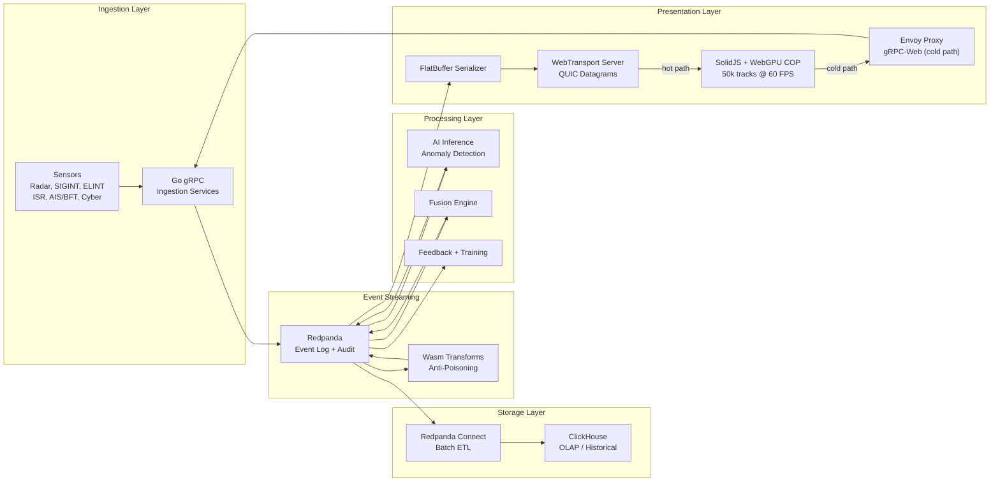

<!-- CLASSIFICATION: UNCLASSIFIED -->
# RTSA Copilot Instructions — Root Policy Loader

> **CLASSIFICATION: This repository contains UNCLASSIFIED code artifacts for a system rated Protected C / Secret.**
> **No classified data, keys, credentials, PII, or operationally sensitive information may exist in this repository.**

---

## Project Identity

| Attribute | Value |
|---|---|
| **Project** | Real-Time Situational Awareness & Risk Assessment (RTSA) |
| **Domain** | Canadian Defence — Situational Awareness & AI-driven Anomaly Detection |
| **Classification Ceiling** | Protected C / Secret |
| **Compliance** | ITSG-33 (CCCS), NIST 800-53 Rev 5, NATO STANAG 5516 |
| **Team Size** | 3–5 developers (trunk-based development) |

---

## Global Constraints — Always Enforce

1. **No secrets in code.** Never hardcode passwords, API keys, tokens, certificates, or connection strings. Use environment variables or secret management services.
2. **Classification marking.** Every generated file must include a classification header comment as its first line: `// CLASSIFICATION: UNCLASSIFIED` (adjust per file type).
3. **Approved libraries only.** Do not introduce dependencies without checking `docs/sdlc_guidelines/01_security_compliance/supply_chain_security.md`.
4. **Input validation.** All external data (sensor feeds, user input, API payloads) is untrusted. Validate before processing.
5. **No PII in logs.** Structured logging only. Never log classified data, user identifiers, or raw sensor payloads at INFO level or above.
6. **Mandatory tests.** Every code change must include corresponding unit tests. Target 80%+ line coverage.
7. **Error handling.** Never panic in production Go code. Never swallow errors silently. Always propagate context.
8. **mTLS everywhere.** All gRPC channels must use mutual TLS with CSE-approved cipher suites.
9. **Immutable audit trail.** All state-changing operations must produce audit events routed through Redpanda.
10. **Code review required.** No direct commits to main. All changes via PR with at least one reviewer.

---

## Core Technology Stack

| Layer | Technology | Purpose |
|---|---|---|
| Event Streaming | Redpanda | Real-time event log, audit trail, feedback routing, tiered storage |
| Services | Go + gRPC (Protobuf) | Microservices with strict type-safety |
| Analytics / OLAP | ClickHouse | Historical storage, forensics, complex analytical queries |
| Frontend (Hot Path) | SolidJS + WebGPU + WebTransport | Real-time COP — 50k tracks @ 60 FPS, QUIC datagrams, FlatBuffers |
| Frontend (Cold Path) | SolidJS + gRPC-Web (ConnectRPC) | Commands, queries, feedback — Protobuf over HTTP/2 |
| Data Pipeline | Redpanda Connect | Batch ETL from stream to ClickHouse / S3 |
| Anti-Poisoning | Wasm Data Transforms / Go middleware | Feedback trust validation before model retraining |
| Interoperability | STANAG 5516 / NFFI / MIP adapters | NATO data exchange with allied systems |

### Performance Targets

| Metric | Target |
|---|---|
| Sustained track count | 50,000 @ 60 FPS |
| Update-to-pixel latency | < 16 ms |
| Main thread CPU | < 20% |
| Browser ingestion throughput | 50,000+ msg/s |

---

## Mandatory Policy Loading by Task Type

When performing any task, load the **Master Policy** first, then load the task-specific policy files:

### Always Load
- `docs/sdlc_guidelines/00_master_policy.md`
- `docs/sdlc_guidelines/01_security_compliance/security_classification.md`

### By Task Type

| Task | Load These Guidelines |
|---|---|
| **Writing requirements / user stories** | `docs/sdlc_guidelines/02_requirements/*` |
| **Architecture / design decisions** | `docs/sdlc_guidelines/03_architecture_design/*`, `docs/sdlc_guidelines/01_security_compliance/*` |
| **Writing Go code** | `04_coding_standards/general_coding.md`, `go_standards.md`, `secure_coding.md` |
| **Writing Protobuf / gRPC** | `04_coding_standards/protobuf_grpc_standards.md`, `secure_coding.md` |
| **Writing SolidJS code** | `04_coding_standards/solidjs_standards.md`, `general_coding.md`, `secure_coding.md` |
| **Writing WGSL shaders** | `08_tech_specific/wgsl_shader_standards.md`, `webgpu_guidelines.md` |
| **Writing FlatBuffer schemas** | `08_tech_specific/flatbuffers_guidelines.md` |
| **WebTransport work** | `08_tech_specific/webtransport_guidelines.md`, `flatbuffers_guidelines.md` |
| **WebGPU rendering** | `08_tech_specific/webgpu_guidelines.md`, `wgsl_shader_standards.md` |
| **Writing tests** | `docs/sdlc_guidelines/05_testing/*` |
| **CI/CD pipeline work** | `docs/sdlc_guidelines/06_integration_cicd/*` |
| **Deployment / infra** | `docs/sdlc_guidelines/07_deployment_operations/*` |
| **Redpanda configuration** | `08_tech_specific/redpanda_guidelines.md` |
| **ClickHouse schemas / queries** | `08_tech_specific/clickhouse_guidelines.md` |
| **gRPC service design** | `08_tech_specific/grpc_service_guidelines.md` |
| **Wasm transforms** | `08_tech_specific/wasm_transforms.md` |
| **Reviewing AI output** | `09_governance/agent_governance.md` |
| **Creating prompts** | `09_governance/prompt_templates.md` |

> All paths relative to `docs/sdlc_guidelines/` unless fully specified.

---

## Project Documentation References

| Document | Path |
|---|---|
| Business Requirements | `docs/business/requirements.md` |
| Feature List | `docs/business/feature_list.md` |
| Use Cases | `docs/business/usecases/UC*.md` |
| **v1 Architecture (canonical)** | `docs/architecture/v1/RTSA_WebGPU_Architecture_v1.md` |
| High-Level Architecture | `docs/architecture/high_level_architecture.md` |
| Component Design | `docs/architecture/component_design.md` |
| Data Architecture | `docs/architecture/data_architecture.md` |
| Security Architecture | `docs/architecture/security_architecture.md` |
| Deployment Architecture | `docs/architecture/deployment_architecture.md` |
| Integration Architecture | `docs/architecture/integration_architecture.md` |
| Dependency Graph | `docs/architecture/dependency_graph.md` |
| v4 Implementation Plan | `docs/implementation/v4/README.md` |

---

## Custom AI Agent Profiles

This repository includes two purpose-built GitHub Copilot AI Agent profiles located in `.github/prompts/`. Both agents automatically inherit all global constraints defined in this file.

| Agent | Prompt File | Role |
|---|---|---|
| **Greatest Ever Developer** | `.github/prompts/greatest-ever-developer.prompt.md` | End-to-end feature implementation, test generation, validation, PR creation |
| **Meanest Ever Reviewer** | `.github/prompts/meanest-ever-reviewer.prompt.md` | PR code review, SDLC compliance enforcement, merge or block with comments |

### Greatest Ever Developer
Performs the complete development lifecycle: reads architecture and SDLC docs, conducts impact analysis, implements the feature, generates unit/integration/E2E tests, runs an optimised validation cycle, and raises a PR against `main`.

**Invoke:** `@greatest-ever-developer <feature description or issue reference>`

### Meanest Ever Reviewer
Performs exhaustive, non-negotiable code review: verifies CI, enforces security and classification rules, checks architecture conformance, validates test completeness, then either merges (squash) or blocks with detailed actionable comments. Posts `Handover to Human` if merge conflicts cannot be auto-resolved.

**Invoke:** `@meanest-ever-reviewer Review PR #<number> for <feature>`

> Full agent documentation: `.github/prompts/README.md`

---

## Output Validation Rules

Before submitting any generated code or documentation, validate against:

1. Does the output contain any classified information? → **REJECT**
2. Does the output include hardcoded secrets or credentials? → **REJECT**
3. Does Go code use `panic()` in non-test files? → **REJECT**
4. Does the code include proper error handling and context propagation? → **REQUIRED**
5. Are there corresponding unit tests? → **REQUIRED** for all code changes
6. Does the output follow the naming conventions in the coding standards? → **REQUIRED**
7. Is the classification header present? → **REQUIRED**
8. For new services/data flows: Has a threat model entry been created? → **REQUIRED**
9. Does SolidJS code destructure props? → **REJECT** (breaks reactivity)
10. Does WGSL code match TypeScript `GPUBindGroupLayout`? → **REQUIRED**
11. Are GPU buffers allocated per-frame? → **REJECT** (allocate at init only)
