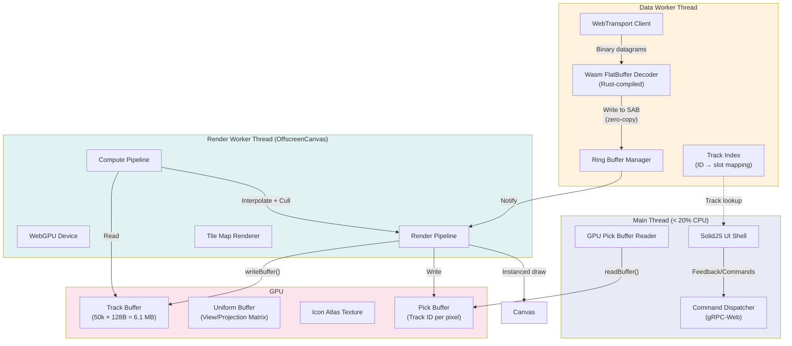
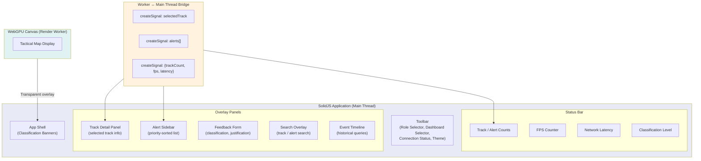
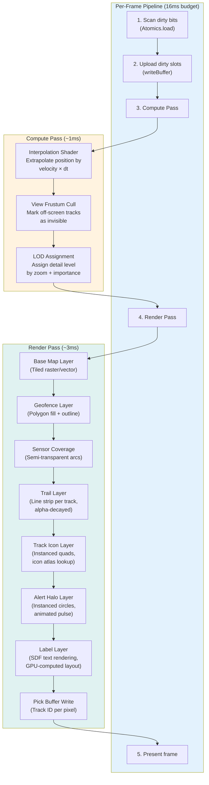
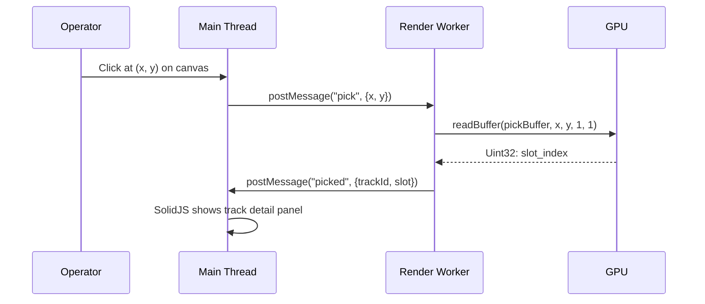

<!-- CLASSIFICATION: UNCLASSIFIED -->

# Component Design

> **Document**: RTSA Component Design — WebGPU Pipeline
> **Version**: 3.0
> **Classification**: UNCLASSIFIED
> **Last Updated**: 2026-03-05
> **Compliance**: ITSG-33 (CCCS), NIST 800-53 Rev 5
> **Authoritative Source**: `docs/architecture/v1/RTSA_WebGPU_Architecture_v1.md`

---

## 1. Overview

This document describes the internal component design of each major subsystem in the RTSA platform. The backend (Go gRPC services, Redpanda, ClickHouse) is retained from the proven architecture. The frontend is a complete redesign using SolidJS, WebGPU, WebTransport, FlatBuffers, and SharedArrayBuffer.

---

## 2. Backend Components (Retained)

### 2.1 Ingestion Services (×6)

| Service               | Sensor Type               | Typical Volume    | Partition Key            |
| --------------------- | ------------------------- | ----------------- | ------------------------ |
| `svc-radar-ingestion` | Radar track plots         | 1K–10K events/sec | `radar_id:track_id`      |
| `svc-ew-ingestion`    | EW/SIGINT detections      | 500–5K events/sec | `sensor_id:emitter_id`   |
| `svc-elint-ingestion` | ELINT/COMINT intelligence | 200–2K events/sec | `collector_id:signal_id` |
| `svc-isr-ingestion`   | ISR metadata/detections   | 100–1K events/sec | `platform_id:mission_id` |
| `svc-ais-ingestion`   | AIS/BFT position reports  | 50–500 events/sec | `unit_id`                |
| `svc-cyber-ingestion` | Cyber events/IOCs         | 1K–50K events/sec | `sensor_id:source_ip`    |

**Common Design Pattern**: Each ingestion service:

1. Accepts authenticated mTLS gRPC streams from edge gateways
2. Validates input against Protobuf schema + Wasm transforms (anti-poisoning)
3. Produces validated events to sensor-specific Redpanda topics (`sensors.radar.*`, `sensors.ew.*`, etc.)
4. Emits OpenTelemetry traces and metrics

### 2.2 Fusion Engine (`svc-fusion-engine`)

- **Input**: `sensors.*` topics from Redpanda
- **Processing**: Extended Kalman Filter, spatial-temporal alignment, track correlation (≥0.85 confidence threshold)
- **Output**: `tracks.fused.*` topics
- **Design**: Stateful stream processor with in-memory track state, periodic ClickHouse snapshots

### 2.3 Anomaly Detection (`svc-anomaly-detection`)

- **Input**: `tracks.fused.*` topics
- **Processing**: Kinematic analysis, contextual analysis, risk scoring (GPU-backed inference)
- **Output**: `alerts.anomaly.*` topics
- **Design**: GPU inference engine with model hot-reload from model registry

### 2.4 Feedback Service (`svc-feedback`)

- **Input**: `feedback.*` topics (operator classifications, alert responses)
- **Processing**: Trust scoring, anti-poisoning validation, operator reputation tracking
- **Output**: `feedback.operator.validated` topic
- **Design**: Stateful trust scoring with per-operator history

### 2.5 Track, Alert, Query, Audit Services

| Service            | Purpose                           | Data Source           | API                   |
| ------------------ | --------------------------------- | --------------------- | --------------------- |
| `svc-track`        | Track state streaming (cold path) | Redpanda              | gRPC-Web via Envoy    |
| `svc-alert`        | Alert lifecycle management        | Redpanda              | gRPC-Web via Envoy    |
| `svc-query`        | Historical forensic queries       | ClickHouse            | gRPC-Web via Envoy    |
| `svc-audit`        | Immutable audit trail             | Redpanda → ClickHouse | Internal gRPC         |
| `svc-nato-adapter` | STANAG 5516/NFFI/MIP exchange     | Redpanda              | gRPC + NATO protocols |
| `svc-training`     | Model retraining pipeline         | Redpanda + ClickHouse | Internal gRPC         |

### 2.6 Wasm Data Transforms

In-broker Redpanda transforms for schema validation and anti-poisoning. Go-compiled to Wasm, executed within Redpanda broker process. See `wasm-transforms/` directory.

---

## 3. New Backend Components

### 3.1 FlatBuffer Serializer Service

| Property          | Specification                                                  |
| ----------------- | -------------------------------------------------------------- |
| Language          | Go                                                             |
| Input             | Consumes `tracks.fused.*` and `alerts.anomaly.*` from Redpanda |
| Output            | FlatBuffer-encoded binary datagrams via WebTransport           |
| Format            | 128-byte fixed-stride GPU-optimized records                    |
| Throughput target | 100,000+ messages/second serialized                            |
| Deployment        | Co-located with WebTransport server                            |

### 3.2 WebTransport Server

| Property       | Specification                                                    |
| -------------- | ---------------------------------------------------------------- |
| Protocol       | WebTransport over HTTP/3 (QUIC)                                  |
| Datagram mode  | Unreliable datagrams for position updates                        |
| Stream mode    | Reliable unidirectional stream for initial state snapshot        |
| Authentication | Session token validated against mTLS certificate                 |
| Encryption     | TLS 1.3 (QUIC-native) with CSE-approved cipher suites            |
| Backpressure   | Server-side rate adaptation: drops lowest-priority updates first |

**Priority-based shedding under backpressure:**

| Priority        | Data                                   | Shedding behavior                    |
| --------------- | -------------------------------------- | ------------------------------------ |
| P0 (never shed) | CRITICAL alerts                        | Always delivered via reliable stream |
| P1              | ELEVATED alerts, friendly force tracks | Shed only under extreme pressure     |
| P2              | Active hostile/unknown tracks          | Reduce update rate to 5 Hz           |
| P3              | Active neutral tracks                  | Reduce update rate to 2 Hz           |
| P4              | Stale tracks, sensor observations      | Shed first                           |

---

## 4. Browser Thread Architecture

The browser data pipeline bypasses the main thread entirely for the hot path. Three threads cooperate:

### Thread Responsibilities

| Thread            | CPU Budget | Responsibilities                                                          |
| ----------------- | ---------- | ------------------------------------------------------------------------- |
| **Main Thread**   | < 20%      | SolidJS UI shell, DOM panels, gRPC-Web commands, pick buffer reads        |
| **Data Worker**   | 10–20%     | WebTransport connection, Wasm FlatBuffer decode, SharedArrayBuffer writes |
| **Render Worker** | 5–10%      | WebGPU pipeline management, GPU buffer uploads, compute/render dispatch   |
| **GPU**           | 40–60%     | Compute shaders (interpolation, culling, LOD), render passes (all layers) |

### Worker ↔ Main Thread Communication

| Direction          | Channel             | Data                            | Frequency      |
| ------------------ | ------------------- | ------------------------------- | -------------- |
| Render → Main      | `postMessage`       | FPS, track count, visible count | 1 Hz           |
| Render → Main      | `postMessage`       | Picked track details (on click) | On demand      |
| Data Worker → Main | `postMessage`       | Alert list (new/changed only)   | On change      |
| Main → Render      | `postMessage`       | Viewport change (pan/zoom)      | On user input  |
| Main → Render      | `postMessage`       | Selected track ID (highlight)   | On click       |
| Main → Data Worker | `postMessage`       | Filter criteria change          | On user input  |
| Main → Backend     | gRPC-Web (Protobuf) | Feedback, commands, queries     | On user action |

---

## 5. SolidJS Component Architecture

SolidJS handles all DOM-based user interactions. WebGPU handles only the tactical map rendering (canvas).

### SolidJS Component Inventory

| Feature                    | SolidJS Component                    | Backend Integration                              |
| -------------------------- | ------------------------------------ | ------------------------------------------------ |
| Operator Feedback          | `FeedbackForm`                       | gRPC-Web → Feedback Service → Redpanda → Audit   |
| Alert Acknowledgment       | `AlertSidebar` + `AlertActions`      | gRPC-Web → Alert Service → Redpanda → Audit      |
| Track Detail Inspection    | `TrackDetailPanel`                   | GPU pick buffer → Worker → Main → SolidJS signal |
| Role & Dashboard Selection | `RoleSelector` + `DashboardSelector` | Local SolidJS signal (no backend call)           |
| Search                     | `SearchOverlay`                      | gRPC-Web → Query Service → ClickHouse            |
| Forensic Queries           | `QueryBuilder` + `ResultsView`       | gRPC-Web → Query Service → ClickHouse            |
| Event Timeline             | `EventTimeline`                      | gRPC-Web → Query Service → ClickHouse            |
| Classification Banners     | `ClassificationBanner`               | Static (deployment config)                       |
| Connection Status          | `ConnectionIndicator`                | WebTransport readyState + gRPC health            |
| FPS / Latency Metrics      | `StatusBar`                          | Render Worker → postMessage → SolidJS signal     |

### Optimistic UI Pattern

1. **SolidJS** immediately updates local signal state (optimistic)
2. **Command** sent via reliable gRPC-Web to Feedback/Alert service
3. **Backend** validates, produces audit event to Redpanda
4. **Confirmation** returns via gRPC response
5. If rejected: SolidJS rolls back local state and shows error toast

---

## 6. WebGPU Rendering Pipeline

### 6.1 Per-Frame Pipeline

### 6.2 Render Layers (Bottom to Top)

| Layer               | Technique                          | Notes                                            |
| ------------------- | ---------------------------------- | ------------------------------------------------ |
| **Base map**        | Tiled raster or MVT vector tiles   | Standard tile pyramid, cached to GPU textures    |
| **Geofences**       | Polygon triangulation (Earcut)     | Pre-uploaded, rarely changes                     |
| **Sensor coverage** | Arc geometry, semi-transparent     | Updated on sensor health change only             |
| **Track trails**    | Line strip per track, ring buffer  | Alpha-decayed; oldest points fade to 0           |
| **Track icons**     | Instanced quads + icon atlas       | Single `drawIndexedIndirect` call for all tracks |
| **Alert halos**     | Instanced circles, animated radius | Pulsating animation via uniform time             |
| **Labels**          | SDF text rendering                 | GPU-computed collision avoidance                 |
| **Pick buffer**     | Color-coded track ID, off-screen   | Read back on click for O(1) selection            |

### 6.3 GPU Pick Buffer (Selection)

Instead of CPU-side hit testing, the render pipeline writes a pick buffer — an off-screen render target where each pixel contains the track slot index:

---

## 7. Performance Budget

### 7.1 Per-Frame Time Budget (16.67 ms for 60 FPS)

```mermaid
gantt
    title Per-Frame Time Budget (16.67ms target)
    dateFormat X
    axisFormat %L ms

    section Data
    Scan dirty bits + upload    :a1, 0, 1500

    section Compute
    Interpolation shader        :a2, 1500, 500
    Frustum culling             :a3, 2000, 300

    section Render
    Base map tiles              :a4, 2300, 2000
    Geofences + coverage        :a5, 4300, 500
    Track trails                :a6, 4800, 1500
    Track icons (instanced)     :a7, 6300, 1000
    Alert halos                 :a8, 7300, 500
    SDF labels                  :a9, 7800, 1000
    Pick buffer                 :a10, 8800, 500

    section Present
    Composite + vsync           :a11, 9300, 700
```

**Total: ~10 ms** — leaves 6.67 ms headroom for variance on lower-end hardware.

### 7.2 Memory Budget

| Component                      | Size       | Location            |
| ------------------------------ | ---------- | ------------------- |
| SharedArrayBuffer (track data) | 6.1 MB     | System RAM (shared) |
| GPU track buffer               | 6.1 MB     | VRAM                |
| GPU interpolated buffer        | 3.2 MB     | VRAM                |
| GPU trail ring buffer          | 12.8 MB    | VRAM                |
| Icon atlas texture             | 512 KB     | VRAM                |
| SDF font atlas                 | 2 MB       | VRAM                |
| Tile cache (256 tiles)         | 64 MB      | VRAM                |
| Pick buffer (1920×1080)        | 8 MB       | VRAM                |
| Wasm module heap               | 4 MB       | System RAM          |
| SolidJS DOM                    | ~2 MB      | System RAM          |
| **Total VRAM**                 | **~97 MB** | —                   |
| **Total System RAM**           | **~12 MB** | —                   |

---

## 8. Cross-References

| Document                           | Path                                                             |
| ---------------------------------- | ---------------------------------------------------------------- |
| Full v1 Architecture Specification | `docs/architecture/v1/RTSA_WebGPU_Architecture_v1.md`            |
| High-Level Architecture            | `docs/architecture/high_level_architecture.md`                   |
| Data Architecture                  | `docs/architecture/data_architecture.md`                         |
| Security Architecture              | `docs/architecture/security_architecture.md`                     |
| SolidJS Standards                  | `docs/sdlc_guidelines/04_coding_standards/solidjs_standards.md`  |
| WebGPU Guidelines                  | `docs/sdlc_guidelines/08_tech_specific/webgpu_guidelines.md`     |
| WGSL Shader Standards              | `docs/sdlc_guidelines/08_tech_specific/wgsl_shader_standards.md` |
