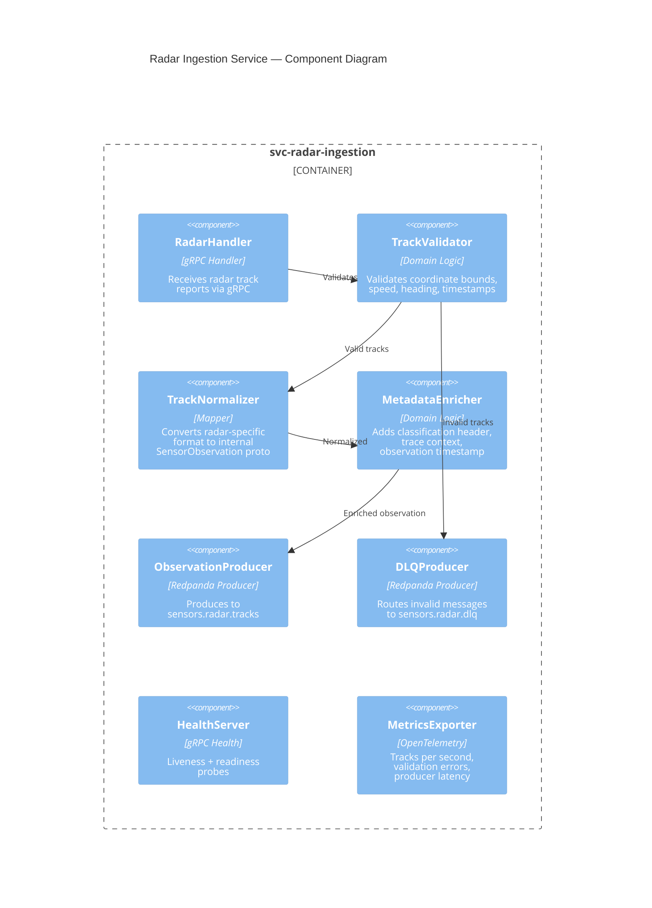
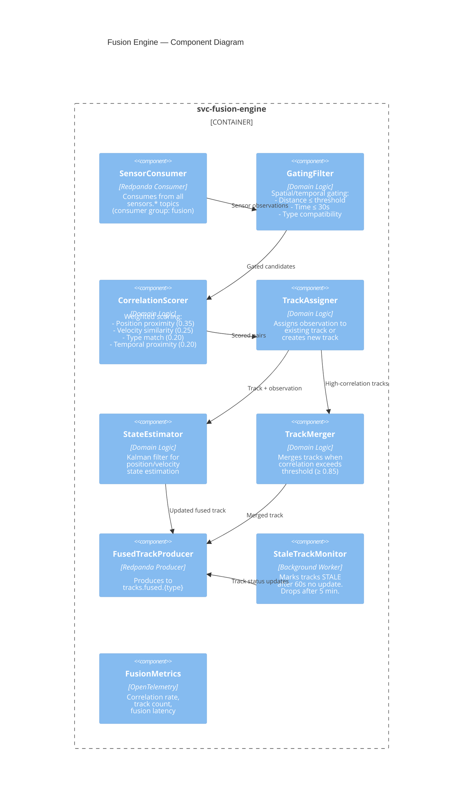
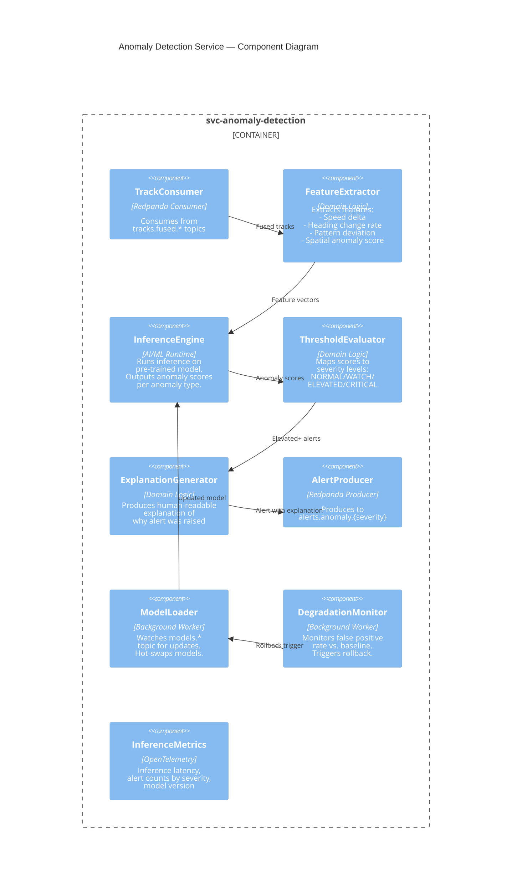
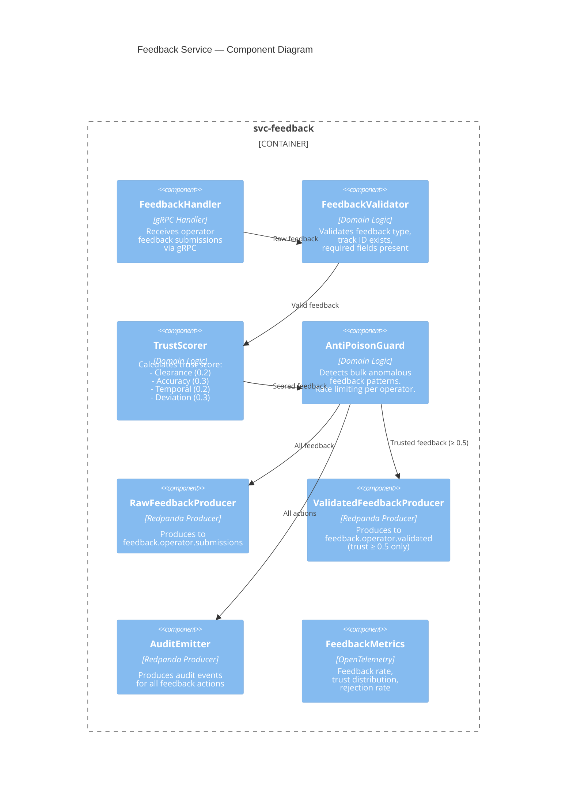
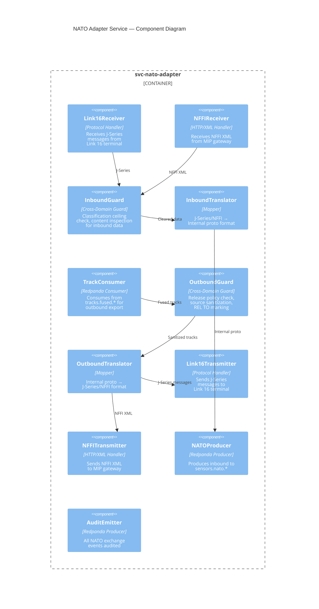
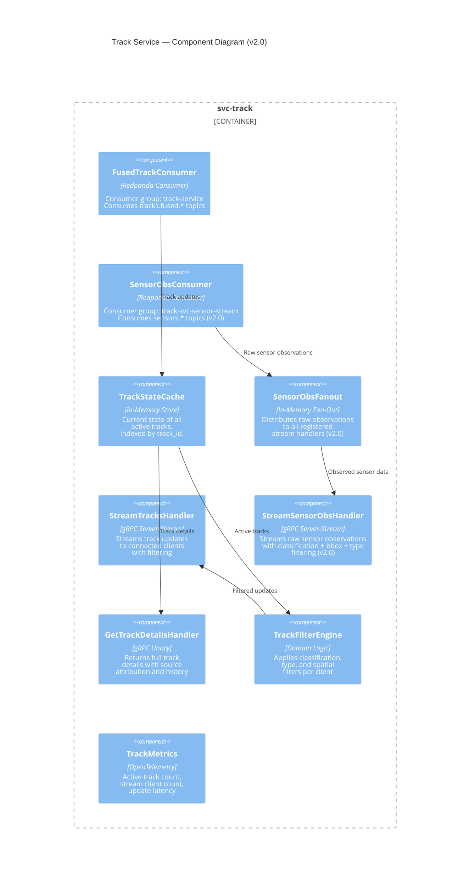
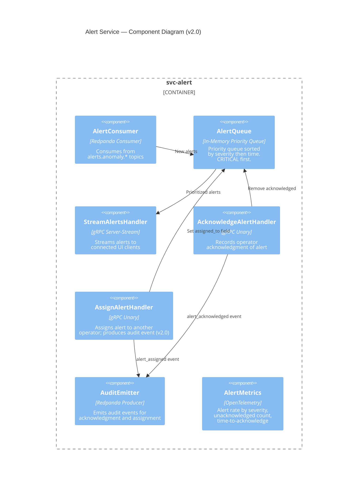
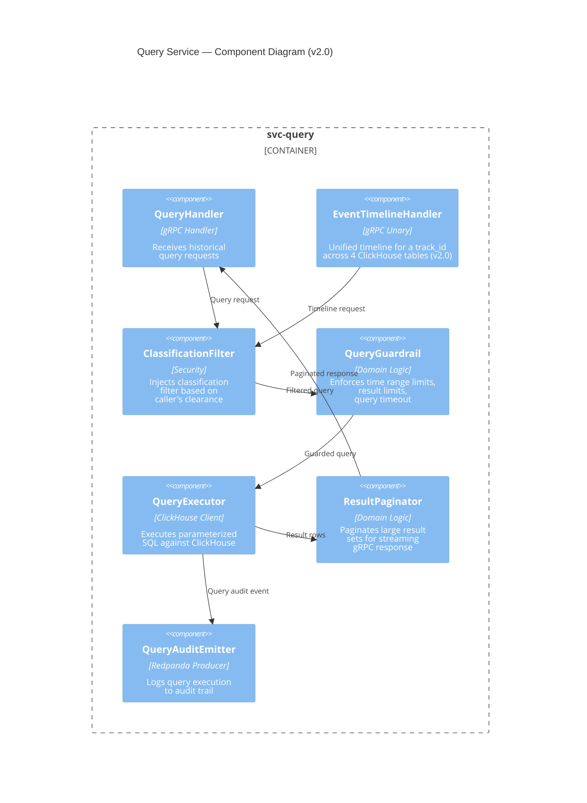
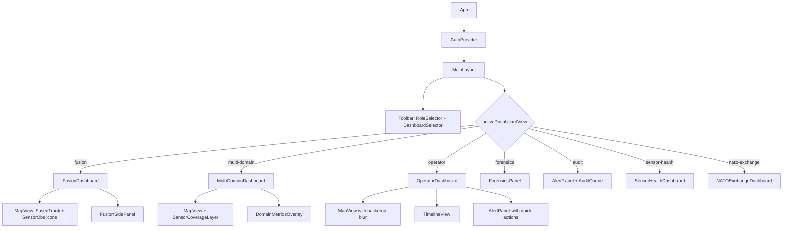
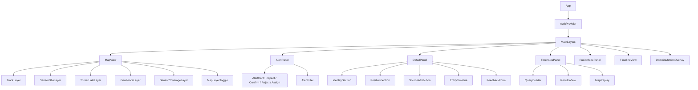

<!-- CLASSIFICATION: UNCLASSIFIED -->
# Component Design

> **Document**: RTSA Component Design
> **Version**: 2.0
> **Classification**: UNCLASSIFIED
> **Last Updated**: 2026-02-28
> **Compliance**: ITSG-33, NIST 800-53 Rev 5

---

## 1. Overview

This document defines the internal component design for each RTSA service. Components are organized by bounded context. Each service follows the standard Go project layout defined in the coding standards.

---

## 2. Standard Service Structure

All Go services follow this internal structure:

```
svc-<name>/
├── cmd/
│   └── <name>/main.go          # Entry point, wire dependencies
├── internal/
│   ├── config/                  # Configuration loading
│   ├── domain/                  # Domain types, business logic
│   ├── handler/                 # gRPC handler implementations
│   ├── producer/                # Redpanda producers
│   ├── consumer/                # Redpanda consumers
│   ├── repository/              # Data access (ClickHouse, etc.)
│   └── mapper/                  # Schema translation / mapping
├── proto/                       # Service-specific .proto files
├── deploy/
│   └── helm/                    # Helm chart
├── Dockerfile
├── Makefile
└── README.md
```

---

## 3. Sensor Ingestion Services

### 3.1 Component Diagram — Radar Ingestion Service



> **Note**: EW/SIGINT, ELINT/COMINT, ISR, AIS/BFT, and Cyber ingestion services follow the same component pattern with sensor-specific validators and normalizers. The key differences are:

| Service | Validator Specifics | Normalizer Specifics |
|---|---|---|
| EW/SIGINT | Frequency 0.5–40 GHz, power dBm | EmitterObservation with modulation, PRI |
| ELINT/COMINT | Emitter ID format, intercept completeness | InterceptObservation with content classification |
| ISR | Geo-rect validity, resolution bounds | ISRObservation with platform + sensor metadata |
| AIS/BFT | MMSI format (9 digits), AIS spoofing checks | MaritimeObservation with vessel details |
| Cyber | STIX 2.1 schema validation, IOC dedup | ThreatObservation with MITRE ATT&CK mapping |

---

## 4. Fusion Engine

### 4.1 Component Diagram



### 4.2 Key Algorithms

#### Gating Criteria

| Criterion | Surface Track | Air Track | Subsurface |
|---|---|---|---|
| Max distance | 5 NM | 20 NM | 2 NM |
| Max time delta | 30 s | 15 s | 60 s |
| Type compatibility | Surface only | Air only | Sub only |

#### Correlation Score Thresholds

| Score Range | Action |
|---|---|
| ≥ 0.85 | Auto-correlate (merge into existing track) |
| 0.60 – 0.84 | Tentative correlation (flag for review) |
| < 0.60 | No correlation (create new track or discard) |

---

## 5. Anomaly Detection Service

### 5.1 Component Diagram



### 5.2 Anomaly Types

| Type | Features Used | Threshold (ELEVATED) |
|---|---|---|
| Speed anomaly | Speed delta, historical avg | > 3σ from mean |
| Route deviation | Heading change rate, expected route | > 30° sustained deviation |
| AIS manipulation | AIS vs. radar position delta | > 0.5 NM discrepancy |
| Behavioral pattern | Activity sequence encoding | Model confidence > 0.75 |
| Temporal anomaly | Time-of-day activity pattern | Outside normal pattern, p < 0.05 |
| Proximity alert | Distance to critical assets | < defined exclusion zone |

---

## 6. Feedback Service

### 6.1 Component Diagram



---

## 7. NATO Adapter Service

### 7.1 Component Diagram



---

## 8. Presentation Services

### 8.1 Track Service *(v2.0: dual consumer group)*



**New RPC — `StreamSensorObservations` *(v2.0)***: Server-streaming RPC consuming from `sensors.*` Redpanda topics via a dedicated consumer group. Classification filtering, bounding box filtering, and sensor type filtering are applied per connected client before forwarding each `SensorObservationUpdate`.

### 8.2 Alert Service *(v2.0: AssignAlert)*



**New RPC — `AssignAlert` *(v2.0)***: Unary RPC with fields `alert_id`, `assigner_operator_id`, `assignee_operator_id`, `comment`. Sets an `assigned_to` field on the in-memory alert and produces an audit event to `audit.events`. Returns `success` and `assigned_at` timestamp.

### 8.3 Query Service *(v2.0: GetEventTimeline)*



**New RPC — `GetEventTimeline` *(v2.0)***: Unary RPC accepting `track_id`, `time_range`, `max_events`, and `clearance_level`. Executes a ClickHouse `UNION ALL` query across `tracks_fused`, `anomaly_detections`, `operator_feedback`, and `audit_log`, ordered by `event_time ASC`. Returns `repeated TimelineEvent` with a `oneof` payload discriminated by `TimelineEventType`.

---

## 9. COP Web Application (React) *(v2.0: Two-Level RBAC Shell)*

### 9.1 Architecture Overview

v2.0 introduces a **Two-Level RBAC Shell**:
- **Level 1** — Role Selector: Operations Commander, Intelligence Analyst, Security Officer, Sensor Operator, NATO Liaison
- **Level 2** — Dashboard Selector: role-appropriate views rendered dynamically by `MainLayout`



### 9.2 Component Hierarchy *(v2.0)*



### 9.3 State Management *(v2.0)*

| Store | Library | Content |
|---|---|---|
| TrackStore | Zustand | Active tracks indexed by `track_id` |
| AlertStore | Zustand | Alert queue + acknowledgment state |
| AuthStore | Zustand | Operator identity, clearance level |
| UIStore | Zustand | Panel visibility, selected entity, filters, **`activeRole`**, **`activeDashboardView`** *(v2.0)* |

**New `uiStore` fields** *(v2.0)*:
- `activeDashboardView: DashboardView` — current Level-2 view selection
- `setDashboardView(view: DashboardView): void` — Level-2 view switch action
- `ActiveRole` extended to include `sensor_operator` and `nato_liaison`
- `setActiveRole` auto-resets `activeDashboardView` to the role's default

### 9.4 Real-Time Hooks *(v2.0)*

| Hook | Transport | Purpose |
|---|---|---|
| `useTrackStream` | gRPC-Web server-stream | Subscribe to filtered fused track updates |
| `useAlertStream` | gRPC-Web server-stream | Subscribe to severity-filtered alerts |
| `useSensorStream` | gRPC-Web server-stream | Subscribe to raw sensor observations *(v2.0 — Fusion Dashboard)* |
| `useConnectionStatus` | WebSocket heartbeat | Monitor backend connectivity |
| `useOfflineMode` | Service Worker | Cache tracks and queue feedback when offline |

### 9.5 Role-to-Dashboard Mapping *(v2.0)*

| Role | Default Dashboard | Available Dashboards |
|---|---|---|
| Operations Commander | Fusion | Fusion, Multi-Domain, Operator UI |
| Intelligence Analyst | Forensics | Forensics, Intelligence Search |
| Security Officer | Audit & Feedback | Audit & Feedback |
| Sensor Operator | Sensor Health | Sensor Health |
| NATO Liaison | NATO Exchange | NATO Exchange |

### 9.6 Design System *(v2.0)*

| Category | Specification |
|---|---|
| Typography | Inter (Google Fonts) — weights 300/400/500/600/700 |
| Base background | `#0B1120` (near-black) |
| Panel background | `rgba(15, 23, 42, 0.60)` — glassmorphism with `backdrop-filter: blur(12px)` |
| Primary accent | `#3B82F6` (blue) |
| Warning accent | `#F59E0B` (amber) |
| Critical accent | `#EF4444` (red) |
| NVG theme | Green-on-black palette via `[data-theme="nvg"]` CSS override |
| Panel collapse | CSS transitions on width/height with `.panel-collapsible.collapsed` class |

| Library | Package Path | Purpose |
|---|---|---|
| `pkg/interceptors` | `github.com/rtsa/pkg/interceptors` | gRPC interceptor chain (auth, logging, metrics, tracing, classification) |
| `pkg/redpanda` | `github.com/rtsa/pkg/redpanda` | franz-go wrapper with standard producer/consumer config |
| `pkg/health` | `github.com/rtsa/pkg/health` | Standard health check server |
| `pkg/shutdown` | `github.com/rtsa/pkg/shutdown` | Graceful shutdown orchestrator |
| `pkg/classification` | `github.com/rtsa/pkg/classification` | Classification level types and enforcement |
| `pkg/audit` | `github.com/rtsa/pkg/audit` | Audit event builder and producer |
| `pkg/telemetry` | `github.com/rtsa/pkg/telemetry` | OpenTelemetry initialization |
| `pkg/config` | `github.com/rtsa/pkg/config` | Environment-based configuration loader |
