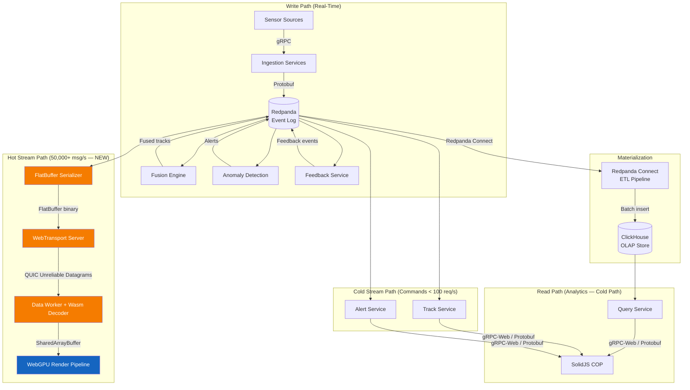
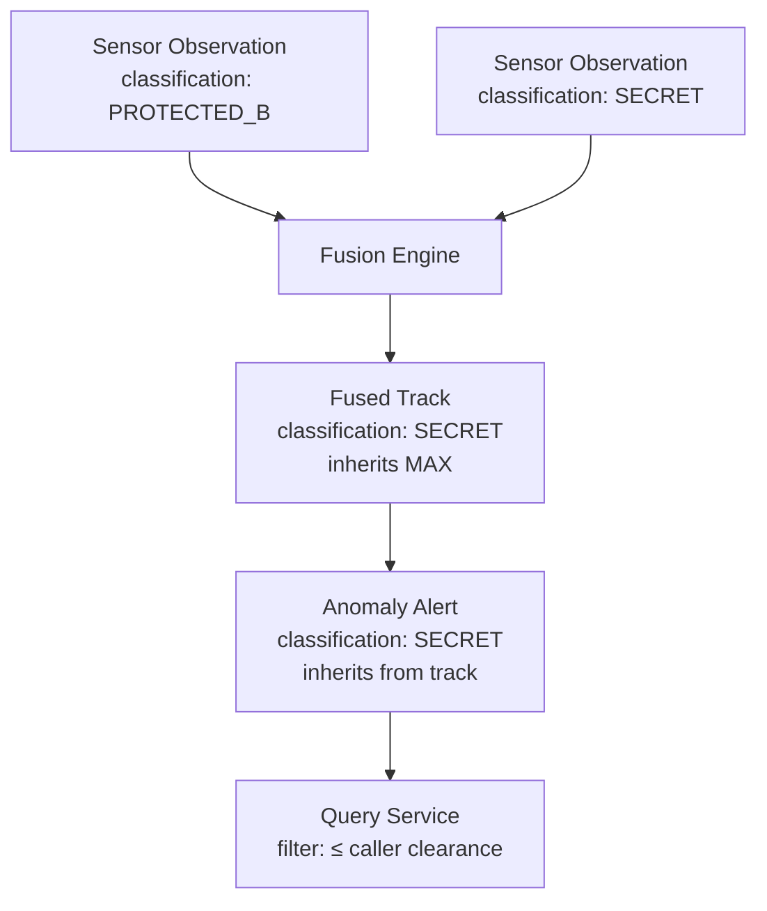
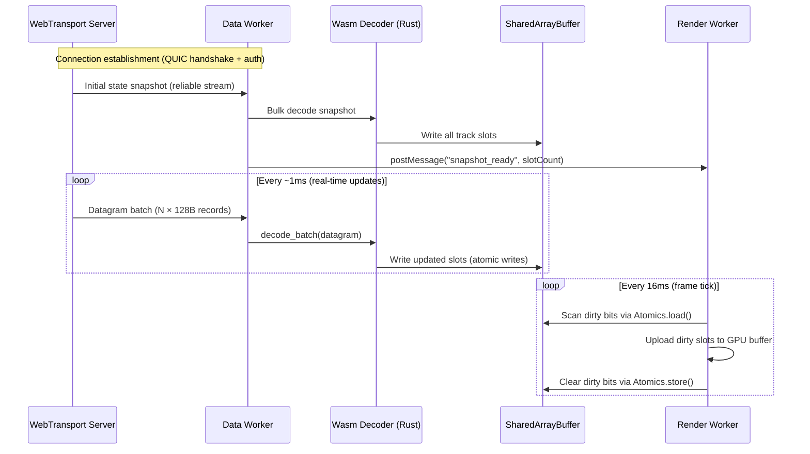

<!-- CLASSIFICATION: UNCLASSIFIED -->

# Data Architecture

> **Document**: RTSA Data Architecture
> **Version**: 3.0
> **Classification**: UNCLASSIFIED
> **Last Updated**: 2026-03-05
> **Compliance**: ITSG-33, NIST 800-53 Rev 5
> **Authoritative Source**: `docs/architecture/v1/RTSA_WebGPU_Architecture_v1.md`

---

## 1. Overview

The RTSA data architecture follows an event-sourced, CQRS pattern. All data flows through Redpanda as the single source of truth. ClickHouse serves as the materialized read model for historical analytics. Data is classified, partitioned, and retained according to government security policies.

---

## 2. Data Flow Architecture



---

## 3. Event Schema Design (Protobuf)

### 3.1 Core Domain Events

#### SensorObservation (Base)

```protobuf
// All sensor observations extend this base structure
message SensorObservation {
  string observation_id = 1;          // UUID v7 (time-ordered)
  string sensor_id = 2;              // Source sensor identifier
  SensorType sensor_type = 3;        // RADAR, EW_SIGINT, ELINT_COMINT, ISR, AIS_BFT, CYBER, NATO
  google.protobuf.Timestamp observation_time = 4;
  ClassificationLevel classification = 5;
  Position position = 6;             // Optional — not all sensors provide position
  map<string, string> metadata = 7;  // Sensor-specific key-value pairs
}

enum SensorType {
  SENSOR_TYPE_UNSPECIFIED = 0;
  SENSOR_TYPE_RADAR = 1;
  SENSOR_TYPE_EW_SIGINT = 2;
  SENSOR_TYPE_ELINT_COMINT = 3;
  SENSOR_TYPE_ISR = 4;
  SENSOR_TYPE_AIS_BFT = 5;
  SENSOR_TYPE_CYBER = 6;
  SENSOR_TYPE_NATO = 7;
}

enum ClassificationLevel {
  CLASSIFICATION_UNSPECIFIED = 0;
  CLASSIFICATION_UNCLASSIFIED = 1;
  CLASSIFICATION_PROTECTED_A = 2;
  CLASSIFICATION_PROTECTED_B = 3;
  CLASSIFICATION_PROTECTED_C = 4;
  CLASSIFICATION_SECRET = 5;
}

message Position {
  double latitude = 1;   // WGS-84, -90 to +90
  double longitude = 2;  // WGS-84, -180 to +180
  optional double altitude_meters = 3;
  optional double speed_knots = 4;
  optional double heading_degrees = 5;
}
```

#### FusedTrack

```protobuf
message FusedTrack {
  string track_id = 1;               // UUID v7
  EntityType entity_type = 2;
  HostileClassification hostile_class = 3;
  Position estimated_position = 4;   // Kalman-filtered state estimate
  double confidence_score = 5;       // 0.0–1.0
  uint32 source_count = 6;           // Number of contributing sensors
  repeated SourceAttribution sources = 7;
  TrackStatus status = 8;
  ClassificationLevel classification = 9;
  google.protobuf.Timestamp created_at = 10;
  google.protobuf.Timestamp updated_at = 11;
}

enum EntityType {
  ENTITY_TYPE_UNSPECIFIED = 0;
  ENTITY_TYPE_SURFACE = 1;
  ENTITY_TYPE_AIR = 2;
  ENTITY_TYPE_SUBSURFACE = 3;
  ENTITY_TYPE_LAND = 4;
  ENTITY_TYPE_CYBER = 5;
}

enum HostileClassification {
  HOSTILE_UNSPECIFIED = 0;
  HOSTILE_HOSTILE = 1;
  HOSTILE_FRIENDLY = 2;
  HOSTILE_NEUTRAL = 3;
  HOSTILE_UNKNOWN = 4;
}

enum TrackStatus {
  TRACK_STATUS_UNSPECIFIED = 0;
  TRACK_STATUS_ACTIVE = 1;
  TRACK_STATUS_STALE = 2;
  TRACK_STATUS_DROPPED = 3;
  TRACK_STATUS_MERGED = 4;
}

message SourceAttribution {
  string sensor_id = 1;
  SensorType sensor_type = 2;
  double confidence = 3;
  google.protobuf.Timestamp last_contribution = 4;
}
```

#### AnomalyAlert

```protobuf
message AnomalyAlert {
  string alert_id = 1;               // UUID v7
  string track_id = 2;               // Reference to fused track
  AnomalyType anomaly_type = 3;
  AlertSeverity severity = 4;
  double confidence_score = 5;       // 0.0–1.0
  string explanation = 6;            // Human-readable explanation
  repeated FeatureContribution features = 7;
  ClassificationLevel classification = 8;
  google.protobuf.Timestamp detected_at = 9;
}

enum AnomalyType {
  ANOMALY_TYPE_UNSPECIFIED = 0;
  ANOMALY_TYPE_SPEED = 1;
  ANOMALY_TYPE_ROUTE_DEVIATION = 2;
  ANOMALY_TYPE_AIS_MANIPULATION = 3;
  ANOMALY_TYPE_BEHAVIORAL = 4;
  ANOMALY_TYPE_TEMPORAL = 5;
  ANOMALY_TYPE_PROXIMITY = 6;
}

enum AlertSeverity {
  ALERT_SEVERITY_UNSPECIFIED = 0;
  ALERT_SEVERITY_NORMAL = 1;
  ALERT_SEVERITY_WATCH = 2;
  ALERT_SEVERITY_ELEVATED = 3;
  ALERT_SEVERITY_CRITICAL = 4;
}

message FeatureContribution {
  string feature_name = 1;
  double value = 2;
  double contribution_weight = 3;
}
```

#### OperatorFeedback

```protobuf
message OperatorFeedback {
  string feedback_id = 1;            // UUID v7
  string track_id = 2;
  string operator_id = 3;            // From mTLS certificate
  FeedbackType feedback_type = 4;
  string justification = 5;          // Free-text explanation
  double trust_score = 6;            // Calculated by trust engine
  TrustBreakdown trust_breakdown = 7;
  ClassificationLevel classification = 8;
  google.protobuf.Timestamp submitted_at = 9;
}

enum FeedbackType {
  FEEDBACK_TYPE_UNSPECIFIED = 0;
  FEEDBACK_TYPE_CONFIRM_HOSTILE = 1;
  FEEDBACK_TYPE_CONFIRM_FRIENDLY = 2;
  FEEDBACK_TYPE_RECLASSIFY = 3;
  FEEDBACK_TYPE_REJECT_ANOMALY = 4;
  FEEDBACK_TYPE_CONFIRM_ANOMALY = 5;
}

message TrustBreakdown {
  double clearance_score = 1;
  double accuracy_score = 2;
  double temporal_score = 3;
  double deviation_score = 4;
}
```

---

## 4. Redpanda Topic Design

### 4.1 Topic Naming Convention

```
{domain}.{bounded-context}.{entity}[.{qualifier}]
```

### 4.2 Complete Topic Map

| Topic                           | Key            | Partitions (DC) | Partitions (Edge) | Retention     | Replication       |
| ------------------------------- | -------------- | --------------- | ----------------- | ------------- | ----------------- |
| `sensors.radar.tracks`          | sensor_id      | 12              | 3                 | 72h           | 3 (DC) / 1 (Edge) |
| `sensors.ew.intercepts`         | sensor_id      | 8               | 2                 | 72h           | 3 / 1             |
| `sensors.elint.detections`      | sensor_id      | 8               | 2                 | 72h           | 3 / 1             |
| `sensors.isr.observations`      | sensor_id      | 6               | 2                 | 72h           | 3 / 1             |
| `sensors.ais.positions`         | mmsi           | 12              | 3                 | 72h           | 3 / 1             |
| `sensors.cyber.iocs`            | ioc_type       | 4               | 1                 | 168h          | 3 / 1             |
| `sensors.nato.link16`           | track_number   | 8               | —                 | 72h           | 3 / —             |
| `sensors.nato.nffi`             | track_id       | 8               | —                 | 72h           | 3 / —             |
| `tracks.fused.surface`          | track_id       | 16              | 4                 | 168h          | 3 / 1             |
| `tracks.fused.air`              | track_id       | 16              | 4                 | 168h          | 3 / 1             |
| `tracks.fused.subsurface`       | track_id       | 8               | 2                 | 168h          | 3 / 1             |
| `tracks.fused.land`             | track_id       | 8               | 2                 | 168h          | 3 / 1             |
| `tracks.fused.cyber`            | track_id       | 4               | 1                 | 168h          | 3 / 1             |
| `alerts.anomaly.critical`       | track_id       | 4               | 2                 | 720h          | 3 / 1             |
| `alerts.anomaly.elevated`       | track_id       | 4               | 2                 | 720h          | 3 / 1             |
| `alerts.anomaly.watch`          | track_id       | 4               | 1                 | 168h          | 3 / 1             |
| `feedback.operator.submissions` | operator_id    | 4               | 1                 | 720h          | 3 / 1             |
| `feedback.operator.validated`   | operator_id    | 4               | 1                 | 720h          | 3 / 1             |
| `models.anomaly.published`      | model_version  | 1               | 1                 | ∞ (compacted) | 3 / 1             |
| `audit.events`                  | service_id     | 8               | 2                 | ∞ (tiered)    | 3 / 1             |
| `dlq.sensors.*`                 | original_topic | 2               | 1                 | 720h          | 3 / 1             |

### 4.3 Required Message Headers

Every message produced to Redpanda must include:

| Header                | Type   | Description                             |
| --------------------- | ------ | --------------------------------------- |
| `rtsa-classification` | string | Classification level of the data        |
| `rtsa-source-service` | string | Producing service name                  |
| `rtsa-trace-id`       | string | OpenTelemetry trace ID                  |
| `rtsa-timestamp`      | string | ISO 8601 UTC timestamp                  |
| `rtsa-schema-version` | string | Protobuf schema version (e.g., "1.2.0") |

---

## 5. ClickHouse Schema Design

### 5.1 Core Tables

#### tracks_fused

```sql
CREATE TABLE tracks_fused (
    track_id String,
    entity_type Enum8(
        'UNSPECIFIED' = 0, 'SURFACE' = 1, 'AIR' = 2,
        'SUBSURFACE' = 3, 'LAND' = 4, 'CYBER' = 5
    ),
    hostile_classification Enum8(
        'UNSPECIFIED' = 0, 'HOSTILE' = 1, 'FRIENDLY' = 2,
        'NEUTRAL' = 3, 'UNKNOWN' = 4
    ),
    latitude Float64,
    longitude Float64,
    altitude_meters Nullable(Float64),
    speed_knots Nullable(Float64),
    heading_degrees Nullable(Float64),
    confidence_score Float64,
    source_count UInt8,
    source_sensors Array(String),
    classification_level Enum8(
        'UNCLASSIFIED' = 1, 'PROTECTED_A' = 2, 'PROTECTED_B' = 3,
        'PROTECTED_C' = 4, 'SECRET' = 5
    ),
    track_status Enum8(
        'ACTIVE' = 1, 'STALE' = 2, 'DROPPED' = 3, 'MERGED' = 4
    ),
    event_time DateTime64(3, 'UTC'),
    ingestion_time DateTime64(3, 'UTC') DEFAULT now64(3)
)
ENGINE = MergeTree()
PARTITION BY toYYYYMMDD(event_time)
ORDER BY (entity_type, track_id, event_time)
TTL event_time + INTERVAL 90 DAY
SETTINGS index_granularity = 8192;
```

#### sensor_observations

```sql
CREATE TABLE sensor_observations (
    observation_id String,
    sensor_id String,
    sensor_type Enum8(
        'UNSPECIFIED' = 0, 'RADAR' = 1, 'EW_SIGINT' = 2,
        'ELINT_COMINT' = 3, 'ISR' = 4, 'AIS_BFT' = 5,
        'CYBER' = 6, 'NATO' = 7
    ),
    latitude Nullable(Float64),
    longitude Nullable(Float64),
    altitude_meters Nullable(Float64),
    speed_knots Nullable(Float64),
    heading_degrees Nullable(Float64),
    classification_level Enum8(
        'UNCLASSIFIED' = 1, 'PROTECTED_A' = 2, 'PROTECTED_B' = 3,
        'PROTECTED_C' = 4, 'SECRET' = 5
    ),
    metadata_json String,          -- JSON-encoded sensor-specific fields
    event_time DateTime64(3, 'UTC'),
    ingestion_time DateTime64(3, 'UTC') DEFAULT now64(3)
)
ENGINE = MergeTree()
PARTITION BY (sensor_type, toYYYYMMDD(event_time))
ORDER BY (sensor_type, sensor_id, event_time)
TTL event_time + INTERVAL 90 DAY
SETTINGS index_granularity = 8192;
```

#### anomaly_detections

```sql
CREATE TABLE anomaly_detections (
    alert_id String,
    track_id String,
    anomaly_type Enum8(
        'UNSPECIFIED' = 0, 'SPEED' = 1, 'ROUTE_DEVIATION' = 2,
        'AIS_MANIPULATION' = 3, 'BEHAVIORAL' = 4,
        'TEMPORAL' = 5, 'PROXIMITY' = 6
    ),
    severity Enum8(
        'NORMAL' = 1, 'WATCH' = 2, 'ELEVATED' = 3, 'CRITICAL' = 4
    ),
    confidence_score Float64,
    explanation String,
    model_version String,
    classification_level Enum8(
        'UNCLASSIFIED' = 1, 'PROTECTED_A' = 2, 'PROTECTED_B' = 3,
        'PROTECTED_C' = 4, 'SECRET' = 5
    ),
    event_time DateTime64(3, 'UTC'),
    ingestion_time DateTime64(3, 'UTC') DEFAULT now64(3)
)
ENGINE = MergeTree()
PARTITION BY toYYYYMMDD(event_time)
ORDER BY (anomaly_type, track_id, event_time)
TTL event_time + INTERVAL 365 DAY
SETTINGS index_granularity = 8192;
```

#### operator_feedback

```sql
CREATE TABLE operator_feedback (
    feedback_id String,
    track_id String,
    operator_id String,
    feedback_type Enum8(
        'UNSPECIFIED' = 0, 'CONFIRM_HOSTILE' = 1, 'CONFIRM_FRIENDLY' = 2,
        'RECLASSIFY' = 3, 'REJECT_ANOMALY' = 4, 'CONFIRM_ANOMALY' = 5
    ),
    justification String,
    trust_score Float64,
    clearance_score Float64,
    accuracy_score Float64,
    temporal_score Float64,
    deviation_score Float64,
    validated UInt8,           -- 0 = pending, 1 = validated, 2 = rejected
    classification_level Enum8(
        'UNCLASSIFIED' = 1, 'PROTECTED_A' = 2, 'PROTECTED_B' = 3,
        'PROTECTED_C' = 4, 'SECRET' = 5
    ),
    event_time DateTime64(3, 'UTC'),
    ingestion_time DateTime64(3, 'UTC') DEFAULT now64(3)
)
ENGINE = MergeTree()
PARTITION BY toYYYYMMDD(event_time)
ORDER BY (operator_id, track_id, event_time)
TTL event_time + INTERVAL 730 DAY
SETTINGS index_granularity = 8192;
```

#### audit_log

```sql
CREATE TABLE audit_log (
    audit_id String,
    service_id String,
    event_type String,              -- e.g., 'track_created', 'feedback_submitted'
    actor_id String,                -- Service name or operator ID
    actor_type Enum8('SERVICE' = 1, 'OPERATOR' = 2, 'SYSTEM' = 3),
    resource_type String,           -- e.g., 'track', 'alert', 'feedback', 'model'
    resource_id String,
    action String,                  -- e.g., 'CREATE', 'UPDATE', 'DELETE', 'QUERY'
    detail_json String,             -- JSON-encoded additional context
    classification_level Enum8(
        'UNCLASSIFIED' = 1, 'PROTECTED_A' = 2, 'PROTECTED_B' = 3,
        'PROTECTED_C' = 4, 'SECRET' = 5
    ),
    event_time DateTime64(3, 'UTC'),
    ingestion_time DateTime64(3, 'UTC') DEFAULT now64(3)
)
ENGINE = MergeTree()
PARTITION BY toYYYYMMDD(event_time)
ORDER BY (service_id, event_type, event_time)
-- No TTL on audit: retained indefinitely per ITSG-33
SETTINGS index_granularity = 8192;
```

### 5.2 Materialized Views

#### Track Count by Type (Real-Time)

```sql
CREATE MATERIALIZED VIEW mv_track_count_by_type
ENGINE = SummingMergeTree()
ORDER BY (entity_type, hour)
AS SELECT
    entity_type,
    toStartOfHour(event_time) AS hour,
    uniqExact(track_id) AS unique_tracks,
    count() AS total_observations
FROM tracks_fused
GROUP BY entity_type, hour;
```

#### Anomaly Summary (Hourly)

```sql
CREATE MATERIALIZED VIEW mv_anomaly_summary_hourly
ENGINE = SummingMergeTree()
ORDER BY (anomaly_type, severity, hour)
AS SELECT
    anomaly_type,
    severity,
    toStartOfHour(event_time) AS hour,
    count() AS alert_count,
    avg(confidence_score) AS avg_confidence,
    uniqExact(track_id) AS affected_tracks
FROM anomaly_detections
GROUP BY anomaly_type, severity, hour;
```

#### Active Tracks by Domain — 10-Second Granularity _(v2.0)_

Feeds the Fusion Dashboard and Multi-Domain Dashboard real-time domain split KPIs.

```sql
CREATE MATERIALIZED VIEW IF NOT EXISTS mv_active_tracks_by_domain
ENGINE = AggregatingMergeTree()
ORDER BY (entity_type, ten_second_bucket)
AS SELECT
    entity_type,
    toStartOfInterval(event_time, INTERVAL 10 SECOND) AS ten_second_bucket,
    uniqExactState(track_id)  AS unique_tracks,
    countState()              AS observation_count
FROM tracks_fused
WHERE track_status IN ('ACTIVE', 'NEW')
GROUP BY entity_type, ten_second_bucket;
```

#### Sensor Throughput — 5-Minute Rolling _(v2.0)_

Feeds the Multi-Domain Dashboard sensor observation rate panel by sensor type.

```sql
CREATE MATERIALIZED VIEW IF NOT EXISTS mv_sensor_throughput_5min
ENGINE = AggregatingMergeTree()
ORDER BY (sensor_type, sensor_id, five_min_bucket)
AS SELECT
    sensor_type,
    sensor_id,
    toStartOfFiveMinutes(event_time) AS five_min_bucket,
    countState()                     AS observation_count
FROM sensor_observations
GROUP BY sensor_type, sensor_id, five_min_bucket;
```

#### Alert Acknowledgement Latency _(v2.0)_

Feeds the Operator UI alert latency metrics panel.

```sql
CREATE MATERIALIZED VIEW IF NOT EXISTS mv_alert_ack_latency
ENGINE = AggregatingMergeTree()
ORDER BY (severity, hour)
AS SELECT
    severity,
    toStartOfHour(event_time) AS hour,
    countState()              AS alert_count,
    avgState(
        toUnixTimestamp(now()) - toUnixTimestamp(event_time)
    )                         AS avg_ack_delay_seconds
FROM anomaly_detections
WHERE alert_id IN (
    SELECT resource_id FROM audit_log
    WHERE event_type = 'alert_acknowledged'
)
GROUP BY severity, hour;
```

---

## 6. Data Retention Policy

| Data Category       | Hot Retention (SSD)  | Warm Retention (HDD/Tiered) | Cold Archive | Compliance                   |
| ------------------- | -------------------- | --------------------------- | ------------ | ---------------------------- |
| Sensor observations | 7 days               | 90 days                     | —            | ITSG-33 AU-11                |
| Fused tracks        | 7 days               | 90 days                     | —            | ITSG-33 AU-11                |
| Anomaly detections  | 30 days              | 365 days                    | —            | NIST 800-53 AU-11            |
| Operator feedback   | 30 days              | 730 days                    | —            | NIST 800-53 AU-11            |
| Audit log           | 90 days              | Indefinite                  | —            | ITSG-33 AU-11 (never expire) |
| Redpanda events     | 72h–720h (per topic) | Tiered storage              | —            | Operational                  |
| Model artifacts     | Current + 5 previous | All versions                | —            | Model governance             |

### Edge Retention (Resource-Constrained)

| Data Category       | Edge Retention |
| ------------------- | -------------- |
| Sensor observations | 24 hours       |
| Fused tracks        | 48 hours       |
| Anomaly detections  | 7 days         |
| Operator feedback   | Until synced   |
| Audit log           | Until synced   |

---

## 7. Data Classification Enforcement

### 7.1 Classification Tagging

Every data record carries a `classification_level` field. This field is:

1. **Set at ingestion** — based on source sensor classification
2. **Propagated through fusion** — fused track inherits highest classification of contributing sources
3. **Enforced at query time** — `WHERE classification_level <= {caller_clearance}` injected server-side
4. **Enforced at export** — NATO export guard checks classification before release

### 7.2 Classification Propagation Rules



**Rule**: Fused entity classification = MAX(contributing source classifications)

---

## 8. Data Quality

### 8.1 Validation Rules (Enforced at Ingestion)

| Field            | Validation                               | Action on Failure |
| ---------------- | ---------------------------------------- | ----------------- |
| latitude         | -90.0 to +90.0                           | Reject to DLQ     |
| longitude        | -180.0 to +180.0                         | Reject to DLQ     |
| speed_knots      | 0 to 999 (surface), 0 to 2500 (air)      | Flag as suspect   |
| heading_degrees  | 0.0 to 360.0                             | Reject to DLQ     |
| observation_time | Not > 5 min in future, not > 24h in past | Reject to DLQ     |
| classification   | Must be valid enum value                 | Reject to DLQ     |
| sensor_id        | Non-empty, known sensor registry         | Reject to DLQ     |

### 8.2 Data Quality Metrics

| Metric                            | Target   | Measurement                                   |
| --------------------------------- | -------- | --------------------------------------------- |
| Observation acceptance rate       | > 99.5%  | `accepted / (accepted + rejected)` per sensor |
| Duplicate rate                    | < 0.1%   | Deduplication counter per topic               |
| Schema compliance                 | 100%     | Wasm transform validation                     |
| Latency (ingestion to ClickHouse) | < 5s p99 | Redpanda Connect lag metric                   |

---

## 9. Redpanda Connect ETL Configuration

```yaml
# Redpanda Connect pipeline: tracks.fused.* → ClickHouse
input:
  kafka_franz:
    seed_brokers: ["${REDPANDA_BROKERS}"]
    topics:
      [
        "tracks.fused.surface",
        "tracks.fused.air",
        "tracks.fused.subsurface",
        "tracks.fused.land",
        "tracks.fused.cyber",
      ]
    consumer_group: "rpconnect-clickhouse-tracks"
    tls:
      enabled: true
      root_cas_file: /certs/ca.crt
      cert_file: /certs/client.crt
      key_file: /certs/client.key

pipeline:
  processors:
    - protobuf:
        operator: from_string
        message: rtsa.tracks.v1.FusedTrack
    - mapping: |
        root.track_id = this.track_id
        root.entity_type = this.entity_type
        root.hostile_classification = this.hostile_class
        root.latitude = this.estimated_position.latitude
        root.longitude = this.estimated_position.longitude
        root.altitude_meters = this.estimated_position.altitude_meters
        root.speed_knots = this.estimated_position.speed_knots
        root.heading_degrees = this.estimated_position.heading_degrees
        root.confidence_score = this.confidence_score
        root.source_count = this.source_count
        root.source_sensors = this.sources.map_each(s -> s.sensor_id)
        root.classification_level = this.classification
        root.track_status = this.status
        root.event_time = this.updated_at

output:
  sql_insert:
    driver: clickhouse
    dsn: "clickhouse://${CLICKHOUSE_USER}:${CLICKHOUSE_PASSWORD}@${CLICKHOUSE_HOST}:9440/rtsa?secure=true"
    table: tracks_fused
    columns:
      - track_id
      - entity_type
      - hostile_classification
      - latitude
      - longitude
      - altitude_meters
      - speed_knots
      - heading_degrees
      - confidence_score
      - source_count
      - source_sensors
      - classification_level
      - track_status
      - event_time
    batching:
      count: 1000
      period: "5s"
```

---

## 12. Hot Path Wire Format — FlatBuffer GPU-Optimized Records

> **Context**: The hot path (real-time track position updates) uses FlatBuffers instead of Protobuf to eliminate deserialization overhead in the browser. Each track update is a fixed-stride 128-byte record for direct GPU buffer mapping.

### 12.1 Why FlatBuffers for the Hot Path

| Property         | Protobuf (Cold Path)                        | FlatBuffers (Hot Path)              |
| ---------------- | ------------------------------------------- | ----------------------------------- |
| Deserialization  | Full decode required (allocations)          | Zero-copy read from buffer          |
| Browser overhead | ~50 μs per message decode                   | ~0 μs (offset access)               |
| Alignment        | Variable-length encoding                    | 4-byte aligned (GPU-friendly)       |
| GPU upload       | Requires JS object → typed array conversion | Direct `memcpy` to GPU buffer       |
| Use case         | Commands, queries, feedback                 | Track position updates, alert state |

### 12.2 Track Record Layout (128 bytes)

```
Offset  Size   Type        Field
──────  ────   ────        ─────
0       16     uint8[16]   track_id (UUID bytes)
16      4      float32     latitude (WGS-84)
20      4      float32     longitude (WGS-84)
24      4      float32     altitude_meters
28      4      float32     speed_knots
32      4      float32     heading_degrees
36      4      float32     confidence_score
40      4      uint32      entity_type (SURFACE=1, AIR=2, SUB=3, LAND=4, CYBER=5)
44      4      uint32      hostile_class (HOSTILE=1, FRIENDLY=2, NEUTRAL=3, UNKNOWN=4)
48      4      uint32      track_status (ACTIVE=1, STALE=2, DROPPED=3, MERGED=4)
52      4      uint32      alert_severity (NORMAL=0, WATCH=1, ELEVATED=2, CRITICAL=3)
56      4      uint32      source_count
60      4      float32     anomaly_score (0.0–1.0)
64      8      uint64      timestamp_ns (nanoseconds since epoch)
72      4      float32     velocity_x (m/s, pre-computed for interpolation)
76      4      float32     velocity_y (m/s, pre-computed for interpolation)
80      4      float32     velocity_z (m/s, for 3D interpolation)
84      4      uint32      age_frames (frames since last server update)
88      4      float32     trail_opacity (1.0 = fresh, decays)
92      4      uint32      selected_flag (1 = operator selected)
96      32     uint8[32]   reserved (future: classification, NATO fields)
```

**Total: 128 bytes per track** — At 50,000 tracks: **6.1 MB GPU buffer**.

### 12.3 SharedArrayBuffer Ring Buffer Layout

```
┌─────────────────────────────────────────────────┐
│ Header (4096 bytes)                              │
│   [0..3]    uint32  active_track_count           │
│   [4..7]    uint32  write_generation             │
│   [8..11]   uint32  max_slots (50,000)           │
│   [12..4095] reserved                            │
├─────────────────────────────────────────────────┤
│ Dirty Bitfield (8192 bytes)                      │
│   1 bit per slot × 50,000 ≈ 6,250 bytes         │
│   Padded to 8192 for alignment                   │
├─────────────────────────────────────────────────┤
│ Track Data (50,000 × 128 bytes = 6,400,000 B)   │
│   Slot 0:    [offset 12288 .. offset 12415]      │
│   Slot 1:    [offset 12416 .. offset 12543]      │
│   ...                                            │
│   Slot 49999: [offset 6,412,160 .. 6,412,287]   │
└─────────────────────────────────────────────────┘
Total: ~6.1 MB SharedArrayBuffer
```

### 12.4 Data Flow Sequence — Hot Path



### 12.5 Schema Synchronization

The FlatBuffer schema (`.fbs`) and Protobuf schema (`.proto`) must stay synchronized for the track domain model. The FlatBuffer schema is the **GPU-optimized projection** of the Protobuf schema — it contains only the fields needed for real-time rendering. The Protobuf schema remains the source of truth for the full domain model used in backend services and the cold path.
