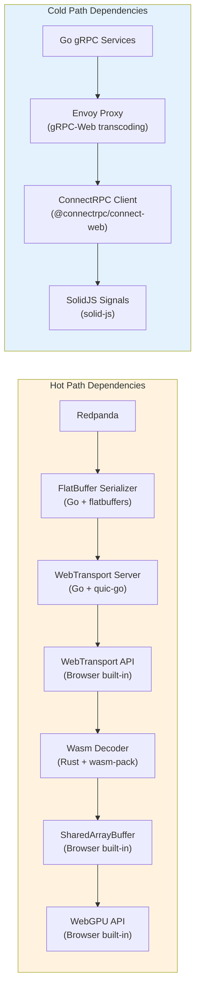
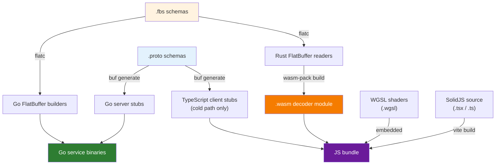

<!-- CLASSIFICATION: UNCLASSIFIED -->

# Dependency Graph

> **Document**: RTSA Dependency Graph — Backend + WebGPU Frontend
> **Version**: 3.0
> **Classification**: UNCLASSIFIED
> **Last Updated**: 2026-03-05
> **Authoritative Source**: `docs/architecture/v1/RTSA_WebGPU_Architecture_v1.md`

---

## 1. System-Level Dependency Graph

```mermaid
flowchart TD
    subgraph Infrastructure["Infrastructure Dependencies"]
        DOCKER["Docker / K8s / K3s"]
        OTEL["OpenTelemetry Collector"]
        PROM["Prometheus"]
        GRAF["Grafana + Loki + Tempo"]
    end

    subgraph Backend["Backend Stack (Retained)"]
        GO["Go 1.22+"]
        GRPC["gRPC / Protobuf"]
        RP["Redpanda (C++, no JVM)"]
        CH["ClickHouse"]
        RPC["Redpanda Connect"]
        WASM_BE["Wasm Transforms (Go → Wasm)"]
        ENVOY["Envoy Proxy<br/>(gRPC-Web + QUIC)"]
    end

    subgraph NewBackend["New Backend Components"]
        FB_SER["FlatBuffer Serializer (Go)"]
        WT_SRV["WebTransport Server (Go)"]
        FLATC["FlatBuffers Compiler (flatc)"]
    end

    subgraph Frontend["Frontend Stack (New)"]
        SOLID["SolidJS (~7 KB)"]
        VITE["Vite + SolidJS Plugin"]
        WEBGPU["WebGPU API (Browser)"]
        WGSL["WGSL Shaders"]
        WT_API["WebTransport API (Browser)"]
        SAB["SharedArrayBuffer API"]
        WASM_FE["Rust Wasm Decoder"]
        WASM_PACK["wasm-pack / wasm-bindgen"]
        CONNECT["ConnectRPC (gRPC-Web client)"]
    end

    subgraph BuildTools["Build Toolchain"]
        PROTOC["protoc + buf"]
        RUSTC["Rust Toolchain (rustup)"]
        TSC["TypeScript 5+"]
        NODE["Node.js 20+ / pnpm"]
    end

    GO --> GRPC
    GO --> RP
    GO --> CH
    GO --> FB_SER
    GO --> WT_SRV
    GRPC --> PROTOC
    FB_SER --> FLATC
    FB_SER --> RP
    WT_SRV --> FB_SER
    RPC --> RP
    RPC --> CH
    WASM_BE --> RP

    SOLID --> VITE --> NODE
    SOLID --> TSC
    WEBGPU --> WGSL
    CONNECT --> GRPC
    CONNECT --> ENVOY
    WASM_FE --> RUSTC --> WASM_PACK
    WASM_FE --> SAB
    WT_API --> WT_SRV

    DOCKER --> GO
    DOCKER --> NODE
    OTEL --> PROM --> GRAF

    style RP fill:#d32f2f,color:#fff
    style WEBGPU fill:#1565c0,color:#fff
    style SOLID fill:#6a1b9a,color:#fff
    style CH fill:#2e7d32,color:#fff
    style FB_SER fill:#f57c00,color:#fff
    style WT_SRV fill:#f57c00,color:#fff
    style WASM_FE fill:#f57c00,color:#fff
```

---

## 2. Backend Dependencies (Go)

### 2.1 Core Go Modules

| Module            | Import Path                              | Purpose                            | Status       |
| ----------------- | ---------------------------------------- | ---------------------------------- | ------------ |
| gRPC Server       | `google.golang.org/grpc`                 | Service-to-service + ingestion     | **Retained** |
| Protobuf Runtime  | `google.golang.org/protobuf`             | Message serialization (cold path)  | **Retained** |
| FlatBuffers       | `github.com/google/flatbuffers/go`       | Binary serialization (hot path)    | **New**      |
| Redpanda Client   | `github.com/twmb/franz-go`               | Kafka-compatible producer/consumer | **Retained** |
| ClickHouse Driver | `github.com/ClickHouse/clickhouse-go/v2` | OLAP queries                       | **Retained** |
| ConnectRPC        | `connectrpc.com/connect`                 | gRPC-Web server support            | **Retained** |
| OpenTelemetry     | `go.opentelemetry.io/otel`               | Distributed tracing + metrics      | **Retained** |
| slog              | `log/slog` (stdlib)                      | Structured logging                 | **Retained** |
| WebTransport      | `github.com/quic-go/webtransport-go`     | HTTP/3 QUIC datagram server        | **New**      |

### 2.2 Proto / Schema Toolchain

| Tool                    | Version           | Purpose                                                        |
| ----------------------- | ----------------- | -------------------------------------------------------------- |
| `buf`                   | Latest            | Protobuf schema management, linting, breaking change detection |
| `protoc-gen-go`         | Matches Go module | Go code generation from .proto                                 |
| `protoc-gen-connect-go` | Latest            | ConnectRPC server stubs                                        |
| `flatc`                 | Latest            | FlatBuffer schema compilation (.fbs → Go/Rust/TypeScript)      |

---

## 3. Frontend Dependencies (SolidJS + WebGPU)

### 3.1 NPM Packages

| Package                    | Purpose                                                 | Status                                      |
| -------------------------- | ------------------------------------------------------- | ------------------------------------------- |
| `solid-js`                 | UI framework — fine-grained reactivity, JSX compilation | **New** (replaces `react`, `react-dom`)     |
| `vite`                     | Build tool + dev server                                 | **Retained**                                |
| `vite-plugin-solid`        | SolidJS JSX transform for Vite                          | **New**                                     |
| `@connectrpc/connect-web`  | gRPC-Web client (cold path)                             | **Retained**                                |
| `@connectrpc/protobuf-es`  | Protobuf runtime for TypeScript (cold path)             | **Retained**                                |
| `typescript`               | Type checking                                           | **Retained**                                |
| `vitest`                   | Unit testing                                            | **Retained**                                |
| `@solidjs/testing-library` | SolidJS component testing                               | **New** (replaces `@testing-library/react`) |
| `playwright`               | E2E browser testing                                     | **Retained**                                |

### 3.2 Browser APIs (No NPM Package — Built-in)

| API                        | Browser Minimum                      | Purpose                                 |
| -------------------------- | ------------------------------------ | --------------------------------------- |
| `WebGPU` (`navigator.gpu`) | Chrome 113+, Edge 113+, Firefox 128+ | GPU compute + render pipeline           |
| `WebTransport`             | Chrome 97+, Edge 97+, Firefox 114+   | QUIC unreliable datagrams (hot path)    |
| `SharedArrayBuffer`        | All modern (with COOP/COEP)          | Zero-copy shared memory between workers |
| `OffscreenCanvas`          | All modern                           | WebGPU rendering from Render Worker     |
| `Atomics`                  | All modern (with SAB)                | Lock-free synchronization of dirty bits |

### 3.3 Rust / Wasm Toolchain (Decoder)

| Tool                       | Purpose                                     |
| -------------------------- | ------------------------------------------- |
| `rustup` / `cargo`         | Rust toolchain management                   |
| `wasm-pack`                | Build Rust → Wasm module with JS bindings   |
| `wasm-bindgen`             | Rust ↔ JS FFI (SharedArrayBuffer access)    |
| `flatbuffers` (Rust crate) | FlatBuffer zero-copy reader in Wasm decoder |

### 3.4 Removed Dependencies

These dependencies from the React-era stack are **not present** in the new codebase:

| Removed Package                 | Replaced By                         |
| ------------------------------- | ----------------------------------- |
| `react`, `react-dom`            | `solid-js`                          |
| `zustand`                       | SolidJS signals + SharedArrayBuffer |
| `maplibre-gl`                   | Custom WebGPU renderer              |
| `@tanstack/react-query`         | SolidJS `createResource` + gRPC-Web |
| `@testing-library/react`        | `@solidjs/testing-library`          |
| `protobuf-ts` (hot path decode) | Rust Wasm FlatBuffer decoder        |

---

## 4. Dual-Protocol Dependency Map

---

## 5. Build Dependency Chain

---

## 6. Infrastructure Dependencies

| Component               | Version / Image                       | Purpose                                     |
| ----------------------- | ------------------------------------- | ------------------------------------------- |
| Redpanda                | `redpandadata/redpanda:latest`        | Event streaming (C++, no JVM)               |
| ClickHouse              | `clickhouse/clickhouse-server:latest` | OLAP analytics                              |
| Envoy Proxy             | `envoyproxy/envoy:latest`             | gRPC-Web transcoding + HTTP/3 QUIC listener |
| OpenTelemetry Collector | `otel/opentelemetry-collector:latest` | Telemetry aggregation                       |
| Prometheus              | `prom/prometheus:latest`              | Metrics                                     |
| Grafana                 | `grafana/grafana:latest`              | Dashboards                                  |
| Loki                    | `grafana/loki:latest`                 | Log aggregation                             |
| Tempo                   | `grafana/tempo:latest`                | Distributed traces                          |

---

## 7. Cross-References

| Document                | Path                                                                   |
| ----------------------- | ---------------------------------------------------------------------- |
| Full v1 Architecture    | `docs/architecture/v1/RTSA_WebGPU_Architecture_v1.md`                  |
| Supply Chain Security   | `docs/sdlc_guidelines/01_security_compliance/supply_chain_security.md` |
| SolidJS Standards       | `docs/sdlc_guidelines/04_coding_standards/solidjs_standards.md`        |
| WebGPU Guidelines       | `docs/sdlc_guidelines/08_tech_specific/webgpu_guidelines.md`           |
| FlatBuffers Guidelines  | `docs/sdlc_guidelines/08_tech_specific/flatbuffers_guidelines.md`      |
| WebTransport Guidelines | `docs/sdlc_guidelines/08_tech_specific/webtransport_guidelines.md`     |
