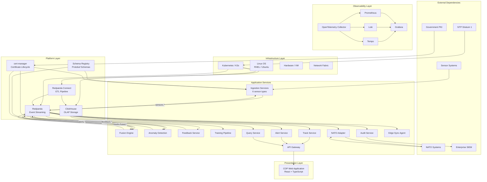
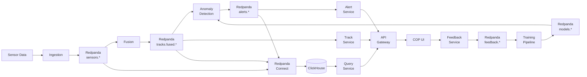
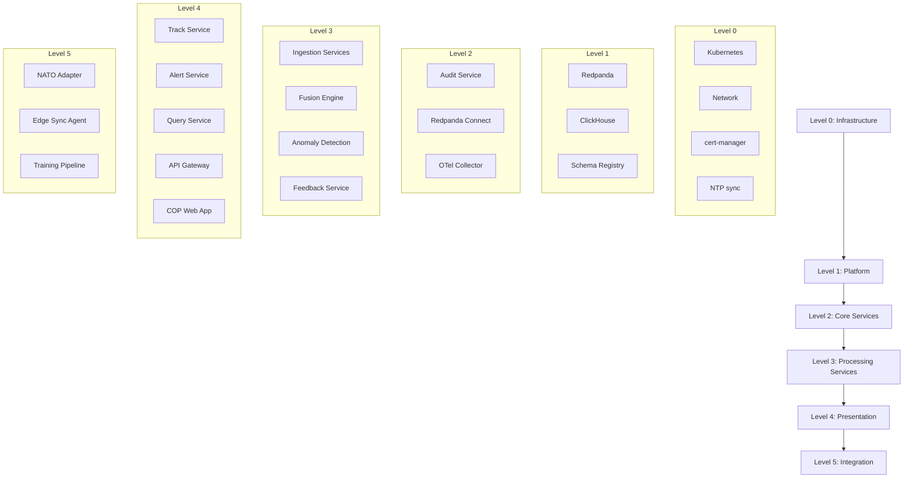
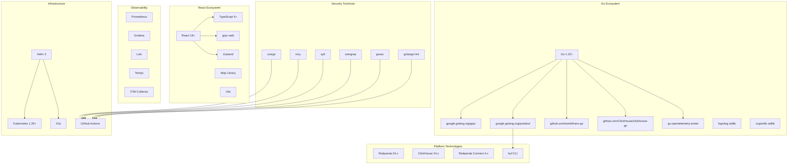
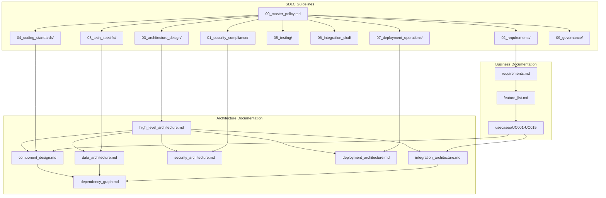

<!-- CLASSIFICATION: UNCLASSIFIED -->
# Dependency Graph

> **Document**: RTSA System Dependency Graph
> **Version**: 2.0
> **Classification**: UNCLASSIFIED
> **Last Updated**: 2026-02-28

---

## 1. System Dependency Overview

---

## 2. Service Dependency Matrix

| Service | Depends On | Depended On By |
|---|---|---|
| **Radar Ingestion** | Redpanda, Schema Registry, cert-manager | Fusion Engine (via Redpanda) |
| **EW/SIGINT Ingestion** | Redpanda, Schema Registry, cert-manager | Fusion Engine (via Redpanda) |
| **ELINT/COMINT Ingestion** | Redpanda, Schema Registry, cert-manager | Fusion Engine (via Redpanda) |
| **ISR Ingestion** | Redpanda, Schema Registry, cert-manager | Fusion Engine (via Redpanda) |
| **AIS/BFT Ingestion** | Redpanda, Schema Registry, cert-manager | Fusion Engine (via Redpanda) |
| **Cyber Ingestion** | Redpanda, Schema Registry, cert-manager | Fusion Engine (via Redpanda) |
| **Fusion Engine** | Redpanda, Schema Registry | Anomaly Detection, Track Service (via Redpanda) |
| **Anomaly Detection** | Redpanda, Schema Registry | Alert Service (via Redpanda), Feedback Service |
| **Feedback Service** | Redpanda, Schema Registry | Training Pipeline (via Redpanda) |
| **Training Pipeline** | Redpanda, Model Registry | Anomaly Detection (model updates via Redpanda) |
| **NATO Adapter** | Redpanda, Link 16 Terminal, NFFI Gateway | Fusion Engine (inbound), NATO Systems (outbound) |
| **Track Service** | Redpanda | API Gateway |
| **Alert Service** | Redpanda | API Gateway |
| **Query Service** | ClickHouse | API Gateway |
| **Audit Service** | Redpanda, ClickHouse | SIEM (outbound) |
| **API Gateway** | Track/Alert/Query Services, cert-manager | COP Web Application |
| **Edge Sync Agent** | Redpanda (edge), Redpanda (DC) | None |
| **Redpanda Connect** | Redpanda, ClickHouse | None (ETL pipeline) |

---

## 3. Data Flow Dependency Chain

**Critical Path** (sensor-to-display latency budget):

| Stage | Target Latency | Cumulative |
|---|---|---|
| Sensor → Ingestion | < 10 ms | 10 ms |
| Ingestion → Redpanda | < 5 ms | 15 ms |
| Redpanda → Fusion | < 20 ms | 35 ms |
| Fusion processing | < 50 ms | 85 ms |
| Fusion → Redpanda | < 5 ms | 90 ms |
| Redpanda → Track Service | < 10 ms | 100 ms |
| Track Service → Gateway | < 5 ms | 105 ms |
| Gateway → UI render | < 45 ms | **150 ms** |

---

## 4. Startup Order

| Level | Services | Ready When |
|---|---|---|
| 0 | Kubernetes, Network, cert-manager, NTP | Cluster healthy, certificates issued |
| 1 | Redpanda, ClickHouse, Schema Registry | Brokers accepting connections, topics created |
| 2 | Audit Service, Redpanda Connect, OTel Collector | Consuming audit events, ETL running |
| 3 | Ingestion Services, Fusion, Anomaly, Feedback | gRPC servers ready, consuming/producing |
| 4 | Track, Alert, Query Services, Gateway, UI | Streaming to clients, queries returning |
| 5 | NATO Adapter, Sync Agent, Training Pipeline | NATO link established, sync running |

---

## 5. Technology Dependency Tree

---

## 6. Failure Impact Analysis

| Component Failure | Impact | Blast Radius | Mitigation |
|---|---|---|---|
| **Redpanda** (total) | All data flow stops | **Critical** — entire system | 5-node cluster, RF=3, automated recovery |
| **Redpanda** (1 broker) | Temporary rebalance | Low — auto-recovery | Leader election < 2s |
| **ClickHouse** (total) | Historical queries unavailable | Medium — analytics only | 2-replica per shard, separate read path |
| **ClickHouse** (1 replica) | No impact (failover) | None | Automatic replica promotion |
| **Fusion Engine** | No fused tracks produced | High — COP shows stale data | 3 replicas, consumer group rebalance |
| **Anomaly Detection** | No new alerts generated | Medium — tracks still visible | 2 replicas, last-known alerts persist |
| **Single Ingestion Service** | One sensor type not ingested | Low — other sensors continue | 2 replicas per sensor type |
| **API Gateway** | UI cannot connect | High — no operator access | 2 replicas, health-check failover |
| **Track Service** | No real-time track updates | High — stale COP | 2 replicas, cached last-known state |
| **Query Service** | No historical queries | Low — real-time unaffected | 2 replicas |
| **Audit Service** | Audit events queued in Redpanda | Low — no data loss | Events buffered in Redpanda until recovery |
| **NATO Adapter** | No NATO data exchange | Medium — local ops continue | 2 replicas, queued messages in Redpanda |
| **Edge WAN Link** | Edge operates independently | Low (edge) — edge continues | Store-and-forward, automatic resync |
| **cert-manager** | No new certificates | Low — existing certs valid | 90-day cert lifetime provides buffer |

---

## 7. Document Dependency Map

---

## 8. Requirement → Feature → Component Traceability

| Requirement Group | Features | Components | Use Cases |
|---|---|---|---|
| CR-ING (Ingestion) | FEAT-01..06 | 6 Ingestion Services, Wasm Transforms | UC001..UC007 |
| CR-ING-011..012 *(v2.0)* | FEAT-16, FEAT-19 | Track Service (`StreamSensorObservations`), Ingestion Service (`ListSensorStatuses` + `SensorCoverage`) | UC016, UC017 |
| CR-FUS (Fusion) | FEAT-07 | Fusion Engine | UC008 |
| CR-INF (Inference) | FEAT-08 | Anomaly Detection Service | UC009 |
| CR-FB (Feedback) | FEAT-12, FEAT-13 | Feedback Service, Training Pipeline | UC010, UC011 |
| CR-FB-008 *(v2.0)* | FEAT-18 | Alert Service (`AssignAlert`) | UC010 |
| CR-UI (User Interface) | FEAT-13, FEAT-16..19 | Track/Alert/Query Services, Gateway, COP UI (Two-Level RBAC Shell) | UC012, UC016, UC017 |
| CR-UI-009..020 *(v2.0)* | FEAT-13, FEAT-16..19 | `uiStore`, `RoleSelector`, `DashboardSelector`, `FusionDashboard`, `MultiDomainDashboard`, `OperatorDashboard`, `SensorHealthDashboard` | UC012, UC016, UC017 |
| CR-HIS (Historical) | FEAT-14, FEAT-20 | Query Service, ClickHouse, Redpanda Connect | UC013 |
| CR-HIS-008..009 *(v2.0)* | FEAT-20 | Query Service (`GetEventTimeline`), ClickHouse materialized views | UC013 |
| CR-NATO (Interop) | FEAT-15 | NATO Adapter, Cross-Domain Guard | UC014, UC015 |
| CR-SEC (Security) | All features | All services (cross-cutting) | All use cases |
