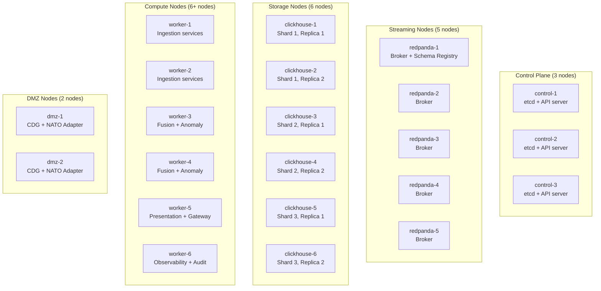
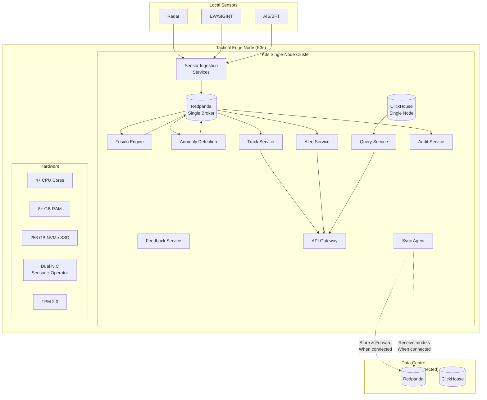
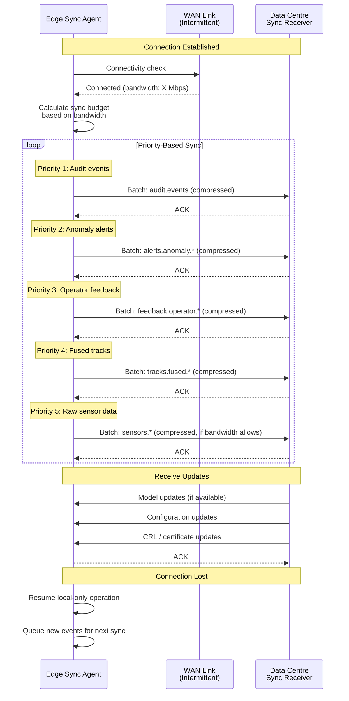
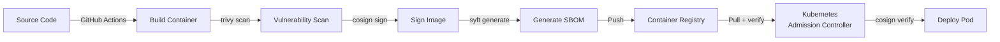

<!-- CLASSIFICATION: UNCLASSIFIED -->

# Deployment Architecture

> **Document**: RTSA Deployment Architecture
> **Version**: 3.0
> **Classification**: UNCLASSIFIED
> **Last Updated**: 2026-03-05
> **Compliance**: ITSG-33, NIST 800-53 Rev 5
> **Authoritative Source**: `docs/architecture/v1/RTSA_WebGPU_Architecture_v1.md`

---

## 1. Overview

The RTSA system deploys to three environment types: tactical edge (K3s, resource-constrained, potentially disconnected), on-premise data centre (full Kubernetes HA), and development/CI (Docker Compose / single-node K3s). Each environment has distinct resource profiles, redundancy levels, and operational constraints.

---

## 2. Environment Matrix

| Property      | Development     | CI/Testing     | Staging          | Production (DC)    | Production (Edge) |
| ------------- | --------------- | -------------- | ---------------- | ------------------ | ----------------- |
| Orchestration | Docker Compose  | K3s (single)   | K8s (3 nodes)    | K8s (5+ nodes)     | K3s (single)      |
| Redpanda      | 1 broker        | 1 broker       | 3 brokers        | 5 brokers          | 1 broker          |
| ClickHouse    | 1 node          | 1 node         | 2-shard          | 3-shard, 2-replica | 1 node            |
| Replication   | None            | None           | RF=3             | RF=3               | RF=1              |
| TLS           | Self-signed     | Self-signed    | Internal CA      | Government PKI     | Government PKI    |
| Air-gapped    | No              | No             | Partial          | Yes (option)       | Yes               |
| Min hardware  | 8 cores / 16 GB | 4 cores / 8 GB | 12 cores / 32 GB | 40 cores / 128 GB  | 4 cores / 8 GB    |

---

## 3. Data Centre Deployment

### 3.1 Kubernetes Cluster Topology



### 3.2 Namespace Layout

| Namespace            | Services                                                  | Node Affinity             |
| -------------------- | --------------------------------------------------------- | ------------------------- |
| `rtsa-ingestion`     | All 6 ingestion services                                  | Compute workers 1-2       |
| `rtsa-processing`    | Fusion Engine, Anomaly Detection, Feedback, Training      | Compute workers 3-4       |
| `rtsa-streaming`     | Redpanda cluster, Schema Registry                         | Dedicated streaming nodes |
| `rtsa-storage`       | ClickHouse cluster, Redpanda Connect                      | Dedicated storage nodes   |
| `rtsa-presentation`  | Track Service, Alert Service, Query Service, API Gateway  | Compute workers 5         |
| `rtsa-observability` | Prometheus, Grafana, Loki, Tempo, OpenTelemetry Collector | Compute worker 6          |
| `rtsa-audit`         | Audit Service                                             | Compute worker 6          |
| `rtsa-dmz`           | Cross-Domain Guards, NATO Adapter                         | DMZ nodes                 |
| `rtsa-system`        | Cert-manager, sealed-secrets, network policies            | Control plane             |

### 3.3 Resource Allocation (Data Centre)

| Service                | Replicas | CPU Request | CPU Limit | Memory Request | Memory Limit |
| ---------------------- | -------- | ----------- | --------- | -------------- | ------------ |
| Radar Ingestion        | 2        | 500m        | 1000m     | 256Mi          | 512Mi        |
| EW/SIGINT Ingestion    | 2        | 500m        | 1000m     | 256Mi          | 512Mi        |
| ELINT/COMINT Ingestion | 2        | 250m        | 500m      | 128Mi          | 256Mi        |
| ISR Ingestion          | 2        | 250m        | 500m      | 128Mi          | 256Mi        |
| AIS/BFT Ingestion      | 2        | 500m        | 1000m     | 256Mi          | 512Mi        |
| Cyber Ingestion        | 1        | 250m        | 500m      | 128Mi          | 256Mi        |
| NATO Adapter           | 2        | 500m        | 1000m     | 256Mi          | 512Mi        |
| FlatBuffer Serializer  | 2        | 500m        | 1000m     | 128Mi          | 256Mi        |
| WebTransport Server    | 2        | 500m        | 1000m     | 256Mi          | 512Mi        |
| Fusion Engine          | 3        | 1000m       | 2000m     | 512Mi          | 1024Mi       |
| Anomaly Detection      | 2        | 1000m       | 2000m     | 1024Mi         | 2048Mi       |
| Feedback Service       | 2        | 250m        | 500m      | 128Mi          | 256Mi        |
| Training Pipeline      | 1        | 2000m       | 4000m     | 2048Mi         | 4096Mi       |
| Track Service          | 2        | 500m        | 1000m     | 256Mi          | 512Mi        |
| Alert Service          | 2        | 250m        | 500m      | 128Mi          | 256Mi        |
| Query Service          | 2        | 500m        | 1000m     | 256Mi          | 512Mi        |
| API Gateway (Envoy)    | 2        | 500m        | 1000m     | 256Mi          | 512Mi        |
| Audit Service          | 2        | 250m        | 500m      | 128Mi          | 256Mi        |
| Redpanda Connect       | 2        | 500m        | 1000m     | 256Mi          | 512Mi        |

---

## 4. Edge Deployment

### 4.1 Edge Node Architecture



### 4.2 Edge Resource Budget

| Service              | Replicas | CPU Request | Memory Request | Total CPU | Total Memory |
| -------------------- | -------- | ----------- | -------------- | --------- | ------------ |
| Redpanda             | 1        | 500m        | 1024Mi         | 500m      | 1024Mi       |
| ClickHouse           | 1        | 300m        | 512Mi          | 300m      | 512Mi        |
| Ingestion (3 active) | 1 each   | 100m        | 64Mi           | 300m      | 192Mi        |
| Fusion Engine        | 1        | 400m        | 256Mi          | 400m      | 256Mi        |
| Anomaly Detection    | 1        | 400m        | 512Mi          | 400m      | 512Mi        |
| Feedback Service     | 1        | 50m         | 32Mi           | 50m       | 32Mi         |
| Track Service        | 1        | 100m        | 64Mi           | 100m      | 64Mi         |
| Alert Service        | 1        | 50m         | 32Mi           | 50m       | 32Mi         |
| Query Service        | 1        | 100m        | 64Mi           | 100m      | 64Mi         |
| API Gateway          | 1        | 100m        | 64Mi           | 100m      | 64Mi         |
| Audit Service        | 1        | 50m         | 32Mi           | 50m       | 32Mi         |
| Sync Agent           | 1        | 50m         | 32Mi           | 50m       | 32Mi         |
| **Total**            | —        | —           | —              | **2400m** | **3096Mi**   |

**Remaining headroom**: 1600m CPU, ~5 GB RAM on minimum 4-core / 8GB system.

### 4.3 Edge Data Retention

| Data                           | Retention            | Rationale                          |
| ------------------------------ | -------------------- | ---------------------------------- |
| Redpanda events                | 24 hours             | Limited SSD capacity               |
| ClickHouse sensor observations | 24 hours             | Limited SSD capacity               |
| ClickHouse fused tracks        | 48 hours             | Operational context window         |
| ClickHouse anomaly detections  | 7 days               | Post-incident review               |
| ClickHouse audit log           | Until synced         | Compliance — never lose audit data |
| Operator feedback              | Until synced         | Must reach training pipeline       |
| Model artifacts                | Current + 1 previous | Rollback capability                |

---

## 5. Edge-to-Centre Sync Protocol

### 5.1 Sync Flow



### 5.2 Sync Priority Matrix

| Priority     | Data Type                  | Compression  | Max Batch      | Retry Policy                      |
| ------------ | -------------------------- | ------------ | -------------- | --------------------------------- |
| 1 (Critical) | Audit events               | zstd level 3 | 10,000 events  | Infinite retry, persistent queue  |
| 2 (High)     | Anomaly alerts (ELEVATED+) | zstd level 3 | 5,000 events   | 3 retries, then queue             |
| 3 (High)     | Operator feedback          | zstd level 3 | 1,000 events   | 3 retries, then queue             |
| 4 (Medium)   | Fused tracks               | zstd level 1 | 50,000 events  | 1 retry, then drop oldest         |
| 5 (Low)      | Raw sensor observations    | zstd level 1 | 100,000 events | Best-effort, drop if no bandwidth |

---

## 6. Helm Chart Structure

```
deploy/
├── charts/
│   ├── rtsa-platform/              # Umbrella chart
│   │   ├── Chart.yaml
│   │   ├── values.yaml             # Default values
│   │   ├── values-dev.yaml         # Development overrides
│   │   ├── values-staging.yaml     # Staging overrides
│   │   ├── values-production.yaml  # Data centre production
│   │   ├── values-edge.yaml        # Edge deployment
│   │   └── templates/
│   │       ├── namespace.yaml
│   │       └── network-policies.yaml
│   ├── rtsa-redpanda/              # Redpanda sub-chart
│   ├── rtsa-clickhouse/            # ClickHouse sub-chart
│   ├── rtsa-ingestion/             # All ingestion services
│   ├── rtsa-fusion/                # Fusion engine
│   ├── rtsa-anomaly/               # Anomaly detection
│   ├── rtsa-feedback/              # Feedback service
│   ├── rtsa-training/              # Training pipeline
│   ├── rtsa-presentation/          # Track, Alert, Query services
│   ├── rtsa-gateway/               # API Gateway / Envoy
│   ├── rtsa-nato/                  # NATO adapter
│   ├── rtsa-audit/                 # Audit service
│   ├── rtsa-sync/                  # Edge sync agent
│   └── rtsa-observability/         # Prometheus, Grafana, Loki, Tempo
```

### 6.1 Helm Values — Edge Profile

```yaml
# values-edge.yaml — Tactical edge deployment
global:
  environment: edge
  replicas: 1
  resources:
    defaultCpuRequest: "100m"
    defaultMemoryRequest: "64Mi"

redpanda:
  replicas: 1
  storage:
    size: 50Gi
  resources:
    cpu: "500m"
    memory: "1Gi"
  config:
    log_retention_ms: 86400000 # 24 hours
    log_segment_size: 134217728 # 128 MB

clickhouse:
  replicas: 1
  shards: 1
  storage:
    size: 100Gi
  resources:
    cpu: "300m"
    memory: "512Mi"

fusion:
  replicas: 1
  resources:
    cpu: "400m"
    memory: "256Mi"

anomaly:
  replicas: 1
  resources:
    cpu: "400m"
    memory: "512Mi"
  config:
    modelPath: /models/edge-anomaly-v1

sync:
  enabled: true
  config:
    syncIntervalSeconds: 60
    compressionLevel: 3
    maxBatchSize: 10000

nato:
  enabled: false # Not deployed at edge

training:
  enabled: false # Training only at data centre
```

---

## 7. Container Security

### 7.1 Base Image Policy

| Property             | Requirement                                     |
| -------------------- | ----------------------------------------------- |
| Base image           | `cgr.dev/chainguard/static:latest` (distroless) |
| User                 | Non-root (UID 65532)                            |
| Read-only filesystem | `readOnlyRootFilesystem: true`                  |
| Privilege escalation | `allowPrivilegeEscalation: false`               |
| Capabilities         | Drop ALL, add none                              |
| Seccomp              | RuntimeDefault profile                          |

### 7.2 Pod Security Context

```yaml
securityContext:
  runAsNonRoot: true
  runAsUser: 65532
  runAsGroup: 65532
  fsGroup: 65532
  seccompProfile:
    type: RuntimeDefault
containerSecurityContext:
  readOnlyRootFilesystem: true
  allowPrivilegeEscalation: false
  capabilities:
    drop: ["ALL"]
```

### 7.3 Image Supply Chain



---

## 8. Health Check Configuration

| Service               | Liveness                         | Readiness                       | Startup                         |
| --------------------- | -------------------------------- | ------------------------------- | ------------------------------- |
| All gRPC services     | gRPC health check / 10s interval | gRPC health check / 5s interval | gRPC health check / 30s timeout |
| Redpanda              | TCP :9092 / 10s                  | HTTP :9644/v1/status/ready / 5s | TCP :9092 / 60s                 |
| ClickHouse            | TCP :9440 / 10s                  | HTTP :8443/ping / 5s            | TCP :9440 / 120s                |
| API Gateway           | HTTP :8080/healthz / 10s         | HTTP :8080/ready / 5s           | HTTP :8080/healthz / 30s        |
| COP Web App           | HTTP :5173/ / 30s                | HTTP :5173/ / 10s               | HTTP :5173/ / 30s               |
| FlatBuffer Serializer | gRPC health check / 10s          | gRPC health check / 5s          | gRPC health check / 30s         |
| WebTransport Server   | QUIC health / 10s                | HTTP :443/health / 5s           | HTTP :443/health / 30s          |

---

## 9.5 WebGPU COP Infrastructure Requirements

The WebGPU COP introduces specific infrastructure requirements beyond the backend stack:

| Change               | Description                                                                                                                  |
| -------------------- | ---------------------------------------------------------------------------------------------------------------------------- |
| HTTP/3 proxy         | Envoy with QUIC listener or Caddy reverse proxy for WebTransport datagrams                                                   |
| COOP/COEP headers    | `Cross-Origin-Opener-Policy: same-origin`, `Cross-Origin-Embedder-Policy: require-corp` on COP web app for SharedArrayBuffer |
| CORS for tiles       | Tile server must set `Access-Control-Allow-Origin` for COEP compliance                                                       |
| Wasm module hosting  | Serve `.wasm` with `application/wasm` MIME type, cached aggressively                                                         |
| Browser requirements | Operator workstations must run Chrome 113+, Edge 113+, or Firefox 128+                                                       |
| QUIC firewall rules  | UDP port 443 must be permitted for WebTransport QUIC datagrams                                                               |

---

## 9. Disaster Recovery

| Scenario                | RPO              | RTO                 | Recovery Procedure                                       |
| ----------------------- | ---------------- | ------------------- | -------------------------------------------------------- |
| Single pod failure      | 0 (event replay) | < 30s (K8s restart) | Automatic pod restart, consumer rebalance                |
| Single node failure     | 0 (RF=3)         | < 5 min             | K8s reschedule, Redpanda rebalance                       |
| Redpanda broker failure | 0 (RF=3)         | < 2 min             | Automatic leader election                                |
| ClickHouse shard loss   | 0 (2 replicas)   | < 5 min             | Replica promotion                                        |
| Full cluster failure    | ≤ 5 min          | < 1 hour            | Restore from backup, replay from Redpanda tiered storage |
| Edge node failure       | ≤ 24h (local)    | < 30 min            | Re-image, restore from encrypted backup                  |
| Data centre loss        | ≤ 1 hour         | < 4 hours           | Secondary site activation (if configured)                |
