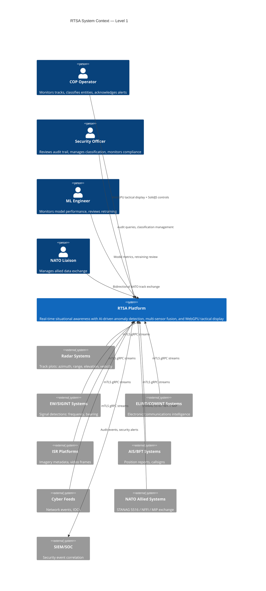
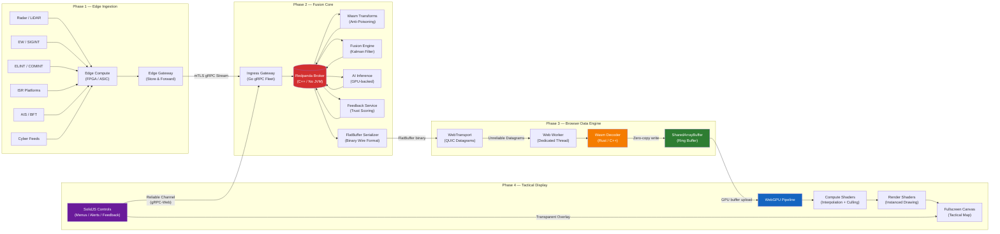
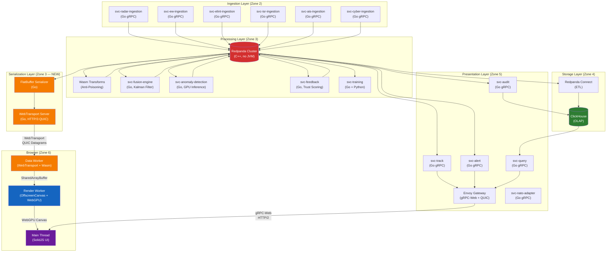

<!-- CLASSIFICATION: UNCLASSIFIED -->
# High-Level Architecture

> **Document**: RTSA High-Level Architecture — WebGPU Performance-First Pipeline
> **Version**: 3.0
> **Classification**: UNCLASSIFIED
> **Last Updated**: 2026-03-05
> **Compliance**: ITSG-33 (CCCS), NIST 800-53 Rev 5, NATO STANAG 5516
> **Authoritative Source**: `docs/architecture/v1/RTSA_WebGPU_Architecture_v1.md`

---

## 1. Executive Summary

RTSA provides Canadian Armed Forces operators with a unified, real-time operational picture by fusing data from six sensor categories, applying AI-driven anomaly detection, and enabling human-in-the-loop feedback. The system supports full data centre and hardware-constrained tactical edge deployments while maintaining NATO interoperability via STANAG 5516 / NFFI / MIP.

The **performance-first v1 architecture** re-architects the frontend data pipeline from backend binary serialization through browser transport, off-main-thread processing, GPU-resident storage, to WebGPU compute-and-render — while preserving the proven Redpanda + ClickHouse + Go gRPC backend stack.

### Performance Targets

| Metric | Previous (React/MapLibre) | Target (WebGPU) |
|---|---|---|
| Concurrent rendered tracks | ~5,000 (degraded) | 50,000+ (sustained) |
| Track update ingestion rate | ~2,000 msg/s (browser) | 50,000+ msg/s (browser) |
| Frame rate under load | 15–30 FPS at 5k tracks | 60 FPS sustained at 50k tracks |
| Update-to-pixel latency | 100–200 ms | < 16 ms (single frame) |
| Main thread CPU utilization | 70–95% under load | < 20% (UI controls only) |
| Memory per track | ~2 KB (JS objects + GeoJSON) | ~128 bytes (GPU buffer slot) |

---

## 2. C4 Context Diagram (Level 1)



---

## 3. End-to-End Data Pipeline

The system processes data through four phases: Edge Ingestion → Fusion Core → Browser Data Engine → Tactical Display.



---

## 4. Dual-Protocol Architecture

The system uses two distinct communication protocols optimized for different access patterns:

```mermaid
flowchart TD
    subgraph HotPath["Hot Path — Real-Time Display (50,000+ msg/s)"]
        direction LR
        BE_HOT["Backend<br/>FlatBuffer Serializer"] -- "WebTransport<br/>Unreliable Datagrams<br/>(QUIC)" --> WW_HOT["Web Worker<br/>+ Wasm Decoder"]
        WW_HOT -- "SharedArrayBuffer" --> GPU_HOT["WebGPU<br/>Compute + Render"]
    end

    subgraph ColdPath["Cold Path — Commands & Queries (< 100 req/s)"]
        direction LR
        UI_COLD["SolidJS UI"] -- "gRPC-Web<br/>Protobuf<br/>(HTTP/2)" --> GW_COLD["Envoy Gateway"]
        GW_COLD -- "gRPC / mTLS" --> SVC_COLD["Go Services<br/>(Track, Alert, Query,<br/>Feedback)"]
    end

    subgraph Historical["Historical Path — Analytics"]
        direction LR
        UI_HIST["Query Builder"] -- "gRPC-Web<br/>Protobuf" --> QS["Query Service"]
        QS -- "SQL / mTLS" --> CH[("ClickHouse")]
    end

    style HotPath fill:#fff3e0
    style ColdPath fill:#e3f2fd
    style Historical fill:#e8f5e9
```



| Path | Protocol | Format | Reliability | Use Case |
|---|---|---|---|---|
| **Hot** | WebTransport (QUIC) | FlatBuffers | Unreliable datagrams | Track position updates, sensor observations, alert state |
| **Cold** | gRPC-Web (HTTP/2) | Protobuf | Reliable, ordered | Operator feedback, alert acknowledgment, role selection |
| **Historical** | gRPC-Web (HTTP/2) | Protobuf | Reliable, ordered | Forensic queries, event timeline, map replay |

---

## 5. C4 Container Diagram (Level 2)



---

## 6. Security Zones

All traffic between zones uses mTLS with CSE-approved cipher suites. Components operate under a zero-trust model.

```
Zone 0 — External (Untrusted)   : Sensor networks, NATO allied systems, cyber feeds
Zone 1 — DMZ                    : Cross-Domain Guards, Link 16 terminal, NFFI/MIP gateway
Zone 2 — Ingestion (Restricted) : Ingestion services, Wasm Data Transforms
Zone 3 — Processing (Confidential) : Redpanda, Fusion, Anomaly Detection, Feedback, FlatBuffer Serializer, WebTransport Server
Zone 4 — Storage (Confidential) : ClickHouse, Redpanda Connect, Model Registry
Zone 5 — Presentation (Controlled) : API Gateway (Envoy with QUIC), Track/Alert/Query services
Zone 6 — Operator (User-Facing) : WebGPU COP (SolidJS + WebGPU canvas), Operator workstations
Zone 7 — Management (Admin)     : Audit service, Observability stack (OTel, Prometheus, Grafana, Loki, Tempo)
```

---

## 7. Technology Stack

| Layer | Technology | Purpose |
|---|---|---|
| Event Streaming | Redpanda (C++, no JVM) | Real-time event log, audit trail, feedback routing |
| Microservices | Go + gRPC (Protobuf) | Strict type-safety, high performance, small binary footprint |
| Analytics / OLAP | ClickHouse | Historical storage, forensics, complex analytical queries |
| Real-time Serialization | FlatBuffers | GPU-optimized zero-copy binary wire format for hot path |
| Hot Path Transport | WebTransport (HTTP/3 / QUIC) | Unreliable datagrams for track updates — no HOL blocking |
| Cold Path Transport | gRPC-Web (HTTP/2) | Reliable ordered RPCs for commands, queries, feedback |
| Browser Decode | Rust → Wasm | Zero-allocation FlatBuffer decoder, off-main-thread |
| State Management | SharedArrayBuffer | Zero-copy ring buffer shared between Worker threads |
| Tactical Rendering | WebGPU + WGSL Compute Shaders | 50k instanced tracks at 60 FPS, GPU-side interpolation and culling |
| UI Framework | SolidJS | Fine-grained reactivity, no Virtual DOM, ~7 KB runtime |
| Text Rendering | SDF Font Atlases (GPU) | GPU-rendered labels replacing DOM `<div>` overlays |
| Track Selection | GPU Pick Buffer | O(1) pixel-perfect selection, no DOM event listeners |
| Data Pipeline | Redpanda Connect | Batch ETL: stream → ClickHouse / S3 |
| Anti-Poisoning | Wasm Data Transforms / Go middleware | In-broker feedback trust validation |
| Interoperability | STANAG 5516 / NFFI / MIP adapters | NATO data exchange with allied systems |
| Observability | OpenTelemetry + Prometheus + Grafana + Loki + Tempo | Distributed tracing, metrics, structured logging |
| Container Runtime | Docker / Kubernetes / K3s (edge) | Dev via Docker Compose, staging/prod via Helm |

---

## 8. Key Design Decisions

| # | Decision | Rationale |
|---|---|---|
| D-01 | Replace React with SolidJS for command UI | Fine-grained reactivity, no Virtual DOM diffing, ~7 KB runtime |
| D-02 | Replace MapLibre GL with custom WebGPU renderer | Direct GPU control, compute shaders for interpolation, instanced rendering |
| D-03 | FlatBuffers over Protobuf for real-time stream | Zero-copy read, no deserialization step, direct memory-map to GPU |
| D-04 | WebTransport over gRPC-Web for real-time stream | Unreliable datagrams (no HOL blocking), QUIC-native, lower latency |
| D-05 | Web Worker + Wasm decoder pipeline | Off-main-thread binary processing, near-native throughput |
| D-06 | SharedArrayBuffer + GPU buffer upload | Zero-copy path from network to GPU, eliminates GC pressure |
| D-07 | Retain Protobuf/gRPC for command & query paths | Type-safe, existing backend contract, low-frequency operations |
| D-08 | Retain Redpanda as event backbone | Proven, low-latency, Kafka-compatible, edge-deployable |
| D-09 | Retain ClickHouse for historical analytics | Columnar OLAP optimized for time-series, existing materialized views |
| D-10 | GPU-resident ring buffer for track state | Eliminates per-frame CPU→GPU transfer, compute shaders update in-place |
| D-11 | WebGPU-only COP — no legacy fallback | Military controlled workstations, team size prevents dual-stack maintenance |

---

## 9. Cross-References

| Document | Path |
|---|---|
| **Full v1 Architecture Specification** | `docs/architecture/v1/RTSA_WebGPU_Architecture_v1.md` |
| Component Design | `docs/architecture/component_design.md` |
| Data Architecture | `docs/architecture/data_architecture.md` |
| Security Architecture | `docs/architecture/security_architecture.md` |
| Deployment Architecture | `docs/architecture/deployment_architecture.md` |
| Integration Architecture | `docs/architecture/integration_architecture.md` |
| Dependency Graph | `docs/architecture/dependency_graph.md` |
| Business Requirements | `docs/business/requirements.md` |
| Feature List | `docs/business/feature_list.md` |
| Use Cases | `docs/business/usecases/UC*.md` |
