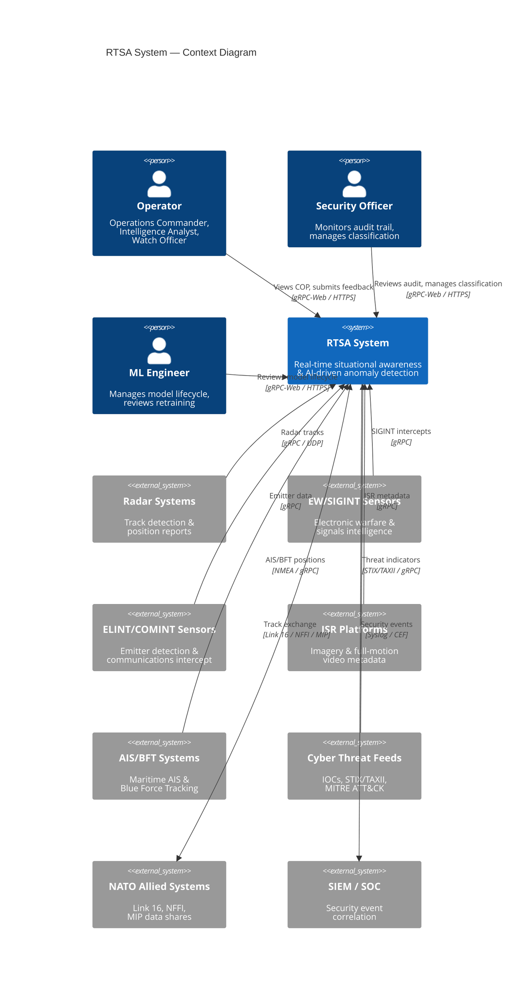
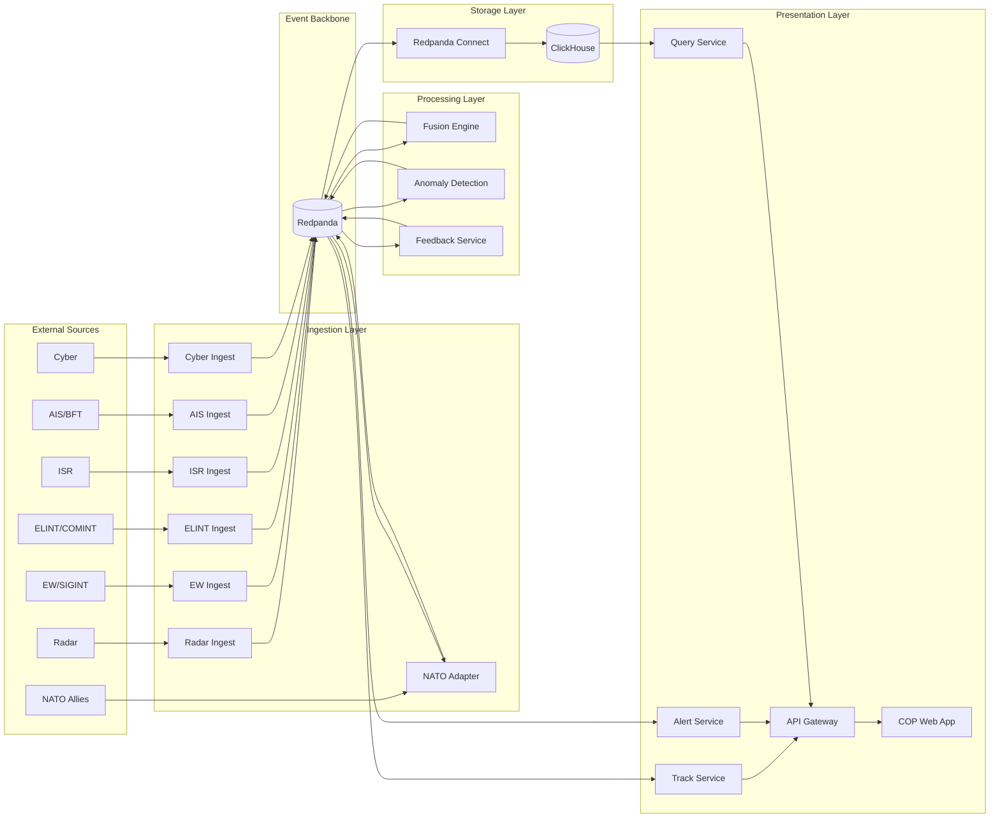

<!-- CLASSIFICATION: UNCLASSIFIED -->
# High-Level Architecture

> **Document**: RTSA High-Level Architecture
> **Version**: 1.0
> **Classification**: UNCLASSIFIED
> **Last Updated**: 2026-02-23
> **Compliance**: ITSG-33, NIST 800-53 Rev 5, NATO STANAG 5516

---

## 1. Executive Summary

The Real-Time Situational Awareness & Risk Assessment (RTSA) system is an event-driven microservices platform that ingests multi-sensor data (Radar, EW/SIGINT, ELINT/COMINT, ISR, AIS/BFT, Cyber), fuses it into a unified track picture, applies AI-driven anomaly detection, and presents a real-time common operating picture (COP) to operators. Human-in-the-loop feedback drives model improvement. The system supports deployment at tactical edge (disconnected, resource-constrained) and data centre (full capacity) environments.

---

## 2. C4 Context Diagram

---

## 3. C4 Container Diagram

```mermaid
C4Container
    title RTSA System — Container Diagram

    Person(operator, "Operator", "")

    System_Boundary(rtsa, "RTSA System") {
        Container(ui, "COP Web Application", "React 18, TypeScript, gRPC-Web", "Real-time situational awareness<br/>dashboard with map, alerts,<br/>and feedback UI")

        Container(gateway, "API Gateway", "Go, Envoy", "gRPC-Web proxy, mTLS termination,<br/>rate limiting, auth")

        Container(radar_ing, "Radar Ingestion Service", "Go, gRPC", "Ingests radar tracks,<br/>normalizes to internal schema")
        Container(ew_ing, "EW/SIGINT Ingestion Service", "Go, gRPC", "Ingests electronic warfare<br/>& signals intelligence data")
        Container(elint_ing, "ELINT/COMINT Ingestion Service", "Go, gRPC", "Ingests emitter detections<br/>& communications intercepts")
        Container(isr_ing, "ISR Ingestion Service", "Go, gRPC", "Ingests ISR platform<br/>metadata & observations")
        Container(ais_ing, "AIS/BFT Ingestion Service", "Go, gRPC", "Ingests maritime AIS<br/>& Blue Force Tracking")
        Container(cyber_ing, "Cyber Ingestion Service", "Go, gRPC", "Ingests cyber threat IOCs<br/>from STIX/TAXII feeds")
        Container(nato_ing, "NATO Adapter Service", "Go, gRPC", "Bidirectional Link 16 / NFFI /<br/>MIP translation & exchange")

        Container(fusion, "Fusion Engine", "Go, gRPC", "Multi-source track correlation,<br/>entity state estimation,<br/>confidence scoring")
        Container(anomaly, "Anomaly Detection Service", "Go, gRPC", "AI/ML inference for<br/>behavioral, spatial, temporal<br/>anomaly detection")
        Container(feedback, "Feedback Service", "Go, gRPC", "Operator feedback collection,<br/>trust scoring,<br/>anti-poisoning validation")
        Container(training, "Model Training Pipeline", "Go, Python", "Feedback-driven model<br/>retraining with<br/>anti-poisoning safeguards")

        Container(track_svc, "Track Service", "Go, gRPC", "Track state management,<br/>streaming to UI,<br/>historical queries")
        Container(alert_svc, "Alert Service", "Go, gRPC", "Alert management,<br/>severity routing,<br/>acknowledgment tracking")
        Container(query_svc, "Query Service", "Go, gRPC", "Historical queries against<br/>ClickHouse with<br/>classification filtering")
        Container(audit_svc, "Audit Service", "Go, gRPC", "Immutable audit trail,<br/>compliance reporting")

        ContainerDb(redpanda, "Redpanda Cluster", "Redpanda", "Event streaming backbone,<br/>all inter-service communication")
        ContainerDb(clickhouse, "ClickHouse Cluster", "ClickHouse", "Historical storage, OLAP<br/>analytics, forensics")
        Container(rpconnect, "Redpanda Connect", "Redpanda Connect", "Stream-to-OLAP ETL,<br/>batch materialization")
    }

    Rel(operator, ui, "Uses", "HTTPS")
    Rel(ui, gateway, "gRPC-Web", "HTTPS/mTLS")
    Rel(gateway, track_svc, "gRPC", "mTLS")
    Rel(gateway, alert_svc, "gRPC", "mTLS")
    Rel(gateway, feedback, "gRPC", "mTLS")
    Rel(gateway, query_svc, "gRPC", "mTLS")

    Rel(radar_ing, redpanda, "Produce", "sensors.radar.*")
    Rel(ew_ing, redpanda, "Produce", "sensors.ew.*")
    Rel(elint_ing, redpanda, "Produce", "sensors.elint.*")
    Rel(isr_ing, redpanda, "Produce", "sensors.isr.*")
    Rel(ais_ing, redpanda, "Produce", "sensors.ais.*")
    Rel(cyber_ing, redpanda, "Produce", "sensors.cyber.*")
    Rel(nato_ing, redpanda, "Produce/Consume", "sensors.nato.*")

    Rel(redpanda, fusion, "Consume", "sensors.*")
    Rel(fusion, redpanda, "Produce", "tracks.fused.*")
    Rel(redpanda, anomaly, "Consume", "tracks.fused.*")
    Rel(anomaly, redpanda, "Produce", "alerts.*")
    Rel(feedback, redpanda, "Produce", "feedback.*")
    Rel(redpanda, training, "Consume", "feedback.operator.validated")
    Rel(audit_svc, redpanda, "Consume/Produce", "audit.*")

    Rel(rpconnect, redpanda, "Consume", "all topics")
    Rel(rpconnect, clickhouse, "Insert", "batch ETL")
    Rel(query_svc, clickhouse, "Query", "SQL/mTLS")
```

---

## 4. Architectural Principles

| # | Principle | Description |
|---|---|---|
| AP-01 | Event-Driven First | All inter-service communication flows through Redpanda. No direct service-to-service calls for data exchange. |
| AP-02 | Security by Design | mTLS everywhere, classification enforcement at every boundary, zero-trust between services. |
| AP-03 | Edge-Native | Every service must operate in resource-constrained edge environments (4 cores, 8 GB RAM minimum). |
| AP-04 | Immutable Audit | All state-changing operations produce audit events. Audit data is append-only, never modified or deleted. |
| AP-05 | Human-in-the-Loop | AI/ML systems never act autonomously on critical decisions without operator awareness. |
| AP-06 | Graceful Degradation | Services degrade predictably under resource pressure. Shedding rules prioritize safety-critical data. |
| AP-07 | NATO Interoperable | System can exchange data with allied systems using standard formats without custom integration. |
| AP-08 | Observable | Every service emits structured logs, metrics, and traces via OpenTelemetry. |

---

## 5. Key Architectural Decisions

### ADR-001: Redpanda as Event Backbone

**Decision**: Use Redpanda as the sole inter-service communication mechanism.

**Rationale**:
- Kafka-compatible API with lower resource footprint (critical for edge)
- Single binary, no JVM dependency
- Built-in Schema Registry for protobuf schema evolution
- Wasm Data Transforms for in-broker validation
- Tiered storage for long-term event retention

**Consequences**: All services are decoupled via topics. No synchronous service-to-service calls for data flow. Command/query separation is natural.

### ADR-002: ClickHouse for Historical Analytics

**Decision**: Use ClickHouse as the OLAP engine for historical queries and forensics.

**Rationale**:
- Columnar storage optimized for time-series analytics
- MergeTree engine with native partitioning by date
- Excellent compression for high-volume sensor data
- SQL interface familiar to analysts
- Lightweight enough for tactical edge deployment

**Consequences**: Redpanda Connect handles stream-to-OLAP ETL. No direct writes from services to ClickHouse. Query service provides classification-filtered access.

### ADR-003: Go for All Backend Services

**Decision**: Use Go as the primary backend language.

**Rationale**:
- Excellent gRPC/protobuf support
- Low memory footprint for edge deployment
- Strong concurrency model (goroutines)
- Static binary compilation (no runtime dependencies)
- CSE-approved for Protected C workloads

**Consequences**: All services follow the same project structure and coding standards. Shared libraries for common patterns (interceptors, health checks, graceful shutdown).

### ADR-004: CQRS with Event Sourcing

**Decision**: Separate command (write) and query (read) paths.

**Rationale**:
- Write path: Sensor ingestion → Redpanda → Fusion → Redpanda (optimized for throughput)
- Read path: ClickHouse (optimized for complex analytical queries)
- Event sourcing via Redpanda provides complete audit trail and replay capability

**Consequences**: Redpanda Connect materializes views into ClickHouse. Slight eventual consistency delay (< 5s) between write and read paths.

---

## 6. Data Flow Overview

---

## 7. Service Inventory

| Service | Bounded Context | Topics Consumed | Topics Produced | Edge Deployed |
|---|---|---|---|---|
| Radar Ingestion | Sensor Ingestion | — | `sensors.radar.*` | Yes |
| EW/SIGINT Ingestion | Sensor Ingestion | — | `sensors.ew.*` | Yes |
| ELINT/COMINT Ingestion | Sensor Ingestion | — | `sensors.elint.*` | Yes |
| ISR Ingestion | Sensor Ingestion | — | `sensors.isr.*` | Yes |
| AIS/BFT Ingestion | Sensor Ingestion | — | `sensors.ais.*` | Yes |
| Cyber Ingestion | Sensor Ingestion | — | `sensors.cyber.*` | Yes |
| NATO Adapter | Interoperability | `tracks.fused.*`, `sensors.nato.*` | `sensors.nato.*` | No |
| Fusion Engine | Entity Fusion | `sensors.*` | `tracks.fused.*` | Yes |
| Anomaly Detection | AI/ML Inference | `tracks.fused.*` | `alerts.*` | Yes |
| Feedback Service | Human Feedback | — | `feedback.*` | Yes |
| Training Pipeline | AI/ML Training | `feedback.operator.validated` | `models.*` | No |
| Track Service | Presentation | `tracks.fused.*` | — | Yes |
| Alert Service | Presentation | `alerts.*` | — | Yes |
| Query Service | Analytics | — (ClickHouse) | — | Yes |
| Audit Service | Governance | `*` (filtered) | `audit.*` | Yes |
| Redpanda Connect | Data Pipeline | `*` | — (ClickHouse) | Yes (limited) |

---

## 8. Cross-Cutting Concerns

### 8.1 Security
- **mTLS**: All gRPC channels use mutual TLS with CSE-approved cipher suites
- **Authentication**: Certificate-based identity for services and operators
- **Authorization**: Clearance-level-based access control
- **Classification**: Every data item carries classification metadata
- **Audit**: Immutable, append-only audit trail via Redpanda

### 8.2 Observability
- **Metrics**: Prometheus-compatible via OpenTelemetry (15s scrape interval)
- **Logging**: Structured JSON via Go `slog` → Loki
- **Tracing**: Distributed traces via OpenTelemetry → Tempo
- **Dashboards**: Grafana with domain-specific dashboards

### 8.3 Resilience
- **Circuit Breakers**: Per-service circuit breakers for external dependencies
- **Dead Letter Queues**: Invalid messages routed to DLQ topics with diagnostic context
- **Graceful Shutdown**: All services handle SIGTERM with in-flight request completion
- **Health Checks**: Liveness + readiness probes on every service

### 8.4 Edge Deployment
- **Resource Budget**: 4 CPU cores, 8 GB RAM minimum
- **Offline Mode**: Full operation without data centre connectivity
- **Sync Protocol**: Store-and-forward with priority-based queue on reconnect
- **Model Distribution**: Edge receives pre-trained and incrementally updated models

---

## 9. Deployment Environments

| Environment | Orchestration | Redpanda | ClickHouse | Purpose |
|---|---|---|---|---|
| Development | Docker Compose | Single node | Single node | Local development |
| Testing | K3s (single node) | Single node | Single node | CI/CD pipeline |
| Staging | K8s (3 nodes) | 3-node cluster | 2-shard cluster | Pre-production validation |
| Production (Data Centre) | K8s (5+ nodes) | 5-node cluster | 3-shard, 2-replica | Full capacity |
| Production (Edge) | K3s (single node) | Single node | Single node | Tactical deployment |

---

## 10. Technology Stack Summary

| Layer | Technology | Version | Purpose |
|---|---|---|---|
| Event Streaming | Redpanda | 24.x | Event backbone, audit trail |
| Services | Go | 1.22+ | All backend microservices |
| RPC Framework | gRPC + Protobuf | proto3 | Type-safe inter-service communication |
| OLAP Database | ClickHouse | 24.x | Historical analytics, forensics |
| Data Pipeline | Redpanda Connect | 4.x | Stream-to-OLAP ETL |
| Frontend | React + TypeScript | 18+ / 5+ | COP web application |
| Frontend Transport | gRPC-Web | — | Real-time streaming to browser |
| Container Runtime | containerd | — | OCI-compliant container runtime |
| Orchestration | Kubernetes / K3s | 1.29+ | Service orchestration |
| Observability | OpenTelemetry + Prometheus + Grafana + Loki + Tempo | — | Metrics, logs, traces |
| Security | cosign, trivy, semgrep, gosec | — | Supply chain & code security |
| Build | buf, golangci-lint, GitHub Actions | — | Build, lint, CI/CD |
