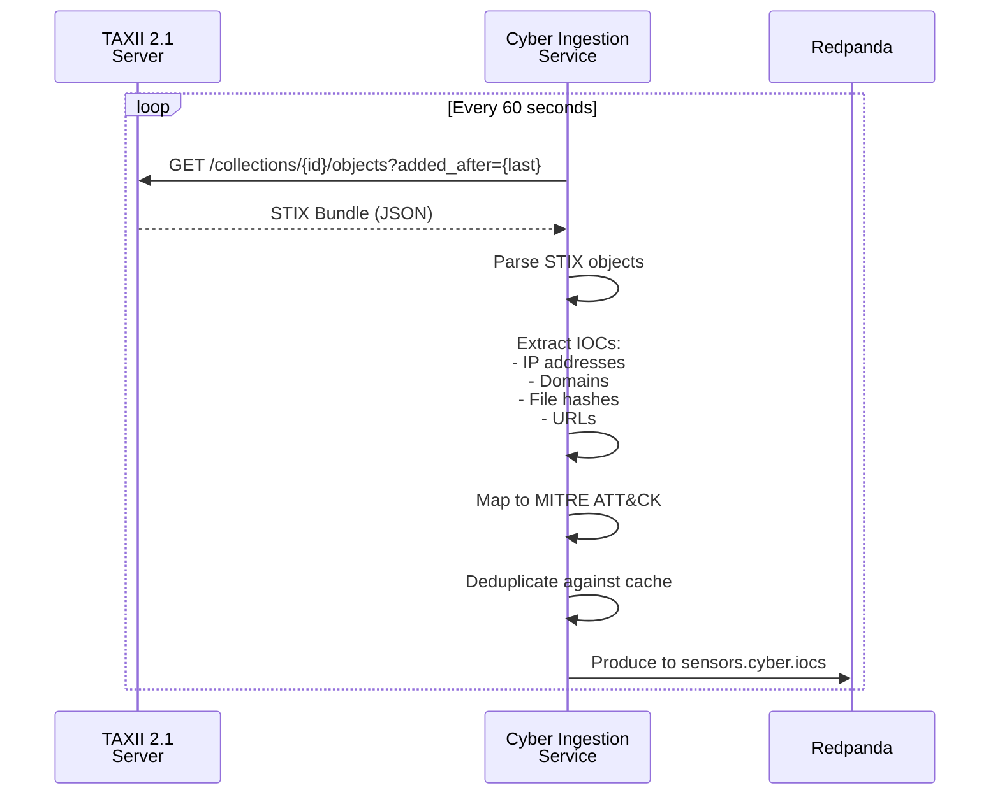
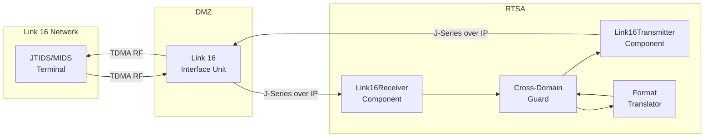
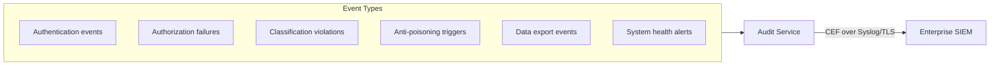
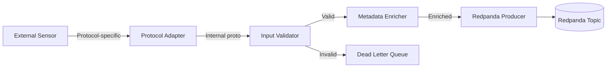
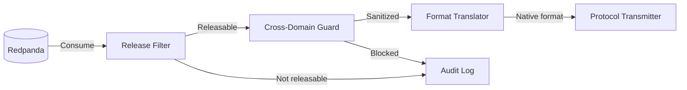

<!-- CLASSIFICATION: UNCLASSIFIED -->
# Integration Architecture

> **Document**: RTSA Integration Architecture
> **Version**: 1.0
> **Classification**: UNCLASSIFIED
> **Last Updated**: 2026-02-23
> **Compliance**: ITSG-33, NIST 800-53 Rev 5, NATO STANAG 5516

---

## 1. Overview

The RTSA system integrates with external sensor systems, NATO allied platforms, cyber threat feeds, and enterprise security infrastructure. All external integrations pass through validated boundaries with protocol translation, classification enforcement, and comprehensive audit logging.

---

## 2. Integration Map

```mermaid
flowchart TD
    subgraph External["External Systems"]
        RAD[Radar Systems<br/>Track reports]
        EW[EW/SIGINT Sensors<br/>Intercepts]
        ELINT[ELINT/COMINT<br/>Emitter detections]
        ISR[ISR Platforms<br/>Metadata feeds]
        AIS[AIS Receivers<br/>NMEA sentences]
        BFT[BFT Systems<br/>Force positions]
        CTF[Cyber Threat Feeds<br/>STIX/TAXII servers]
        L16[Link 16 Terminal<br/>J-Series messages]
        NFFI_EXT[NATO NFFI/MIP<br/>Allied track shares]
        SIEM_EXT[Enterprise SIEM<br/>SOC platform]
        PKI[Government PKI<br/>Certificate authority]
        NTP[NTP Stratum 1<br/>Time source]
    end

    subgraph RTSA["RTSA System"]
        ING_RADAR[Radar Ingestion]
        ING_EW[EW/SIGINT Ingestion]
        ING_ELINT[ELINT/COMINT Ingestion]
        ING_ISR[ISR Ingestion]
        ING_AIS[AIS/BFT Ingestion]
        ING_CYBER[Cyber Ingestion]
        NATO_ADAPT[NATO Adapter]
        AUDIT_SVC[Audit Service]
        CERT_MGR[Cert-Manager]
        CHRONY[Chrony NTP Client]
    end

    RAD -->|gRPC/mTLS| ING_RADAR
    EW -->|gRPC/mTLS| ING_EW
    ELINT -->|gRPC/mTLS| ING_ELINT
    ISR -->|gRPC/mTLS| ING_ISR
    AIS -->|NMEA over TCP/TLS| ING_AIS
    BFT -->|gRPC/mTLS| ING_AIS
    CTF -->|TAXII 2.1 / HTTPS| ING_CYBER
    L16 -->|Link 16 Protocol| NATO_ADAPT
    NFFI_EXT -->|HTTPS/mTLS| NATO_ADAPT
    NATO_ADAPT -->|Link 16 Protocol| L16
    NATO_ADAPT -->|HTTPS/mTLS| NFFI_EXT
    AUDIT_SVC -->|Syslog/TLS + CEF| SIEM_EXT
    PKI -->|SCEP/EST| CERT_MGR
    NTP -->|NTP| CHRONY
```



---

## 3. Sensor Integration Specifications

### 3.1 Radar Systems

| Property | Specification |
|---|---|
| Protocol | gRPC (unary RPC: `ReportTrack`) |
| Transport | mTLS (TLS 1.3) |
| Message format | `RadarTrackReport` protobuf |
| Data rate | Up to 1,000 track reports/second |
| Authentication | Client certificate from sensor PKI |
| Error handling | Retry with exponential backoff (max 3 retries) |
| Ordering | Per-sensor ordering guaranteed via Redpanda partitioning |

**Service Definition**:
```protobuf
service RadarIngestion {
  rpc ReportTrack(RadarTrackReport) returns (IngestionAck);
  rpc StreamTracks(stream RadarTrackReport) returns (stream IngestionAck);
}

message RadarTrackReport {
  string sensor_id = 1;
  string track_number = 2;
  double latitude = 3;
  double longitude = 4;
  double range_nm = 5;
  double bearing_deg = 6;
  double speed_knots = 7;
  double heading_deg = 8;
  double radar_cross_section = 9;
  google.protobuf.Timestamp observation_time = 10;
}

message IngestionAck {
  string observation_id = 1;
  bool accepted = 2;
  string rejection_reason = 3;
}
```

### 3.2 EW/SIGINT Sensors

| Property | Specification |
|---|---|
| Protocol | gRPC (unary + client-streaming) |
| Transport | mTLS (TLS 1.3) |
| Message format | `SIGINTIntercept` protobuf |
| Data rate | Up to 500 intercepts/second |
| Classification | Source material typically PROTECTED B or higher |
| Special handling | Intercept content classification may differ from metadata |

### 3.3 ELINT/COMINT Sensors

| Property | Specification |
|---|---|
| Protocol | gRPC (unary) |
| Transport | mTLS (TLS 1.3) |
| Message format | `EmitterDetection` protobuf |
| Data rate | Up to 200 detections/second |
| Special handling | Emitter library lookups for identification |

### 3.4 ISR Platforms

| Property | Specification |
|---|---|
| Protocol | gRPC (unary) |
| Transport | mTLS (TLS 1.3) |
| Message format | `ISRObservation` protobuf |
| Data rate | Up to 100 observations/second |
| Special handling | Imagery metadata only (no raw imagery in stream) |

### 3.5 AIS Receivers

| Property | Specification |
|---|---|
| Protocol | NMEA 0183 over TCP (Types 1, 2, 3, 5, 18, 24) |
| Transport | TLS-wrapped TCP |
| Message format | NMEA sentences → parsed to `AISPosition` protobuf |
| Data rate | Up to 2,000 messages/second (busy maritime area) |
| Special handling | AIS spoofing detection (position vs. radar correlation) |

**NMEA Parsing**:
```
!AIVDM,1,1,,A,13u@Dt002s000000000000000000,0*26
  → ParseAIS() → AISPosition{mmsi: "338...", lat: 47.5, lon: -122.3, ...}
```

### 3.6 Blue Force Tracking (BFT)

| Property | Specification |
|---|---|
| Protocol | gRPC (server-streaming from BFT gateway) |
| Transport | mTLS (TLS 1.3) |
| Message format | `BFTPosition` protobuf |
| Data rate | Up to 500 positions/second |
| Classification | PROTECTED C (friendly force positions) |
| Special handling | Position data always classified as friendly |

### 3.7 Cyber Threat Feeds

| Property | Specification |
|---|---|
| Protocol | TAXII 2.1 over HTTPS |
| Transport | mTLS (TLS 1.3) |
| Message format | STIX 2.1 JSON bundles |
| Data rate | Poll interval: 60 seconds |
| Special handling | IOC deduplication, MITRE ATT&CK mapping |

**STIX/TAXII Integration**:


---

## 4. NATO Integration

### 4.1 Link 16 (STANAG 5516)



**Supported J-Series Messages**:

| Message | Direction | Description |
|---|---|---|
| J3.2 | Inbound/Outbound | Air/Surface Track |
| J3.3 | Inbound/Outbound | Electronic Warfare Track |
| J3.5 | Inbound/Outbound | Land Track |
| J3.7 | Inbound | Track Management (drop/transfer) |
| J7.0 | Inbound | Information Management |
| J7.2 | Outbound | Track Correlation |
| J13.2 | Inbound | Emergency Point |

**Operational Constraints**:
- Link 16 time slot allocation managed by JICO (Joint Interface Control Officer)
- Maximum message rate determined by assigned time slots
- TEMPEST-certified terminal enclosure required
- Physical isolation from other network segments

### 4.2 NFFI (NATO Friendly Force Information)

| Property | Specification |
|---|---|
| Protocol | HTTPS (REST/XML) |
| Transport | mTLS (NATO PKI certificates) |
| Message format | NFFI XML (NATO STANAG 5527) |
| Data rate | Push/pull, 10-second intervals |
| Schema | NFFI XSD v1.3+ |
| Authentication | NATO PKI client certificates |

**NFFI XML Structure**:
```xml
<?xml version="1.0" encoding="UTF-8"?>
<FFI xmlns="urn:nato:fft:protocols:nffi">
  <Track>
    <TrackId>NFFI-CA-001234</TrackId>
    <Identity>FRIENDLY</Identity>
    <Position>
      <Latitude>44.6532</Latitude>
      <Longitude>-63.5923</Longitude>
    </Position>
    <Kinematics>
      <Speed>12.5</Speed>
      <Course>045.0</Course>
    </Kinematics>
    <Quality>0.85</Quality>
    <DateTime>2026-02-23T14:30:00Z</DateTime>
  </Track>
</FFI>
```

### 4.3 MIP (Multilateral Interoperability Programme)

| Property | Specification |
|---|---|
| Protocol | HTTPS (REST/JSON) |
| Transport | mTLS |
| Data model | MIP Information Model (JC3IEDM derivatives) |
| Exchange pattern | Publish-subscribe via MIP gateway |
| Scope | Tactical picture sharing, threat assessment exchange |

---

## 5. Enterprise Integration

### 5.1 SIEM / SOC Integration



**CEF Format**:
```
CEF:0|RTSA|AuditService|1.0|AUTH_FAILURE|Authentication Failure|7|
  src=10.20.3.15 suser=svc-radar-ingestion 
  cs1Label=service cs1=svc-radar-ingestion
  cs2Label=reason cs2=certificate_expired
  rt=Feb 23 2026 14:30:00
```

**Syslog Configuration**:

| Property | Value |
|---|---|
| Protocol | Syslog over TLS (RFC 5424) |
| Port | 6514 |
| Format | CEF (Common Event Format) |
| Severity mapping | P1 → Emergency, P2 → Alert, P3 → Warning, P4 → Notice |
| Transport security | mTLS with enterprise SIEM certificate |
| Buffer | 10,000 events local buffer on connection loss |

### 5.2 PKI Integration

| Property | Specification |
|---|---|
| Protocol | EST (Enrollment over Secure Transport, RFC 7030) |
| CA | Government of Canada PKI |
| cert-manager | Kubernetes cert-manager with EST issuer |
| Rotation | Automated 90-day certificate rotation |
| Revocation | CRL distribution point + OCSP stapling |
| Edge | Cached CRL for disconnected operation |

### 5.3 Time Synchronization

| Property | Specification |
|---|---|
| Protocol | NTP (RFC 5905) |
| Client | Chrony |
| Stratum | Stratum 1 (GPS-disciplined or CDMA) |
| Accuracy | ± 1 ms |
| Edge | Local GPS receiver as fallback time source |
| Impact | All timestamps in audit trail, sensor observations, and fusion |

---

## 6. Integration Patterns

### 6.1 Inbound Sensor Pattern



Every inbound sensor integration follows this pattern:
1. **Protocol Adapter**: Translates sensor-native protocol to internal protobuf
2. **Input Validator**: Validates all fields against defined ranges
3. **Metadata Enricher**: Adds classification, trace context, timestamps
4. **Redpanda Producer**: Publishes to appropriate sensor topic
5. **DLQ**: Invalid messages routed with diagnostic context

### 6.2 Outbound Export Pattern



Every outbound export follows this pattern:
1. **Release Filter**: Checks classification and release policy
2. **Cross-Domain Guard**: Content inspection, source sanitization
3. **Format Translator**: Converts internal proto to target format
4. **Protocol Transmitter**: Sends via target protocol
5. **Audit Log**: All decisions logged (exported, blocked, sanitized)

### 6.3 Error Handling for Integrations

| Error Type | Detection | Response | Escalation |
|---|---|---|---|
| Connection failure | gRPC deadline exceeded | Retry with backoff (1s, 2s, 4s, 8s, max 30s) | Alert after 5 min |
| Authentication failure | TLS handshake error | Log, reject, alert | Immediate P2 alert |
| Schema violation | Protobuf parse error | Route to DLQ with raw bytes | Alert after 100 in 1 min |
| Rate limit exceeded | Counter threshold | Throttle, log warning | Alert after sustained 5 min |
| Classification violation | Guard rejection | Block, log, alert | Immediate P1 alert |
| Data quality issue | Validation failure | DLQ with diagnostic context | Alert if > 0.5% rejection rate |

---

## 7. Integration Testing Strategy

### 7.1 Contract Testing

| Integration | Contract Type | Tool |
|---|---|---|
| Sensor → Ingestion | Protobuf schema | buf breaking change detection |
| Ingestion → Redpanda | Message format | Schema Registry compatibility check |
| Redpanda → ClickHouse | ETL mapping | Redpanda Connect integration test |
| RTSA → NATO | J-Series / NFFI format | Format validation test suite |
| RTSA → SIEM | CEF format | CEF parser validation |

### 7.2 Integration Test Environments

| Environment | Sensor Simulation | NATO Simulation | Purpose |
|---|---|---|---|
| Local (Docker Compose) | Mock gRPC server | Mock Link 16 / NFFI | Developer testing |
| CI Pipeline | Protobuf test fixtures | XML test fixtures | Automated regression |
| Staging | Synthetic sensor data generator | NATO test harness | Pre-deployment validation |
| Qualification | Hardware-in-the-loop | NATO interop test event | Certification |

---

## 8. API Versioning Strategy

| Component | Versioning | Compatibility |
|---|---|---|
| gRPC services | Package path: `rtsa.{context}.v1` | Backward-compatible within major version |
| Protobuf schemas | Field numbers never reused | Additive changes only (new fields) |
| Redpanda topics | Schema Registry compatibility mode: BACKWARD | Old consumers can read new messages |
| NFFI XML | XSD version in namespace | Support current and previous version |
| REST APIs (internal) | URL path: `/api/v1/` | Backward-compatible within major version |

### 8.1 Schema Evolution Rules

1. **Never** remove or rename a protobuf field
2. **Never** change a field number
3. **Always** add new fields with next available number
4. **Always** provide defaults for new fields
5. **Always** register schema changes in Schema Registry before deploying producers
6. **Always** deploy consumers before producers when adding required processing
