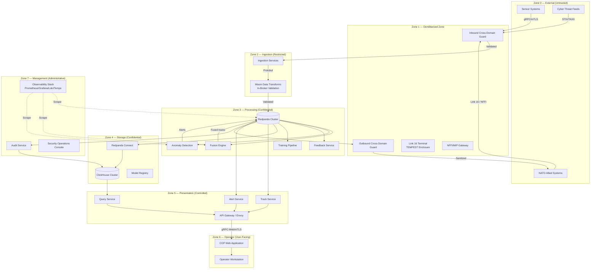
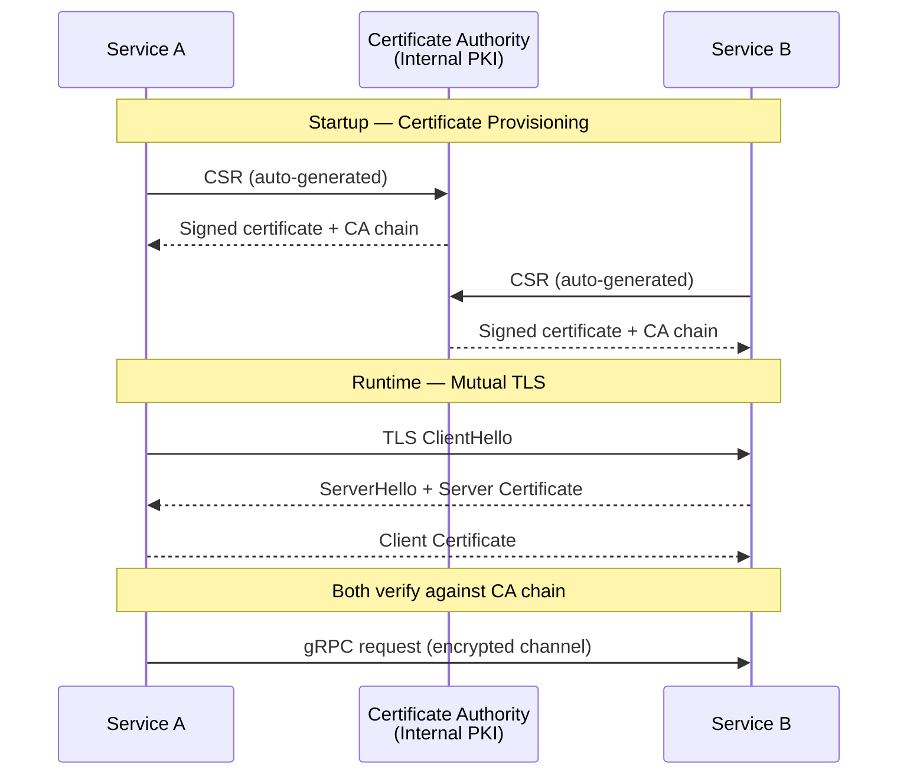
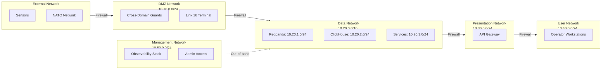
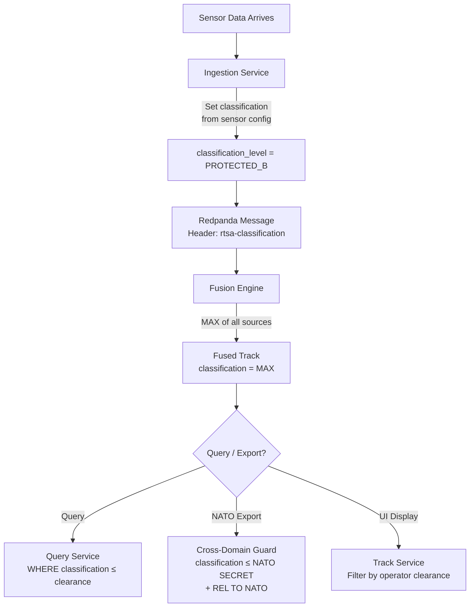
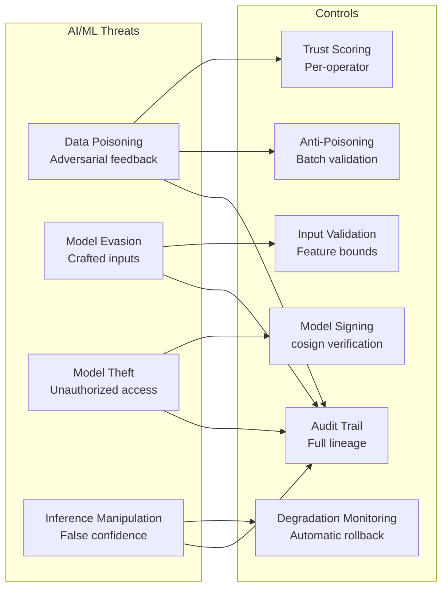
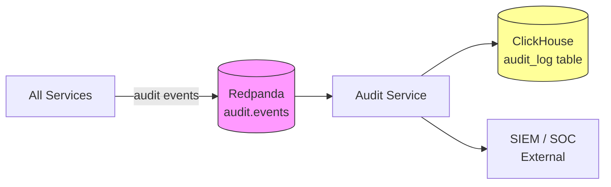

<!-- CLASSIFICATION: UNCLASSIFIED -->
# Security Architecture

> **Document**: RTSA Security Architecture
> **Version**: 2.0
> **Classification**: UNCLASSIFIED
> **Last Updated**: 2026-02-28
> **Compliance**: ITSG-33 (CCCS), NIST 800-53 Rev 5, NATO STANAG 5516

---

## 1. Overview

The RTSA security architecture implements defence-in-depth across all layers. Every service, data flow, and operator interaction is governed by classification enforcement, mutual authentication, and immutable audit. The system operates at Protected C / Secret classification ceiling, with all code artifacts remaining UNCLASSIFIED.

---

## 2. Security Zones

---

## 3. Trust Boundaries

| Boundary | Between | Controls |
|---|---|---|
| TB-01 | External ↔ DMZ | Cross-domain guard, protocol validation, rate limiting |
| TB-02 | DMZ ↔ Ingestion | mTLS, schema validation, Wasm transforms |
| TB-03 | Ingestion ↔ Processing | Redpanda ACLs, topic-level authorization, message headers |
| TB-04 | Processing ↔ Storage | mTLS, parameterized queries, read-only ClickHouse users |
| TB-05 | Processing ↔ Presentation | mTLS, classification filtering, result sanitization |
| TB-06 | Presentation ↔ Operator | mTLS (certificate-based auth), session management, RBAC |
| TB-07 | Processing ↔ Management | Separate network segment, admin-only access |
| TB-08 | Internal ↔ NATO Export | Outbound cross-domain guard, source sanitization, REL TO marking |

---

## 4. Authentication & Authorization

### 4.1 Service-to-Service Authentication

**Requirements**:
- TLS 1.3 only (no fallback to TLS 1.2)
- CSE-approved cipher suites: `TLS_AES_256_GCM_SHA384`, `TLS_CHACHA20_POLY1305_SHA256`
- Certificate rotation: 90-day maximum lifetime, automated renewal
- Certificate revocation: CRL or OCSP stapling

### 4.2 Operator Authentication

| Mechanism | Description |
|---|---|
| Primary | X.509 client certificate from Government of Canada PKI |
| Certificate fields | CN = operator name, OU = unit, O = organization |
| Clearance extraction | Custom extension OID carries clearance level |
| Session management | JWT token issued after certificate validation, 30-min expiry |
| MFA | CAC/PIV smart card (certificate-based inherently 2FA) |

### 4.3 Authorization Model (RBAC + ABAC)

| Role | Permissions | Clearance Minimum |
|---|---|---|
| Watch Officer | View COP, acknowledge alerts | PROTECTED A |
| Intelligence Analyst | View COP, submit feedback, query history, generate reports | PROTECTED B |
| Operations Commander | All Analyst permissions + manage alert assignments | PROTECTED C |
| NATO Interop Officer | Manage NATO data exchange, approve track nominations | SECRET |
| Security Officer | View audit trail, manage classification, review anti-poisoning | SECRET |
| ML Engineer | Review model lifecycle, approve model promotion | PROTECTED C |
| System Administrator | Infrastructure management, no data access | PROTECTED B |

**Attribute-Based Access Control (ABAC) Rules**:
1. Data access filtered by `classification_level <= operator_clearance`
2. NATO data access requires NATO caveat authorization
3. Audit data access restricted to Security Officer role
4. Model management restricted to ML Engineer role

---

## 5. Cryptographic Standards

### 5.1 CSE-Approved Algorithms

| Purpose | Algorithm | Key Size | Standard |
|---|---|---|---|
| Symmetric encryption | AES-256-GCM | 256-bit | CCCS ITSP.40.111 |
| Asymmetric encryption | RSA-4096 or ECDSA P-384 | 4096/384-bit | CCCS ITSP.40.111 |
| Hashing | SHA-384 or SHA-512 | — | NIST FIPS 180-4 |
| Key derivation | HKDF-SHA-384 | — | NIST SP 800-56C |
| TLS | TLS 1.3 | — | CCCS ITSP.40.062 |
| Signing (artifacts) | cosign (ECDSA P-384) | 384-bit | Sigstore |
| Random generation | `crypto/rand` (Go) | — | FIPS 140-2 Level 1 |

### 5.2 Key Management

| Key Type | Storage | Rotation | Backup |
|---|---|---|---|
| TLS certificates | Kubernetes Secrets (encrypted at rest) | 90 days | Automated |
| Redpanda TLS | Kubernetes Secrets | 90 days | Automated |
| ClickHouse TLS | Kubernetes Secrets | 90 days | Automated |
| Signing keys (cosign) | Hardware Security Module (HSM) or KMS | 365 days | HSM backup |
| Data encryption keys | KMS (envelope encryption) | 365 days | KMS-managed |

---

## 6. Network Security

### 6.1 Network Segmentation

### 6.2 Kubernetes Network Policies

| Policy | From | To | Ports | Protocol |
|---|---|---|---|---|
| Ingestion → Redpanda | `ns: ingestion` | `ns: streaming` | 9092 (TLS) | TCP |
| Processing → Redpanda | `ns: processing` | `ns: streaming` | 9092 (TLS) | TCP |
| Redpanda Connect → ClickHouse | `ns: pipeline` | `ns: storage` | 9440 (TLS) | TCP |
| Presentation → Redpanda | `ns: presentation` | `ns: streaming` | 9092 (TLS) | TCP |
| Query → ClickHouse | `ns: presentation` | `ns: storage` | 9440 (TLS) | TCP |
| Gateway → Presentation | `ns: gateway` | `ns: presentation` | 50051 (gRPC) | TCP |
| Deny all other | `*` | `*` | — | — |

---

## 7. Classification Enforcement

### 7.1 Data Classification Flow

### 7.2 Classification Rules

| Rule ID | Rule | Enforcement Point |
|---|---|---|
| CLS-01 | Every data record must carry `classification_level` | Ingestion (Wasm Transform) |
| CLS-02 | Fused entity classification = MAX(source classifications) | Fusion Engine |
| CLS-03 | Anomaly alert inherits track classification | Anomaly Detection |
| CLS-04 | Query results filtered by caller clearance | Query Service (server-side) |
| CLS-05 | NATO export limited to ≤ NATO SECRET | Outbound Cross-Domain Guard |
| CLS-06 | Source attribution stripped from NATO exports | NATO Adapter |
| CLS-07 | Classification cannot be downgraded by operators | System-wide (immutable field) |
| CLS-08 | Audit records inherit event classification | Audit Service |
| CLS-09 | `StreamSensorObservations` only sends observations ≤ caller clearance | Track Service (v2.0) |
| CLS-10 | `GetEventTimeline` injects `WHERE classification_level <= clearance` across all UNION ALL branches | Query Service (v2.0) |
| CLS-11 | `AssignAlert` produces audit event with `actor_id`, `assignee_operator_id`, and alert classification | Alert Service (v2.0) |

---

## 8. Anti-Poisoning & AI Security

### 8.1 Threat Model for AI/ML Pipeline

### 8.2 Trust Scoring Controls

| Control | Description | Threshold |
|---|---|---|
| Operator trust score | Weighted: clearance (0.2), accuracy (0.3), temporal (0.2), deviation (0.3) | ≥ 0.5 for auto-validation |
| Batch validation | Distribution analysis, label flip detection, source diversity | Chi-squared p > 0.05 |
| Rate limiting | Max feedback submissions per operator per hour | 20 submissions/hour |
| Bulk anomaly detection | Flag operator with > 10 low-trust submissions in 1 hour | Auto-hold for review |
| Model evaluation | Candidate vs. baseline: accuracy, precision, false positive rate | Accuracy delta ≥ -2% |
| Rollback trigger | False positive rate exceeds baseline + 10% post-deployment | Automatic rollback |

---

## 9. Audit Architecture

### 9.1 Audit Event Flow

### 9.2 Auditable Events

| Category | Events |
|---|---|
| Authentication | Login success/failure, certificate validation, session create/expire |
| Data Access | Query execution (with parameters), track detail view, report generation |
| Data Modification | Feedback submission, alert acknowledgment, alert assignment *(v2.0)*, track nomination |
| Model Lifecycle | Training batch submitted, model candidate staged/promoted/rejected/rollback |
| NATO Exchange | Inbound track ingested, outbound track exported, export blocked |
| Security | Classification violation, anti-poisoning trigger, rate limit exceeded |
| System | Service startup/shutdown, configuration change, health check failure |

### 9.3 Audit Record Requirements

| Field | Required | Description |
|---|---|---|
| audit_id | Yes | UUID v7 (time-ordered) |
| event_time | Yes | UTC DateTime64(3) — server clock, not client |
| service_id | Yes | Producing service name |
| event_type | Yes | Standardized event type string |
| actor_id | Yes | Service name or operator ID (from cert) |
| actor_type | Yes | SERVICE, OPERATOR, or SYSTEM |
| resource_type | Yes | track, alert, feedback, model, query |
| resource_id | Yes | Target resource identifier |
| action | Yes | CREATE, READ, UPDATE, DELETE, EXPORT, QUERY |
| classification | Yes | Classification of the event data |
| detail_json | No | Additional structured context |

### 9.4 Audit Integrity

- **Append-only**: No UPDATE or DELETE operations on audit data
- **ClickHouse TTL**: No TTL on audit tables (indefinite retention)
- **Tamper detection**: Periodic hash chain verification of audit log segments
- **Backup**: Daily encrypted backup to separate storage with independent access controls
- **Compliance**: Meets ITSG-33 AU-* family and NIST 800-53 AU-* controls

---

## 10. Incident Response Integration

### 10.1 Security Alert Escalation

| Severity | Trigger | Response | SLA |
|---|---|---|---|
| P1 — Critical | Classification violation, unauthorized data export | Immediate block, Security Officer notified, system isolation if needed | 15 min |
| P2 — High | Anti-poisoning trigger, bulk anomalous feedback, cert validation failure | Block actor, queue for review, Security Officer notified | 1 hour |
| P3 — Medium | Rate limit exceeded, DLQ overflow, model degradation | Log alert, auto-remediate if possible, operations review | 4 hours |
| P4 — Low | Validation failure spike, query timeout, stale certificate warning | Log for trending, review in weekly operations meeting | 24 hours |

### 10.2 SIEM Integration

| Feed | Format | Transport | Content |
|---|---|---|---|
| Audit events | CEF (Common Event Format) | Syslog over TLS | All auditable events |
| Security alerts | CEF | Syslog over TLS | P1 and P2 security events |
| Health status | Prometheus remote write | HTTPS | Service health and availability |

---

## 11. Edge Security Considerations

| Concern | Control |
|---|---|
| Physical access | Full disk encryption (LUKS2), TPM-bound keys |
| Tamper detection | Secure boot chain, runtime integrity monitoring |
| Disconnected operation | Cached CRL, offline certificate validation |
| Data at rest | AES-256-GCM encryption for all persistent storage |
| Data in transit | mTLS within the edge cluster (even single-node) |
| Key management | TPM-stored keys, no plaintext keys on filesystem |
| Sync security | Store-and-forward with end-to-end encryption to data centre |
| Zeroize capability | Emergency data destruction command (hardware-supported) |

---

## 12. Compliance Mapping

| Security Control | ITSG-33 | NIST 800-53 | Implementation |
|---|---|---|---|
| Access Control | AC-2, AC-3, AC-6 | AC-2, AC-3, AC-6 | RBAC + ABAC, certificate-based auth |
| Audit | AU-2, AU-3, AU-6, AU-11 | AU-2, AU-3, AU-6, AU-11 | Immutable audit via Redpanda → ClickHouse |
| Authentication | IA-2, IA-3, IA-5 | IA-2, IA-3, IA-5 | mTLS, X.509 certificates, PKI |
| Cryptography | SC-8, SC-12, SC-13 | SC-8, SC-12, SC-13 | TLS 1.3, AES-256-GCM, CSE-approved |
| Classification | — | — | Every data record carries classification metadata |
| Integrity | SI-7, SI-10 | SI-7, SI-10 | cosign signing, input validation, Wasm transforms |
| Network | SC-7, SC-8 | SC-7, SC-8 | Network segmentation, K8s NetworkPolicy, firewalls |
| Incident Response | IR-4, IR-5, IR-6 | IR-4, IR-5, IR-6 | SIEM integration, escalation matrix, audit trail |
