<!-- CLASSIFICATION: UNCLASSIFIED -->

# RTSA High-Performance Architecture v1 — WebGPU Tactical Display

> **Document**: RTSA High-Performance Architecture — WebGPU Rendering Pipeline
> **Version**: 1.0
> **Classification**: UNCLASSIFIED
> **Last Updated**: 2026-03-05
> **Status**: Proposed
> **Compliance**: ITSG-33 (CCCS), NIST 800-53 Rev 5, NATO STANAG 5516
> **Supersedes**: Draft "RTSA Architecture Blueprint" (undated)

---

## 1. Executive Summary

The current RTSA COP Web Application uses React 18 with MapLibre GL JS and gRPC-Web streaming. Profiling reveals that beyond ~10,000 concurrent tracks the UI becomes unresponsive due to main-thread GeoJSON serialization, Zustand `Map` cloning on every batch write, and HTML-based label overlay DOM thrashing. This document defines a **performance-first re-architecture** of the full data pipeline — from backend binary serialization through browser transport, off-main-thread data processing, GPU-resident storage, to WebGPU compute-and-render — while preserving the proven Redpanda + ClickHouse + Go gRPC backend stack.

### Performance Targets

| Metric                      | Current (React/MapLibre)     | Target (WebGPU)                |
| --------------------------- | ---------------------------- | ------------------------------ |
| Concurrent rendered tracks  | ~5,000 (degraded)            | 50,000+ (sustained)            |
| Track update ingestion rate | ~2,000 msg/s (browser)       | 50,000+ msg/s (browser)        |
| Frame rate under load       | 15–30 FPS at 5k tracks       | 60 FPS sustained at 50k tracks |
| Update-to-pixel latency     | 100–200 ms                   | < 16 ms (single frame)         |
| Main thread CPU utilization | 70–95% under load            | < 20% (UI controls only)       |
| GC pause impact             | Visible frame drops          | Near-zero (GPU-resident data)  |
| Memory per track            | ~2 KB (JS objects + GeoJSON) | ~128 bytes (GPU buffer slot)   |

### Key Design Decisions Summary

| #    | Decision                                        | Rationale                                                                  |
| ---- | ----------------------------------------------- | -------------------------------------------------------------------------- |
| D-01 | Replace React with SolidJS for command UI       | Fine-grained reactivity, no Virtual DOM diffing, ~7 KB runtime             |
| D-02 | Replace MapLibre GL with custom WebGPU renderer | Direct GPU control, compute shaders for interpolation, instanced rendering |
| D-03 | FlatBuffers over Protobuf for real-time stream  | Zero-copy read, no deserialization step, direct memory-map to GPU          |
| D-04 | WebTransport over gRPC-Web for real-time stream | Unreliable datagrams (no HOL blocking), QUIC-native, lower latency         |
| D-05 | Web Worker + Wasm decoder pipeline              | Off-main-thread binary processing, near-native throughput                  |
| D-06 | SharedArrayBuffer + GPU buffer upload           | Zero-copy path from network to GPU, eliminates GC pressure                 |
| D-07 | Retain Protobuf/gRPC for command & query paths  | Type-safe, existing backend contract, low-frequency operations             |
| D-08 | Retain Redpanda as event backbone               | Proven, low-latency, Kafka-compatible, edge-deployable                     |
| D-09 | Retain ClickHouse for historical analytics      | Columnar OLAP optimized for time-series, existing materialized views       |
| D-10 | GPU-resident ring buffer for track state        | Eliminates per-frame CPU→GPU transfer, compute shaders update in-place     |

---

## 2. Architecture Overview

### 2.1 End-to-End Data Pipeline

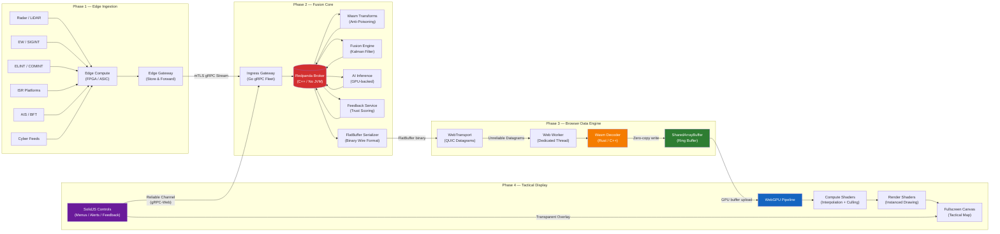

### 2.2 Dual-Protocol Architecture

The system uses two distinct communication protocols optimized for different access patterns:

```mermaid
flowchart TD
    subgraph HotPath["Hot Path — Real-Time Display (50,000+ msg/s)"]
        direction LR
        BE_HOT["Backend<br/>FlatBuffer Serializer"] -- "WebTransport<br/>Unreliable Datagrams<br/>(QUIC)" --> WW_HOT["Web Worker<br/>+ Wasm Decoder"]
        WW_HOT -- "SharedArrayBuffer" --> GPU_HOT["WebGPU<br/>Compute + Render"]
    end

    subgraph ColdPath["Cold Path — Commands & Queries (< 100 req/s)"]
        direction LR
        UI_COLD["SolidJS UI"] -- "gRPC-Web<br/>Protobuf<br/>(HTTP/2)" --> GW_COLD["Envoy Gateway"]
        GW_COLD -- "gRPC / mTLS" --> SVC_COLD["Go Services<br/>(Track, Alert, Query,<br/>Feedback)"]
    end

    subgraph Historical["Historical Path — Analytics"]
        direction LR
        UI_HIST["Query Builder"] -- "gRPC-Web<br/>Protobuf" --> QS["Query Service"]
        QS -- "SQL / mTLS" --> CH[("ClickHouse")]
    end

    style HotPath fill:#fff3e0
    style ColdPath fill:#e3f2fd
    style Historical fill:#e8f5e9
```

| Path           | Protocol            | Format      | Reliability          | Use Case                                                 |
| -------------- | ------------------- | ----------- | -------------------- | -------------------------------------------------------- |
| **Hot**        | WebTransport (QUIC) | FlatBuffers | Unreliable datagrams | Track position updates, sensor observations, alert state |
| **Cold**       | gRPC-Web (HTTP/2)   | Protobuf    | Reliable, ordered    | Operator feedback, alert acknowledgment, role selection  |
| **Historical** | gRPC-Web (HTTP/2)   | Protobuf    | Reliable, ordered    | Forensic queries, event timeline, map replay             |

---

## 3. Phase 1 — Edge Ingestion

Edge ingestion is **unchanged** from the existing architecture. Sensors produce raw signals, edge compute nodes perform local signal processing (noise filtering, plot extraction), and edge gateways queue processed plots for tactical backhaul.

### 3.1 Edge Components

| Component        | Function                             | Technology                                           |
| ---------------- | ------------------------------------ | ---------------------------------------------------- |
| Physical Sensors | Raw signal capture                   | Radar, LiDAR, EO/IR, SIGINT, AIS receivers           |
| Edge Compute     | Signal processing, plot extraction   | FPGA/ASIC hardware, local DSP algorithms             |
| Edge Gateway     | Fail-safe queuing, tactical backhaul | Go agent, persistent gRPC streams, store-and-forward |

### 3.2 Plot Data Structure

Each extracted plot contains:

| Field              | Type      | Description                                         |
| ------------------ | --------- | --------------------------------------------------- |
| `observation_id`   | UUID v7   | Time-ordered unique identifier                      |
| `sensor_id`        | string    | Source sensor identifier                            |
| `sensor_type`      | enum      | RADAR, EW_SIGINT, ELINT_COMINT, ISR, AIS_BFT, CYBER |
| `observation_time` | timestamp | PTP-synchronized GPS timestamp                      |
| `position`         | Position  | WGS-84 lat/lon/alt + speed/heading                  |
| `classification`   | enum      | UNCLASSIFIED through SECRET                         |
| `raw_attributes`   | map       | Sensor-specific (RCS, thermal sig, frequency, etc.) |

### 3.3 Tactical Backhaul

- **Transport**: Persistent mTLS gRPC streams (bidirectional)
- **Networks**: SATCOM, 5G mesh, Link 16, wired
- **Resilience**: Local message queue buffers during network drops; store-and-forward on reconnect with priority-based draining (CRITICAL alerts first)
- **Compression**: gRPC built-in gzip or zstd compression for bandwidth-constrained links

---

## 4. Phase 2 — Fusion Core (Backend)

### 4.1 Retained Architecture

The backend processing pipeline is retained with one addition: a **FlatBuffer serializer** stage that converts fused track state to a binary wire format optimized for zero-copy browser consumption.

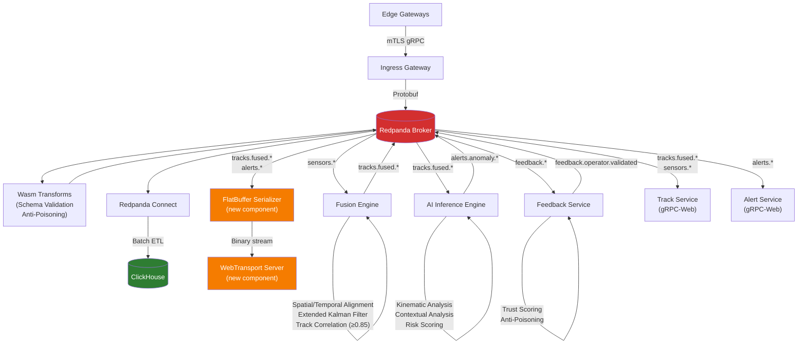

### 4.2 New Component — FlatBuffer Serializer Service

| Property          | Specification                                                  |
| ----------------- | -------------------------------------------------------------- |
| Language          | Go                                                             |
| Input             | Consumes `tracks.fused.*` and `alerts.anomaly.*` from Redpanda |
| Output            | FlatBuffer-encoded binary datagrams via WebTransport           |
| Format            | See §4.3 GPU-Optimized Wire Format                             |
| Throughput target | 100,000+ messages/second serialized                            |
| Deployment        | Co-located with WebTransport server                            |

**Why FlatBuffers over Protobuf for the hot path:**

| Property         | Protobuf                                    | FlatBuffers                        |
| ---------------- | ------------------------------------------- | ---------------------------------- |
| Deserialization  | Full decode required (allocations)          | Zero-copy read from buffer         |
| Browser overhead | ~50 μs per message decode                   | ~0 μs (offset access)              |
| Alignment        | Variable-length encoding                    | 4-byte aligned (GPU-friendly)      |
| Schema evolution | Full backward compatible                    | Forward/backward compatible        |
| Size overhead    | Slightly smaller wire size                  | ~10–20% larger, but no decode cost |
| GPU upload       | Requires JS object → typed array conversion | Direct `memcpy` to GPU buffer      |

### 4.3 GPU-Optimized Wire Format

Each track update is serialized as a **fixed-stride 128-byte record** for direct GPU buffer mapping:

```
Offset  Size   Type        Field
──────  ────   ────        ─────
0       16     uint8[16]   track_id (UUID bytes)
16      4      float32     latitude (WGS-84)
20      4      float32     longitude (WGS-84)
24      4      float32     altitude_meters
28      4      float32     speed_knots
32      4      float32     heading_degrees
36      4      float32     confidence_score
40      4      uint32      entity_type (SURFACE=1, AIR=2, SUB=3, LAND=4, CYBER=5)
44      4      uint32      hostile_class (HOSTILE=1, FRIENDLY=2, NEUTRAL=3, UNKNOWN=4)
48      4      uint32      track_status (ACTIVE=1, STALE=2, DROPPED=3, MERGED=4)
52      4      uint32      alert_severity (NORMAL=0, WATCH=1, ELEVATED=2, CRITICAL=3)
56      4      uint32      source_count
60      4      float32     anomaly_score (0.0–1.0)
64      8      uint64      timestamp_ns (nanoseconds since epoch)
72      4      float32     velocity_x (m/s, pre-computed for interpolation)
76      4      float32     velocity_y (m/s, pre-computed for interpolation)
80      4      float32     velocity_z (m/s, for 3D interpolation)
84      4      uint32      age_frames (frames since last server update)
88      4      float32     trail_opacity (1.0 = fresh, decays)
92      4      uint32      selected_flag (1 = operator selected)
96      32     uint8[32]   reserved (future: classification, NATO fields)
```

**Total: 128 bytes per track** — aligned to GPU buffer stride requirements. At 50,000 tracks: **6.1 MB GPU buffer** (trivial for modern GPUs).

### 4.4 WebTransport Server

| Property       | Specification                                                    |
| -------------- | ---------------------------------------------------------------- |
| Protocol       | WebTransport over HTTP/3 (QUIC)                                  |
| Datagram mode  | Unreliable datagrams for position updates                        |
| Stream mode    | Reliable unidirectional stream for initial state snapshot        |
| Authentication | Session token validated against mTLS certificate                 |
| Encryption     | TLS 1.3 (QUIC-native) with CSE-approved cipher suites            |
| Backpressure   | Server-side rate adaptation: drops lowest-priority updates first |

**Priority-based shedding under backpressure:**

| Priority        | Data                                   | Shedding behavior                    |
| --------------- | -------------------------------------- | ------------------------------------ |
| P0 (never shed) | CRITICAL alerts                        | Always delivered via reliable stream |
| P1              | ELEVATED alerts, friendly force tracks | Shed only under extreme pressure     |
| P2              | Active hostile/unknown tracks          | Reduce update rate to 5 Hz           |
| P3              | Active neutral tracks                  | Reduce update rate to 2 Hz           |
| P4              | Stale tracks, sensor observations      | Shed first                           |

### 4.5 Retained Backend Components (Unchanged)

| Component               | Technology             | Status                                          |
| ----------------------- | ---------------------- | ----------------------------------------------- |
| Redpanda Cluster        | Redpanda (C++, no JVM) | **Retained** — event backbone                   |
| ClickHouse Cluster      | ClickHouse             | **Retained** — OLAP analytics                   |
| Redpanda Connect        | Redpanda Connect       | **Retained** — stream-to-OLAP ETL               |
| Ingestion Services (×6) | Go gRPC                | **Retained** — sensor ingestion                 |
| Fusion Engine           | Go, Kalman Filter      | **Retained** — track correlation                |
| Anomaly Detection       | Go, GPU inference      | **Retained** — AI risk scoring                  |
| Feedback Service        | Go, trust scoring      | **Retained** — anti-poisoning                   |
| Training Pipeline       | Go + Python            | **Retained** — model retraining                 |
| Track Service           | Go gRPC                | **Retained** — gRPC-Web streaming for cold path |
| Alert Service           | Go gRPC                | **Retained** — alert management                 |
| Query Service           | Go gRPC                | **Retained** — ClickHouse queries               |
| Audit Service           | Go gRPC                | **Retained** — immutable audit trail            |
| NATO Adapter            | Go gRPC                | **Retained** — STANAG 5516 interop              |
| Wasm Transforms         | Wasm (Go-compiled)     | **Retained** — in-broker validation             |

---

## 5. Phase 3 — Browser Data Engine

This is the critical performance layer. The existing architecture processes everything on the main thread: gRPC-Web stream → protobuf decode → Zustand store update (Map clone) → GeoJSON rebuild → MapLibre `setData()`. Each step allocates JS objects that trigger garbage collection pauses.

The new architecture **bypasses the main thread entirely** for the hot path:

### 5.1 Thread Architecture

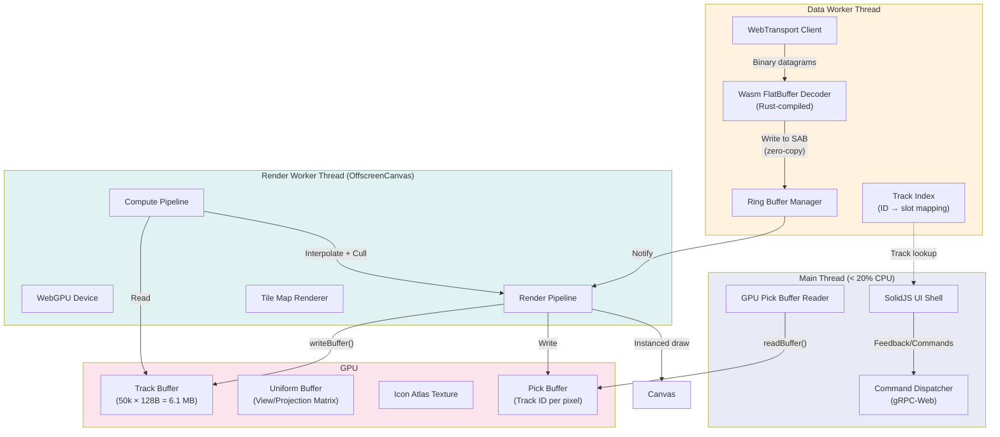

### 5.2 Data Worker — WebTransport + Wasm Decoder

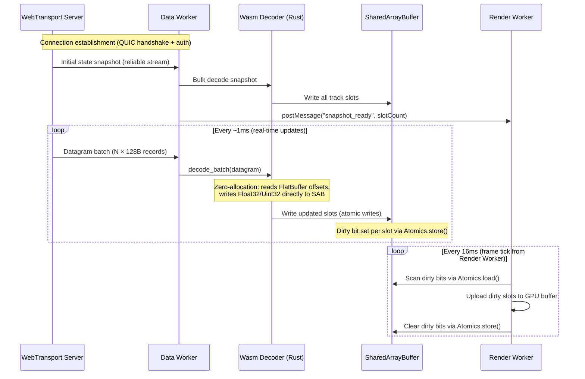

**Wasm Decoder Specifications:**

| Property    | Specification                                           |
| ----------- | ------------------------------------------------------- |
| Language    | Rust (compiled to wasm32-unknown-unknown)               |
| Size        | < 100 KB (.wasm)                                        |
| Allocation  | Zero heap allocation in hot path (arena pre-allocated)  |
| Throughput  | 500,000+ records/second decoded                         |
| Output      | Writes directly to SharedArrayBuffer via `wasm-bindgen` |
| Track index | In-Wasm HashMap: UUID → slot index (O(1) lookup)        |

**SharedArrayBuffer Layout:**

```
┌─────────────────────────────────────────────────┐
│ Header (4096 bytes)                              │
│   [0..3]    uint32  active_track_count           │
│   [4..7]    uint32  write_generation             │
│   [8..11]   uint32  max_slots (50,000)           │
│   [12..4095] reserved                            │
├─────────────────────────────────────────────────┤
│ Dirty Bitfield (8192 bytes)                      │
│   1 bit per slot × 50,000 ≈ 6,250 bytes         │
│   Padded to 8192 for alignment                   │
├─────────────────────────────────────────────────┤
│ Track Data (50,000 × 128 bytes = 6,400,000 B)   │
│   Slot 0:    [offset 12288 .. offset 12415]      │
│   Slot 1:    [offset 12416 .. offset 12543]      │
│   ...                                            │
│   Slot 49999: [offset 6,412,160 .. 6,412,287]   │
└─────────────────────────────────────────────────┘
Total: ~6.1 MB SharedArrayBuffer
```

### 5.3 Why This Eliminates Current Bottlenecks

| Current Bottleneck                 | Root Cause                                         | New Architecture Solution                            |
| ---------------------------------- | -------------------------------------------------- | ---------------------------------------------------- |
| GeoJSON rebuild (15k allocs/frame) | `Array.from(tracks).map(toGeoJSON)` on main thread | Eliminated: GPU reads directly from typed buffer     |
| Zustand Map clone per batch        | `new Map(state.tracks)` copies 15k entries         | Eliminated: no JS track objects exist                |
| Protobuf decode overhead           | ~50 μs per message × 1000 msg/frame                | Replaced: FlatBuffer zero-copy, Wasm decoder         |
| MapLibre `setData()` serialization | GeoJSON → GL buffer conversion per frame           | Eliminated: data is already in GPU-compatible layout |
| HTML label DOM thrashing           | 200 `<div>` elements repositioned per RAF          | Replaced: GPU-rendered text via SDF atlas            |
| GC pauses causing frame drops      | Millions of short-lived JS objects                 | Eliminated: hot path allocates zero JS objects       |
| Main thread saturation             | All processing on single thread                    | Off-loaded: Data Worker + Render Worker + GPU        |

---

## 6. Phase 4 — WebGPU Tactical Display

### 6.1 Rendering Pipeline

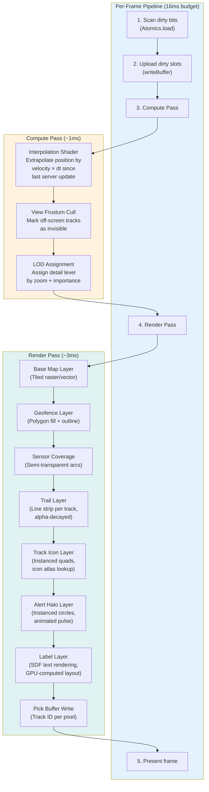

### 6.2 Compute Shaders

#### 6.2.1 Interpolation Shader

Between server updates (arriving at variable rates), tracks must move smoothly. The compute shader extrapolates position using the pre-computed velocity vector:

```
// Pseudo-WGSL
@compute @workgroup_size(256)
fn interpolate(@builtin(global_invocation_id) id: vec3u) {
    let slot = id.x;
    if (slot >= uniforms.active_count) { return; }

    let track = tracks[slot];
    if (track.status == DROPPED) { return; }

    let dt = uniforms.current_time_ns - track.timestamp_ns;
    let dt_sec = f32(dt) / 1e9;

    // Clamp interpolation to 2 seconds max (stale guard)
    let dt_clamped = min(dt_sec, 2.0);

    // Great-circle approximation for short distances
    let dlat = track.velocity_y * dt_clamped / 111320.0;
    let dlon = track.velocity_x * dt_clamped /
               (111320.0 * cos(radians(track.latitude)));

    interpolated[slot].x = lon_to_screen(track.longitude + dlon);
    interpolated[slot].y = lat_to_screen(track.latitude + dlat);
    interpolated[slot].size = lod_size(uniforms.zoom, track.entity_type);
    interpolated[slot].icon_index = icon_lookup(track.entity_type,
                                                 track.hostile_class);
    interpolated[slot].visible = frustum_test(interpolated[slot].x,
                                               interpolated[slot].y);

    // Age tracking for trail fade
    tracks[slot].age_frames += 1u;
    tracks[slot].trail_opacity = max(0.0, 1.0 - f32(tracks[slot].age_frames) / 120.0);
}
```

**Workgroup dispatch:** `ceil(50000 / 256) = 196 workgroups` — completes in < 0.5 ms on integrated GPUs.

#### 6.2.2 View-Frustum Culling Shader

Only tracks within the current map viewport are rendered. The culling shader outputs a compact index buffer of visible track indices for the instanced draw call:

```
// Pseudo-WGSL — produces compacted visible_indices buffer
@compute @workgroup_size(256)
fn cull_and_compact(@builtin(global_invocation_id) id: vec3u) {
    let slot = id.x;
    if (!interpolated[slot].visible) { return; }

    let idx = atomicAdd(&visible_count, 1u);
    visible_indices[idx] = slot;
}
```

### 6.3 Render Layers (Bottom to Top)

| Layer               | Technique                          | Vertex Count       | Notes                                         |
| ------------------- | ---------------------------------- | ------------------ | --------------------------------------------- |
| **Base map**        | Tiled raster or MVT vector tiles   | Variable           | Standard tile pyramid, cached to GPU textures |
| **Geofences**       | Polygon triangulation (Earcut)     | Static             | Pre-uploaded, rarely changes                  |
| **Sensor coverage** | Arc geometry, semi-transparent     | Per sensor         | Updated on sensor health change only          |
| **Track trails**    | Line strip per track, ring buffer  | 20 pts × 50k       | Alpha-decayed; oldest points fade to 0        |
| **Track icons**     | **Instanced quads** + icon atlas   | 6 verts × visible  | Single draw call for all tracks               |
| **Alert halos**     | Instanced circles, animated radius | 32 verts × alerted | Pulsating animation via uniform time          |
| **Labels**          | SDF text rendering                 | Per visible label  | GPU-computed collision avoidance              |
| **Pick buffer**     | Color-coded track ID, off-screen   | Same as icons      | Read back on click for selection              |

### 6.4 Instanced Track Rendering

A single `drawIndexedIndirect` call renders all visible tracks:

```
// Per-instance data (read from interpolated buffer):
struct TrackInstance {
    screen_x: f32,
    screen_y: f32,
    size: f32,
    icon_index: u32,     // Index into icon atlas (domain × hostile)
    alert_severity: u32, // Controls halo color
    selected: u32,       // Highlight ring
    trail_opacity: f32,
}

// Vertex shader reads per-instance data by instance_index
@vertex
fn vs_track(@builtin(instance_index) inst: u32,
            @builtin(vertex_index) vert: u32) -> VertexOutput {
    let track = interpolated[visible_indices[inst]];
    let quad_pos = quad_vertices[vert]; // Unit quad: [-0.5, 0.5]²
    var out: VertexOutput;
    out.position = vec4f(
        track.screen_x + quad_pos.x * track.size,
        track.screen_y + quad_pos.y * track.size,
        0.0, 1.0);
    out.uv = atlas_uv(track.icon_index, quad_pos);
    out.severity = track.alert_severity;
    return out;
}
```

**Performance:** 50,000 instanced quads = ~300,000 vertices in a single draw call. Modern GPUs process this in < 1 ms.

### 6.5 GPU Pick Buffer (Selection Without Raycasting)

Instead of CPU-side hit testing, the render pipeline writes a **pick buffer** — an off-screen render target where each pixel contains the track slot index:

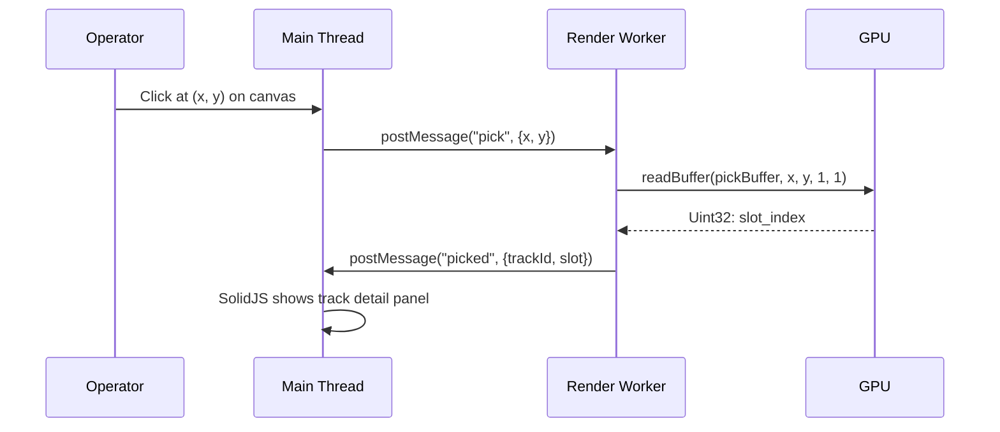

This provides **O(1) pixel-perfect selection** regardless of track count — no spatial index or DOM event listeners needed.

### 6.6 SDF Text Labels (GPU-Rendered)

Instead of HTML `<div>` overlays (current: 200 DOM elements causing layout thrashing), labels are rendered entirely on the GPU using **Signed Distance Field** font atlases:

| Property            | HTML Labels (Current)           | SDF Labels (New)                          |
| ------------------- | ------------------------------- | ----------------------------------------- |
| Max labels          | ~200 (DOM thrashing)            | 5,000+ (GPU-rendered)                     |
| Layout cost         | Browser layout engine per frame | GPU compute shader per frame              |
| Collision avoidance | None (manual viewport cull)     | GPU-computed spatial hash                 |
| Anti-aliasing       | Browser text rendering          | SDF provides resolution-independent AA    |
| Customization       | CSS (limited)                   | Shader-based (halos, outlines, animation) |

---

## 7. SolidJS Command Layer

SolidJS is the **sole UI framework** — it handles all DOM-based user interactions including operator feedback, alert management, track inspection, search, and forensic queries. WebGPU handles only the tactical map rendering (canvas). There is no React, no MapLibre, no Zustand in the codebase.

SolidJS runs on the **main thread** but has near-zero overhead because:

1. **No Virtual DOM** — SolidJS compiles to direct DOM mutations (no diffing)
2. **Fine-grained reactivity** — only the specific text node or attribute changes, not the component tree
3. **~7 KB runtime** vs. React's ~45 KB (react + react-dom)
4. **No re-renders** — signals propagate updates surgically

### SolidJS Covers All Interactive UI

Every user-facing feature that was previously a React component is implemented in SolidJS:

| Feature                                                      | SolidJS Component                    | Backend Integration                              |
| ------------------------------------------------------------ | ------------------------------------ | ------------------------------------------------ |
| **Operator Feedback** (classify track, confirm/reject alert) | `FeedbackForm`                       | gRPC-Web → Feedback Service → Redpanda → Audit   |
| **Alert Acknowledgment** (inspect, confirm, reject, assign)  | `AlertSidebar` + `AlertActions`      | gRPC-Web → Alert Service → Redpanda → Audit      |
| **Track Detail Inspection**                                  | `TrackDetailPanel`                   | GPU pick buffer → Worker → Main → SolidJS signal |
| **Role & Dashboard Selection**                               | `RoleSelector` + `DashboardSelector` | Local SolidJS signal (no backend call)           |
| **Search** (track/alert text search)                         | `SearchOverlay`                      | gRPC-Web → Query Service → ClickHouse            |
| **Forensic Queries** (time range, spatial, attribute)        | `QueryBuilder` + `ResultsView`       | gRPC-Web → Query Service → ClickHouse            |
| **Event Timeline**                                           | `EventTimeline`                      | gRPC-Web → Query Service → ClickHouse            |
| **Classification Banners**                                   | `ClassificationBanner`               | Static (deployment config)                       |
| **Connection Status**                                        | `ConnectionIndicator`                | WebTransport readyState + gRPC health            |
| **FPS / Latency Metrics**                                    | `StatusBar`                          | Render Worker → postMessage → SolidJS signal     |

### 7.1 Component Architecture

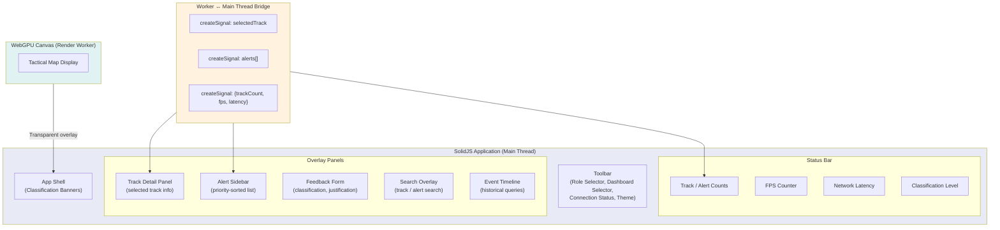

### 7.2 Worker ↔ Main Thread Communication

| Direction          | Channel             | Data                            | Frequency      |
| ------------------ | ------------------- | ------------------------------- | -------------- |
| Render → Main      | `postMessage`       | FPS, track count, visible count | 1 Hz           |
| Render → Main      | `postMessage`       | Picked track details (on click) | On demand      |
| Data Worker → Main | `postMessage`       | Alert list (new/changed only)   | On change      |
| Main → Render      | `postMessage`       | Viewport change (pan/zoom)      | On user input  |
| Main → Render      | `postMessage`       | Selected track ID (highlight)   | On click       |
| Main → Data Worker | `postMessage`       | Filter criteria change          | On user input  |
| Main → Backend     | gRPC-Web (Protobuf) | Feedback, commands, queries     | On user action |

### 7.3 Optimistic UI Pattern

When the operator submits feedback (classify a track, acknowledge an alert):

1. **SolidJS** immediately updates local signal state (optimistic)
2. **Command** sent via reliable gRPC-Web to Feedback/Alert service
3. **Backend** validates, produces audit event to Redpanda
4. **Confirmation** returns via gRPC response
5. If rejected: SolidJS rolls back local state and shows error toast

---

## 8. Performance Architecture — Quantified Budget

### 8.1 Per-Frame Time Budget (16.67 ms for 60 FPS)

```mermaid
gantt
    title Per-Frame Time Budget (16.67ms target)
    dateFormat X
    axisFormat %L ms

    section Data
    Scan dirty bits + upload    :a1, 0, 1500

    section Compute
    Interpolation shader        :a2, 1500, 500
    Frustum culling             :a3, 2000, 300

    section Render
    Base map tiles              :a4, 2300, 2000
    Geofences + coverage        :a5, 4300, 500
    Track trails                :a6, 4800, 1500
    Track icons (instanced)     :a7, 6300, 1000
    Alert halos                 :a8, 7300, 500
    SDF labels                  :a9, 7800, 1000
    Pick buffer                 :a10, 8800, 500

    section Present
    Composite + vsync           :a11, 9300, 700
```

**Total: ~10 ms** — leaving 6.67 ms headroom for variance on lower-end hardware.

### 8.2 Memory Budget

| Component                      | Size       | Location                  |
| ------------------------------ | ---------- | ------------------------- |
| SharedArrayBuffer (track data) | 6.1 MB     | System RAM (shared)       |
| GPU track buffer               | 6.1 MB     | VRAM                      |
| GPU interpolated buffer        | 3.2 MB     | VRAM                      |
| GPU trail ring buffer          | 12.8 MB    | VRAM (20 pts × 50k × 12B) |
| Icon atlas texture             | 512 KB     | VRAM                      |
| SDF font atlas                 | 2 MB       | VRAM                      |
| Tile cache (256 tiles)         | 64 MB      | VRAM                      |
| Pick buffer (1920×1080)        | 8 MB       | VRAM                      |
| Wasm module heap               | 4 MB       | System RAM                |
| SolidJS DOM                    | ~2 MB      | System RAM                |
| **Total VRAM**                 | **~97 MB** | —                         |
| **Total System RAM**           | **~12 MB** | —                         |

### 8.3 Network Bandwidth Budget

| Stream                        | Rate              | Record Size     | Bandwidth      |
| ----------------------------- | ----------------- | --------------- | -------------- |
| Track updates (hot)           | 50,000 msg/s peak | 128 bytes       | 6.1 MB/s       |
| Alert updates                 | 100 msg/s peak    | 128 bytes       | 12.5 KB/s      |
| Initial snapshot (50k tracks) | One-time          | 128 bytes × 50k | 6.1 MB         |
| gRPC-Web commands             | < 10 req/s        | ~200 bytes avg  | < 2 KB/s       |
| Map tiles                     | On pan/zoom       | 256 KB avg      | Bursty, cached |
| **Total sustained**           | —                 | —               | **~6.5 MB/s**  |

---

## 9. Architecture Decision Records

### ADR-V1-001: WebGPU for Tactical Display Rendering

| Attribute                | Value                         |
| ------------------------ | ----------------------------- |
| **Status**               | Proposed                      |
| **Date**                 | 2026-03-05                    |
| **Affected Components**  | web-cop (full rewrite)        |
| **Related Requirements** | 50k track rendering at 60 FPS |

**Context:** The current React + MapLibre GL architecture processes all track data on the main JS thread. GeoJSON serialization, Zustand Map cloning, and `setData()` calls consume 70–95% CPU at 5k tracks, leaving no headroom for growth. MapLibre GL uses WebGL 1/2 under the hood but exposes no compute shader capability.

**Decision:** Replace the MapLibre GL rendering pipeline with a custom WebGPU renderer. Use compute shaders for interpolation, view-frustum culling, and label layout. Use instanced rendering for tracks, trails, halos, and labels.

**Alternatives Considered:**

- _deck.gl with WebGPU backend_ — Not production-ready for compute shaders; adds 200 KB+ bundle; limited control over buffer layout.
- _MapLibre + custom WebGL layers_ — WebGL 2 lacks compute shaders; would still require CPU-side interpolation and culling.
- _CesiumJS_ — Overkill for 2D tactical display; heavy runtime; license constraints.
- _Three.js + instanced mesh_ — Possible, but no compute shaders in WebGL mode; WebGPU backend experimental.

**Consequences:** Requires custom tile rendering (or hybrid: raster tiles as texture, tracks via WebGPU). Higher development effort. Requires WebGPU-capable browsers (Chrome 113+, Edge 113+, Firefox 128+). Non-WebGPU browsers are blocked at startup (see ADR-V1-006).

### ADR-V1-002: SolidJS for Command UI Layer

| Attribute               | Value            |
| ----------------------- | ---------------- |
| **Status**              | Proposed         |
| **Date**                | 2026-03-05       |
| **Affected Components** | web-cop UI shell |

**Context:** The command layer (menus, panels, forms) is low-frequency and DOM-appropriate. React's Virtual DOM diffing adds unnecessary overhead when the main thread must stay under 20% CPU to preserve GPU pipeline headroom.

**Decision:** Use SolidJS for the command UI layer. SolidJS compiles JSX to direct DOM operations with fine-grained reactive signals, eliminating Virtual DOM overhead.

**Alternatives Considered:**

- _Keep React_ — Virtual DOM overhead tolerable at low frequency, but adds 45 KB runtime and risk of accidental re-renders.
- _Svelte 5_ — Comparable performance; less TypeScript ecosystem maturity.
- _Vanilla DOM_ — Maximum control but unmaintainable at scale.
- _Lit (Web Components)_ — Good perf, but weaker TSX/JSX DX for complex forms.

**Consequences:** Team must learn SolidJS reactive primitives (signals, effects, memos). Zustand stores replaced with SolidJS signals. Connect-RPC gRPC-Web integration works identically (transport-level).

### ADR-V1-003: WebTransport with FlatBuffers for Hot Path

| Attribute               | Value                                                        |
| ----------------------- | ------------------------------------------------------------ |
| **Status**              | Proposed                                                     |
| **Date**                | 2026-03-05                                                   |
| **Affected Components** | Backend serializer, WebTransport server, browser Data Worker |

**Context:** gRPC-Web over HTTP/2 suffers from head-of-line blocking at the TCP level. For positional updates that are immediately superseded, retransmission wastes bandwidth and increases latency. Protobuf decoding allocates JS objects that create GC pressure.

**Decision:** Use WebTransport (HTTP/3 / QUIC) with unreliable datagrams for real-time track updates. Serialize using FlatBuffers with a fixed 128-byte record stride for zero-copy GPU buffer mapping. Retain gRPC-Web for commands/queries.

**Alternatives Considered:**

- _WebSockets + custom binary_ — No unreliable mode; TCP HOL blocking persists.
- _gRPC-Web with Protobuf_ — Current approach; decode overhead is the bottleneck.
- _WebRTC DataChannel_ — Unreliable mode exists but adds SRTP/DTLS complexity; designed for peer-to-peer, not server push.

**Consequences:** Requires HTTP/3 capable proxy (Envoy with QUIC listener or Caddy). FlatBuffer schema maintained alongside Protobuf schema. Backend serializer is a new Go service consuming from Redpanda.

### ADR-V1-004: SharedArrayBuffer + Web Workers for Off-Main-Thread Processing

| Attribute               | Value                 |
| ----------------------- | --------------------- |
| **Status**              | Proposed              |
| **Date**                | 2026-03-05            |
| **Affected Components** | Browser data pipeline |

**Context:** Processing 50,000 updates/second on the main thread is impossible without frame drops. Even with requestAnimationFrame batching, the current architecture's per-batch Map cloning and GeoJSON construction blocks the main thread for 8–15 ms at scale.

**Decision:** Use a dedicated Data Worker for WebTransport + Wasm decoding, writing to a SharedArrayBuffer. Use a Render Worker (OffscreenCanvas) for the WebGPU pipeline. Main thread handles only SolidJS UI controls.

**Alternatives Considered:**

- _Single worker with postMessage for render data_ — Structured clone of 50k records per frame defeats the purpose.
- _Main thread with careful batching_ — Already proven insufficient at scale in current architecture.
- _Comlink-based worker abstraction_ — Adds async overhead per call; SAB is synchronous and zero-copy.

**Consequences:** Requires `Cross-Origin-Opener-Policy: same-origin` and `Cross-Origin-Embedder-Policy: require-corp` headers for SharedArrayBuffer. All cross-origin resources (tiles, fonts) must support CORS.

### ADR-V1-005: Retain Redpanda and ClickHouse

| Attribute               | Value            |
| ----------------------- | ---------------- |
| **Status**              | Accepted         |
| **Date**                | 2026-03-05       |
| **Affected Components** | None (no change) |

**Context:** The Redpanda + ClickHouse backend has proven performant, edge-deployable, and operationally reliable.

**Decision:** Retain Redpanda as the event streaming backbone and ClickHouse as the OLAP analytics engine without modification.

**Rationale:**

- Redpanda: C++ implementation, no JVM, microsecond latencies, Kafka-compatible, Wasm transforms, edge-deployable on single node
- ClickHouse: Columnar compression, MergeTree partitioning, SQL familiarity, lightweight enough for edge
- Both are mature with existing topic schemas, materialized views, and ETL pipelines

**Consequences:** No backend data layer changes required. FlatBuffer Serializer consumes from existing Redpanda topics.

### ADR-V1-006: WebGPU-Only COP — No Legacy Fallback Pipeline

| Attribute                | Value                                   |
| ------------------------ | --------------------------------------- |
| **Status**               | Accepted                                |
| **Date**                 | 2026-03-05                              |
| **Affected Components**  | web-cop                                 |
| **Related Requirements** | Deployment simplification, dev velocity |

**Context:** The original architecture proposed a 4-tier graceful degradation strategy with a Tier 4 legacy fallback retaining the full React + MapLibre + Zustand + gRPC-Web pipeline. This required maintaining two complete frontend stacks (React and SolidJS), two data paths (gRPC-Web streaming and WebTransport), two state management systems (Zustand and SharedArrayBuffer), and a feature flag toggling between them. For a 3–5 person team, this doubles the testing surface and creates ongoing maintenance burden.

**Decision:** Remove all legacy fallback tiers. The COP requires WebGPU + WebTransport + SharedArrayBuffer as hard prerequisites. Non-capable browsers display a blocking requirements message instead of a degraded experience. There is no React, MapLibre, or Zustand code in the new codebase.

**Rationale:**

- RTSA COP runs on **controlled military workstations** — not consumer BYOD. Browser and hardware are provisioned.
- WebGPU has been stable in Chrome/Edge for ~3 years (since May 2023) and Firefox for ~2 years (mid-2024).
- Maintaining two frontend stacks for a 3–5 person team is disproportionate effort.
- Every feature must be implemented and tested twice with dual pipelines.
- Feature flag complexity introduces subtle dual-path bugs.
- The legacy pipeline's 5k track ceiling is operationally insufficient regardless — there is no scenario where falling back to it is acceptable for mission use.

**Alternatives Considered:**

- _Keep Tier 4 React/MapLibre fallback_ — Doubles dev/test effort; legacy ceiling (5k tracks) is mission-inadequate.
- _Keep Tier 2–3 WebGPU with WebSocket/postMessage_ — Still requires alternative transport/state code paths; modest benefit.
- _Progressive enhancement_ — Attractive in principle but incompatible with zero-copy SharedArrayBuffer design (the fundamental architecture change).

**Consequences:** Non-WebGPU browsers cannot run the COP. Operator workstation provisioning must specify Chrome 113+ or Edge 113+ as minimum. Deployment pre-checks must validate WebGPU, WebTransport, and SharedArrayBuffer availability. This eliminates ~2 weeks of fallback implementation effort and removes the React/MapLibre/Zustand dependency tree entirely.

---

## 10. Browser Compatibility & Requirements

### 10.1 Minimum Browser Requirements (Mandatory)

All three capabilities must be present. The COP **will not load** without them.

| Capability        | Minimum Browser                      | Detection                                  |
| ----------------- | ------------------------------------ | ------------------------------------------ |
| WebGPU            | Chrome 113+, Edge 113+, Firefox 128+ | `navigator.gpu !== undefined`              |
| WebTransport      | Chrome 97+, Edge 97+, Firefox 114+   | `typeof WebTransport !== 'undefined'`      |
| SharedArrayBuffer | All modern (with COOP/COEP headers)  | `typeof SharedArrayBuffer !== 'undefined'` |

### 10.2 Supported Browsers (as of 2026-03)

| Browser        | WebGPU  | WebTransport | SharedArrayBuffer    | Status            |
| -------------- | ------- | ------------ | -------------------- | ----------------- |
| Chrome 113+    | Yes     | Yes          | Yes (with COOP/COEP) | **Approved**      |
| Edge 113+      | Yes     | Yes          | Yes (with COOP/COEP) | **Approved**      |
| Firefox 128+   | Yes     | Yes          | Yes (with COOP/COEP) | **Approved**      |
| Safari 18+     | Partial | No WT        | Yes                  | **Not supported** |
| Older browsers | No      | No           | Varies               | **Not supported** |

### 10.2 Browser Requirements Gate (No Legacy Fallback)

The RTSA COP is a controlled-environment military application. Operator workstations are provisioned with approved hardware and browser versions. Rather than maintaining a parallel legacy pipeline (React + MapLibre), the application enforces a **hard requirements gate** at startup:

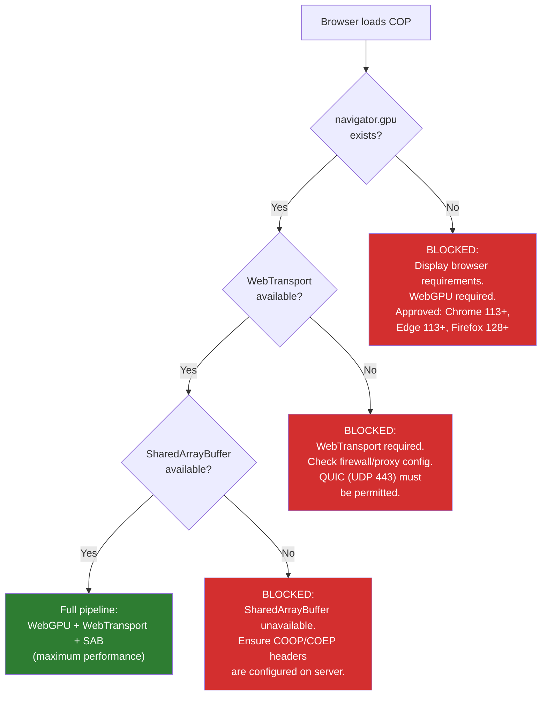

**Rationale for no legacy fallback (see ADR-V1-006):**

| Factor                 | Justification                                                                  |
| ---------------------- | ------------------------------------------------------------------------------ |
| Controlled environment | Military COP — operator workstations are provisioned, not BYOD                 |
| Browser maturity       | WebGPU stable in Chrome/Edge since May 2023 (~3 years), Firefox since mid-2024 |
| Team size              | 3–5 developers — maintaining two UI frameworks doubles testing surface         |
| Development velocity   | Single pipeline eliminates feature flag complexity and dual-path bugs          |
| Testing matrix         | Cut in half — no React/MapLibre/Zustand code paths to validate                 |

---

## 11. Security Considerations

All security requirements from the existing RTSA Security Architecture remain enforced.

### 11.1 WebTransport Security

| Concern             | Mitigation                                                                                              |
| ------------------- | ------------------------------------------------------------------------------------------------------- |
| Authentication      | Session token in WebTransport connection URL, validated against mTLS operator certificate               |
| Encryption          | QUIC mandates TLS 1.3; CSE-approved cipher suites enforced at server                                    |
| Data classification | Classification field in each 128-byte record; client-side filter drops records above operator clearance |
| Session management  | Server-side session timeout (30 min); reconnect requires re-authentication                              |
| Rate limiting       | Server-side per-session datagram rate limit                                                             |

### 11.2 SharedArrayBuffer Security

| Concern             | Mitigation                                                                     |
| ------------------- | ------------------------------------------------------------------------------ |
| Spectre mitigation  | COOP/COEP headers required; same-origin isolation enforced                     |
| Memory corruption   | Wasm sandboxing limits write to SAB bounds only; no raw pointer access from JS |
| Cross-worker access | Only Data Worker writes; Render Worker reads; Main Thread reads metadata only  |

### 11.3 WebGPU Security

| Concern              | Mitigation                                                       |
| -------------------- | ---------------------------------------------------------------- |
| GPU memory isolation | WebGPU enforces per-context GPU memory isolation (browser-level) |
| Shader execution     | WGSL shaders validated by browser before GPU dispatch            |
| Pick buffer data     | Contains only slot indices (integers), no sensitive data         |
| Denial of service    | GPU workload bounded: max 50k instances, max 256 workgroup size  |

### 11.4 Audit Trail

All operator actions (feedback, alert acknowledgment, track selection) continue to flow through the gRPC-Web → Feedback/Alert Service → Redpanda → Audit Service pipeline. The WebGPU rendering path is **read-only** and produces no audit events.

---

## 12. Deployment Changes

### 12.1 New Backend Components

| Component             | Replicas (DC) | Replicas (Edge) | CPU          | Memory        |
| --------------------- | ------------- | --------------- | ------------ | ------------- |
| FlatBuffer Serializer | 2             | 1               | 500m / 1000m | 128Mi / 256Mi |
| WebTransport Server   | 2             | 1               | 500m / 1000m | 256Mi / 512Mi |

### 12.2 Infrastructure Requirements

| Change              | Description                                                                                            |
| ------------------- | ------------------------------------------------------------------------------------------------------ |
| HTTP/3 proxy        | Envoy with QUIC listener or Caddy reverse proxy for WebTransport                                       |
| COOP/COEP headers   | `Cross-Origin-Opener-Policy: same-origin`, `Cross-Origin-Embedder-Policy: require-corp` on COP web app |
| CORS for tiles      | Tile server must set `Access-Control-Allow-Origin` for COEP compliance                                 |
| Wasm module hosting | Serve `.wasm` with `application/wasm` MIME type, cached aggressively                                   |

### 12.3 Updated Technology Stack

| Layer                   | Current                                    | New                                              | Change Type  |
| ----------------------- | ------------------------------------------ | ------------------------------------------------ | ------------ |
| Event Streaming         | Redpanda                                   | Redpanda                                         | **Retained** |
| OLAP                    | ClickHouse                                 | ClickHouse                                       | **Retained** |
| Backend Services        | Go gRPC                                    | Go gRPC                                          | **Retained** |
| Data Pipeline           | Redpanda Connect                           | Redpanda Connect                                 | **Retained** |
| Real-time serialization | Protobuf (gRPC-Web)                        | FlatBuffers (WebTransport) + Protobuf (gRPC-Web) | **Added**    |
| Transport (hot path)    | gRPC-Web/HTTP/2                            | WebTransport/QUIC                                | **Replaced** |
| Transport (commands)    | gRPC-Web/HTTP/2                            | gRPC-Web/HTTP/2                                  | **Retained** |
| Browser decode          | JS protobuf-ts                             | Rust Wasm FlatBuffer decoder                     | **Replaced** |
| State management        | Zustand (Map clone)                        | SharedArrayBuffer (zero-copy)                    | **Replaced** |
| Rendering               | MapLibre GL (WebGL)                        | Custom WebGPU pipeline                           | **Replaced** |
| UI framework            | React 18                                   | SolidJS                                          | **Replaced** |
| Text rendering          | HTML div overlay                           | GPU SDF atlas                                    | **Replaced** |
| Selection               | DOM event + MapLibre queryRenderedFeatures | GPU pick buffer                                  | **Replaced** |

---

## 13. Migration Strategy

### 13.1 Phased Approach

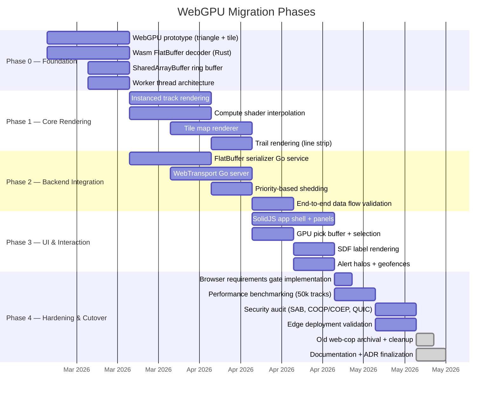

### 13.2 Clean-Break Migration

The COP was built as a **separate application** (`web-cop-gpu/`) and has fully replaced the legacy `web-cop/` React COP, which has been deleted from the repository. There is no feature flag or runtime switching — `web-cop-gpu/` is the sole frontend.

- **Development**: `web-cop-gpu/` project with SolidJS + WebGPU built from scratch
- **Backend**: FlatBuffer Serializer and WebTransport Server deployed alongside existing gRPC services
- **Validation**: New COP validated against the same synthetic test data as old COP
- **Cutover**: ✅ Complete — `web-cop-gpu/` is the deployed COP. Old `web-cop/` deleted from repository
- **Cleanup**: ✅ Complete — React/MapLibre/Zustand dependencies fully removed

This avoids feature flag complexity, dual-path bugs, and the overhead of maintaining two frontend frameworks simultaneously.

---

## 14. Testing Strategy

### 14.1 Performance Tests

| Test                 | Tool                        | Target              | Pass Criteria                        |
| -------------------- | --------------------------- | ------------------- | ------------------------------------ |
| 50k track rendering  | Custom benchmark harness    | 60 FPS sustained    | p99 frame time < 16.67 ms            |
| 50k msg/s ingestion  | Synthetic WebTransport feed | < 16 ms E2E latency | No frame drops over 60s              |
| GPU memory stability | 24-hour soak test           | No VRAM growth      | Stable ± 5 MB over 24h               |
| Browser gate         | Non-WebGPU browser test     | Blocking message    | COP does not load; clear error shown |

### 14.2 Security Tests

| Test                  | Target                                                | Pass Criteria                    |
| --------------------- | ----------------------------------------------------- | -------------------------------- |
| COOP/COEP enforcement | SharedArrayBuffer available only with correct headers | SAB unavailable without headers  |
| Classification filter | Records above clearance dropped client-side           | No above-clearance data rendered |
| WebTransport auth     | Expired/invalid session token rejected                | Connection refused               |
| Wasm memory bounds    | Decoder cannot write outside SAB                      | No out-of-bounds write possible  |

### 14.3 Compatibility Tests

| Browser                  | Version | Test              | Expected                      |
| ------------------------ | ------- | ----------------- | ----------------------------- |
| Chrome                   | 113+    | Full pipeline     | 50k @ 60 FPS                  |
| Edge                     | 113+    | Full pipeline     | 50k @ 60 FPS                  |
| Firefox                  | 128+    | Full pipeline     | 50k @ 60 FPS                  |
| Safari                   | 18+     | Requirements gate | Blocked (no WebTransport)     |
| Chrome (WebGPU disabled) | Any     | Requirements gate | Blocked (clear error message) |

---

## 15. Risk Register

| #    | Risk                                      | Probability             | Impact | Mitigation                                                                  |
| ---- | ----------------------------------------- | ----------------------- | ------ | --------------------------------------------------------------------------- |
| R-01 | WebGPU spec instability                   | Low (stable since 2023) | High   | Pin to well-tested browser versions in workstation provisioning             |
| R-02 | WebTransport firewall blocking            | Medium                  | Medium | Network provisioning must permit QUIC (UDP 443); pre-deployment check       |
| R-03 | SAB disabled by enterprise policy         | Low                     | High   | COOP/COEP headers mandatory in deployment config; pre-deployment validation |
| R-04 | GPU driver bugs on edge hardware          | Medium                  | Medium | Explicit GPU adapter selection; approved hardware list for workstations     |
| R-05 | FlatBuffer schema drift vs Protobuf       | Low                     | Medium | Schema generation from single source (.fbs → .proto sync)                   |
| R-06 | SolidJS ecosystem maturity                | Low                     | Low    | Minimal dependency surface; core lib is stable                              |
| R-07 | COOP/COEP breaks third-party integrations | Medium                  | Medium | Pre-audit all cross-origin resources; CORS proxy where needed               |
| R-08 | Wasm decoder memory leak                  | Low                     | High   | Arena allocator with fixed-size budget; automated soak tests                |

---

## 16. Appendix A — Glossary

| Term                    | Definition                                                                        |
| ----------------------- | --------------------------------------------------------------------------------- |
| **COOP**                | Cross-Origin-Opener-Policy — browser header isolating browsing context for SAB    |
| **COEP**                | Cross-Origin-Embedder-Policy — browser header requiring CORS for all subresources |
| **FlatBuffers**         | Google's zero-copy serialization library (no decode step)                         |
| **HOL Blocking**        | Head-of-Line Blocking — TCP retransmit stalls all subsequent data                 |
| **Instanced Rendering** | GPU technique drawing the same geometry N times with per-instance data            |
| **Pick Buffer**         | Off-screen render target encoding object ID per pixel for hit testing             |
| **QUIC**                | UDP-based transport protocol with multiplexed streams and built-in TLS            |
| **SAB**                 | SharedArrayBuffer — raw byte buffer accessible by multiple JS/Wasm threads        |
| **SDF**                 | Signed Distance Field — resolution-independent glyph rendering technique          |
| **WebGPU**              | Modern GPU API for the web, successor to WebGL, supports compute shaders          |
| **WebTransport**        | HTTP/3-based bidirectional transport with unreliable datagram mode                |
| **WGSL**                | WebGPU Shading Language                                                           |
| **Wasm**                | WebAssembly — portable binary format for near-native code execution in browsers   |
| **Ring Buffer**         | Fixed-size circular buffer; new writes overwrite oldest data                      |

---

## 17. Appendix B — Reference Comparisons

### B.1 End-to-End Latency (Single Track Update)

```
Current Architecture (React + MapLibre):
  Server → gRPC-Web (HTTP/2 TCP) → Protobuf decode (JS) → Zustand write (Map clone)
  → requestAnimationFrame → GeoJSON build → MapLibre setData() → WebGL render
  Total: 100–200 ms

New Architecture (WebGPU):
  Server → WebTransport (QUIC datagram) → Wasm decode → SAB write (atomic)
  → Next frame scan → GPU buffer upload (dirty only) → Compute → Render
  Total: 1–16 ms (next frame)
```

### B.2 CPU Utilization at 10,000 Tracks

| Thread          | Current        | New             |
| --------------- | -------------- | --------------- |
| Main thread     | 85–95%         | 5–15%           |
| Data Worker     | N/A            | 10–20%          |
| Render Worker   | N/A            | 5–10%           |
| GPU utilization | 20% (MapLibre) | 40–60% (WebGPU) |

---

_End of document._
