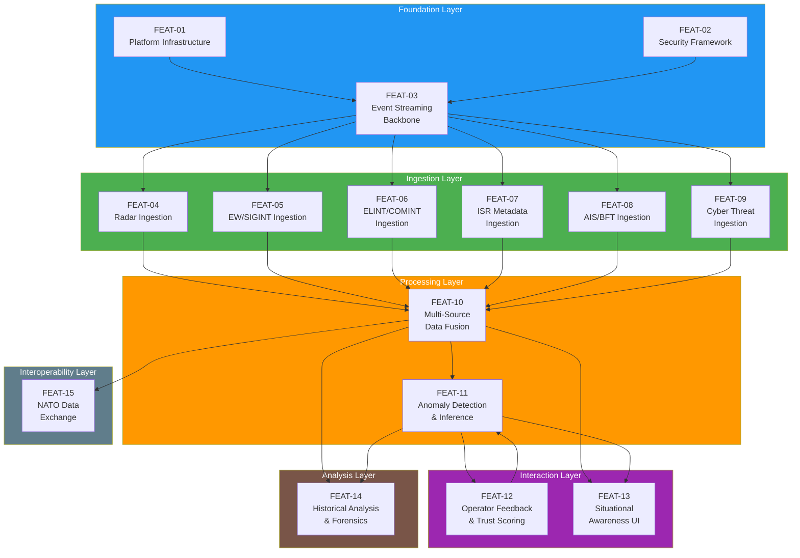
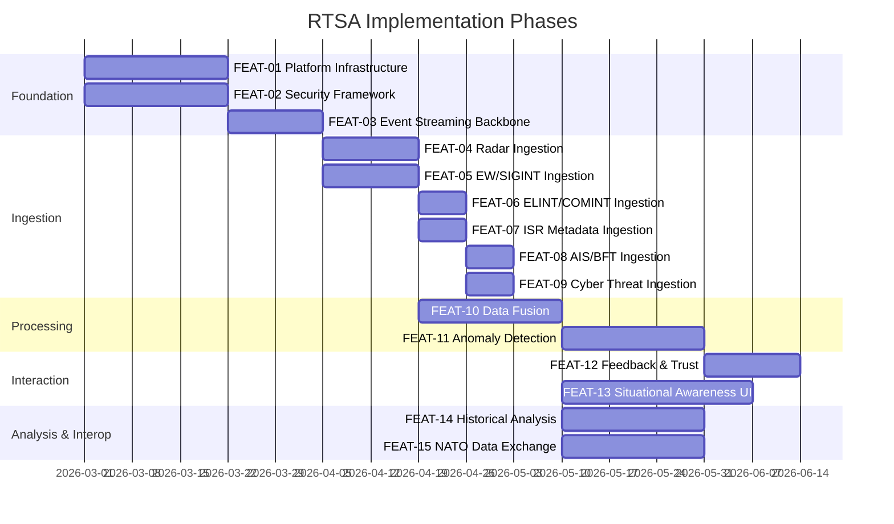

<!-- CLASSIFICATION: UNCLASSIFIED -->
# Feature List — RTSA

> **Project**: Real-Time Situational Awareness & Risk Assessment (RTSA)
> **Classification**: UNCLASSIFIED
> **Version**: 1.0
> **Last Updated**: 2026-02-23

---

## 1. Feature Dependency Graph

## 2. Feature List

| ID | Feature Name | Priority | Requirements | Use Cases | Dependencies |
|---|---|---|---|---|---|
| FEAT-01 | Platform Infrastructure | MUST | CR-SEC-002, NFR-AVAIL-001 | UC001 | None |
| FEAT-02 | Security Framework | MUST | CR-SEC-001..008 | UC001 | None |
| FEAT-03 | Event Streaming Backbone | MUST | CR-ING-009, CR-ING-010 | UC001 | FEAT-01, FEAT-02 |
| FEAT-04 | Radar Sensor Ingestion | MUST | CR-ING-001, CR-ING-007..008 | UC002 | FEAT-03 |
| FEAT-05 | EW/SIGINT Sensor Ingestion | MUST | CR-ING-002, CR-ING-007..008 | UC003 | FEAT-03 |
| FEAT-06 | ELINT/COMINT Sensor Ingestion | MUST | CR-ING-003, CR-ING-007..008 | UC004 | FEAT-03 |
| FEAT-07 | ISR Metadata Ingestion | MUST | CR-ING-004, CR-ING-007..008 | UC005 | FEAT-03 |
| FEAT-08 | AIS/BFT Data Ingestion | MUST | CR-ING-005, CR-ING-007..008 | UC006 | FEAT-03 |
| FEAT-09 | Cyber Threat Indicator Ingestion | MUST | CR-ING-006, CR-ING-007..008 | UC007 | FEAT-03 |
| FEAT-10 | Multi-Source Data Fusion | MUST | CR-FUS-001..007 | UC008 | FEAT-04..09 |
| FEAT-11 | Anomaly Detection & Inference | MUST | CR-INF-001..007 | UC009 | FEAT-10 |
| FEAT-12 | Operator Feedback & Trust Scoring | MUST | CR-FB-001..008 | UC010, UC011 | FEAT-11 |
| FEAT-13 | Situational Awareness UI — Two-Level RBAC Shell | MUST | CR-UI-001..020 | UC012 | FEAT-10, FEAT-11 |
| FEAT-14 | Historical Analysis & Forensics | MUST | CR-HIS-001..009 | UC013 | FEAT-10, FEAT-11 |
| FEAT-15 | NATO Data Exchange | MUST | CR-NATO-001..005 | UC014, UC015 | FEAT-10 |
| FEAT-16 | Fusion Dashboard | MUST | CR-UI-011, CR-ING-011 | UC016 | FEAT-13, FEAT-04..09 |
| FEAT-17 | Multi-Domain Dashboard | SHOULD | CR-UI-012, CR-ING-012 | UC012 | FEAT-13 |
| FEAT-18 | Operator UI Dashboard | MUST | CR-UI-013..015, CR-FB-008 | UC010, UC012 | FEAT-13, FEAT-12 |
| FEAT-19 | Sensor Health Dashboard | MUST | CR-UI-016, CR-ING-012 | UC017 | FEAT-13 |
| FEAT-20 | Unified Event Timeline | MUST | CR-HIS-008 | UC013 | FEAT-14 |

## 3. Feature Details

### FEAT-01: Platform Infrastructure

**Description**: Kubernetes-based platform providing service orchestration, networking, storage, and observability for all RTSA services. Includes data centre (full K8s) and tactical edge (K3s) deployment profiles.

**Components**: Kubernetes/K3s, Helm charts, OpenTelemetry Collector, Prometheus, Grafana, Loki

**Acceptance Criteria**:
- All services deploy successfully via Helm
- Health checks pass for all services
- Observability stack operational (metrics, logs, traces)
- Edge profile fits within resource constraints

---

### FEAT-02: Security Framework

**Description**: Cross-cutting security layer providing mTLS, classification enforcement, audit logging, and RBAC. Enforces ITSG-33 and NIST 800-53 controls.

**Components**: PKI/certificate management, classification guard, audit service, mTLS interceptors

**Acceptance Criteria**:
- All gRPC channels use mTLS (TLS 1.3)
- Classification markings enforced on all data flows
- All state-changing operations produce audit events
- Certificate-based authentication for all services

---

### FEAT-03: Event Streaming Backbone

**Description**: Redpanda-based event streaming infrastructure providing real-time data flow, event sourcing, and inter-service communication.

**Components**: Redpanda cluster (3 brokers DC / 1 broker edge), Wasm data transforms, Redpanda Connect

**Acceptance Criteria**:
- Sustained 50,000 msg/sec throughput (DC)
- Sustained 5,000 msg/sec throughput (edge)
- Wasm validation transforms operational
- Dead-letter queue routing functional

---

### FEAT-04 through FEAT-09: Sensor Ingestion (per sensor type)

**Description**: Dedicated ingestion adapters for each of the 6 sensor categories. Each adapter validates, normalizes, and publishes sensor data to Redpanda.

**Components**: Go gRPC service per sensor type, Protobuf message definitions, Wasm validation transform

**Acceptance Criteria**:
- Ingests sensor data at specified throughput
- Validates all required fields (coordinates, timestamps, sensor ID)
- Rejects invalid data to DLQ with reason
- Produces normalized Protobuf messages to Redpanda

---

### FEAT-10: Multi-Source Data Fusion

**Description**: Correlates sensor reports from multiple sensors into unified entity tracks with position, kinematics, entity type, and hostile status.

**Components**: Fusion Engine (Go), correlation algorithms, track management

**Acceptance Criteria**:
- Correlates reports from 2+ sensor types into single track
- Assigns entity type and hostile status
- Computes position and confidence
- Completes within 100ms of sensor data arrival

---

### FEAT-11: Anomaly Detection & Inference

**Description**: AI/ML-based anomaly detection engine that scores entity tracks for anomalous behavior and produces explainable alerts.

**Components**: Inference Engine (Go), pre-trained ML models, model version management

**Acceptance Criteria**:
- Produces anomaly scores for all fused tracks
- Provides human-readable explanations
- Completes inference within 150ms
- Uses pre-trained models at edge (no live training)

---

### FEAT-12: Operator Feedback & Trust Scoring

**Description**: Enables operators to confirm, reject, or reclassify anomaly detections. All feedback is trust-scored to prevent model poisoning.

**Components**: Feedback Service (Go), trust scoring engine, anti-poisoning validation

**Acceptance Criteria**:
- Operators can submit feedback via UI
- Trust scores computed based on clearance, accuracy, consistency, deviation
- Low-trust feedback flagged and excluded from training
- Complete audit trail for all feedback

---

### FEAT-13: Situational Awareness UI

**Description**: React-based operational display showing entity tracks on a geographic map with anomaly alerts, filtering, and classification markings.

**Components**: React app, WebSocket/gRPC-Web, map renderer (Leaflet/MapLibre), Zustand state management

**Acceptance Criteria**:
- Real-time entity display on map
- Anomaly alert display with severity
- Filtering by entity type, hostile status, sensor type
- Classification banners and badges
- Offline/edge degraded mode

---

### FEAT-14: Historical Analysis & Forensics

**Description**: ClickHouse-backed analytical capability for querying historical sensor events, entity tracks, anomaly scores, and audit trails.

**Components**: Query Service (Go gRPC), ClickHouse, Redpanda Connect (ETL), Grafana dashboards

**Acceptance Criteria**:
- Time-range queries complete within 500ms (simple)
- Aggregation queries complete within 5s (complex)
- 90-day sensor data retention (DC)
- 2-year audit retention (DC)

---

### FEAT-15: NATO Data Exchange

**Description**: Bidirectional data exchange with NATO partners via STANAG 5516 (Link 16), NFFI, and MIP protocols. Includes cross-domain classification mapping.

**Components**: NATO Adapter Service (Go), STANAG message parser/formatter, NFFI XML handler, classification mapper

**Acceptance Criteria**:
- Send/receive STANAG 5516 J-Series messages
- Send/receive NFFI entity reports
- Classification mapping between NATO and GC levels
- Cross-domain guard enforced at exchange boundary

---

### FEAT-16: Fusion Dashboard *(v2.0)*

**Description**: Premium dashboard for Operations Commander — renders individual raw sensor observations (Radar ◇, EW △, SIGINT ◻) alongside fused tracks (●) to visualize the multi-source correlation process. Includes a collapsible `FusionSidePanel` with real-time active track counts, confidence score histograms, and sensor contribution metrics.

**Components**: `FusionDashboard.tsx`, `FusionSidePanel.tsx`, `SensorObsLayer` (map), `useSensorStream` hook, `StreamSensorObservations` gRPC RPC (Track Service v2.0)

**Acceptance Criteria**:
- Raw sensor icons rendered on map with distinct shapes per sensor type
- Fused tracks shown simultaneously with visual correlation line
- `FusionSidePanel` shows active track count, top-5 confidence tracks, and sensor contribution chart
- Classification filtering applied at the stream boundary
- Bounding box filter limits observations to visible map extent

---

### FEAT-17: Multi-Domain Dashboard *(v2.0)*

**Description**: Wide-angle situational awareness view showing all five entity domains (Air, Surface, Subsurface, Land, Cyber) with sensor coverage overlays and domain-specific KPI panels. Supports the Multi-Domain Operations (MDO) commander workflow.

**Components**: `MultiDomainDashboard.tsx`, `DomainMetricsOverlay.tsx`, `SensorCoverageLayer.tsx`, `mv_active_tracks_by_domain` materialized view, `mv_sensor_throughput_5min` materialized view

**Acceptance Criteria**:
- Five-domain track breakdown rendered simultaneously
- Sensor coverage polygons / fan sectors overlaid on map
- Domain KPI panel shows track count, alert count, and sensor obs rate per domain
- Materialized views refresh at ≤ 10-second intervals

---

### FEAT-18: Operator UI Dashboard *(v2.0)*

**Description**: Mission-focused command dashboard for the duty operations officer. Features a blurred map background, a chronological event timeline correlated to the selected entity, and an alert panel with four quick-action buttons (`[Inspect]`, `[Confirm]`, `[Reject]`, `[Assign]`).

**Components**: `OperatorDashboard.tsx`, `TimelineView.tsx`, `AlertCard.tsx` (v2.0 — quick-actions), `GetEventTimeline` gRPC RPC, `AssignAlert` gRPC RPC

**Acceptance Criteria**:
- Event timeline renders track state changes, anomaly detections, and operator feedback in chronological order
- `[Confirm]` / `[Reject]` call `FeedbackService.SubmitFeedback` with appropriate type
- `[Assign]` opens an operator picker and calls `AlertService.AssignAlert`
- `[Inspect]` opens the Entity Detail Panel for the alert's track
- Assignment produces an audit event

---

### FEAT-19: Sensor Health Dashboard *(v2.0)*

**Description**: Dedicated dashboard for the Sensor Operator role. Displays per-sensor status cards (observation rate, last seen, connection status, data quality score) and a coverage map showing each sensor's geographic footprint.

**Components**: `SensorHealthDashboard.tsx`, `SensorStatusCard.tsx`, `SensorCoverageLayer.tsx`, `ListSensorStatuses` gRPC RPC (extended `SensorCoverage` geometry)

**Acceptance Criteria**:
- All active sensors displayed as status cards
- Each card shows: sensor ID, type, obs/sec, last observation time, data quality score
- Coverage map overlays radar fan sectors, EW arcs, and ISR polygons
- Card colour: green (connected), amber (stale > 30s), red (no data > 2 min)

---

### FEAT-20: Unified Event Timeline *(v2.0)*

**Description**: Backend API enhancement to `QueryService` providing a single chronological timeline for a given `track_id`, aggregating track state changes, anomaly detections, operator feedback, and audit events via a ClickHouse `UNION ALL` query.

**Components**: `GetEventTimeline` gRPC RPC (`svc-query`), `timeline.go` handler, ClickHouse `UNION ALL` across 4 tables

**Acceptance Criteria**:
- Returns events from all four ClickHouse tables for a given `track_id` and `time_range`
- All events ordered by `event_time ASC`
- Classification filter applied across all UNION ALL branches
- Maximum events configurable (default 200, max 1000)
- Response time < 2s for a 24-hour range

## 4. Implementation Priority

