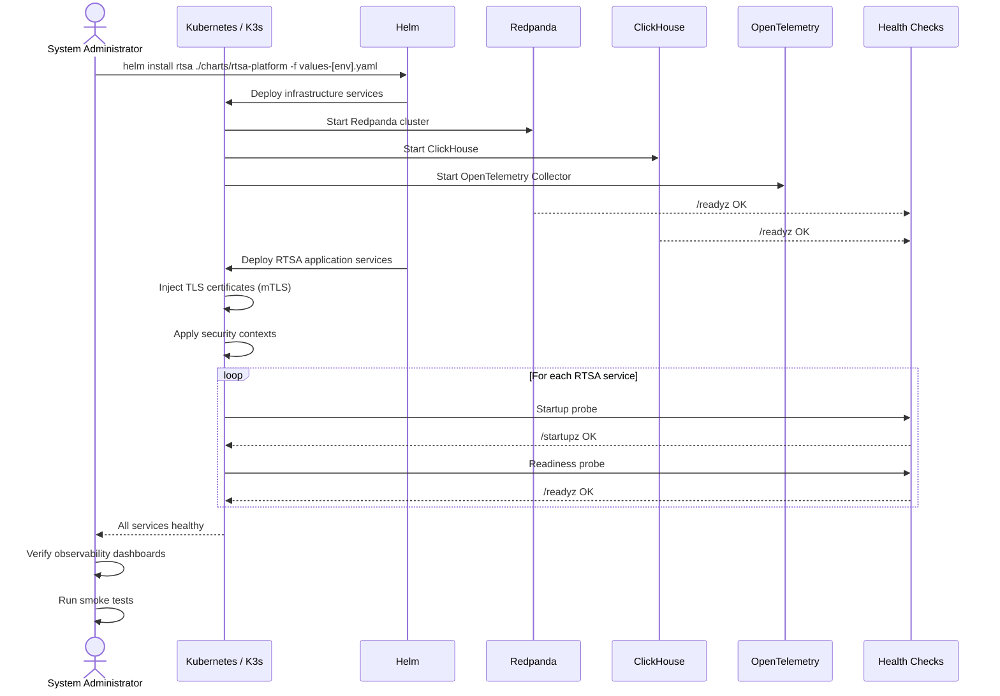

<!-- CLASSIFICATION: UNCLASSIFIED -->
# UC001 — System Initialization & Platform Bootstrap

> **Use Case ID**: UC001
> **Feature**: FEAT-01 (Platform Infrastructure), FEAT-02 (Security Framework), FEAT-03 (Event Streaming Backbone)
> **Priority**: MUST
> **Actors**: System Administrator
> **Classification**: UNCLASSIFIED
> **Last Updated**: 2026-02-23

---

## 1. Description

The system administrator deploys and initializes the RTSA platform, including all infrastructure components (Kubernetes, Redpanda, ClickHouse), security framework (mTLS, PKI, classification guards), and observability stack. The system must be deployable to both data centre and tactical edge environments.

## 2. Preconditions

- Target infrastructure provisioned (Kubernetes cluster or K3s node)
- PKI certificates generated and available
- Helm charts and container images available (via registry or air-gap bundle)
- Administrator has appropriate security clearance

## 3. Triggers

- Initial deployment of RTSA to a new environment
- Disaster recovery / re-deployment
- Tactical edge node provisioning

## 4. Main Flow

## 5. Alternative Flows

### 5a. Air-Gap Edge Deployment
- Administrator transfers distribution bundle via encrypted removable media
- Verifies image signatures with `cosign verify`
- Loads images into local K3s registry
- Deploys with edge values file (`values-edge.yaml`)

### 5b. Infrastructure Service Fails to Start
- Kubernetes restarts the service (up to `failureThreshold`)
- If still unhealthy, administrator investigates logs
- Rollback to previous version if needed

## 6. Postconditions

- All infrastructure components running and healthy
- All RTSA services running and healthy
- mTLS enforced on all gRPC channels
- Observability stack collecting metrics, logs, and traces
- Redpanda topics created with correct partition counts
- ClickHouse tables and materialized views created

## 7. Security Considerations

- Certificates must be validated before deployment (expiry, CA chain)
- Security contexts enforced (non-root, read-only FS, drop all capabilities)
- No secrets in Helm values files — use Kubernetes Secrets
- Audit event generated for deployment operations

## 8. Requirements Traced

| Requirement | Description |
|---|---|
| CR-SEC-002 | mTLS for all inter-service communication |
| NFR-AVAIL-001 | 99.9% data centre availability |
| NFR-AVAIL-003 | RTO < 15 minutes |
