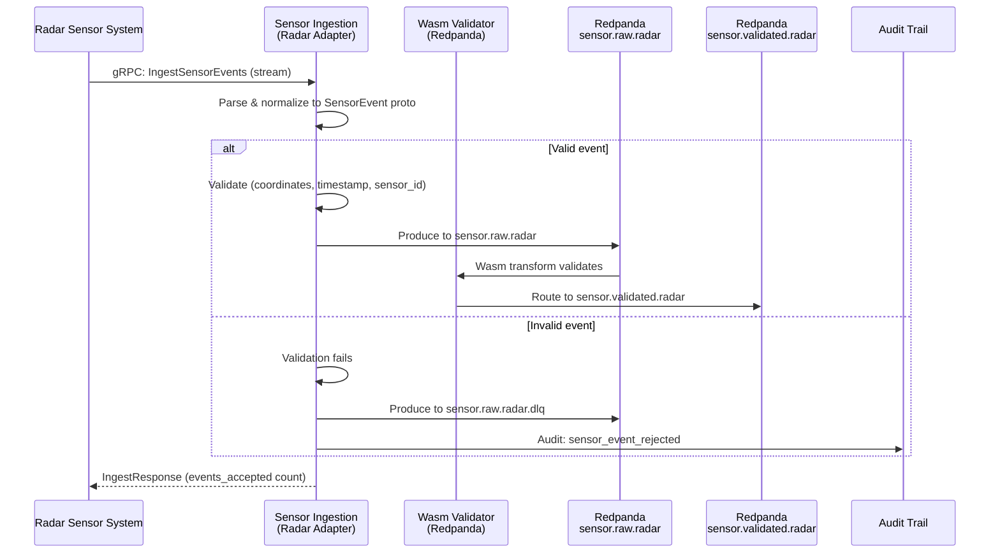

<!-- CLASSIFICATION: UNCLASSIFIED -->
# UC002 — Radar Sensor Data Ingestion

> **Use Case ID**: UC002
> **Feature**: FEAT-04 (Radar Sensor Ingestion)
> **Priority**: MUST
> **Actors**: Radar Sensor System (external), Sensor Operator (monitoring)
> **Classification**: UNCLASSIFIED
> **Last Updated**: 2026-02-23

---

## 1. Description

The system ingests real-time radar track reports and plot data from radar sensor systems. Each radar event is validated, normalized to a common Protobuf format, and published to Redpanda for downstream processing by the fusion engine.

## 2. Preconditions

- RTSA platform is initialized and healthy (UC001)
- Radar sensor system is configured to send data to RTSA ingestion endpoint
- Network connectivity exists between radar system and RTSA
- mTLS certificates provisioned for the radar adapter

## 3. Triggers

- Radar sensor system transmits a track report or plot detection
- Continuous flow during operational period

## 4. Main Flow

## 5. Alternative Flows

### 5a. Radar System Reconnects After Disconnection
- gRPC client-side streaming reconnects automatically
- Events during disconnection are lost (radar system may buffer)
- Ingestion service logs reconnection event

### 5b. Radar Event Rate Exceeds Threshold
- Rate limiter enforces per-sensor rate limit
- Excess events rejected with `RESOURCE_EXHAUSTED`
- Alert generated for operator attention

### 5c. Invalid Coordinates
- Latitude outside [-90, 90] or longitude outside [-180, 180]
- Event routed to DLQ with reason "coordinates out of range"
- Counter `rtsa_sensor_events_rejected_total{sensor_type="RADAR"}` incremented

## 6. Postconditions

- Valid radar events are available on `sensor.validated.radar` topic
- Invalid events are on `sensor.raw.radar.dlq` with rejection reason
- Metrics updated (ingested count, rejected count, latency)
- Audit trail records any rejections

## 7. Data Mapping

| Radar Field | SensorEvent Field | Validation |
|---|---|---|
| Track number | `sensor_track_id` | Non-empty string |
| Latitude | `position.latitude_deg` | [-90, 90] |
| Longitude | `position.longitude_deg` | [-180, 180] |
| Altitude | `position.altitude_m` | [-500, 100000] |
| Speed | `kinematics.speed_ms` | [0, 10000] |
| Heading | `kinematics.heading_deg` | [0, 360) |
| Detection time | `event_time` | [2020-01-01, now+1h] |
| Classification | `classification` | Valid enum value |

## 8. Security Considerations

- Radar adapter authenticates via mTLS client certificate
- Sensor data classification marked on every message
- No raw sensor payloads logged at INFO level
- Rate limiting prevents DoS via sensor flooding

## 9. Requirements Traced

| Requirement | Description |
|---|---|
| CR-ING-001 | Ingest radar sensor data in real time |
| CR-ING-007 | Validate all sensor data before processing |
| CR-ING-008 | Reject invalid data to DLQ |
| CR-ING-009 | 50,000 events/sec (data centre) |
| CR-ING-010 | 5,000 events/sec (edge) |
