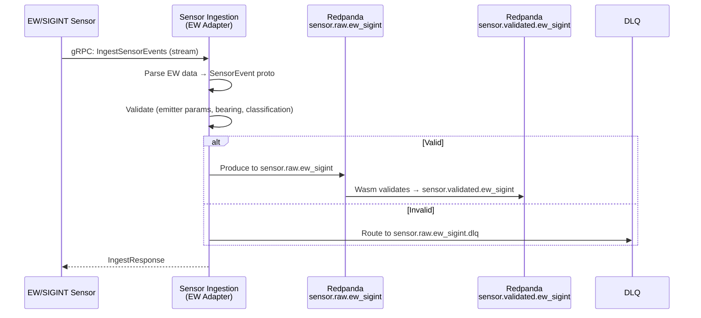

<!-- CLASSIFICATION: UNCLASSIFIED -->
# UC003 — EW/SIGINT Sensor Data Ingestion

> **Use Case ID**: UC003
> **Feature**: FEAT-05 (EW/SIGINT Sensor Ingestion)
> **Priority**: MUST
> **Actors**: EW/SIGINT Sensor System (external), Sensor Operator (monitoring)
> **Classification**: UNCLASSIFIED
> **Last Updated**: 2026-02-23

---

## 1. Description

The system ingests real-time Electronic Warfare (EW) and Signals Intelligence (SIGINT) data including emitter detections, signal characterizations, and electronic order of battle (EOB) updates. Data is validated, normalized, and published.

## 2. Preconditions

- RTSA platform is initialized and healthy (UC001)
- EW/SIGINT sensor systems configured to send data to RTSA
- mTLS certificates provisioned for EW adapter

## 3. Triggers

- EW/SIGINT sensor detects an emitter or intercepts a signal
- EOB update received from collection platform

## 4. Main Flow

## 5. Alternative Flows

### 5a. High-Classification EW Data
- EW data may carry higher classification (e.g., SECRET)
- Classification guard validates classification marking matches topic authorization
- Cross-classification violation triggers alert

### 5b. Bearing-Only Detection (No Position)
- SIGINT may provide bearing without position
- Position fields set to null; bearing stored in signal characteristics
- Fusion engine handles bearing-only correlation

## 6. EW-Specific Data

| EW Field | SensorEvent Field | Notes |
|---|---|---|
| Emitter ID | `emitter_id` (extension field) | Platform-assigned identifier |
| Frequency (MHz) | `signal.frequency_mhz` | Validated range |
| Bearing (degrees) | `signal.bearing_deg` | [0, 360) |
| Signal type | `signal.signal_type` | Enum: CW, PULSE, FHSS, etc. |
| Classification | `classification` | Often PROTECTED_B or higher |

## 7. Security Considerations

- EW/SIGINT data is frequently classified above UNCLASSIFIED
- Classification guard mandatory on this ingestion path
- No signal characteristics logged at any level (operationally sensitive)
- Audit trail for all EW data handling

## 8. Requirements Traced

| Requirement | Description |
|---|---|
| CR-ING-002 | Ingest EW/SIGINT sensor data in real time |
| CR-ING-007 | Validate all sensor data before processing |
| CR-ING-008 | Reject invalid data to DLQ |
| CR-SEC-001 | Enforce GC security classification on all data flows |
