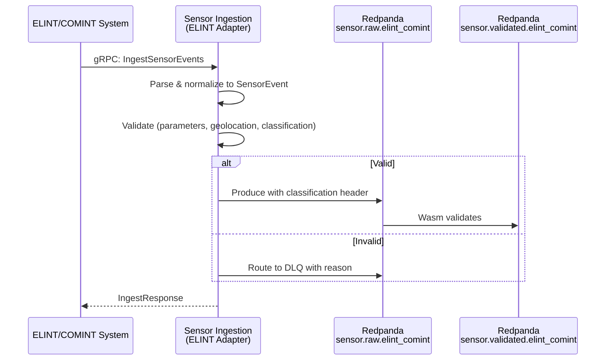

<!-- CLASSIFICATION: UNCLASSIFIED -->
# UC004 — ELINT/COMINT Sensor Data Ingestion

> **Use Case ID**: UC004
> **Feature**: FEAT-06 (ELINT/COMINT Sensor Ingestion)
> **Priority**: MUST
> **Actors**: ELINT/COMINT Collection System (external), Sensor Operator (monitoring)
> **Classification**: UNCLASSIFIED
> **Last Updated**: 2026-02-23

---

## 1. Description

The system ingests Electronic Intelligence (ELINT) and Communications Intelligence (COMINT) data including radar parameter measurements, communication intercepts metadata, and emitter geolocation data. This data is validated, normalized, and published for fusion.

## 2. Preconditions

- RTSA platform initialized and healthy (UC001)
- ELINT/COMINT collection systems configured
- mTLS certificates provisioned

## 3. Triggers

- ELINT system produces radar parameter measurement
- COMINT system produces intercept metadata (no content — metadata only)
- Emitter geolocation computed from multiple intercepts

## 4. Main Flow

## 5. ELINT/COMINT-Specific Data

| Field | SensorEvent Mapping | Notes |
|---|---|---|
| Emitter type | `emitter.type` | Radar type classification |
| PRF (Pulse Repetition Freq) | `emitter.prf_hz` | Radar parameter |
| Pulse width | `emitter.pulse_width_us` | Microseconds |
| Scan type | `emitter.scan_type` | Circular, sector, etc. |
| Geolocation (lat/lon) | `position.latitude_deg/longitude_deg` | CEP accuracy provided |
| CEP (Circular Error Probable) | `position.accuracy_m` | Geolocation accuracy |

## 6. Security Considerations

- ELINT/COMINT data is typically classified PROTECTED_B or SECRET
- Only metadata is ingested — never communications content
- Classification guard is critical on this path
- Enhanced audit logging for all ELINT/COMINT operations

## 7. Requirements Traced

| Requirement | Description |
|---|---|
| CR-ING-003 | Ingest ELINT/COMINT sensor data in real time |
| CR-ING-007 | Validate all sensor data |
| CR-SEC-001 | Enforce GC security classification |
| CR-SEC-007 | Prevent classification spillage |
