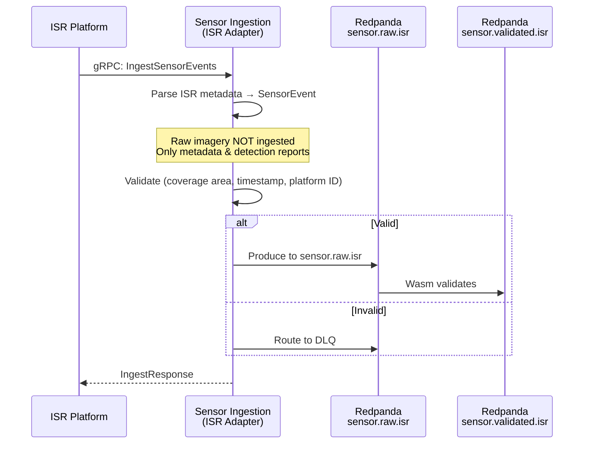

<!-- CLASSIFICATION: UNCLASSIFIED -->
# UC005 — ISR Metadata Ingestion

> **Use Case ID**: UC005
> **Feature**: FEAT-07 (ISR Metadata Ingestion)
> **Priority**: MUST
> **Actors**: ISR Platform (external), ISR Operator (monitoring)
> **Classification**: UNCLASSIFIED
> **Last Updated**: 2026-02-23

---

## 1. Description

The system ingests Intelligence, Surveillance, and Reconnaissance (ISR) metadata from ISR platforms (UAVs, manned aircraft, ground stations). Metadata includes imagery metadata (geolocation, timestamp, sensor mode), detection reports, and platform status — not raw imagery.

## 2. Preconditions

- RTSA platform initialized (UC001)
- ISR platforms configured to send metadata to RTSA
- mTLS certificates provisioned

## 3. Triggers

- ISR platform produces imagery metadata (detection/non-detection)
- ISR detection report generated (entity detected in imagery)
- ISR platform status update

## 4. Main Flow

## 5. ISR-Specific Data

| Field | SensorEvent Mapping | Notes |
|---|---|---|
| Platform ID | `sensor_id` | UAV/aircraft identifier |
| Collection area (bbox) | `coverage.bounding_box` | NW and SE corners |
| Sensor mode | `isr.sensor_mode` | EO, IR, SAR, GMTI |
| Detection type | `isr.detection_type` | Entity, activity, change |
| Detected entity position | `position.latitude_deg/longitude_deg` | If entity detected |
| Confidence | `isr.detection_confidence` | [0.0, 1.0] |
| Timestamp | `event_time` | Collection time |

## 6. Alternative Flows

### 6a. Area Search (No Detection)
- ISR reports coverage area with no detections
- Event type set to "area_clear"
- Fusion engine uses negative information for track management

### 6b. Multiple Detections in Single Pass
- ISR platform may report multiple entities per pass
- Each detection is a separate SensorEvent
- All linked by common `collection_id`

## 7. Security Considerations

- ISR metadata classification varies by collection mode and target
- SAR and GMTI data may be higher classification than EO
- Platform IDs may be sensitive (do not log in operational contexts)

## 8. Requirements Traced

| Requirement | Description |
|---|---|
| CR-ING-004 | Ingest ISR platform metadata in real time |
| CR-ING-007 | Validate all sensor data |
| CR-ING-008 | Reject invalid data to DLQ |
