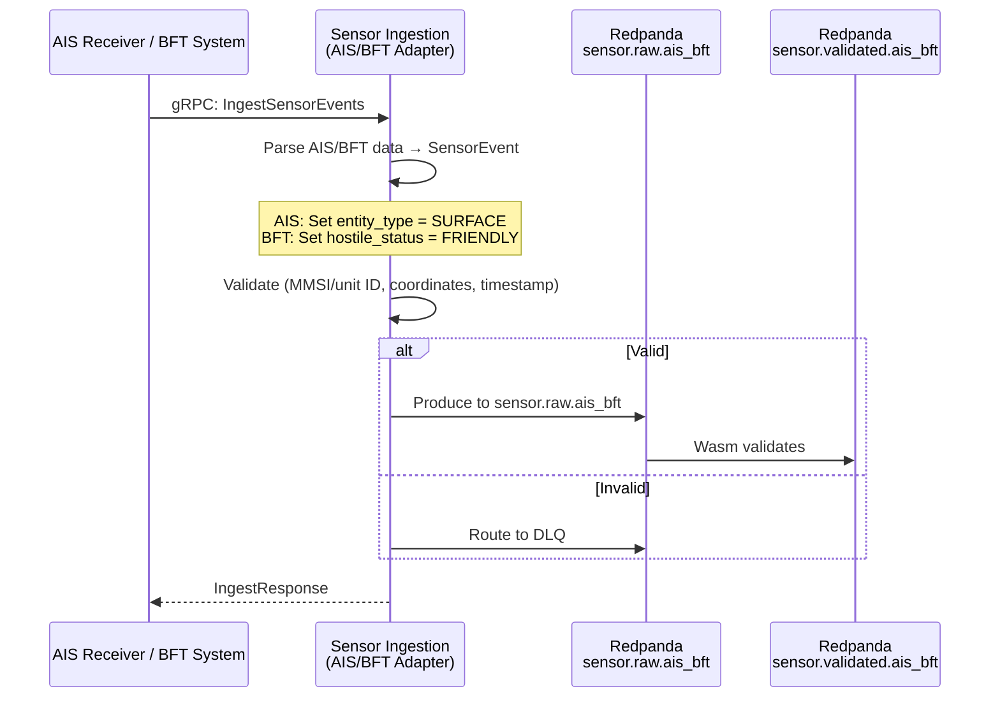

<!-- CLASSIFICATION: UNCLASSIFIED -->
# UC006 — AIS/BFT Data Ingestion

> **Use Case ID**: UC006
> **Feature**: FEAT-08 (AIS/BFT Data Ingestion)
> **Priority**: MUST
> **Actors**: AIS Receiver (external), BFT System (external), Sensor Operator
> **Classification**: UNCLASSIFIED
> **Last Updated**: 2026-02-23

---

## 1. Description

The system ingests Automatic Identification System (AIS) data for maritime vessel tracking and Blue Force Tracking (BFT) data for friendly force positions. AIS provides cooperative vessel identification; BFT provides friendly force locations from GPS-based tracking systems.

## 2. Preconditions

- RTSA platform initialized (UC001)
- AIS receiver and BFT systems connected
- mTLS certificates provisioned

## 3. Triggers

- AIS receiver decodes a vessel position report (Class A or Class B)
- BFT system transmits friendly force position update

## 4. Main Flow

## 5. AIS/BFT-Specific Data

| Field | SensorEvent Mapping | Notes |
|---|---|---|
| MMSI (AIS) | `vessel.mmsi` | 9-digit Maritime Mobile Service Identity |
| Vessel name (AIS) | `vessel.name` | If available (Class A only) |
| Vessel type (AIS) | `vessel.type_code` | IMO vessel type code |
| Unit ID (BFT) | `force.unit_id` | Friendly force unit identifier |
| Force element (BFT) | `force.element_type` | Unit type designation |
| Position | `position.latitude_deg/longitude_deg` | WGS 84 |
| Course over ground | `kinematics.heading_deg` | Degrees |
| Speed over ground | `kinematics.speed_ms` | Meters/second |
| Navigation status (AIS) | `vessel.nav_status` | At anchor, underway, etc. |

## 6. Alternative Flows

### 6a. AIS Spoofing Detection
- Multiple AIS positions for same MMSI at impossible distances
- Fusion engine flags as anomalous
- Alert generated for operator investigation

### 6b. BFT Data Classified
- BFT positions may be PROTECTED_B (force disposition)
- Classification guard enforces topic authorization
- BFT data segregated from UNCLASSIFIED AIS data when required

## 7. Security Considerations

- AIS data is generally UNCLASSIFIED (publicly broadcast)
- BFT data is classified — reveals friendly force positions
- Never combine AIS and BFT data without classification controls
- AIS spoofing is a known threat — fusion must account for this

## 8. Requirements Traced

| Requirement | Description |
|---|---|
| CR-ING-005 | Ingest AIS and BFT data in real time |
| CR-ING-007 | Validate all sensor data |
| CR-SEC-001 | Enforce GC security classification |
