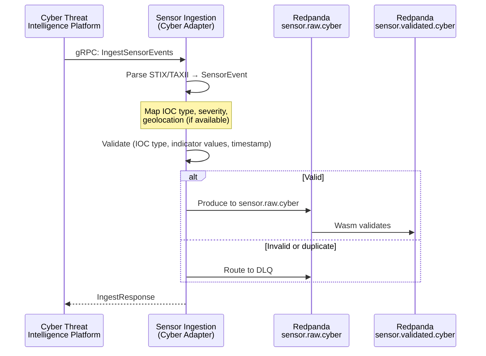

<!-- CLASSIFICATION: UNCLASSIFIED -->
# UC007 — Cyber Threat Indicator Ingestion

> **Use Case ID**: UC007
> **Feature**: FEAT-09 (Cyber Threat Indicator Ingestion)
> **Priority**: MUST
> **Actors**: Cyber Threat Intelligence Platform (external), Cyber Analyst
> **Classification**: UNCLASSIFIED
> **Last Updated**: 2026-02-23

---

## 1. Description

The system ingests cyber threat indicators (IOCs — Indicators of Compromise) from cyber threat intelligence platforms. These indicators enable correlation of cyber threats with physical domain entities (e.g., a command-and-control server geo-located to a region of interest).

## 2. Preconditions

- RTSA platform initialized (UC001)
- Cyber threat intelligence platform configured
- mTLS certificates provisioned

## 3. Triggers

- New Indicator of Compromise (IOC) published by threat intelligence platform
- Cyber incident report generated
- Periodic threat feed update

## 4. Main Flow

## 5. Cyber-Specific Data

| Field | SensorEvent Mapping | Notes |
|---|---|---|
| IOC type | `cyber.ioc_type` | IP, domain, hash, URL, email |
| Indicator value | `cyber.indicator` | The IOC value |
| Threat type | `cyber.threat_type` | Malware, C2, phishing, exploit |
| Severity | `cyber.severity` | LOW, MEDIUM, HIGH, CRITICAL |
| Source | `sensor_id` | Threat intelligence source |
| Geolocation (if known) | `position.latitude_deg/longitude_deg` | GeoIP or attributed location |
| Confidence | `cyber.confidence` | [0.0, 1.0] |
| MITRE ATT&CK ID | `cyber.attack_id` | e.g., T1071.001 |

## 6. Alternative Flows

### 6a. Duplicate IOC
- System de-duplicates based on indicator value + IOC type
- Duplicate events acknowledged but not re-published
- Update timestamp if duplicate carries newer information

### 6b. Geo-Located Cyber Threat
- When IOC has associated geolocation, fusion engine can correlate with physical domain entities
- Enables "cyber-physical" situational awareness

## 7. Security Considerations

- Cyber threat indicators may reveal detection capabilities (handle accordingly)
- IOC values should not be logged at INFO level
- Threat feed sources may be classified

## 8. Requirements Traced

| Requirement | Description |
|---|---|
| CR-ING-006 | Ingest cyber threat indicator data in real time |
| CR-ING-007 | Validate all sensor data |
| CR-ING-008 | Reject invalid data to DLQ |
