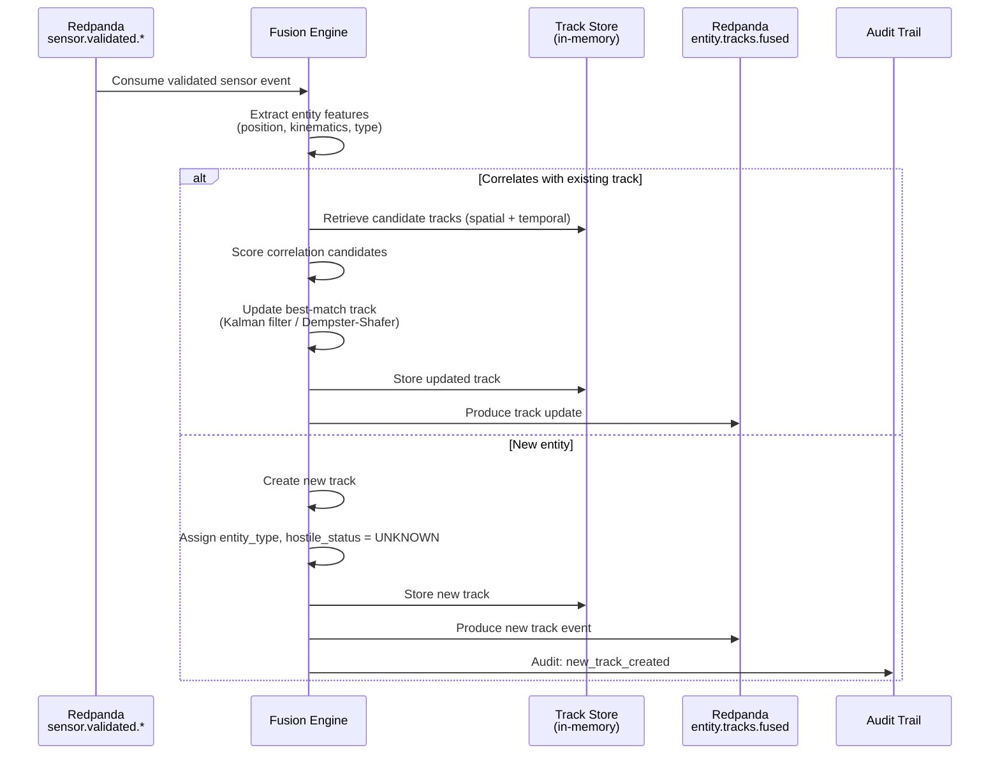
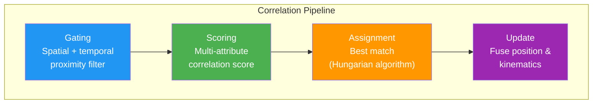

<!-- CLASSIFICATION: UNCLASSIFIED -->
# UC008 — Multi-Source Data Fusion

> **Use Case ID**: UC008
> **Feature**: FEAT-10 (Multi-Source Data Fusion)
> **Priority**: MUST
> **Actors**: System (automated), Operations Commander (consumer)
> **Classification**: UNCLASSIFIED
> **Last Updated**: 2026-02-23

---

## 1. Description

The fusion engine consumes validated sensor events from all 6 sensor types and correlates them into unified entity tracks. Each track represents a single real-world entity (aircraft, vessel, vehicle, emitter, cyber threat node) with fused position, kinematics, entity type, hostile status, and confidence.

## 2. Preconditions

- At least one sensor ingestion adapter is producing validated events
- Fusion engine service is running and subscribed to `sensor.validated.*` topics

## 3. Triggers

- New validated sensor event arrives on any `sensor.validated.*` topic

## 4. Main Flow

## 5. Correlation Algorithm

### 5.1 Gating Criteria

| Parameter | Gate Value | Notes |
|---|---|---|
| Spatial distance | < 10 km (air), < 5 km (surface) | Adjustable per entity type |
| Temporal offset | < 30 seconds | Sensor report freshness |
| Speed compatibility | ± 50% of predicted speed | Based on track history |
| Heading compatibility | ± 45° of predicted heading | Based on track history |

### 5.2 Correlation Scoring

| Factor | Weight | Description |
|---|---|---|
| Position proximity | 0.35 | Euclidean distance penalty |
| Kinematics match | 0.25 | Speed + heading compatibility |
| Sensor type affinity | 0.15 | Cross-sensor correlation bonus |
| Historical consistency | 0.25 | Consistency with track history |

## 6. Alternative Flows

### 6a. Track Merge (Two Tracks → One)
- When correlation reveals two existing tracks are the same entity
- Merge into single track with combined source history
- Audit event generated

### 6b. Track Split (One Track → Two)
- When sensor data indicates track represents multiple entities
- Create child tracks from parent
- Audit event generated

### 6c. Track Timeout (Stale Track)
- No sensor updates for configurable duration (default: 5 minutes)
- Track marked as "LOST"
- Retained for 30 minutes, then promoted to historical storage

### 6d. Edge Mode (Reduced Sensors)
- Not all 6 sensor types may be available at edge
- Fusion operates with available sensors
- Confidence reduced when fewer sensor sources contribute

## 7. Output: Fused Entity Track

| Field | Description |
|---|---|
| `track_id` | Unique track identifier (UUID) |
| `entity_type` | AIR, SURFACE, SUBSURFACE, LAND, SPACE, CYBER |
| `hostile_status` | UNKNOWN, PENDING, FRIENDLY, NEUTRAL, HOSTILE, SUSPECT |
| `position` | Fused lat/lon/alt with uncertainty |
| `kinematics` | Fused speed/heading with uncertainty |
| `confidence` | [0.0, 1.0] — fusion confidence |
| `source_sensors` | List of contributing sensor IDs |
| `source_sensor_types` | List of contributing sensor types |
| `update_time` | Timestamp of latest fusion update |
| `classification` | Max classification of contributing sensors |

## 8. Security Considerations

- Fused track classification = highest classification of any contributing sensor
- Classification must propagate correctly through fusion
- Track creation and merge/split operations are audited

## 9. Requirements Traced

| Requirement | Description |
|---|---|
| CR-FUS-001 | Correlate sensor reports into unified entity tracks |
| CR-FUS-002 | Assign entity type classification |
| CR-FUS-003 | Assign hostile status assessment |
| CR-FUS-004 | Compute position, kinematics, and confidence |
| CR-FUS-005 | Maintain track identity across sensor handoffs |
| CR-FUS-006 | De-duplicate overlapping sensor reports |
| CR-FUS-007 | Complete fusion within 100ms |
