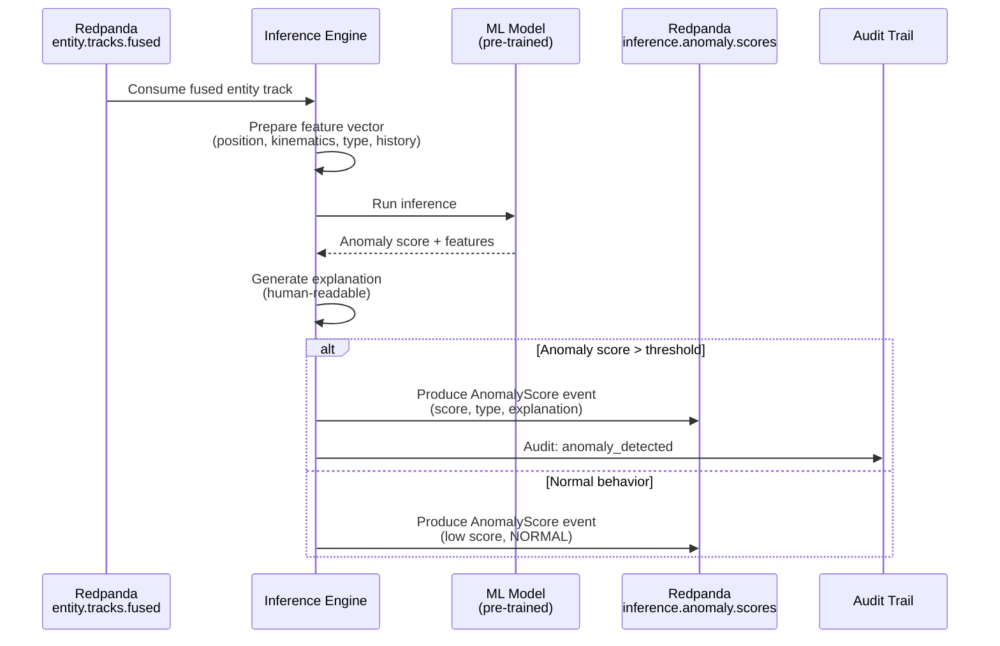

<!-- CLASSIFICATION: UNCLASSIFIED -->
# UC009 — Anomaly Detection & Inference

> **Use Case ID**: UC009
> **Feature**: FEAT-11 (Anomaly Detection & Inference)
> **Priority**: MUST
> **Actors**: System (automated), Operations Commander (consumer), Intelligence Analyst
> **Classification**: UNCLASSIFIED
> **Last Updated**: 2026-02-23

---

## 1. Description

The inference engine consumes fused entity tracks and applies AI/ML models to detect anomalous behavior. Each track is scored with an anomaly score, confidence level, and human-readable explanation. Anomaly types include unusual movement patterns, unexpected locations, behavioral deviations, and threat indicators.

## 2. Preconditions

- Fusion engine is producing fused entity tracks (UC008)
- Pre-trained ML models are loaded and initialized
- Inference engine is subscribed to `entity.tracks.fused`

## 3. Triggers

- New or updated fused entity track published to `entity.tracks.fused`

## 4. Main Flow



## 5. Anomaly Types

| Type | Description | Example |
|---|---|---|
| MOVEMENT_ANOMALY | Unusual movement pattern | Vessel circling in shipping lane |
| LOCATION_ANOMALY | Entity in unexpected location | Military aircraft in civilian corridor |
| SPEED_ANOMALY | Abnormal speed for entity type | Surface vessel at 60 knots |
| BEHAVIORAL_ANOMALY | Deviation from expected behavior | AIS transponder on/off pattern |
| THREAT_INDICATOR | Matches known threat pattern | Radar emissions matching hostile platform |
| CORRELATION_ANOMALY | Cross-domain correlation anomaly | Cyber IOC geo-located near naval vessel |

## 6. Inference Output

| Field | Description |
|---|---|
| `score_id` | Unique score identifier (UUID) |
| `track_id` | Reference to fused entity track |
| `anomaly_type` | Type from table above |
| `score` | [0.0, 1.0] — higher = more anomalous |
| `confidence` | [0.0, 1.0] — model confidence |
| `model_version` | Version of the model that produced the score |
| `explanation` | Human-readable explanation |
| `contributing_features` | Features that most influenced the score |
| `inference_time` | Timestamp of inference |

## 7. Alert Thresholds

| Score Range | Alert Level | Action |
|---|---|---|
| 0.0–0.3 | NORMAL | No alert; logged for historical analysis |
| 0.3–0.6 | WATCH | Highlighted on UI; logged |
| 0.6–0.8 | ELEVATED | Alert displayed to operator; audio cue |
| 0.8–1.0 | CRITICAL | Immediate alert; requires operator acknowledgment |

## 8. Alternative Flows

### 8a. Model Not Available
- If ML model fails to load, inference engine enters degraded mode
- All tracks scored as 0.0 (no anomaly detection)
- Alert generated for system administrator
- System continues to display fused tracks without anomaly scoring

### 8b. Edge Deployment (Pre-trained Model)
- Edge uses pre-trained model shipped with deployment bundle
- No live training or model updates at edge
- Model updates applied during sync (UC001, edge update procedure)

### 8c. Multiple Models
- System may run multiple models concurrently (ensemble)
- Final score is weighted average of model scores
- Each model's individual score retained for analysis

## 9. Explanation Generation

```
Example explanation:
"Track TRK-4501 (SURFACE vessel) scored 0.85 CRITICAL:
- SPEED_ANOMALY: Speed 45 kts exceeds expected 20 kts for vessel type
- LOCATION_ANOMALY: Position 15 km outside normal shipping lane
- BEHAVIORAL_ANOMALY: AIS transponder toggled 3 times in last hour
Contributing sensors: RADAR-001, AIS-002"
```

## 10. Security Considerations

- Model weights are sensitive (reveal detection capabilities)
- Anomaly explanations may reveal detection methods
- Log anomaly scores but not full explanations at INFO level
- Model version tracking for audit and reproducibility

## 11. Requirements Traced

| Requirement | Description |
|---|---|
| CR-INF-001 | Detect anomalous entity behavior using AI/ML |
| CR-INF-002 | Produce anomaly scores with confidence levels |
| CR-INF-003 | Provide human-readable explanations |
| CR-INF-004 | Complete inference within 150ms |
| CR-INF-005 | Support multiple models concurrently |
| CR-INF-006 | Pre-trained models at tactical edge |
| CR-INF-007 | Model versioning and rollback |
