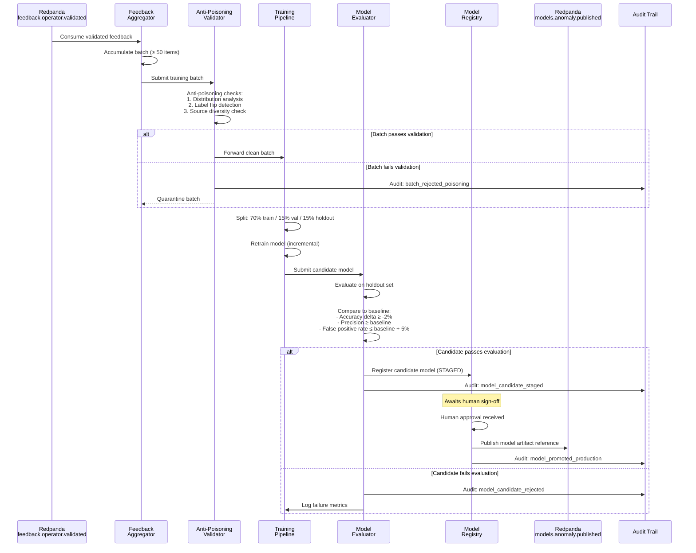
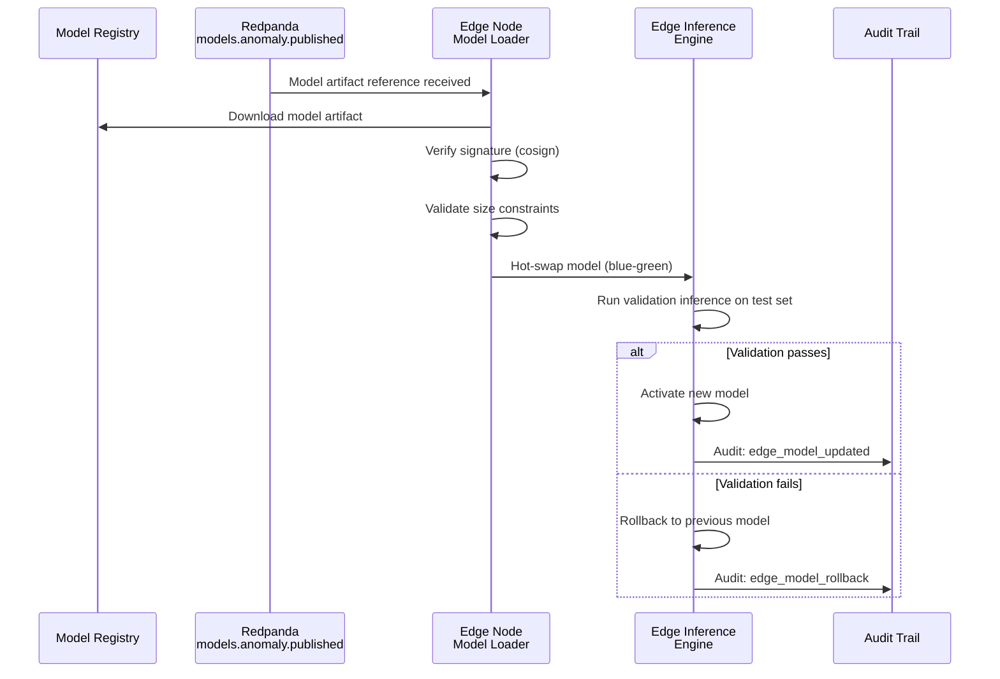

<!-- CLASSIFICATION: UNCLASSIFIED -->
# UC011 — Feedback-Driven Model Retraining

> **Use Case ID**: UC011
> **Feature**: FEAT-13 (Feedback-Driven Model Retraining)
> **Priority**: MUST
> **Actors**: ML Pipeline (automated), Security Officer (oversight)
> **Classification**: UNCLASSIFIED
> **Last Updated**: 2026-02-23

---

## 1. Description

Validated operator feedback is consumed from Redpanda, aggregated into training batches, and used to retrain anomaly detection models. The retraining pipeline enforces anti-poisoning safeguards, validates model quality against holdout datasets, and promotes models only after human sign-off. Edge-deployed models receive updates via model distribution topics.

## 2. Preconditions

- Validated feedback exists in `feedback.operator.validated` (UC010)
- Minimum batch of 50 validated feedback items accumulated
- Existing baseline model deployed and producing predictions

## 3. Triggers

- Batch threshold reached (50+ validated feedback items)
- Scheduled retraining window (weekly)
- Manual trigger by authorized ML engineer

## 4. Main Flow

## 5. Anti-Poisoning Validation Rules

| Check | Description | Threshold |
|---|---|---|
| Distribution analysis | Compare label distribution to historical baseline | Chi-squared test, p > 0.05 |
| Label flip detection | Identify bulk label reversals | Max 20% of batch may flip a single label |
| Source diversity | Ensure feedback from multiple operators | Minimum 3 distinct operators per batch |
| Temporal clustering | Detect suspiciously timed submissions | No single 5-min window contributes > 40% |
| High-trust ratio | Minimum proportion of high-trust items | ≥ 60% of batch must have trust ≥ 0.7 |

## 6. Model Evaluation Criteria

| Metric | Requirement |
|---|---|
| Accuracy | Must not decrease by > 2% vs. baseline |
| Precision (hostile) | Must be ≥ baseline |
| Recall (hostile) | Must be ≥ 90% of baseline |
| False positive rate | Must not increase by > 5% |
| Inference latency | Must remain < 200ms (p99) |
| Model size | Must fit within edge constraints (< 500MB) |

## 7. Edge Model Distribution

## 8. Alternative Flows

### 8a. Insufficient Feedback Volume
- Batch threshold not reached within retraining window
- System logs warning and extends window
- No retraining occurs; existing model continues unchanged

### 8b. Model Degradation Detected Post-Deployment
- Monitoring detects performance degradation (false positive spike)
- Automatic rollback to previous model version
- Degraded model quarantined; contributing feedback batch flagged for review
- Alert sent to ML engineer and Security Officer

### 8c. Edge-Only Retraining (Disconnected)
- Edge accumulates validated feedback locally
- Lightweight incremental update applied to local model
- When connectivity restored, feedback synced to central for full retraining

## 9. Security Considerations

- Model artifacts must be cryptographically signed (cosign)
- Only promoted models deployed to production/edge
- Complete lineage: feedback items → training batch → model version
- Anti-poisoning prevents adversarial manipulation of model behavior
- All model lifecycle events produce immutable audit records

## 10. Requirements Traced

| Requirement | Description |
|---|---|
| CR-FB-005 | Route validated feedback to model retraining |
| CR-INF-005 | Support model updates without service interruption |
| CR-INF-006 | Log all model versions, inputs, and outputs |
| CR-INF-007 | Detect model degradation and alert operators |
| CR-SEC-006 | Anti-poisoning controls on training data |
| CR-SEC-008 | Immutable audit log for model lifecycle |
