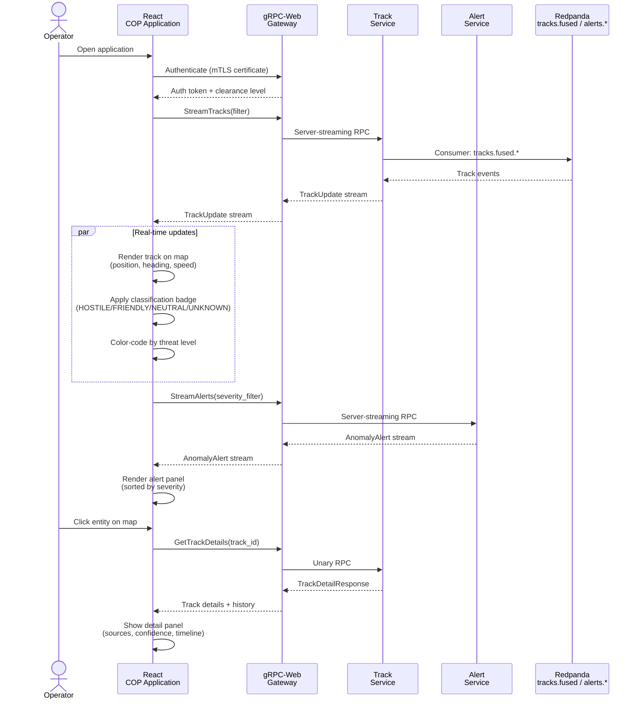
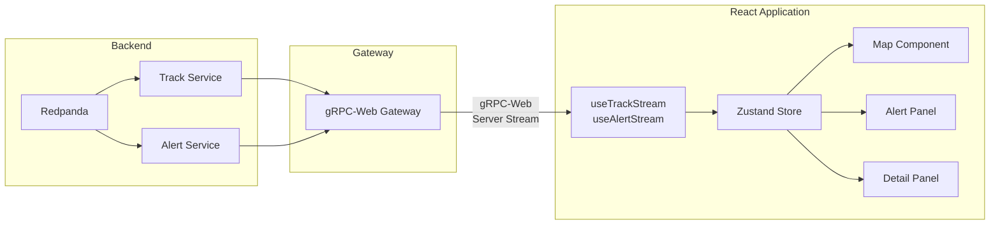

<!-- CLASSIFICATION: UNCLASSIFIED -->
# UC012 — Situational Awareness UI Display

> **Use Case ID**: UC012
> **Feature**: FEAT-09 (Situational Awareness Dashboard), FEAT-10 (Anomaly Alert Management), FEAT-11 (Historical Replay)
> **Priority**: MUST
> **Actors**: Operations Commander, Intelligence Analyst, Watch Officer
> **Classification**: UNCLASSIFIED
> **Last Updated**: 2026-02-23

---

## 1. Description

The situational awareness UI renders a real-time common operating picture (COP) on an interactive map. Fused entity tracks, anomaly alerts, and classification badges are displayed in real time via gRPC-Web streaming and WebSockets. Operators can filter, search, inspect entities, and manage alert queues. The UI adapts to edge deployment with offline capability and reduced bandwidth mode.

## 2. Preconditions

- Fusion engine is producing fused tracks (UC008)
- Anomaly detection is producing scored alerts (UC009)
- Operator is authenticated and has appropriate clearance

## 3. Triggers

- Operator opens the situational awareness application
- Real-time events arrive via gRPC-Web stream
- Operator interacts with map or alert panels

## 4. Main Flow

## 5. UI Components

### 5.1 Map View (Primary)

| Component | Description |
|---|---|
| Entity markers | Icons positioned by lat/lon with heading indicator |
| Track trails | Last N positions shown as fading trail |
| Classification badges | Color-coded: RED=Hostile, BLUE=Friendly, GREEN=Neutral, YELLOW=Unknown |
| Threat halos | Pulsing radius for elevated/critical threat entities |
| Geo-fence overlays | Area of interest boundaries |
| Sensor coverage | Optional overlay showing sensor effective ranges |

### 5.2 Alert Panel

| Element | Description |
|---|---|
| Alert queue | Sorted by severity (CRITICAL → ELEVATED → WATCH) |
| Alert card | Entity ID, anomaly type, severity, confidence, timestamp |
| Quick actions | Confirm, Reject, Investigate, Assign |
| Alert filter | By severity, type, time range, entity class |
| Unacknowledged counter | Badge showing unacknowledged alert count |

### 5.3 Entity Detail Panel

| Section | Content |
|---|---|
| Identity | Track ID, entity type, classification, confidence |
| Position | Lat/lon, speed, heading, altitude (if applicable) |
| Source attribution | Contributing sensors with individual confidence scores |
| Anomaly history | Past anomaly detections for this entity |
| Feedback history | Operator feedback submitted for this entity |
| Timeline | Track lifecycle events (created, updated, merged, split) |

## 6. Real-Time Data Flow

## 7. Alternative Flows

### 7a. Edge Deployment (Bandwidth-Constrained)
- UI switches to reduced bandwidth mode
- Track updates throttled to 1 Hz (vs. 10 Hz normal)
- Map tiles served from local cache
- Only ELEVATED and CRITICAL alerts streamed
- Track trails shortened to last 5 positions

### 7b. Offline Mode
- Last known track state displayed with "STALE" indicator
- Timestamp shows age of last update
- Alerts continue from local anomaly detection
- Feedback queued locally for later sync
- Clear visual indicator: "DISCONNECTED — LOCAL DATA ONLY"

### 7c. Classification-Based Filtering
- UI filters content based on operator clearance
- Tracks above operator clearance are invisible
- Attempting to access restricted content returns sanitized view
- All access attempts logged to audit trail

## 8. Accessibility & Performance

| Metric | Target |
|---|---|
| Track render latency | < 100ms from Redpanda event to map display |
| Alert display latency | < 500ms from detection to alert panel |
| Max simultaneous tracks | 5,000 on standard workstation |
| Max simultaneous tracks (edge) | 500 on edge terminal |
| Map redraw rate | 30 FPS |
| Keyboard navigation | Full WCAG 2.1 AA compliance |
| High contrast mode | Supported for tactical displays |

## 9. Security Considerations

- mTLS authentication for all gRPC-Web connections
- Clearance-based content filtering (no client-side trust)
- No classified data cached in browser storage
- Session timeout after 30 minutes of inactivity
- All user interactions logged for audit

## 10. Requirements Traced

| Requirement | Description |
|---|---|
| CR-UI-001 | Real-time common operating picture display |
| CR-UI-002 | Entity filtering by classification and type |
| CR-UI-003 | Alert management with severity-based queuing |
| CR-UI-004 | Entity detail views with source attribution |
| CR-UI-005 | Anomaly alert visualization with severity color-coding |
| CR-UI-006 | Offline mode with stale data indication |
| CR-UI-007 | WCAG 2.1 AA compliance for accessibility |
| CR-UI-008 | Responsive layout for vehicle-mounted and desktop displays |
