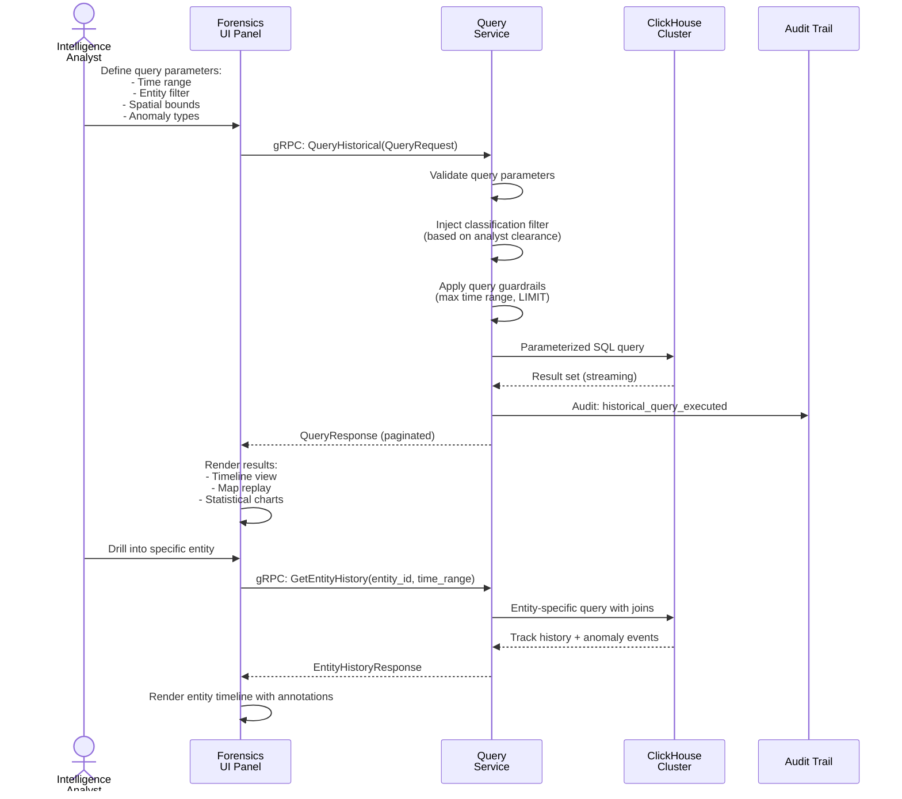
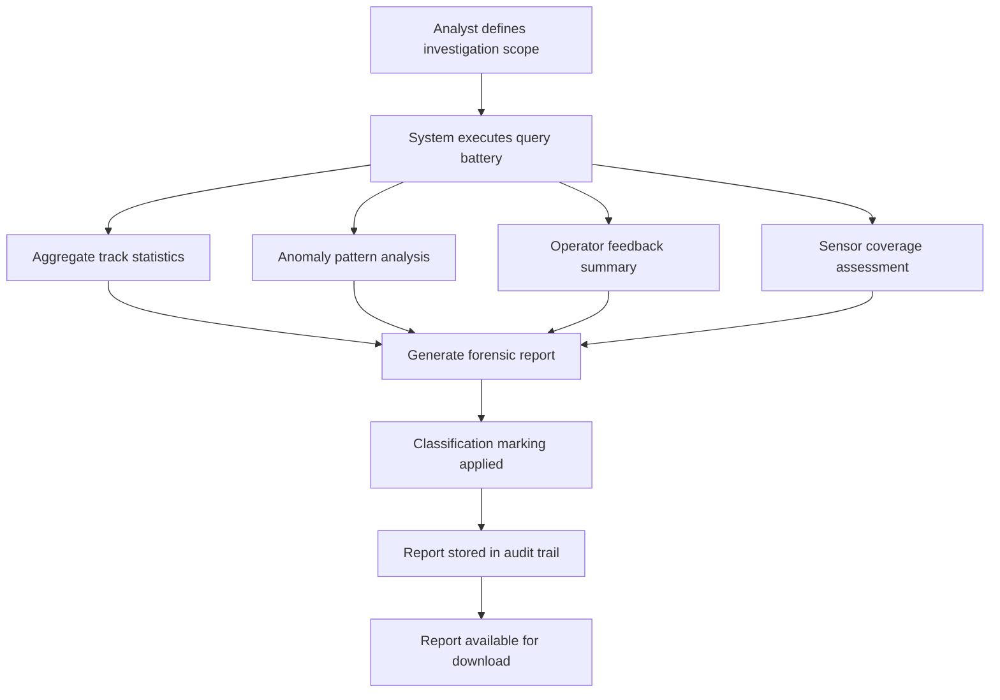

<!-- CLASSIFICATION: UNCLASSIFIED -->
# UC013 — Historical Data Query & Forensic Analysis

> **Use Case ID**: UC013
> **Feature**: FEAT-14 (Historical Analytics & Forensics)
> **Priority**: MUST
> **Actors**: Intelligence Analyst, Forensic Investigator
> **Classification**: UNCLASSIFIED
> **Last Updated**: 2026-02-23

---

## 1. Description

An analyst queries ClickHouse for historical entity tracks, anomaly detections, and sensor observations to investigate incidents, identify patterns, and produce intelligence reports. The system supports time-range queries, spatial queries, entity-specific deep dives, and aggregated statistical analysis. All queries are parameterized and classification-filtered.

## 2. Preconditions

- ClickHouse tables populated via Redpanda Connect ETL (ongoing)
- Analyst is authenticated with appropriate clearance
- Historical data retained per TTL policies (raw: 90 days, aggregated: 2 years)

## 3. Triggers

- Analyst initiates a historical investigation
- Scheduled forensic report generation
- Anomaly pattern review (weekly/monthly)

## 4. Main Flow



## 5. Query Types

### 5.1 Time-Range Track Query
```sql
SELECT
    track_id, entity_type, classification,
    latitude, longitude, speed_knots, heading_deg,
    confidence_score, source_count, event_time
FROM tracks_fused
WHERE event_time BETWEEN {start:DateTime64(3)} AND {end:DateTime64(3)}
  AND classification_level <= {clearance:UInt8}
ORDER BY event_time DESC
LIMIT {limit:UInt32}
```

### 5.2 Spatial Query (Bounding Box)
```sql
SELECT track_id, entity_type, latitude, longitude, event_time
FROM tracks_fused
WHERE event_time BETWEEN {start:DateTime64(3)} AND {end:DateTime64(3)}
  AND latitude BETWEEN {lat_min:Float64} AND {lat_max:Float64}
  AND longitude BETWEEN {lon_min:Float64} AND {lon_max:Float64}
ORDER BY event_time
```

### 5.3 Anomaly Pattern Analysis
```sql
SELECT
    anomaly_type,
    count() AS occurrence_count,
    avg(confidence_score) AS avg_confidence,
    uniqExact(track_id) AS affected_entities,
    min(event_time) AS first_seen,
    max(event_time) AS last_seen
FROM anomaly_detections
WHERE event_time BETWEEN {start:DateTime64(3)} AND {end:DateTime64(3)}
GROUP BY anomaly_type
ORDER BY occurrence_count DESC
```

### 5.4 Entity Deep Dive
```sql
SELECT
    t.track_id, t.event_time, t.latitude, t.longitude,
    t.speed_knots, t.heading_deg,
    a.anomaly_type, a.severity, a.confidence_score AS anomaly_confidence,
    f.feedback_type, f.operator_id, f.trust_score
FROM tracks_fused t
LEFT JOIN anomaly_detections a ON t.track_id = a.track_id
    AND a.event_time BETWEEN t.event_time - INTERVAL 1 MINUTE AND t.event_time + INTERVAL 1 MINUTE
LEFT JOIN operator_feedback f ON t.track_id = f.track_id
WHERE t.track_id = {track_id:String}
  AND t.event_time BETWEEN {start:DateTime64(3)} AND {end:DateTime64(3)}
ORDER BY t.event_time
```

## 6. Query Guardrails

| Guardrail | Constraint |
|---|---|
| Maximum time range | 30 days per query (prevents full table scans) |
| Result limit | Default 10,000 rows, max 100,000 |
| Query timeout | 30 seconds max execution time |
| Concurrent queries | Max 5 per user, max 20 system-wide |
| Classification filter | Always injected server-side (never client-controlled) |
| Parameterization | All queries must use ClickHouse `{param:Type}` syntax |

## 7. Forensic Report Generation



## 8. Alternative Flows

### 8a. Edge Historical Query
- Edge nodes have limited ClickHouse retention (7 days)
- Queries exceeding local retention return partial results with advisory
- Analyst can request data from central (if connected)

### 8b. Large Result Set
- Results exceeding 10,000 rows automatically paginated
- Streaming response via server-streaming gRPC
- Client can cancel long-running queries

### 8c. No Results Found
- System confirms query was valid and executed
- Suggests broadening time range or adjusting filters
- Logs query for analytics (might indicate data gap)

## 9. Security Considerations

- All queries parameterized (SQL injection prevention)
- Classification filter injected server-side — never trusted from client
- Query execution logged in audit trail (query text + parameters + result count)
- No export of data above analyst's clearance level
- ClickHouse user has read-only access (no DDL or DML)

## 10. Requirements Traced

| Requirement | Description |
|---|---|
| CR-HIS-001 | Time-range queries on historical tracks |
| CR-HIS-002 | Spatial queries within geographic bounds |
| CR-HIS-003 | Anomaly pattern analysis and statistics |
| CR-HIS-004 | Entity-specific historical deep dive |
| CR-HIS-005 | Forensic report generation |
| CR-HIS-006 | Query guardrails (timeout, limits, classification) |
| CR-HIS-007 | Complete audit trail for all queries |
