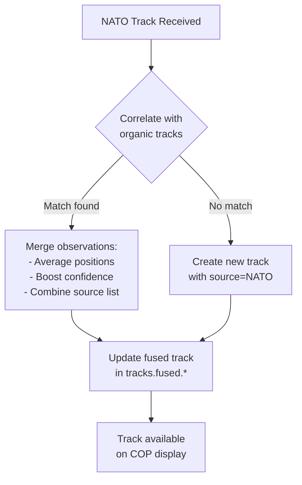

<!-- CLASSIFICATION: UNCLASSIFIED -->
# UC015 — NATO Inbound Data Exchange

> **Use Case ID**: UC015
> **Feature**: FEAT-15 (NATO Interoperability)
> **Priority**: MUST
> **Actors**: System (automated), NATO Interop Officer
> **Classification**: UNCLASSIFIED
> **Last Updated**: 2026-02-23

---

## 1. Description

The RTSA system receives entity tracks and tactical data from NATO-allied systems via STANAG 5516 (Link 16 J-Series), NFFI XML, and MIP data shares. Inbound data is validated, sanitized, classification-mapped, transformed to the internal protobuf schema, and published to Redpanda for fusion with organic sensor data. A cross-domain guard prevents ingestion of data above the system's classification ceiling.

## 2. Preconditions

- NATO communication link established (Link 16, IP-based NFFI/MIP)
- Inbound cross-domain guard configured
- Fusion engine operational and consuming track topics (UC008)
- System authorized for current exercise or operation

## 3. Triggers

- Link 16 terminal receives J-Series messages
- NFFI gateway receives allied track updates
- MIP data share synchronization event

## 4. Main Flow

```mermaid
sequenceDiagram
    participant LINK as Link 16<br/>Terminal
    participant NFFI as NFFI/MIP<br/>Gateway
    participant CDG as Cross-Domain<br/>Guard
    participant XLAT as Format<br/>Translator
    participant ING as NATO Ingest<br/>Service
    participant RP as Redpanda<br/>sensors.nato.*
    participant FUS as Fusion Engine
    participant AUDIT as Audit Trail

    par Link 16 Reception
        LINK->>CDG: J3.2 Track Report received
        CDG->>CDG: Validate classification ≤ ceiling
        CDG->>XLAT: Forward J3.2 message
        XLAT->>XLAT: Parse J-Series → Internal proto:<br/>- TN → track_id prefix "L16-"<br/>- Lat/Lon → WGS-84 Float64<br/>- IFF → entity_type enum<br/>- Feet → meters
        XLAT->>ING: NatoTrackObservation
    and NFFI Reception
        NFFI->>CDG: NFFI XML document received
        CDG->>CDG: Validate classification ≤ ceiling
        CDG->>XLAT: Forward NFFI XML
        XLAT->>XLAT: Parse NFFI → Internal proto:<br/>- TrackId → track_id prefix "NFFI-"<br/>- Position → lat/lon Float64<br/>- Identity → entity_type enum
        XLAT->>ING: NatoTrackObservation
    end

    ING->>ING: Validate observation:<br/>- Coordinate bounds check<br/>- Speed/heading sanity<br/>- Duplicate detection<br/>- Source authentication
    ING->>RP: Produce to sensors.nato.link16<br/>or sensors.nato.nffi
    ING->>AUDIT: Audit: nato_track_ingested

    RP->>FUS: Consume NATO observations
    FUS->>FUS: Correlate with organic tracks<br/>(same entity from different sources)
    FUS->>FUS: Boost confidence for<br/>multi-source corroboration
```

## 5. Format Mappings (Inbound)

### 5.1 STANAG 5516 (Link 16) → Internal

| J-Series Field | Internal Field | Transformation |
|---|---|---|
| Track Number (TN) | track_id | Prefix "L16-" + 5-digit octal |
| Latitude | latitude | WGS-84 decimal degrees |
| Longitude | longitude | WGS-84 decimal degrees |
| Speed | speed_knots | Direct mapping |
| Course | heading_deg | 0–360° |
| Altitude (feet) | altitude_meters | × 0.3048 |
| IFF Identity | entity_type | HOSTILE→HOSTILE, FRIENDLY→FRIENDLY, etc. |
| Exercise Indicator | exercise_flag | Boolean |
| Message Time | observation_time | UTC DateTime64(3) |

### 5.2 NFFI XML → Internal

| NFFI Element | Internal Field | Transformation |
|---|---|---|
| `<TrackId>` | track_id | Prefix "NFFI-" + original ID |
| `<Latitude>` | latitude | Float64 decimal degrees |
| `<Longitude>` | longitude | Float64 decimal degrees |
| `<Speed>` | speed_knots | Float64 |
| `<Course>` | heading_deg | Float64 0–360° |
| `<Identity>` | entity_type | Map to Enum |
| `<Quality>` | confidence_score | Direct mapping 0.0–1.0 |
| `<DateTime>` | observation_time | Parse ISO 8601 → DateTime64(3) |

## 6. Validation Rules

| Rule | Description | Action on Failure |
|---|---|---|
| Classification ceiling | Data must not exceed system's classification level | Reject and alert |
| Coordinate bounds | Latitude ±90°, Longitude ±180° | Reject observation |
| Speed sanity | 0–999 knots for surface, 0–2500 for air | Flag as suspect |
| Duplicate detection | Same TN with identical timestamp within 5s | Deduplicate |
| Source authentication | Link 16 terminal or NFFI gateway must be in trusted list | Reject and alert |
| Schema validation | NFFI XML must validate against published XSD | Reject and log |
| Rate limit | Max 5000 messages/second per source | Throttle and alert |

## 7. Track Correlation with Organic Data



## 8. Alternative Flows

### 8a. Classification Violation
- Inbound data exceeds system classification ceiling
- Cross-domain guard blocks the message
- Alert sent to Security Officer and NATO Interop Officer
- Event logged with full detail in secure audit partition

### 8b. Unknown Track Format
- Message received with unrecognized format version
- Parser logs warning and attempts best-effort parse
- If parse fails, message routed to dead letter queue (DLQ)
- NATO Interop Officer notified for format investigation

### 8c. Link 16 Degraded / Lost
- Terminal reports link degradation or loss
- System marks all L16-prefixed tracks as STALE
- Alert displayed on COP: "Link 16 degraded — NATO tracks may be stale"
- On reconnection, bulk resync of track positions

### 8d. Exercise vs. Live Separation
- Tracks with Exercise Indicator segregated to exercise-only topics
- Exercise tracks never mixed with live operational data
- Exercise topics: `sensors.nato.link16.exercise`, `sensors.nato.nffi.exercise`

## 9. Security Considerations

- Cross-domain guard is mandatory for all inbound data
- Inbound validation prevents injection of malformed data
- NATO source attribution preserved but not forwarded to anomaly reporting
- All ingested data classification-marked with source alliance caveat
- Complete audit trail: source, format, track_id, timestamp, classification
- Link 16 terminal isolation (TEMPEST-approved, dedicated network segment)

## 10. Requirements Traced

| Requirement | Description |
|---|---|
| CR-NATO-001 | Receive tracks via STANAG 5516 Link 16 |
| CR-NATO-002 | Receive tracks via NFFI XML |
| CR-NATO-003 | Cross-domain guard for inbound data |
| CR-NATO-004 | Validate and sanitize all inbound data |
| CR-NATO-005 | Audit trail for all NATO data exchanges |
| CR-ING-009 | Validate all external data before processing |
| CR-ING-010 | Route invalid data to DLQ with diagnostic context |
| CR-FUS-001 | Correlate tracks across all sensor sources including NATO |
