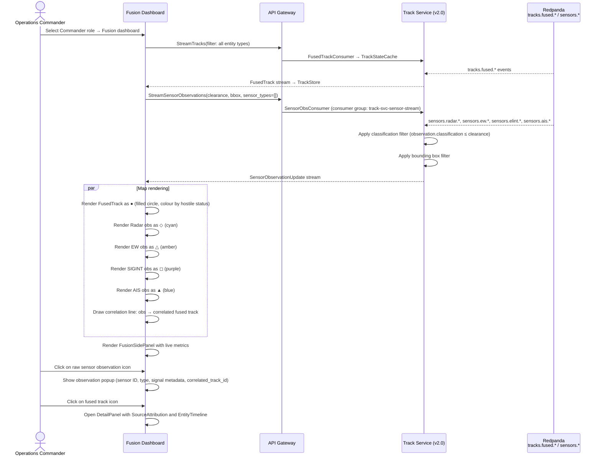

<!-- CLASSIFICATION: UNCLASSIFIED -->
# UC016 — Fusion Dashboard

> **Use Case ID**: UC016
> **Feature**: FEAT-16 (Fusion Dashboard)
> **Priority**: MUST
> **Actors**: Operations Commander
> **Classification**: UNCLASSIFIED
> **Version**: 2.0
> **Last Updated**: 2026-02-28

---

## 1. Description

The Fusion Dashboard is the default Level-2 dashboard view for the Operations Commander role. It renders raw pre-fusion sensor observations (Radar, EW/SIGINT, ELINT, ISR, AIS, Cyber) alongside correlated fused tracks on the same geographic map, making the multi-source data fusion process visible to the duty commander. A collapsible `FusionSidePanel` provides real-time fusion metrics: active track count per domain, confidence score histograms, and per-sensor contribution rates.

## 2. Preconditions

- Operator is authenticated with Operations Commander role
- Track Service is streaming fused tracks (`StreamTracks`)
- Track Service v2.0 is streaming raw sensor observations (`StreamSensorObservations`)
- Fusion Engine is producing fused tracks from sensor data

## 3. Triggers

- Operations Commander selects the **Fusion** dashboard tab from the Level-2 dashboard selector
- On role selection, the Fusion Dashboard is the default view for the Commander role

## 4. Main Flow

## 5. Sensor Observation Icon Legend

| Icon | Shape | Colour | Sensor Type |
|---|---|---|---|
| Fused Track | ● (filled circle) | Red/Blue/Green/Yellow by hostile status | Multi-source fused entity |
| Radar Plot | ◇ (diamond) | Cyan (#06B6D4) | Radar sensor |
| EW Intercept | △ (triangle up) | Amber (#F59E0B) | Electronic Warfare / SIGINT |
| ELINT Detection | ◻ (square) | Purple (#A855F7) | ELINT / COMINT |
| AIS Position | ▲ (solid triangle) | Blue (#3B82F6) | AIS / BFT maritime |
| ISR Observation | ⬟ (pentagon) | Orange (#F97316) | ISR platform |
| Cyber IOC | ✕ (cross) | Red (#EF4444) | Cyber threat indicator |

## 6. FusionSidePanel Specification

The `FusionSidePanel` is a collapsible panel on the right side of the Fusion Dashboard, displaying:

| Section | Content |
|---|---|
| **Active Tracks** | Total active tracks, breakdown by domain (Air / Surface / Sub / Land / Cyber) |
| **Confidence Histogram** | Distribution of confidence scores across active tracks (bar chart) |
| **Sensor Contributions** | Per-sensor type: observation rate (obs/min), correlated count, uncorrelated count |
| **Top Uncertain Tracks** | Top-5 tracks with lowest confidence scores, with link to Entity Detail Panel |
| **Fusion Rate** | Observations per second being fused; correlation success rate |

## 7. Alternative Flows

### 7a. Classification Filter — Observation Hidden
- If a raw sensor observation's `classification_level > operator_clearance`, it is suppressed at the Track Service stream boundary
- The fused track that incorporated that observation is still visible (it inherits MAX classification which the operator already has clearance for if the track is shown)
- No indication is given to the operator that observations are being suppressed (per CLS-09)

### 7b. High-Density Area — Observation Clustering
- When map zoom level > 100 km scale, sensor observations are clustered into density heatmap
- Zoom in to < 10 km to see individual observation icons
- `FusionSidePanel` always shows raw counts regardless of zoom

### 7c. Bounding Box Filter on Scroll/Zoom
- The `StreamSensorObservations` request is re-issued with updated bounding box on every map pan or zoom
- Previous stream is cancelled; new stream connects immediately
- Transition uses a 500ms debounce to avoid excessive reconnects

## 8. Security Considerations

- Classification filtering enforced server-side in Track Service (CLS-09)
- Operator clearance extracted from mTLS certificate; no client-side trust
- Correlation line between observation and fused track never reveals observation classification if it is higher than operator clearance — the correlation is suppressed alongside the observation
- `StreamSensorObservations` requires the same gRPC-Web gateway mTLS authentication as all other streams

## 9. Requirements Traced

| Requirement | Description |
|---|---|
| CR-UI-009 | Two-Level RBAC shell — Commander role with Fusion as default Level-2 view |
| CR-UI-011 | Fusion Dashboard renders raw sensor observations alongside fused tracks with distinct icons |
| CR-ING-011 | `StreamSensorObservations` RPC exposes raw sensor data to the UI with classification and bbox filtering |
| CR-SEC-001..008 | Classification enforcement, mTLS, audit trail |
