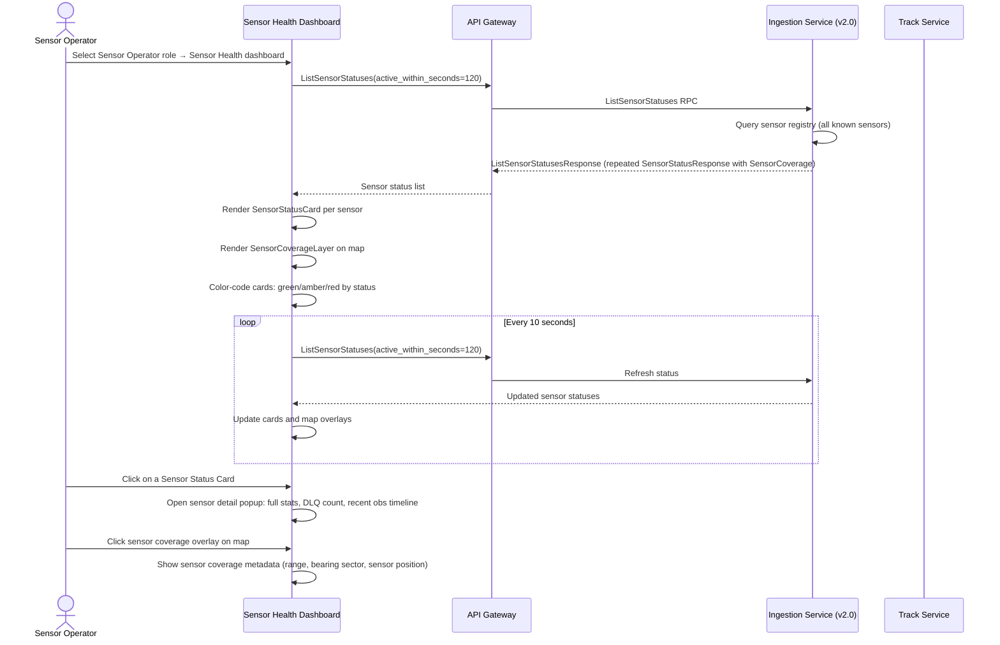

<!-- CLASSIFICATION: UNCLASSIFIED -->
# UC017 — Sensor Health Monitoring

> **Use Case ID**: UC017
> **Feature**: FEAT-19 (Sensor Health Dashboard)
> **Priority**: MUST
> **Actors**: Sensor Operator
> **Classification**: UNCLASSIFIED
> **Version**: 2.0
> **Last Updated**: 2026-02-28

---

## 1. Description

The Sensor Health Dashboard is the dedicated Level-2 dashboard for the Sensor Operator role. It provides real-time monitoring of all active sensors — displaying per-sensor status cards with connection state, observation rates, data quality scores, and a geographic coverage map showing each sensor's effective detection footprint. The dashboard enables sensor operators to identify and report degraded or offline sensors before they impact the fused track picture.

## 2. Preconditions

- Operator is authenticated with Sensor Operator role
- At least one sensor ingestion service is running and producing to `sensors.*` topics
- Ingestion Service v2.0 `ListSensorStatuses` RPC is available (returns `SensorCoverage` geometry)

## 3. Triggers

- Sensor Operator selects the **Sensor Health** dashboard (auto-selected on role login)
- Periodic auto-refresh (10-second polling interval)
- Alert notification of a degraded sensor

## 4. Main Flow

## 5. Sensor Status Card Specification

Each `SensorStatusCard` displays:

| Field | Description | Source |
|---|---|---|
| Sensor ID | Unique sensor identifier | `SensorStatusResponse.sensor_id` |
| Sensor Type | RADAR / EW_SIGINT / ELINT / ISR / AIS / CYBER | `SensorStatusResponse.sensor_type` |
| Status | CONNECTED / STALE / OFFLINE | Derived from `last_observation_time` |
| Observations/sec | Current observation throughput | `SensorStatusResponse.events_per_second` |
| Total Received | Lifetime observation count | `SensorStatusResponse.total_received` |
| Last Seen | Time since last observation (Zulu) | `SensorStatusResponse.last_observation_time` |
| Data Quality | Validation pass rate (%) | `SensorStatusResponse.validation_pass_rate` |
| DLQ Count | Observations routed to dead-letter queue | `SensorStatusResponse.dlq_count` |

**Card Colour Logic**:
- 🟢 **Green** (CONNECTED): `last_observation_time < 30s` ago
- 🟡 **Amber** (STALE): `last_observation_time` between 30s and 2 min ago
- 🔴 **Red** (OFFLINE): `last_observation_time > 2 min` ago or `connected = false`

## 6. Sensor Coverage Map

The `SensorCoverageLayer` renders each sensor's geographic footprint using the `SensorCoverage` geometry from `SensorStatusResponse`:

| Sensor Type | Coverage Rendering | Data Fields |
|---|---|---|
| Radar | Fan sector arc from sensor position | `sensor_position`, `range_nm`, `bearing_start_degrees`, `bearing_end_degrees` |
| EW/SIGINT | Circular range ring (omnidirectional) | `sensor_position`, `range_nm` |
| ELINT/COMINT | Directional arc or circular ring | `sensor_position`, `range_nm`, optional bearing |
| ISR | Coverage polygon (swath) | `coverage_polygon` (GeoJSON-style vertices) |
| AIS | Reception range circle | `sensor_position`, `range_nm` |

Coverage overlays are colour-coded to match sensor status: green/amber/red fill with 30% opacity.

## 7. Alternative Flows

### 7a. Sensor Goes Offline During Session
- Card transitions from green → amber → red as `last_observation_time` ages
- If sensor transitions to OFFLINE, a toast notification appears: `"[SENSOR-ID] OFFLINE — data gap in coverage"`
- Coverage overlay on map dims to 10% opacity to indicate inactive coverage area

### 7b. New Sensor Comes Online
- On next `ListSensorStatuses` refresh, the new sensor card appears
- Its coverage overlay is added to the map
- Log entry recorded in sensor registration audit trail

### 7c. High DLQ Rate Detected
- If `dlq_count` increases by > 100 in a 10-second window, the card shows a DLQ warning badge
- Sensor Operator can click to view a sample of the rejected observation errors

## 8. Security Considerations

- Sensor identity (sensor_id) is authenticated by the ingestion service's mTLS certificate
- Sensor position and coverage geometry are operationally sensitive — rendered only within the classification boundary
- Coverage geometry is not exported to NATO unless cleared by the Security Officer
- All sensor status queries are logged in the audit trail at INFO level

## 9. Requirements Traced

| Requirement | Description |
|---|---|
| CR-UI-009 | Two-Level RBAC shell — Sensor Operator role with Sensor Health as default view |
| CR-UI-016 | Dedicated Sensor Health Dashboard with per-sensor status cards and coverage map |
| CR-ING-012 | `GetSensorStatus` / `ListSensorStatuses` include geographic coverage geometry |
| CR-UI-004 | System displays sensor coverage and health status |
| CR-SEC-001..008 | Classification enforcement, mTLS, audit trail |
