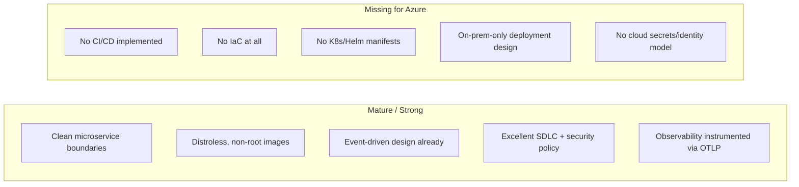

<!-- CLASSIFICATION: UNCLASSIFIED -->

# 01 — Current State & Gap Analysis

> **Parent**: [README](README.md) · **Next**: [02 Target Architecture](02-target-architecture.md)
> **Classification**: UNCLASSIFIED · **Status**: DRAFT FOR REVIEW

---

## 1. Purpose

Establish an accurate baseline of what exists in the repository today and precisely what
is missing to reach a production-ready, WAF-aligned, fully automated Azure deployment.

## 2. System Inventory (as-built)

### 2.1 Microservices (16 Go services, gRPC + Redpanda)

| Layer             | Services                                                                                                                          | Notes                                                     |
| ----------------- | --------------------------------------------------------------------------------------------------------------------------------- | --------------------------------------------------------- |
| Ingestion (6)     | `svc-radar-ingestion`, `svc-ew-ingestion`, `svc-elint-ingestion`, `svc-isr-ingestion`, `svc-ais-ingestion`, `svc-cyber-ingestion` | mTLS gRPC in, produce to Redpanda                         |
| Processing (4)    | `svc-fusion-engine`, `svc-anomaly-detection`, `svc-feedback`, `svc-training`                                                      | Kalman fusion, anomaly scoring, trust scoring, retraining |
| Presentation (3)  | `svc-track`, `svc-alert`, `svc-query`                                                                                             | gRPC streaming + query against ClickHouse                 |
| Cross-cutting (3) | `svc-audit`, `svc-nato-adapter`, `svc-coverage-analyzer`                                                                          | Immutable audit, STANAG interop, coverage                 |

- All services are **Go 1.24** modules unified by `go.work`, share `pkg/` (audit, classification, config, flatbuf, health, redpanda, telemetry, **webtransport**, interceptors, shutdown).
- Each service ships a **multi-stage, distroless** `Dockerfile` (`gcr.io/distroless/static-debian12:nonroot`, non-root, `grpc_health_probe` baked in).

### 2.2 Frontend & edge components

| Component          | Tech                                                                                    | Transport                                                                  |
| ------------------ | --------------------------------------------------------------------------------------- | -------------------------------------------------------------------------- |
| `web-cop-gpu`      | SolidJS + WebGPU + Vite → Nginx static bundle; Rust `wasm-decoder`                      | **Hot**: WebTransport (QUIC/HTTP3 datagrams); **Cold**: gRPC-Web via Envoy |
| `pkg/webtransport` | Go QUIC/HTTP3 server (128-byte FlatBuffer records @ 60 Hz, JWT auth, priority shedding) | UDP/443                                                                    |
| `wasm-transforms`  | Go→Wasm anti-poisoning validators (e.g., `alert-validator`)                             | Redpanda data transforms                                                   |
| `tools/simulator`  | Synthetic multi-sensor data generator                                                   | gRPC into ingestion                                                        |

### 2.3 Platform / infrastructure (local dev only, Docker Compose)

| Capability         | Technology               |
| ------------------ | ------------------------ |
| Event streaming    | **Redpanda** (+ Console) |
| OLAP / historical  | **ClickHouse**           |
| Stream → OLAP ETL  | **Redpanda Connect**     |
| Metrics            | Prometheus               |
| Dashboards         | Grafana                  |
| Logs               | Loki                     |
| Traces             | Tempo                    |
| Telemetry pipeline | OpenTelemetry Collector  |
| gRPC-Web gateway   | Envoy                    |

### 2.4 SDLC assets (documented, high quality)

- **CI/CD spec**: 5 security gates `SG-1..SG-5` (gitleaks, gofmt/buf, build + SBOM via syft, unit tests ≥ 80 %, gosec/semgrep/govulncheck/npm-audit/trivy + SARIF, integration). cosign signing referenced.
- **Branching**: trunk-based, Conventional Commits, squash-merge, < 400-line PRs, ≥ 1 reviewer.
- **Security/compliance**: ITSG-33, NIST 800-53 Rev 5, NATO STANAG 5516, classification headers, mTLS-everywhere, immutable audit trail.
- **Deployment guidelines**: Helm + ArgoCD (GitOps) and Docker Compose **described** as the intended method.

## 3. Maturity Assessment

**Verdict:** The **application** is Azure-ready in shape (containerized, event-driven,
stateless services, health probes, OTLP). The **platform, delivery, and operations**
layers are effectively **greenfield** for Azure.

## 4. Gap Analysis (mapped to WAF pillars)

| #      | Gap                                     | Current                        | Required for Azure                                       | WAF Pillar             |
| ------ | --------------------------------------- | ------------------------------ | -------------------------------------------------------- | ---------------------- |
| GAP-01 | **No CI/CD**                            | 2 disabled agent workflows     | GitHub Actions CI (SG-1..5) + CD to AKS                  | Operational Excellence |
| GAP-02 | **No IaC**                              | none                           | Terraform modules (network, AKS, ACR, KV, identity, obs) | Operational Excellence |
| GAP-03 | **No K8s/Helm**                         | Compose only                   | Helm charts / manifests + GitOps                         | Operational Excellence |
| GAP-04 | **Deployment design is on-prem/edge**   | K8s/K3s DC + tactical edge     | Azure landing zone + AKS topology                        | Reliability            |
| GAP-05 | **No cloud identity**                   | dev certs on disk              | Entra Workload Identity + OIDC federation                | Security               |
| GAP-06 | **No secrets management**               | env vars, sealed-secrets (doc) | Azure Key Vault + Secrets Store CSI                      | Security               |
| GAP-07 | **Registry undefined**                  | local build                    | Azure Container Registry (private, MI pull)              | Security / Ops         |
| GAP-08 | **Stateful services**                   | single-node containers         | Redpanda/ClickHouse HA strategy on Azure                 | Reliability / Cost     |
| GAP-09 | **Ingress/edge undefined**              | Envoy local                    | Mesh ingress + Front Door/App Gateway (WAF)              | Security / Perf        |
| GAP-10 | **Hot path exposure**                   | localhost QUIC                 | Standard LB UDP/443 for WebTransport                     | Performance            |
| GAP-11 | **No resiliency plane**                 | in-code timeouts only          | Mesh rate-limit / circuit-break / bulkhead               | Reliability            |
| GAP-12 | **No autoscaling**                      | fixed compose                  | KEDA (event lag) + Cluster Autoscaler + HPA              | Perf / Cost            |
| GAP-13 | **No environment model**                | single local stack             | Dev/Test/Staging/Prod (ephemeral)                        | Ops / Cost             |
| GAP-14 | **No cost governance**                  | n/a                            | Budgets, alerts, spot, scale-to-zero, TTL teardown       | Cost Optimization      |
| GAP-15 | **mTLS/PKI on Azure**                   | self-signed dev CA             | cert-manager / Key Vault issuer + mesh mTLS              | Security               |
| GAP-16 | **Observability backend**               | self-host compose              | Managed Prometheus/Grafana or self-host on AKS           | Ops                    |
| GAP-17 | **DR / backup**                         | none                           | Backups (ClickHouse/Redpanda), restore runbooks          | Reliability            |
| GAP-18 | **WebTransport service not deployable** | library in `pkg/`              | Package `pkg/webtransport` into a deployable svc         | Reliability            |

## 5. Readiness Scorecard

| Dimension                      | Score (0–5)  | Rationale                                   |
| ------------------------------ | :----------: | ------------------------------------------- |
| Application containerization   |      5       | Distroless, non-root, health probes present |
| Event-driven architecture      |      5       | Redpanda-centric already                    |
| Security policy maturity       |      5       | ITSG-33/NIST mapped, mTLS mandated          |
| CI/CD automation               |      1       | Spec only; nothing runs                     |
| Infrastructure as Code         |      0       | None                                        |
| Kubernetes packaging           |      0       | None                                        |
| Cloud identity / secrets       |      1       | Dev certs only                              |
| Observability backend on cloud |      2       | Instrumented, no cloud sink                 |
| Cost governance                |      0       | None                                        |
| **Overall Azure readiness**    | **~2.1 / 5** | Strong app, greenfield platform/ops         |

## 6. Constraints & Assumptions Carried Into the Plan

1. **No upfront licensing** → OSS (Redpanda Community/BSL, ClickHouse Apache-2) or consumption-based Azure PaaS only.
2. **Ephemeral environments** → everything must `terraform apply` up and `terraform destroy` down cleanly; no click-ops.
3. **Resiliency out of code** → rate limiting, circuit breakers, bulkheads are **platform** concerns (service mesh + Kubernetes), not app changes.
4. **Personal PAYG** → default to lean/spot/scale-to-zero; production fidelity achieved through **topology and configuration**, not permanent scale.
5. **Canadian defence domain** → default region **Canada Central** for data residency (parameterized).
6. Application code changes are minimized; the one expected addition is packaging `pkg/webtransport` into a deployable service ([GAP-18]).

> Continue to **[02 — Target Architecture »](02-target-architecture.md)**
