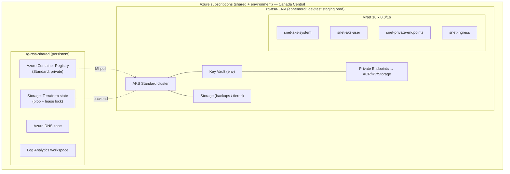
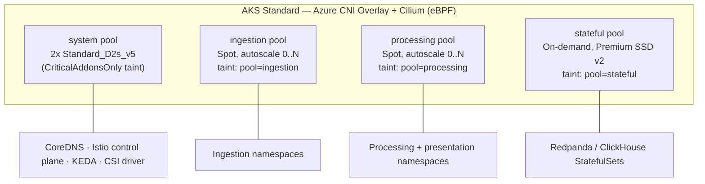
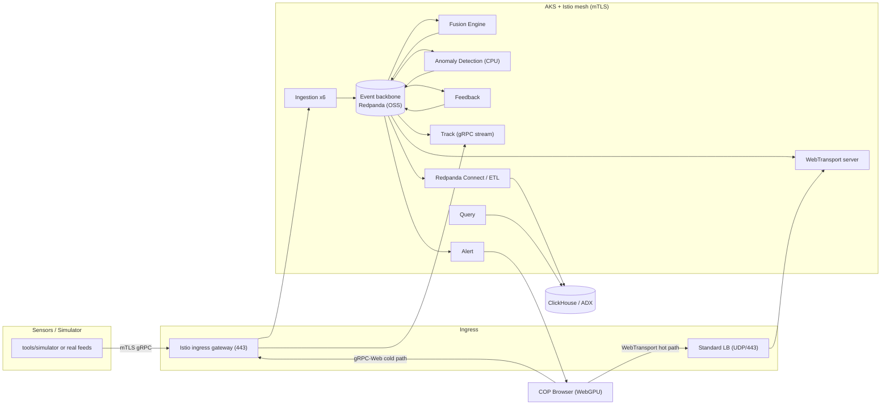
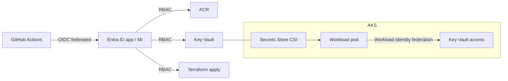
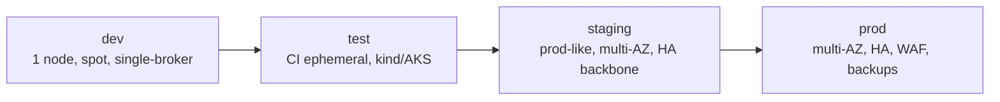

<!-- CLASSIFICATION: UNCLASSIFIED -->

# 02 — Target Azure Architecture (Baseline)

> **Parent**: [README](README.md) · **Prev**: [01 Gap Analysis](01-current-state-and-gap-analysis.md) · **Next**: [03 Technology Options](03-technology-options-and-decisions.md)
> **Classification**: UNCLASSIFIED · **Status**: DRAFT FOR REVIEW

---

## 1. Design Principles

1. **Event-driven first** — Redpanda (OSS) is the backbone; services scale on event lag (KEDA).
2. **Baseline landing zone now, enterprise hardening later** — shared subscription for common services plus a dedicated subscription per environment; hub-spoke and private cluster are additive phases.
3. **Resiliency in the platform, not the code** — service mesh + Kubernetes deliver rate limiting, circuit breaking, bulkheads, retries, and mTLS.
4. **Ephemeral & reproducible** — an environment is a Terraform target that can be stood up and torn down on demand.
5. **Least privilege by identity** — Entra Workload Identity + Key Vault; no secrets in code or images.
6. **Cost-aware fidelity** — production-grade topology; spot + scale-to-zero keep the bill low when idle.

## 2. Azure Landing Zone (Baseline)

**Resource-group strategy**

| Group                                          | Lifetime           | Contents                                                          |
| ---------------------------------------------- | ------------------ | ----------------------------------------------------------------- |
| `rg-rtsa-shared`                               | Persistent (cheap) | ACR, Terraform state storage, DNS, Log Analytics, GitHub OIDC app |
| `rg-rtsa-dev` / `-test` / `-staging` / `-prod` | **Ephemeral**      | VNet, AKS, Key Vault, workload storage, private endpoints         |

Keeping ACR/state/DNS in a small persistent group means tearing down an environment
never destroys images or state. See [08 Cost & Teardown](08-cost-model-and-teardown.md).

## 3. Cluster & Node-Pool Topology (Bulkhead by design)

Separate node pools + taints/tolerations are the **coarse bulkhead**: a storm in
ingestion cannot starve fusion or the stateful backbone. Fine-grained bulkheads (mesh
connection pools, quotas) are covered in [04 Resiliency](04-resiliency-and-well-architected.md).

**Namespace layout** (mirrors on-prem design for portability):

| Namespace            | Workloads                                               | Node pool         |
| -------------------- | ------------------------------------------------------- | ----------------- |
| `rtsa-ingestion`     | 6 ingestion services                                    | ingestion (spot)  |
| `rtsa-processing`    | fusion, anomaly, feedback, training                     | processing (spot) |
| `rtsa-presentation`  | track, alert, query, **webtransport**                   | processing (spot) |
| `rtsa-streaming`     | Redpanda (if self-hosted)                               | stateful          |
| `rtsa-storage`       | ClickHouse (if self-hosted), Redpanda Connect           | stateful          |
| `rtsa-observability` | OTel Collector (+ Prom/Grafana/Loki/Tempo if self-host) | system/processing |
| `rtsa-audit`         | audit service                                           | processing        |
| `rtsa-dmz`           | nato-adapter                                            | processing        |
| `aks-istio-system`   | Istio managed control plane                             | system            |

## 4. End-to-End Event-Driven Flow on Azure

**Scaling signal:** KEDA scales ingestion/processing pods on Redpanda **consumer-group lag**,
from **zero** up — the core of cost-efficient, event-driven elasticity.

## 5. Component Mapping — Existing → Azure

| Existing component            | Azure target (baseline)                                  | Notes                                                                                                                      |
| ----------------------------- | -------------------------------------------------------- | -------------------------------------------------------------------------------------------------------------------------- |
| Go microservice container     | AKS Deployment (spot pools)                              | HPA/KEDA scaled                                                                                                            |
| Redpanda                      | **Redpanda OSS on AKS** (all environments)               | [DL-08] single-broker dev · 3-broker RF=3 staging/prod — see [03](03-technology-options-and-decisions.md#2-event-backbone) |
| ClickHouse                    | **ClickHouse OSS on AKS** _or_ **Azure Data Explorer**   | Decision [DL-09]                                                                                                           |
| Redpanda Connect              | Deployment on AKS                                        | ETL to OLAP                                                                                                                |
| Envoy gRPC-Web                | Istio ingress gateway (or keep Envoy sidecar)            | Cold path                                                                                                                  |
| `pkg/webtransport`            | New `svc-webtransport` Deployment + UDP LB               | [GAP-18] packaging                                                                                                         |
| Prometheus/Grafana/Loki/Tempo | **Azure Managed Prometheus + Grafana** _or_ self-host    | Decision [DL-14]                                                                                                           |
| OTel Collector                | DaemonSet/Deployment on AKS                              | Unchanged                                                                                                                  |
| Dev certs                     | Key Vault + cert-manager / mesh mTLS                     | [GAP-15]                                                                                                                   |
| `docker-compose`              | Terraform + Helm + GitOps                                | [GAP-01..03]                                                                                                               |
| Frontend Nginx bundle         | AKS Deployment behind ingress _or_ Static Web Apps + CDN | see §7                                                                                                                     |

## 6. Identity, Secrets & Network Security (Baseline)

- **GitHub → Azure**: OIDC **federated credentials** (no stored cloud secrets in GitHub).
- **Pod → Azure**: **Entra Workload Identity**; secrets/certs projected via **Secrets Store CSI**.
- **Network policy**: Cilium eBPF network policies; default-deny between namespaces.
- **Private access** (additive): Private Endpoints for ACR/Key Vault/Storage; private AKS API server in the hardening phase.
- **mTLS**: Istio STRICT peer authentication mesh-wide — satisfies the "mTLS everywhere" policy without per-service TLS code.

## 7. Hot-Path / Cold-Path Hosting (critical constraint)

The frontend uses **two transports** with very different Azure networking needs.

| Path     | Protocol                                      | Backend                                               | Azure exposure                                                              | Constraint                                                                                 |
| -------- | --------------------------------------------- | ----------------------------------------------------- | --------------------------------------------------------------------------- | ------------------------------------------------------------------------------------------ |
| **Cold** | gRPC-Web over HTTP/2 (TLS)                    | `svc-track`, `svc-query`, `svc-alert` via Envoy/Istio | Istio ingress gateway, optionally behind **Front Door / App Gateway (WAF)** | Standard L7 — well supported                                                               |
| **Hot**  | **WebTransport = HTTP/3 / QUIC over UDP 443** | `svc-webtransport` (from `pkg/webtransport`)          | **Standard Load Balancer with a UDP frontend + dedicated public IP**        | Azure Front Door & App Gateway **do not proxy WebTransport**; must expose UDP/443 directly |

**Implication for design (open decision DL-12):**

- Hot path terminates QUIC **at the pod** (cert from Key Vault). It bypasses the WAF, so
  it relies on **JWT auth (already implemented)**, mesh authorization, and IP/rate controls
  at the load balancer + application-level priority shedding (already implemented).
- Cold path and static assets can sit behind **Azure Front Door** for WAF, caching, and TLS.

**Frontend static hosting options** (see [03](03-technology-options-and-decisions.md)):
Azure Static Web Apps + CDN (cheapest, simplest) **or** an Nginx Deployment on AKS behind
the ingress (keeps everything in-cluster, one origin for CSP).

## 8. Environments (event-driven, ephemeral)

| Env     | Fidelity  | Backbone                                 | OLAP                    | Nodes                         | Lives        |
| ------- | --------- | ---------------------------------------- | ----------------------- | ----------------------------- | ------------ |
| dev     | low       | Redpanda 1 broker (spot, ephemeral disk) | ClickHouse 1 node       | 1–2 spot                      | on demand    |
| test    | CI        | Redpanda 1 broker (ephemeral)            | ephemeral               | spot                          | per pipeline |
| staging | prod-like | Redpanda 3-broker RF=3                   | ClickHouse 2-shard      | multi-AZ                      | on demand    |
| prod    | full HA   | Redpanda 3-broker RF=3                   | ClickHouse 3-shard RF=2 | multi-AZ + on-demand stateful | on demand    |

All environments are created and destroyed by the **same** parameterized Terraform, with
per-environment `tfvars`. See [06 IaC & Lifecycle](06-iac-terraform-and-lifecycle.md).

## 9. Deferred / Additive (not in baseline)

| Item                               | Phase     | Rationale                                          |
| ---------------------------------- | --------- | -------------------------------------------------- |
| GPU node pool for anomaly/training | Later     | Cost on PAYG; CPU/stub in baseline                 |
| Private AKS API server + hub-spoke | Hardening | Baseline uses public API with authorized IP ranges |
| Azure Front Door + WAF             | Hardening | Cold path first works via ingress gateway          |
| Azure Arc bridge to tactical edge  | Future    | Reuses on-prem/edge design already documented      |
| Multi-region DR                    | Future    | Single-region baseline first                       |

> Continue to **[03 — Technology Options & Decisions »](03-technology-options-and-decisions.md)**
