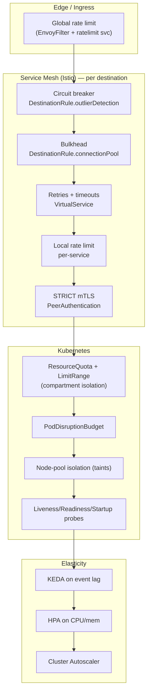

<!-- CLASSIFICATION: UNCLASSIFIED -->

# 04 — Resiliency & Azure Well-Architected

> **Parent**: [README](README.md) · **Prev**: [03 Technology Options](03-technology-options-and-decisions.md) · **Next**: [05 DevOps & CI/CD](05-devops-cicd-and-environments.md)
> **Classification**: UNCLASSIFIED · **Status**: DRAFT FOR REVIEW

---

## 1. Principle: Resiliency Lives in the Platform

Per your requirement, **rate limiting, circuit breaking, and bulkheads are implemented as
infrastructure and configuration — not application code**. The service mesh (Istio) and
Kubernetes provide these as declarative policy objects that ship in the Helm charts and
GitOps repo. Application binaries are unchanged.



---

## 2. Rate Limiting (infrastructure)

**Where:** Istio ingress gateway (north-south) and per-service (east-west).

- **Global rate limiting** at the ingress protects the whole system from floods (e.g., a
  misbehaving sensor or a burst on the cold-path API). Implemented via Istio `EnvoyFilter`
  wired to a small `ratelimit` service backed by Redis.
- **Local rate limiting** caps requests per service instance without a backend, ideal for
  cheap per-route protection.

```yaml
# CLASSIFICATION: UNCLASSIFIED
# infra/mesh/ratelimit-query.yaml — local rate limit example (config, not code)
apiVersion: networking.istio.io/v1alpha3
kind: EnvoyFilter
metadata:
  name: rl-svc-query
  namespace: rtsa-presentation
spec:
  workloadSelector:
    labels: { app: svc-query }
  configPatches:
    - applyTo: HTTP_FILTER
      match: { context: SIDECAR_INBOUND }
      patch:
        operation: INSERT_BEFORE
        value:
          name: envoy.filters.http.local_ratelimit
          typed_config:
            "@type": type.googleapis.com/udpa.type.v1.TypedStruct
            type_url: type.googleapis.com/envoy.extensions.filters.http.local_ratelimit.v3.LocalRateLimit
            value:
              stat_prefix: rtsa_query_rl
              token_bucket:
                { max_tokens: 200, tokens_per_fill: 200, fill_interval: 1s }
              filter_enabled:
                { default_value: { numerator: 100, denominator: HUNDRED } }
              filter_enforced:
                { default_value: { numerator: 100, denominator: HUNDRED } }
```

> The **WebTransport hot path** cannot use HTTP rate limits (it is QUIC datagrams). It relies
> on: JWT auth (implemented), **connection-count limits at the Standard LB**, and the
> **priority-shedding** already built into `pkg/webtransport`. Azure Front Door WAF rate
> rules apply only to the cold path/static content.

---

## 3. Circuit Breakers (infrastructure)

**Where:** Istio `DestinationRule.outlierDetection` — ejects unhealthy endpoints and trips
open when a dependency degrades, without any code change.

```yaml
# CLASSIFICATION: UNCLASSIFIED
# infra/mesh/circuit-breaker-fusion.yaml
apiVersion: networking.istio.io/v1beta1
kind: DestinationRule
metadata:
  name: cb-svc-fusion-engine
  namespace: rtsa-processing
spec:
  host: svc-fusion-engine.rtsa-processing.svc.cluster.local
  trafficPolicy:
    outlierDetection: # <-- circuit breaker
      consecutive5xxErrors: 5
      interval: 5s
      baseEjectionTime: 30s
      maxEjectionPercent: 50
    connectionPool: # <-- bulkhead (see §4)
      tcp: { maxConnections: 100 }
      http: { http2MaxRequests: 1000, maxRequestsPerConnection: 100 }
```

---

## 4. Bulkheads (infrastructure) — three layers

| Layer          | Mechanism                                                                                     | Effect                                               |
| -------------- | --------------------------------------------------------------------------------------------- | ---------------------------------------------------- |
| **Node**       | Separate spot node pools per tier (ingestion / processing / stateful) with taints/tolerations | A resource storm in one tier cannot starve another   |
| **Namespace**  | `ResourceQuota` + `LimitRange` per namespace                                                  | Caps aggregate CPU/mem per compartment               |
| **Connection** | Istio `connectionPool` per destination                                                        | Isolates connection/queue exhaustion between callers |

```yaml
# CLASSIFICATION: UNCLASSIFIED
# infra/k8s/quota-ingestion.yaml — namespace bulkhead
apiVersion: v1
kind: ResourceQuota
metadata: { name: rq-ingestion, namespace: rtsa-ingestion }
spec:
  hard:
    requests.cpu: "4"
    requests.memory: 8Gi
    limits.cpu: "8"
    limits.memory: 16Gi
    pods: "40"
```

---

## 5. Retries, Timeouts & Backpressure

- **Retries/timeouts**: Istio `VirtualService` (`retries.attempts`, `perTryTimeout`,
  `timeout`) — declarative, per route.
- **Backpressure**: the event-driven design is inherently buffered. Redpanda
  absorbs bursts; **KEDA** scales consumers on lag so producers are never blocked. The
  WebTransport server sheds low-priority records under load (already implemented).

```yaml
# CLASSIFICATION: UNCLASSIFIED
# infra/keda/scaledobject-fusion.yaml — scale on Kafka/Redpanda consumer lag
apiVersion: keda.sh/v1alpha1
kind: ScaledObject
metadata: { name: so-fusion, namespace: rtsa-processing }
spec:
  scaleTargetRef: { name: svc-fusion-engine }
  minReplicaCount: 0 # scale to zero when idle (cost)
  maxReplicaCount: 10
  triggers:
    - type: kafka
      metadata:
        bootstrapServers: redpanda.rtsa-streaming:9092
        consumerGroup: fusion-engine
        topic: sensors.radar
        lagThreshold: "1000"
```

---

## 6. Availability & Health

- **PodDisruptionBudgets** for every Deployment/StatefulSet (min-available during upgrades/spot evictions).
- **Multi-AZ** node pools in staging/prod (`--zones 1 2 3`).
- **Spot-eviction resilience**: stateful services on **on-demand** nodes; stateless on spot with PDBs + surge.
- **Probes**: reuse the baked-in `grpc_health_probe`; add readiness gates so mesh only routes to ready pods.
- **StatefulSet HA**: Redpanda RF=3, ClickHouse replicas per shard (staging/prod).

---

## 7. WAF Five-Pillar Mapping

### 7.1 Reliability

| Practice             | Implementation                                                                                            |
| -------------------- | --------------------------------------------------------------------------------------------------------- |
| Redundancy           | Multi-AZ pools, RF=3 backbone, replicated OLAP                                                            |
| Self-healing         | Circuit breakers, outlier ejection, KEDA, PDBs                                                            |
| Backups/DR           | ClickHouse backups → Blob; Redpanda tiered storage; restore runbooks ([07](07-implementation-roadmap.md)) |
| Graceful degradation | Priority shedding (hot path), retries/timeouts                                                            |

### 7.2 Security

| Practice     | Implementation                                                         |
| ------------ | ---------------------------------------------------------------------- |
| Identity     | Entra Workload Identity; GitHub OIDC federation                        |
| Secrets      | Key Vault + Secrets Store CSI; no secrets in code/images               |
| Network      | Cilium default-deny NetworkPolicies; private endpoints (hardening)     |
| In-transit   | Istio STRICT mTLS mesh-wide; TLS 1.3 at edge                           |
| Supply chain | Distroless, cosign signing, trivy scan, SBOM (existing SG-2/SG-4)      |
| Compliance   | ITSG-33/NIST controls preserved; classification headers enforced in CI |

### 7.3 Cost Optimization

| Practice       | Implementation                                                                |
| -------------- | ----------------------------------------------------------------------------- |
| Spot compute   | Ingestion/processing on spot pools                                            |
| Scale-to-zero  | KEDA `minReplicaCount: 0`; Cluster Autoscaler shrinks pools                   |
| Ephemeral envs | `terraform destroy` between test cycles ([08](08-cost-model-and-teardown.md)) |
| Right-sizing   | Requests/limits tuned from the on-prem resource matrix                        |
| Governance     | Azure Budgets + alerts; TTL tags + auto-teardown                              |

### 7.4 Operational Excellence

| Practice      | Implementation                                              |
| ------------- | ----------------------------------------------------------- |
| IaC           | Terraform modules, remote state, PR-reviewed                |
| CI/CD         | GitHub Actions SG-1..SG-5 + CD; reusable workflows          |
| GitOps        | Flux/Helm; declarative, drift-corrected                     |
| Observability | OTel → Prometheus/Grafana/Loki/Tempo (self-host or managed) |
| Runbooks      | Deploy, rollback, restore, teardown                         |

### 7.5 Performance Efficiency

| Practice         | Implementation                               |
| ---------------- | -------------------------------------------- |
| Data plane       | Azure CNI Overlay + **Cilium eBPF**          |
| Event elasticity | KEDA on lag; HPA on CPU                      |
| Hot path         | WebTransport QUIC preserved (< 16 ms target) |
| Placement        | Node-pool affinity per workload class        |

---

## 8. Resiliency Test Strategy (validate the config)

| Scenario                        | Tool                              | Expected behavior                                       |
| ------------------------------- | --------------------------------- | ------------------------------------------------------- |
| Kill fusion pods under load     | `kubectl delete pod` / chaos-mesh | KEDA replaces; circuit breaker isolates; no cascade     |
| Spot eviction of ingestion node | simulate eviction                 | PDB holds min-available; pods reschedule                |
| Backbone burst (10x)            | simulator flood                   | Lag rises, KEDA scales 0→N, no producer block           |
| Dependency brownout             | inject latency (mesh fault)       | Timeouts + retries + breaker trip; graceful degradation |
| Rate-limit breach               | load test cold path               | 429s returned at configured threshold; system stable    |

Chaos and load tests run in the **staging** environment as an optional CD stage
([05 DevOps](05-devops-cicd-and-environments.md)).

> Continue to **[05 — DevOps, CI/CD & Environments »](05-devops-cicd-and-environments.md)**
