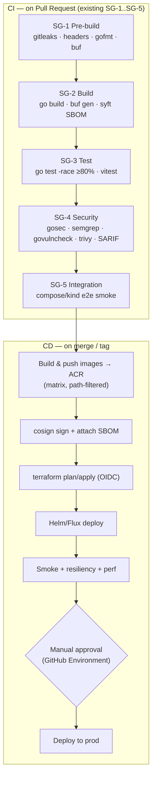
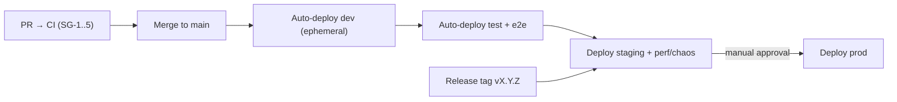
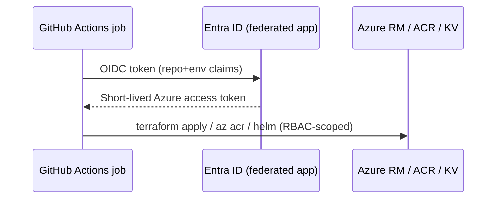

<!-- CLASSIFICATION: UNCLASSIFIED -->

# 05 — DevOps, CI/CD & Environments

> **Parent**: [README](README.md) · **Prev**: [04 Resiliency & WAF](04-resiliency-and-well-architected.md) · **Next**: [06 IaC & Lifecycle](06-iac-terraform-and-lifecycle.md)
> **Classification**: UNCLASSIFIED · **Status**: DRAFT FOR REVIEW
> **Builds on**: `docs/sdlc_guidelines/06_integration_cicd/ci_cd_pipeline.md` (SG-1..SG-5)

---

## 1. Objectives

- Automate the **full SDLC**: Development → Testing → Staging → Production.
- Reuse the **existing 5 security gates** (SG-1..SG-5) verbatim; add Azure **CD**.
- **Zero long-lived cloud secrets** in GitHub (OIDC federation).
- **Reusable** across services and portable to an enterprise org (composite / `workflow_call`).
- Fit **ephemeral** environments: pipelines can create and destroy infrastructure.

For click-by-click execution steps (GitHub Environment setup, `infra-up` output mapping,
manual pre-CI validation, and first `main` push behavior), use
[09 — Operator Runbook](09-operator-runbook-manual-validation.md).

For environment-isolated subscription design (dev/test/staging/prod in separate
subscriptions), see [11 — Multi-Subscription Analysis](11-multi-subscription-analysis.md)
and [12 — Multi-Subscription Migration Plan](12-multi-subscription-migration-plan.md).

## 2. Pipeline Topology



## 3. Environments & Promotion

GitHub **Environments** (`dev`, `test`, `staging`, `prod`) hold protection rules and
per-environment variables (region, sizing, backbone selection, subscription id).
The shared build subscription stays separate from the per-environment deploy
subscriptions. Promotion is by **image digest** — the exact artifact validated in
staging is what ships to prod.



| Environment | Trigger              | Infra lifecycle                | Gates before             |
| ----------- | -------------------- | ------------------------------ | ------------------------ |
| dev         | merge to `main`      | ephemeral, spot, scale-to-zero | SG-1..SG-4               |
| test        | after dev green      | ephemeral per pipeline         | SG-5 e2e                 |
| staging     | release tag / manual | prod-like, on demand           | perf + chaos             |
| prod        | manual approval      | on demand, HA                  | approval + change record |

## 4. GitOps / Promotion

Per [DL-15](03-technology-options-and-decisions.md#9-gitops--delivery-engine):

- **Start** with **pipeline-driven `helm upgrade`** from GitHub Actions for the walking skeleton (fastest to first deploy).
- **Adopt Flux** once ≥ 2 environments exist: a `deploy/` GitOps repo (or folder) holds
  `HelmRelease` + values per environment; Flux reconciles and self-heals drift.
- Image updates flow by digest; Flux image-automation (optional) can bump non-prod automatically while prod stays PR-gated.

## 5. Secure Cloud Access (OIDC federation)



- One **federated credential per environment** (subject = `repo:org/repo:environment:prod`).
- RBAC scoped per environment resource group (least privilege).
- **No** `AZURE_CREDENTIALS` secret, no PATs for cloud.

## 6. Repository Workflow Structure (reusable)

```
.github/workflows/
├── ci.yml                 # PR: SG-1..SG-5 (calls reusable jobs)
├── cd-build.yml           # push/tag: build+sign+scan+push to ACR (matrix)
├── cd-deploy.yml          # deploy to an environment (workflow_call: env input)
├── infra-up.yml           # workflow_dispatch: terraform apply an environment
├── infra-down.yml         # workflow_dispatch/schedule: terraform destroy (teardown)
└── _reusable/
    ├── go-build-test.yml  # workflow_call: build+test a service
    ├── container.yml      # workflow_call: buildx+cosign+trivy+push
    └── deploy-helm.yml    # workflow_call: helm upgrade / flux sync
```

- **Matrix + path filters**: only changed services rebuild (`dorny/paths-filter`), keeping the PR pipeline within the < 15 min target.
- **Reusable workflows** (`workflow_call`) make the pipeline portable to other repos/enterprise orgs by passing inputs (registry, env, region).

### 6.1 Reference: CD build job (illustrative)

```yaml
# CLASSIFICATION: UNCLASSIFIED
# .github/workflows/cd-build.yml (excerpt)
name: CD Build
on:
  push: { branches: [main] }
  workflow_dispatch: {}
permissions: { id-token: write, contents: read, packages: read }
jobs:
  images:
    strategy:
      matrix: { service: [svc-radar-ingestion, svc-fusion-engine, svc-track, svc-webtransport, web-cop-gpu] }
    runs-on: ubuntu-latest
    steps:
      - uses: actions/checkout@v4
      - uses: azure/login@v2                      # OIDC, no secrets
        with: { client-id: ${{ vars.AZURE_CLIENT_ID }}, tenant-id: ${{ vars.AZURE_TENANT_ID }}, subscription-id: ${{ vars.AZURE_SUBSCRIPTION_ID }} }
      - run: az acr login -n ${{ vars.ACR_NAME }}
      - uses: docker/build-push-action@v6
        with: { context: ., file: ${{ matrix.service }}/Dockerfile, push: true, tags: ${{ vars.ACR_NAME }}.azurecr.io/${{ matrix.service }}:${{ github.sha }} }
      - run: cosign sign --yes ${{ vars.ACR_NAME }}.azurecr.io/${{ matrix.service }}:${{ github.sha }}
      - run: trivy image --exit-code 1 --severity CRITICAL,HIGH ${{ vars.ACR_NAME }}.azurecr.io/${{ matrix.service }}:${{ github.sha }}
```

## 7. Environment Lifecycle Automation (ephemeral)

Spin-up / tear-down are **first-class pipelines** and Make targets (see [06 IaC](06-iac-terraform-and-lifecycle.md)):

| Action                     | Trigger                                                 | Effect                                                               |
| -------------------------- | ------------------------------------------------------- | -------------------------------------------------------------------- |
| `infra-up.yml` (env=dev)   | manual dispatch                                         | `terraform apply`, then block on infrastructure and AKS verification |
| `infra-down.yml` (env=dev) | manual **or nightly schedule**                          | `terraform destroy`; images/state survive in `rg-rtsa-shared`        |
| Ad-hoc                     | `make env-up ENV=staging` / `make env-down ENV=staging` | same Terraform locally                                               |

After local `env-up`, run `scripts/azure/verify-infrastructure-deployment.sh --env <env>`.
Application deployment remains a separate Helm/CD operation; the reusable Helm workflow
blocks promotion unless `scripts/azure/verify-workload-deployment.sh` passes.

A **nightly scheduled teardown** of non-prod is the single biggest PAYG cost saver
([08 Cost & Teardown](08-cost-model-and-teardown.md)).

## 8. Quality Gates → Environment Mapping

| Gate                    | dev  | test |     staging     |      prod       |
| ----------------------- | :--: | :--: | :-------------: | :-------------: |
| SG-1..SG-4 (PR)         |  ✓   |  ✓   |        ✓        |        ✓        |
| SG-5 integration        |  —   |  ✓   |        ✓        |        ✓        |
| Image signed + scanned  |  ✓   |  ✓   |        ✓        |        ✓        |
| Terraform plan reviewed | auto | auto | **PR-approved** | **PR-approved** |
| Perf + chaos            |  —   |  —   |        ✓        |        —        |
| Manual approval         |  —   |  —   |        —        |        ✓        |
| Change record           |  —   |  —   |        —        |        ✓        |

## 9. Rollback & Safety

- **Immutable image digests** + Helm revision history → `helm rollback` / Flux revert.
- **Blue-green or canary** via Istio traffic weights for presentation services (additive).
- **Terraform state** is authoritative; `plan` gates prevent drift; destroy is explicit and env-scoped.
- **Break-glass**: documented manual `az`/`kubectl` runbook, audited, for emergencies only.

> Continue to **[06 — IaC (Terraform) & Lifecycle »](06-iac-terraform-and-lifecycle.md)**
