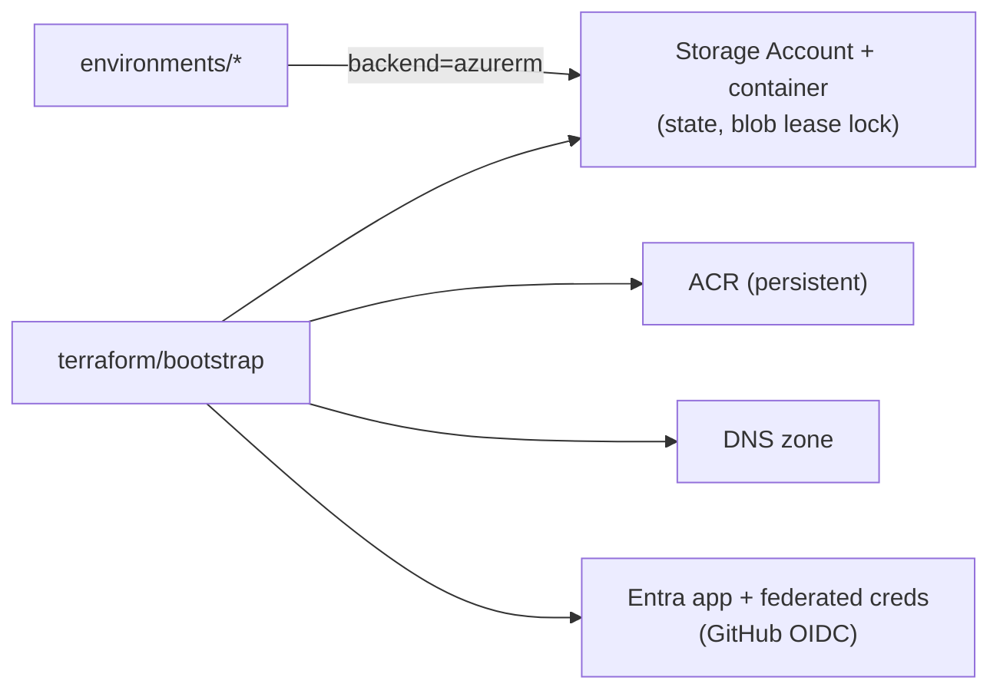

<!-- CLASSIFICATION: UNCLASSIFIED -->

# 06 — Infrastructure as Code (Terraform) & Lifecycle

> **Parent**: [README](README.md) · **Prev**: [05 DevOps & CI/CD](05-devops-cicd-and-environments.md) · **Next**: [07 Roadmap](07-implementation-roadmap.md)
> **Classification**: UNCLASSIFIED · **Status**: DRAFT FOR REVIEW

---

## 1. Goals

- **One codebase, many environments** — the same modules build dev/test/staging/prod from `tfvars`.
- **Ephemeral by design** — `apply` to stand up, `destroy` to tear down, cleanly and repeatably.
- **Enterprise-reusable** — modular, parameterized, no hardcoded names; CAF-aligned naming/tagging.
- **Safe state** — remote state in Azure Storage with locking; images/state never destroyed with an environment.

## 2. Repository Layout

```
infra/terraform/
├── bootstrap/                 # one-time: state storage, ACR, DNS, OIDC app (rg-rtsa-shared)
│   ├── main.tf  outputs.tf  variables.tf
├── modules/
│   ├── network/              # VNet, subnets, NSGs, (optional) private DNS
│   ├── aks/                  # cluster, node pools (system/ingestion/processing/stateful), Istio add-on, KEDA, Workload Identity
│   ├── acr-access/           # role assignments for AKS→ACR pull
│   ├── keyvault/             # Key Vault + access policies/RBAC + CSI wiring
│   ├── identity/             # user-assigned MIs, federated credentials (GitHub + workloads)
│   ├── observability/        # Log Analytics, Managed Prometheus/Grafana (prod) toggle
│   ├── storage/              # blob for backups / Redpanda tiered storage
│   └── dns-tls/              # DNS records, cert-manager/Key Vault issuer
├── environments/
│   ├── dev/      { backend.tf  main.tf  dev.tfvars }
│   ├── test/     { ... }
│   ├── staging/  { ... }
│   └── prod/     { ... }
└── README.md
```

> Kubernetes **workloads** (Deployments, StatefulSets, mesh policy, KEDA objects) live in
> **Helm charts** under `deploy/charts/` (as already specified in the SDLC deployment
> guidelines) and are applied by CD/GitOps — Terraform provisions the **platform**, Helm/Flux
> provisions the **workloads**. This separation keeps state small and teardown fast.

## 3. Remote State & Bootstrap



- **Bootstrap once** into `rg-rtsa-shared`; it is long-lived and cheap.
- Each environment uses an **azurerm backend** with a distinct state key
  (`rtsa/{env}.tfstate`) and **blob-lease locking** (no separate lock table needed).
- Environment isolation via **separate state files** (preferred over workspaces for clarity
  and enterprise reuse).

## 4. Naming & Tagging (CAF-aligned)

| Resource       | Pattern                  | Example             |
| -------------- | ------------------------ | ------------------- |
| Resource group | `rg-rtsa-{env}`          | `rg-rtsa-staging`   |
| AKS            | `aks-rtsa-{env}`         | `aks-rtsa-staging`  |
| ACR (shared)   | `acrrtsa{suffix}`        | `acrrtsa7f3a`       |
| Key Vault      | `kv-rtsa-{env}-{suffix}` | `kv-rtsa-prod-7f3a` |
| VNet           | `vnet-rtsa-{env}`        | `vnet-rtsa-dev`     |

**Mandatory tags** (drive cost governance + auto-teardown):

```hcl
# CLASSIFICATION: UNCLASSIFIED
locals {
  common_tags = {
    project      = "rtsa"
    environment  = var.environment
    managed_by   = "terraform"
    cost_center  = "personal-payg"
    ttl_hours    = var.ttl_hours       # e.g. 12 → nightly teardown targets this
    owner        = var.owner
    classification = "UNCLASSIFIED"
  }
}
```

## 5. Environment Parameterization (example `dev.tfvars`)

```hcl
# CLASSIFICATION: UNCLASSIFIED
environment       = "dev"
location          = "canadacentral"
ttl_hours         = 12

# Cluster
aks_kubernetes_version = "1.30"
system_node_size       = "Standard_D2s_v5"
system_node_count      = 2
user_pools = {
  ingestion  = { vm_size = "Standard_D4s_v5", spot = true,  min = 0, max = 4 }
  processing = { vm_size = "Standard_D4s_v5", spot = true,  min = 0, max = 4 }
  stateful   = { vm_size = "Standard_D4s_v5", spot = false, min = 0, max = 3 }
}

# Backbone / OLAP selection (per DL-08 / DL-09)
event_backbone = "redpanda"      # DL-08: Redpanda OSS in ALL environments (single-broker dev)
olap           = "clickhouse"    # self-host OSS

# Observability (per DL-14)
managed_prometheus = false       # self-host in dev; true in staging/prod
```

`staging.tfvars` / `prod.tfvars` flip to multi-AZ, on-demand stateful, `redpanda`,
`managed_prometheus = true`, higher min replicas, and `ttl_hours = 0` (no auto-teardown for prod).

## 6. Lifecycle: Spin-Up / Tear-Down

```mermaid
flowchart LR
    UP["make env-up ENV=dev"] --> APPLY["terraform apply -var-file=dev.tfvars"]
    APPLY --> PLAT["Platform ready (AKS, KV, mesh, KEDA)"]
    PLAT --> WL["helm/flux deploy walking skeleton"]
    WL --> TEST["run smoke/e2e"]
    TEST --> DOWN["make env-down ENV=dev"]
    DOWN --> DESTROY["terraform destroy -var-file=dev.tfvars"]
    DESTROY --> KEEP["rg-rtsa-shared (ACR/state/DNS) preserved"]
```



**Makefile targets** (added to the root `Makefile`):

```makefile
# CLASSIFICATION: UNCLASSIFIED
ENV ?= dev
TF  = terraform -chdir=infra/terraform/environments/$(ENV)

env-init:  ; $(TF) init
env-plan:  ; $(TF) plan  -var-file=$(ENV).tfvars
env-up:    ; $(TF) apply -var-file=$(ENV).tfvars -auto-approve && ./scripts/azure/deploy-workloads.sh $(ENV)
env-down:  ; $(TF) destroy -var-file=$(ENV).tfvars -auto-approve
env-nuke:  ; ./scripts/azure/nuke-orphans.sh $(ENV)   # safety sweep for leaked resources
```

- `scripts/azure/deploy-workloads.sh` runs `helm upgrade --install` (or `flux reconcile`) for the environment.
- `scripts/azure/nuke-orphans.sh` deletes any resource tagged `project=rtsa,environment=$ENV` as a safety net so **teardown never leaks cost**.
- The same targets are wrapped by `infra-up.yml` / `infra-down.yml` in CI ([05](05-devops-cicd-and-environments.md#7-environment-lifecycle-automation-ephemeral)).

## 7. What Each Module Provisions

| Module          | Key resources                                                                         | WAF pillar           |
| --------------- | ------------------------------------------------------------------------------------- | -------------------- |
| `network`       | VNet, subnets, NSGs, route tables                                                     | Security/Reliability |
| `aks`           | Cluster, 4 node pools, Istio add-on, KEDA, Workload Identity, OIDC issuer, autoscaler | All                  |
| `identity`      | User-assigned MIs, GitHub + workload federated credentials                            | Security             |
| `keyvault`      | Key Vault, RBAC, CSI provider config                                                  | Security             |
| `acr-access`    | AcrPull role for kubelet MI                                                           | Security             |
| `observability` | Log Analytics; Managed Prometheus/Grafana (prod toggle)                               | Ops                  |
| `storage`       | Blob containers (backups, Redpanda tiered storage)                                    | Reliability          |
| `dns-tls`       | DNS records, cert issuer                                                              | Security             |

> The event backbone (**Redpanda OSS**, DL-08) is deployed as an **in-cluster Helm workload**
> (see [P2 walking skeleton](07-implementation-roadmap.md)) — not a Terraform module.

## 8. Guardrails

- **Provider pinning** + `required_version`; renovate/dependabot for module bumps.
- **`terraform plan` in CI** on every PR touching `infra/`; **apply** only via OIDC pipelines or approved local runs.
- **Budgets + alerts** provisioned by Terraform ([08](08-cost-model-and-teardown.md)).
- **No secrets in state where avoidable**; sensitive outputs marked `sensitive = true`; state storage private + encrypted.
- **`prevent_destroy`** on the shared ACR/state/DNS; **explicitly destroyable** on all environment resources.

> Continue to **[07 — Implementation Roadmap »](07-implementation-roadmap.md)**
