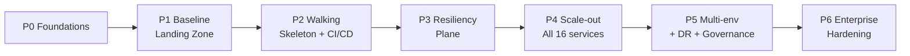

<!-- CLASSIFICATION: UNCLASSIFIED -->

# 07 — Implementation Roadmap

> **Parent**: [README](README.md) · **Prev**: [06 IaC & Lifecycle](06-iac-terraform-and-lifecycle.md) · **Next**: [08 Cost & Teardown](08-cost-model-and-teardown.md)
> **Classification**: UNCLASSIFIED · **Status**: DRAFT FOR REVIEW

---

## 1. Strategy

Deliver a **thin vertical slice (walking skeleton)** end-to-end first — proving the entire
DevOps loop and Azure baseline cheaply — then **scale out** services and **harden** for
enterprise. Phases are sequenced by dependency, not calendar (time is not the constraint;
correctness and cost are). Each phase has explicit **exit criteria**.

## 2. Phase Detail

### P0 — Foundations (prerequisite)

**Deliverables**

- Decisions confirmed ✅ in [03](03-technology-options-and-decisions.md#11-consolidated-decision-summary) (DL-08 = Redpanda OSS everywhere).
- Azure subscription prep; `rg-rtsa-shared`; Terraform **bootstrap** (state storage, ACR, DNS).
- Entra app + **GitHub OIDC** federated credentials; RBAC scoping.
- Repo scaffolding: `infra/terraform/`, `deploy/charts/`, `.github/workflows/` skeletons.

**Exit criteria**: `terraform -chdir=infra/terraform/bootstrap apply` succeeds; GitHub Actions can `az login` via OIDC with no stored secrets; ACR reachable.

---

### P1 — Baseline Landing Zone

**Deliverables**

- `network`, `aks` (system + user + stateful pools, **Istio add-on**, **KEDA**, Workload Identity), `keyvault`, `identity`, `acr-access`, `storage` modules.
- Cilium network policies (default-deny); STRICT mTLS mesh; Secrets Store CSI wired to Key Vault.
- `dev.tfvars`; `make env-up ENV=dev` provisions a working empty platform.

**Exit criteria**: `kubectl get nodes` shows healthy multi-pool cluster; a sample pod obtains a Key Vault secret via CSI + Workload Identity; mesh mTLS verified; `make env-down ENV=dev` destroys cleanly leaving shared RG intact.

---

### P2 — Walking Skeleton + CI/CD ⭐ (first end-to-end)

**Scope (vertical slice):** `svc-radar-ingestion` → backbone → `svc-fusion-engine` → `svc-track` → `svc-webtransport` → `web-cop-gpu`, plus single-node backbone + ClickHouse + OTel + `svc-query`.

**Deliverables**

- Package `pkg/webtransport` into a deployable **`svc-webtransport`** ([GAP-18]) — the only expected code addition.
- Helm charts for the slice; backbone = Redpanda OSS (single-broker dev); ClickHouse single-node.
- **CI** (SG-1..SG-5) green on PRs; **CD** builds/signs/scans images → ACR; deploys slice via Helm.
- Cold path (gRPC-Web via Istio gateway) + hot path (WebTransport via Standard LB UDP/443) both serving the COP.
- `tools/simulator` feeds synthetic tracks end-to-end.

**Exit criteria**: an operator loads the COP in a browser and sees live tracks over **both** transports in the `dev` environment, produced entirely by the automated pipeline from a Git commit. Tear-down/rebuild reproduces it identically.

---

### P3 — Resiliency Plane (config, not code)

**Deliverables**

- Istio `DestinationRule` circuit breakers + connection-pool bulkheads for slice services.
- Ingress + per-service **rate limiting**; `VirtualService` retries/timeouts.
- **KEDA** ScaledObjects (scale-to-zero on lag); HPAs; PDBs; ResourceQuotas per namespace.
- Chaos + load test suite ([04 §8](04-resiliency-and-well-architected.md#8-resiliency-test-strategy-validate-the-config)).

**Exit criteria**: chaos/load scenarios pass — pod kills, spot eviction, 10× burst, brownout, and rate-limit breach all degrade gracefully with **no cascading failure**; KEDA scales 0→N→0.

---

### P4 — Scale-Out to All 16 Services

**Deliverables**

- Helm charts + CI/CD matrix for remaining ingestion (ew, elint, isr, ais, cyber), processing (anomaly **CPU/stub**, feedback, training-stub), presentation (alert), cross-cutting (audit, nato-adapter, coverage-analyzer).
- `wasm-transforms` anti-poisoning deployed on the backbone (drives Redpanda selection where trust-validation matters).
- Redpanda Connect ETL → ClickHouse; full observability dashboards imported.

**Exit criteria**: all 16 services healthy in `dev`; audit trail flowing; end-to-end multi-sensor fusion visible in COP; coverage ≥ 80% maintained in CI.

---

### P5 — Multi-Environment + DR + Governance

**Deliverables**

- `staging` (prod-like: **Redpanda** 3-broker RF=3, ClickHouse sharded+replicated, multi-AZ, **Managed Prometheus/Grafana**) and `prod` env definitions.
- Promotion by digest with **manual approval** to prod; perf/chaos gate before staging→prod.
- Backups (ClickHouse → Blob; Redpanda tiered storage); documented **restore runbooks**.
- **Flux** GitOps adopted across environments; Azure Budgets + alerts + nightly non-prod teardown.

**Exit criteria**: a tagged release promotes dev→test→staging→prod through gates; a restore drill succeeds; non-prod auto-tears-down nightly; budget alerts fire correctly.

---

### P6 — Enterprise Hardening (additive)

**Deliverables**

- Private AKS API server + authorized ranges; Private Endpoints for ACR/KV/Storage; hub-spoke option.
- **Azure Front Door + WAF** fronting cold path + static assets; Defender for Containers; Azure Policy / policy-as-code (Gatekeeper).
- Optional: AKS **Automatic** profile for turnkey enterprise clusters; GPU node pool module for anomaly/training; Azure Arc bridge to tactical edge.

**Exit criteria**: cluster passes an Azure security/compliance review (azqr/Defender); WAF and private networking validated; enterprise reuse demonstrated by standing up a second, differently-named environment from the same modules.

---

## 3. Dependency Matrix

| Phase | Depends on | Blocks |
| ----- | ---------- | ------ |
| P0    | —          | P1     |
| P1    | P0         | P2     |
| P2    | P1         | P3, P4 |
| P3    | P2         | P5     |
| P4    | P2         | P5     |
| P5    | P3, P4     | P6     |
| P6    | P5         | —      |

## 4. Milestones & Demoable Outcomes

| Milestone   | Demoable outcome                                                                        |
| ----------- | --------------------------------------------------------------------------------------- |
| M1 (end P1) | `make env-up`/`env-down` stands up & destroys a full AKS baseline with mesh + Key Vault |
| M2 (end P2) | Live COP from a Git commit via automated pipeline (both transports)                     |
| M3 (end P3) | Chaos/load suite green; scale-to-zero proven                                            |
| M4 (end P4) | All 16 services + audit + fusion visible                                                |
| M5 (end P5) | Gated dev→prod promotion + restore drill + nightly teardown                             |
| M6 (end P6) | Private, WAF-fronted, policy-governed, enterprise-reproducible                          |

## 5. Risks & Mitigations

| Risk                                      | Impact           | Mitigation                                                                                     |
| ----------------------------------------- | ---------------- | ---------------------------------------------------------------------------------------------- |
| WebTransport UDP/443 exposure on Azure LB | Hot path blocked | Validate Standard LB UDP + QUIC early in P2; JWT + LB connection caps                          |
| Stateful services on spot                 | Data loss        | Stateful pool = **on-demand**; PDBs; backups                                                   |
| PAYG cost creep                           | Bill shock       | Nightly teardown, budgets/alerts, `nuke-orphans`, scale-to-zero                                |
| Redpanda operator complexity              | Delivery drag    | Single broker (no operator) in dev; StatefulSet + PDB in stg/prod, add operator only if needed |
| Coverage regressions during scale-out     | Gate failures    | Keep SG-3 80% gate; add tests with each service                                                |
| Mesh misconfig locks traffic              | Outage in env    | Ephemeral env + `terraform destroy` recovery; staged rollout of policies                       |

> Continue to **[08 — Cost Model & Teardown »](08-cost-model-and-teardown.md)**
