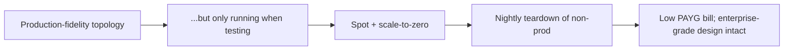
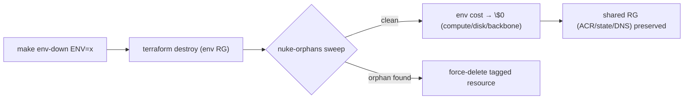

<!-- CLASSIFICATION: UNCLASSIFIED -->

# 08 — Cost Model & Teardown

> **Parent**: [README](README.md) · **Prev**: [07 Roadmap](07-implementation-roadmap.md)
> **Classification**: UNCLASSIFIED · **Status**: DRAFT FOR REVIEW

---

> **Disclaimer:** Figures below are **indicative** planning estimates for **Canada Central**,
> PAYG, in USD, to compare options and shape design. They are **not a quote** — validate with
> the [Azure Pricing Calculator](https://azure.microsoft.com/pricing/calculator/) before commit.
> The cost strategy is **ephemeral-first**: the bill is driven by _hours running_, not by the
> steady-state sticker price.

## 1. Cost Philosophy



You get **production fidelity by configuration** (HA topology, mesh, multi-AZ) while keeping
the bill low because environments **exist only during test windows**.

## 2. Cost Drivers (ranked)

| Rank | Driver                                               | Lever                                                  |
| ---- | ---------------------------------------------------- | ------------------------------------------------------ |
| 1    | AKS worker nodes (VMs)                               | Spot pools, scale-to-zero, teardown                    |
| 2    | Stateful nodes + managed disks (Redpanda/ClickHouse) | On-demand only in staging/prod; ephemeral disks in dev |
| 3    | Managed Prometheus/Grafana + Log Analytics ingestion | Self-host in dev; sampling; retention caps             |
| 4    | Redpanda broker disks / Standard LB / egress         | Ephemeral disks in dev; delete with env                |
| 5    | ACR, Key Vault, Storage, DNS (persistent, small)     | Kept in `rg-rtsa-shared`; negligible                   |

> **AKS control plane**: **Free tier** for non-prod (no SLA) = $0; Standard tier (uptime SLA)
> ≈ $0.10/hr only where you need it (prod).

## 3. Indicative Monthly Cost — If Run 24/7 (worst case)

| Environment | Shape                       | Nodes                                  | Backbone/OLAP                  | ~USD/mo (24/7)               |
| ----------- | --------------------------- | -------------------------------------- | ------------------------------ | ---------------------------- |
| **dev**     | lean, spot, scale-to-zero   | 2 system + 0–4 spot                    | Redpanda 1-broker + CH single  | **$150–300**                 |
| **test**    | ephemeral per pipeline      | spins up/down                          | ephemeral                      | **$0–50** (only during runs) |
| **staging** | prod-like, multi-AZ, HA     | 2 system + spot + 3 stateful on-demand | Redpanda 3-broker + CH sharded | **$700–1,200**               |
| **prod**    | full HA + managed obs + WAF | 2 system(Std) + spot + 3 stateful      | Redpanda RF=3 + CH replicated  | **$1,100–1,800**             |
| **shared**  | persistent                  | —                                      | ACR/state/DNS/LAW              | **$15–40**                   |

## 4. Indicative Monthly Cost — Ephemeral (realistic)

Assume non-prod runs **~4 hrs/day** and is **torn down nightly**; staging spun up only for
release validation (~20 hrs/week); prod not continuously run on personal PAYG.

| Environment                                                 | Run pattern                | ~USD/mo (ephemeral)   |
| ----------------------------------------------------------- | -------------------------- | --------------------- |
| dev                                                         | 4 h/day × 30, spot         | **$25–60**            |
| test                                                        | per pipeline (minutes–1 h) | **$5–20**             |
| staging                                                     | ~20 h/week for validation  | **$70–160**           |
| prod                                                        | on-demand demos only       | **pay per hour used** |
| shared                                                      | always on (tiny)           | **$15–40**            |
| **Typical monthly total (dev+test+shared, ad-hoc staging)** |                            | **≈ $120–280**        |

**Spot discount**: ~60–90% off on-demand for stateless pools. **Scale-to-zero**: idle user
pools cost $0 for compute. **Teardown**: destroyed environments cost $0 except shared.

## 5. Backbone Cost: Redpanda Sizing per Environment

| Environment        | Redpanda shape                   | Fixed cost when idle           | Notes                             |
| ------------------ | -------------------------------- | ------------------------------ | --------------------------------- |
| **dev / test**     | 1 broker, ephemeral disk, spot   | node + small disk while up     | scale-to-zero / torn down nightly |
| **staging / prod** | 3 brokers, RF=3, on-demand + PDB | 3 broker nodes + managed disks | full fidelity + Wasm transforms   |

Per [DL-08](03-technology-options-and-decisions.md#2-event-backbone) the backbone is
**Redpanda OSS in every environment** (single technology, full Wasm-transform parity). Dev
keeps cost low with a **single broker on a spot node with an ephemeral disk**, torn down with
the environment; staging/prod pay for a 3-broker RF=3 quorum only while running.

## 6. Cost Governance (provisioned by Terraform)

| Control                  | Mechanism                                                                                                                              |
| ------------------------ | -------------------------------------------------------------------------------------------------------------------------------------- |
| **Budgets + alerts**     | `azurerm_consumption_budget_resource_group` per env, e.g. alert at 50/80/100%                                                          |
| **Nightly teardown**     | `infra-down.yml` on a schedule for non-prod ([05 §7](05-devops-cicd-and-environments.md#7-environment-lifecycle-automation-ephemeral)) |
| **TTL tags**             | `ttl_hours` tag; a scheduled job destroys anything past TTL                                                                            |
| **Orphan sweep**         | `make -C infra/terraform env-nuke ENV=<env>` deletes tagged environment resource groups                                                |
| **Right-sizing**         | requests/limits from the on-prem resource matrix; VM sizes in `tfvars`                                                                 |
| **Spot + scale-to-zero** | spot user pools; KEDA `minReplicaCount: 0`; Cluster Autoscaler                                                                         |
| **Retention caps**       | short Log Analytics / Prometheus retention in non-prod                                                                                 |

```hcl
# CLASSIFICATION: UNCLASSIFIED
# modules/observability/budget.tf (excerpt)
resource "azurerm_consumption_budget_resource_group" "env" {
  name              = "budget-rtsa-${var.environment}"
  resource_group_id = var.resource_group_id
  amount            = var.monthly_budget      # e.g. 200
  time_grain        = "Monthly"
  notification {
    threshold = 80
    operator  = "GreaterThanOrEqualTo"
    contact_emails = [var.owner_email]
  }
}
```

## 7. Teardown Guarantees



- Destroying an environment removes **all** its compute, disks, backbone, and networking.
- **Shared** ACR/state/DNS persist (tiny cost) so the next `env-up` is fast and image history is retained.
- `prevent_destroy` protects shared resources; environments are always fully destroyable.
- The **orphan sweep** guarantees no forgotten public IP, disk, or LB keeps billing.

## 8. Cost Checklist Before Each Test Cycle

- [ ] `make env-up ENV=dev` (spot pools, scale-to-zero on)
- [ ] `scripts/azure/verify-infrastructure-deployment.sh --env dev`
- [ ] Run tests / demo
- [ ] After Helm deploy, run `scripts/azure/verify-workload-deployment.sh --namespace rtsa --expected-image-tag <tag>`
- [ ] `make env-down ENV=dev` when done (or rely on nightly schedule)
- [ ] Confirm budget dashboard shows expected spend
- [ ] Monthly: review Azure Cost Analysis by `environment` tag; prune anything unexpected

---

## 9. Summary

The design delivers **enterprise-grade, production-fidelity architecture** while keeping a
personal PAYG bill realistically in the **low hundreds of dollars per month** through
spot compute, scale-to-zero, ephemeral environments, per-environment backbone selection, and
automated teardown with budget guardrails. Fidelity is a property of **topology and
configuration**, decoupled from continuous runtime cost.

> Back to **[README / Decision Log »](README.md#5-decision-log)** — all decisions confirmed ✅ (DL-08 = Redpanda OSS everywhere).
