<!-- CLASSIFICATION: UNCLASSIFIED -->

# 10 — Getting Started: Zero to Production (New Team Member Guide)

> **Parent**: [README](README.md) · **Prev**: [09 Operator Runbook](09-operator-runbook-manual-validation.md)
> **Classification**: UNCLASSIFIED · **Audience**: Developers and operators new to the project
> **Scope**: Everything from an empty laptop to a live production deployment

---

## How to Read This Guide

This guide is sequential. Every section ends with a **System State Checkpoint** diagram
so you can see exactly what has been created, what still doesn't exist, and what comes next.
Skip nothing on a first run — later sections depend on earlier steps having succeeded.

Scope note: this guide walks the baseline implementation path. For environment-isolated
subscriptions (dev/test/staging/prod separated), use this guide together with
[11 — Multi-Subscription Analysis](11-multi-subscription-analysis.md) and
[12 — Multi-Subscription Migration Plan](12-multi-subscription-migration-plan.md).

```mermaid
flowchart LR
    S0["0 · Mental\nModel"] --> S1["1 · Prerequisites\n& Tools"]
    S1 --> S2["2 · Bootstrap\n(shared foundation)"]
    S2 --> S3["3 · GitHub\nEnvironments"]
    S3 --> S4["4 · First Infra\nDeploy (infra-up)"]
    S4 --> S5["5 · First PR\n(CI gates)"]
    S5 --> S6["6 · Merge → main\n(CD Build)"]
    S6 --> S7["7 · CD Deploy\n(dev)"]
    S7 --> S8["8 · Promote\ntest → staging"]
    S8 --> S9["9 · Production\nDeployment"]
    S9 --> S10["10 · Ongoing Ops\n& Tear-down"]

    style S0 fill:#f0f0f0
    style S9 fill:#d4edda
```

---

## Section 0 — Mental Model: How Everything Fits Together

Before touching a keyboard, understand the three-layer model that everything in RTSA follows.

### 0.1 The Three Layers

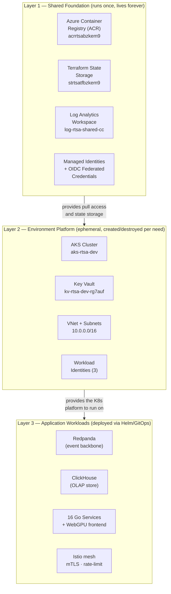

**Key insight**: Destroying an environment (Layer 2) never touches images in ACR or Terraform
state files in the Storage Account. You can rebuild from scratch in ~20 minutes at any time.

### 0.2 The Full Deployment Journey

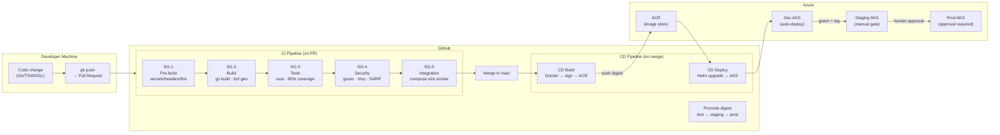

### 0.3 Terraform vs Helm — What Goes Where

This distinction matters. Getting it wrong causes frustration.

| Managed by    | Tool                         | What it creates                                                                           | When                |
| ------------- | ---------------------------- | ----------------------------------------------------------------------------------------- | ------------------- |
| **Terraform** | `infra-up.yml` workflow      | Azure resources: VNet, AKS, Key Vault, Managed Identities, role assignments               | Before any pods run |
| **Helm**      | `cd-deploy.yml` workflow     | Kubernetes resources: Deployments, Services, ConfigMaps, KEDA ScaledObjects, Istio config | After AKS exists    |
| **Bootstrap** | `scripts/azure/bootstrap.sh` | Shared resources: ACR, state storage, OIDC app registrations                              | Once, by an admin   |

Terraform does not know about your Go code. Helm does not know about VNets. They each
manage their own state independently.

### 0.4 Identity and Trust: No Passwords Anywhere

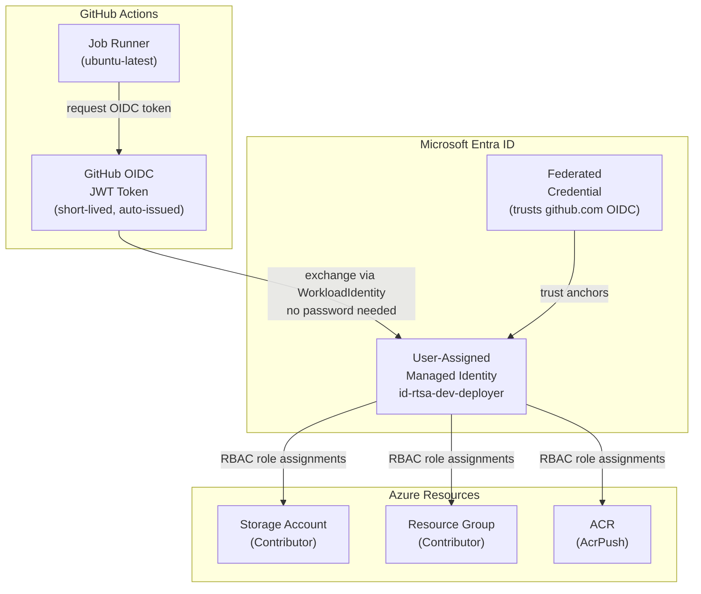

**This is OIDC federation.** GitHub proves its identity to Azure by signing a JWT. No Azure
client secrets are ever stored in GitHub. This is set up by the bootstrap step and never
needs changing unless you rotate the federation.

---

## Section 1 — Prerequisites: What You Need Before You Start

Run through this checklist completely. Every item marked _(one-time)_ only needs doing once
per developer machine.

### 1.1 Required Tools

| Tool              | Minimum version    | Install command                                                                                  | Check                      |
| ----------------- | ------------------ | ------------------------------------------------------------------------------------------------ | -------------------------- |
| `az` (Azure CLI)  | 2.60+              | `brew install azure-cli` or [docs.microsoft.com/cli/azure](https://docs.microsoft.com/cli/azure) | `az --version`             |
| `terraform`       | 1.10.5             | `brew install terraform` or [releases.hashicorp.com](https://releases.hashicorp.com/terraform/)  | `terraform version`        |
| `gh` (GitHub CLI) | 2.40+              | `brew install gh` or [cli.github.com](https://cli.github.com)                                    | `gh --version`             |
| `kubectl`         | 1.30+              | `az aks install-cli`                                                                             | `kubectl version --client` |
| `helm`            | 3.15+              | `brew install helm`                                                                              | `helm version`             |
| `go`              | 1.24+              | [go.dev/dl](https://go.dev/dl)                                                                   | `go version`               |
| `node` / `pnpm`   | Node 22+ / pnpm 9+ | `brew install node pnpm`                                                                         | `pnpm --version`           |
| `buf`             | 1.40+              | `brew install bufbuild/buf/buf`                                                                  | `buf --version`            |
| `docker`          | 25+                | [docs.docker.com/get-docker](https://docs.docker.com/get-docker/)                                | `docker --version`         |
| `cosign`          | 2.4+               | `brew install cosign`                                                                            | `cosign version`           |

### 1.2 Accounts and Permissions

| Account                | What you need                                                          | Who grants it            |
| ---------------------- | ---------------------------------------------------------------------- | ------------------------ |
| **Azure subscription** | Contributor + User Access Administrator (or Owner) on the subscription | Azure subscription owner |
| **GitHub repository**  | Write access + Actions enabled                                         | Repo admin               |
| **GitHub token**       | `gh auth login` with `repo`, `workflow`, `write:variables` scopes      | Yourself                 |

### 1.3 Log in to Everything

```bash
# Azure — interactive browser login
az login

# Confirm you are on the right subscription
az account show --query '{name:name, id:id}' -o json

# If wrong subscription, switch:
az account set --subscription "11f614f9-a6d3-419b-9437-37a84c75f27a"

# GitHub CLI — interactive login, select HTTPS, copy+paste the one-time code
gh auth login

# Verify
gh auth status
```

### 1.4 Clone the Repository

```bash
git clone https://github.com/arvinddhasmana/rtsa_webgpu.git
cd rtsa_webgpu

# Verify you have all workspace modules
go work sync
```

---

## Section 2 — Step 1: Bootstrap (One-Time, Admin Only)

The bootstrap creates the _shared foundation_ that every environment depends on.
Run this exactly once. If it already exists (ask the team), skip to Section 3.

### 2.1 What Bootstrap Provisions

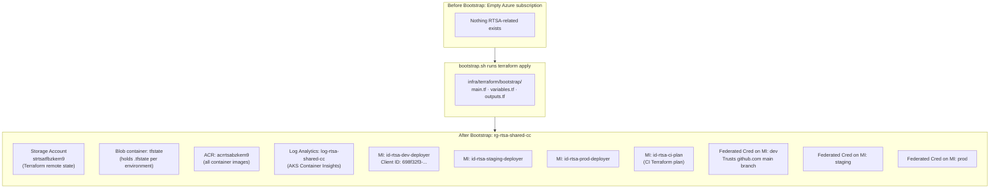

**28 resources total.** None of these are expensive. The ACR Standard tier costs ~$0.10/day.
The Storage Account is negligible. These resources survive environment teardowns permanently.

### 2.2 Configure Bootstrap Variables

```bash
cd infra/terraform/bootstrap

# terraform.tfvars is gitignored — your real values stay local
cp terraform.tfvars.example terraform.tfvars
```

Edit `terraform.tfvars` with your real values:

```hcl
subscription_id = "11f614f9-a6d3-419b-9437-37a84c75f27a"
tenant_id       = "b13ceef6-6c21-40a4-ad1c-bbaac66921c2"
location        = "canadacentral"
project         = "rtsa"

github_owner = "arvinddhasmana"
github_repo  = "rtsa_webgpu"

environments = ["dev", "staging", "prod"]
```

> **Never commit `terraform.tfvars` to git.** It is in `.gitignore`. Only `.tfvars.example`
> files belong in version control.

### 2.3 Run Bootstrap

```bash
cd /path/to/rtsa_webgpu

# Dry run first — review what will be created (no changes)
scripts/azure/bootstrap.sh --plan-only

# Apply when satisfied
scripts/azure/bootstrap.sh

# After apply — save these outputs; you will need them in Section 3
terraform -chdir=infra/terraform/bootstrap output
```

Bootstrap grants each environment deployer identity the Azure management-plane roles and
the `Azure Kubernetes Service RBAC Cluster Admin` data-plane role required by Helm and the
post-deployment verifier. Re-run bootstrap after introducing a new environment identity or
changing these role assignments.

Expected output (values vary by run):

```
acr_name                      = "acrrtsabzkem9"
acr_login_server              = "acrrtsabzkem9.azurecr.io"
shared_resource_group         = "rg-rtsa-shared-cc"
state_storage_account_name    = "strtsatfbzkem9"
state_container_name          = "tfstate"
tenant_id                     = "b13ceef6-6c21-40a4-ad1c-bbaac66921c2"
deployer_identity_client_ids  = {
  "dev"     = "698f32f3-60d4-49a8-9317-94c34c99197b"
  "staging" = "a77c5b05-5dd0-484d-96e-..."
  "prod"    = "13795bc9-6518-4b61-abeb-..."
}
ci_plan_identity_client_id    = "a223d804-258c-4b83-8526-e808cda67eeb"
```

Save these. The setup script in Step 2 reads them automatically if you run it from the
same machine, but having them written down helps debugging.

### 2.4 System State After Bootstrap

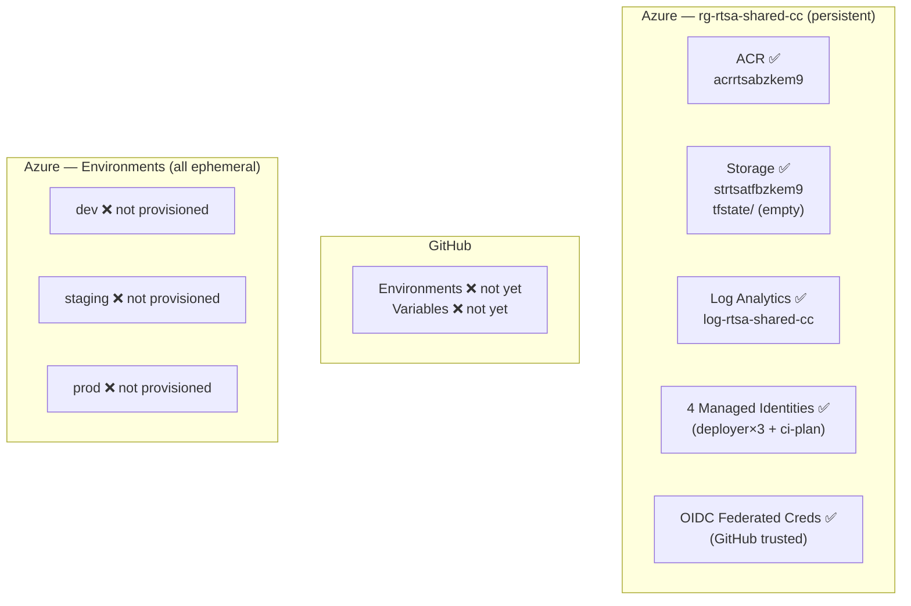

**What works right now**: An admin with the Managed Identity can authenticate to Azure via
OIDC from a GitHub Actions runner. **What doesn't work yet**: No GitHub Environment
variables exist, so workflows would fail at `az login` / `terraform init`.

---

## Section 3 — Step 2: Configure GitHub Environments

GitHub Environments are where per-environment configuration and protection rules live.
They hold the values that workflows need to deploy to a specific environment without
hardcoding anything.

### 3.1 What GitHub Environments Provide

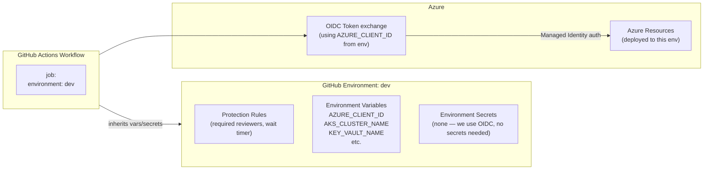

A workflow job that declares `environment: dev` automatically:

1. Waits for any required reviewers to approve (prod only)
2. Gets all variables from that environment injected as `vars.*`
3. Uses those to authenticate to Azure and target the right cluster

### 3.2 Variables Reference: What Each Variable Does

| Variable                          | Scope   | Source                                              | Purpose                                                   |
| --------------------------------- | ------- | --------------------------------------------------- | --------------------------------------------------------- |
| `AZURE_TENANT_ID`                 | Repo    | Bootstrap output                                    | Entra tenant for OIDC exchange                            |
| `REPO_AZURE_SUBSCRIPTION_ID`      | Repo    | bootstrap `terraform.tfvars`                        | Shared build subscription used by CD Build                |
| `REPO_AZURE_CLIENT_ID`            | Repo    | setup script (default: dev deployer identity)       | Shared build identity for CD Build                        |
| `ACR_NAME`                        | Repo    | Bootstrap output `acr_name`                         | Image registry used by all environments                   |
| `TFSTATE_RESOURCE_GROUP`          | Repo    | Bootstrap output `shared_resource_group`            | Where the state storage account lives                     |
| `TFSTATE_STORAGE_ACCOUNT`         | Repo    | Bootstrap output `state_storage_account_name`       | Storage account name for Terraform backends               |
| `TFSTATE_CONTAINER`               | Repo    | Bootstrap output `state_container_name`             | Blob container holding `.tfstate` files                   |
| `AZURE_SUBSCRIPTION_ID`           | Per-env | setup script / env override                         | Target subscription for the environment                   |
| `AZURE_CLIENT_ID`                 | Per-env | Bootstrap output `deployer_identity_client_ids.dev` | **Which Managed Identity to impersonate in this env**     |
| `AKS_CLUSTER_NAME`                | Per-env | infra-up output `cluster_name`                      | AKS cluster name for `kubectl` context                    |
| `AKS_RESOURCE_GROUP`              | Per-env | infra-up output `resource_group`                    | Resource group containing AKS                             |
| `KEY_VAULT_NAME`                  | Per-env | infra-up output `key_vault_uri` (parsed)            | Key Vault for CSI secrets + Helm values                   |
| `WEBTRANSPORT_IDENTITY_CLIENT_ID` | Per-env | infra-up output                                     | Client ID for the WebTransport workload identity          |
| `ISTIO_REVISION`                  | Per-env | `dev.tfvars` `istio_revisions[0]`                   | Which Istio ASM revision is active (for injection labels) |
| `VITE_API_GATEWAY_URL`            | Per-env | Manual — set after first Helm deploy                | gRPC-Web gateway URL injected into the frontend build     |
| `VITE_WEBTRANSPORT_URL`           | Per-env | Manual — set after first Helm deploy                | WebTransport server URL for the COP hot path              |

### 3.3 Automated Setup (Recommended)

```bash
# Creates all 4 environments + seeds repo-level + env-level variables
# from live bootstrap Terraform outputs
scripts/azure/setup-github-environments.sh \
  --repo arvinddhasmana/rtsa_webgpu

# Optional multi-subscription override:
# scripts/azure/setup-github-environments.sh \
#   --repo arvinddhasmana/rtsa_webgpu \
#   --environment-subscriptions \
#   dev=<dev-sub>,test=<test-sub>,staging=<stg-sub>,prod=<prod-sub>

# After infra-up (Section 4), sync the remaining env-level variables:
scripts/azure/sync-dev-github-vars-from-tf.sh \
  --repo arvinddhasmana/rtsa_webgpu \
  --environment dev
```

These two scripts together cover all variables except `VITE_API_GATEWAY_URL` and
`VITE_WEBTRANSPORT_URL`, which can only be known after the first successful Helm deploy.

### 3.4 Manual Setup Fallback (if automated fails)

If the scripts fail, the fallback is the GitHub web UI:

1. Go to **Settings → Environments** in the repository.
2. Create four environments: `dev`, `test`, `staging`, `prod`.
3. For `staging` and `prod`, add a **required reviewer** (yourself initially).
4. Add each variable from the table above under the correct scope.

> Add repo-level variables at **Settings → Secrets and variables → Actions → Variables tab**.

### 3.5 System State After GitHub Setup

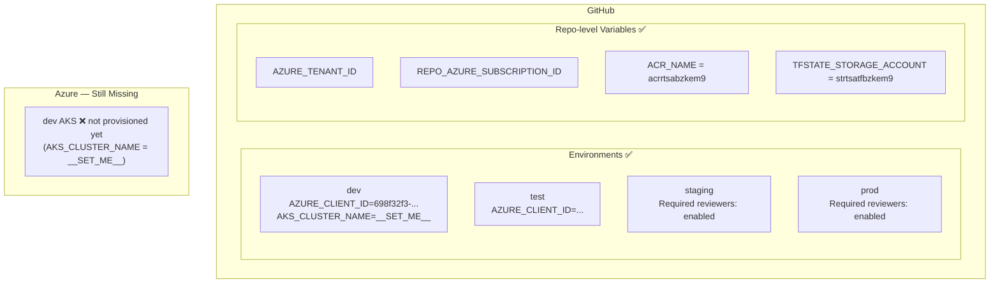

The `AKS_CLUSTER_NAME` and related variables remain `__SET_ME__` until infra-up runs.
The CI pipeline will still work because it does not need the cluster to lint/test code.

---

## Section 4 — Step 3: Provision Infrastructure (infra-up)

`infra-up.yml` is the workflow that runs Terraform for a given environment.
It creates the AKS cluster, Key Vault, VNet, and workload identities.

### 4.1 What infra-up Creates (dev environment)

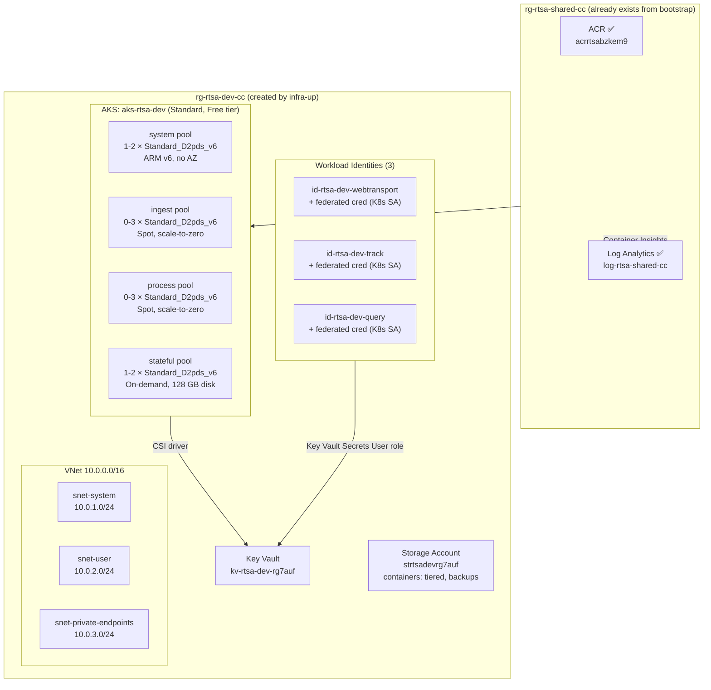

### 4.2 How Terraform Modules Compose

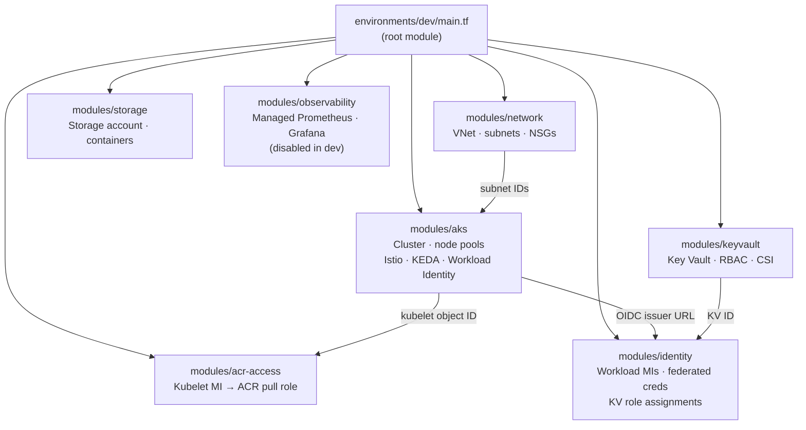

Each module is independently versioned and reused across dev/staging/prod by passing
different `tfvars`. The modules never contain environment-specific hardcoding.

### 4.3 Run infra-up from GitHub Actions (preferred)

```
GitHub UI → Actions tab → "Infra Up" → Run workflow
  environment: dev
  → Run
```

Or via CLI:

```bash
gh workflow run infra-up.yml \
  --repo arvinddhasmana/rtsa_webgpu \
  --field environment=dev
```

Watch it run:

```bash
gh run list --workflow infra-up.yml --limit 5
gh run watch <run-id>
```

### 4.4 Run infra-up Locally (admin / debugging)

```bash
# The environment provider targets nonprod; the backend remains in shared.
export ARM_SUBSCRIPTION_ID="bb2b8549-9693-40f2-9287-3bd5afcc6633"

scripts/azure/preflight-environment-deploy.sh --env dev
make -C infra/terraform env-plan ENV=dev
make -C infra/terraform env-up ENV=dev
make -C infra/terraform env-output ENV=dev
```

> **Expected apply time**: ~15 minutes for the first full apply (AKS cluster creation
> takes 8-12 minutes, Key Vault ~3 minutes).

### 4.5 After infra-up: Sync Variables to GitHub

Once apply completes, copy the Terraform outputs into the GitHub environment variables:

```bash
scripts/azure/sync-dev-github-vars-from-tf.sh \
  --repo arvinddhasmana/rtsa_webgpu \
  --environment dev
```

Expected output:

```
Updated environment variables for arvinddhasmana/rtsa_webgpu / dev:
  AKS_RESOURCE_GROUP=rg-rtsa-dev-cc
  AKS_CLUSTER_NAME=aks-rtsa-dev
  KEY_VAULT_NAME=kv-rtsa-dev-rg7auf
  ACR_NAME=acrrtsabzkem9
  WEBTRANSPORT_IDENTITY_CLIENT_ID=641ebe6a-34b8-...
  ISTIO_REVISION=asm-1-29
```

### 4.6 Verify the Cluster

```bash
export ARM_SUBSCRIPTION_ID="bb2b8549-9693-40f2-9287-3bd5afcc6633"
scripts/azure/verify-infrastructure-deployment.sh --env dev
```

The verifier checks subscription isolation, zero Terraform drift, Azure provisioning and
power states, OIDC and Workload Identity, node-pool health, Ready nodes, and `kube-system`
pods. It uses a temporary kubeconfig and does not replace your current context. The
`infra-up.yml` workflow runs the same command after every successful apply and blocks on
failure.

Local operators also need AKS data-plane access. An Azure administrator can grant it at the
specific cluster scope:

```bash
OPERATOR_ID=$(az ad signed-in-user show --query id -o tsv)
AKS_ID=$(az aks show \
    --subscription "$ARM_SUBSCRIPTION_ID" \
    --resource-group rg-rtsa-dev-cc \
    --name aks-rtsa-dev \
    --query id -o tsv)

az role assignment create \
    --assignee-object-id "$OPERATOR_ID" \
    --assignee-principal-type User \
    --role "Azure Kubernetes Service RBAC Cluster Admin" \
    --scope "$AKS_ID"
```

### 4.7 System State After infra-up

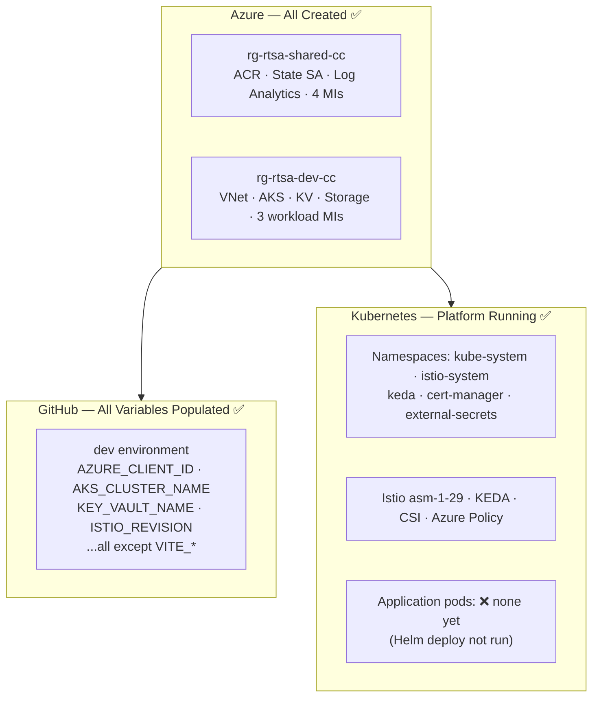

---

## Section 5 — Step 4: Your First Pull Request (CI Pipeline)

Every code change goes through a Pull Request. The CI pipeline enforces five sequential
security gates before any merge is allowed.

### 5.1 Create a Branch and Open a PR

```bash
git checkout -b feature/my-change
# make your changes
git add -A && git commit -m "feat: describe your change"
git push origin feature/my-change

# Open PR
gh pr create --title "feat: describe your change" --body "What this does"
```

### 5.2 The Five Security Gates (SG-1 through SG-5)

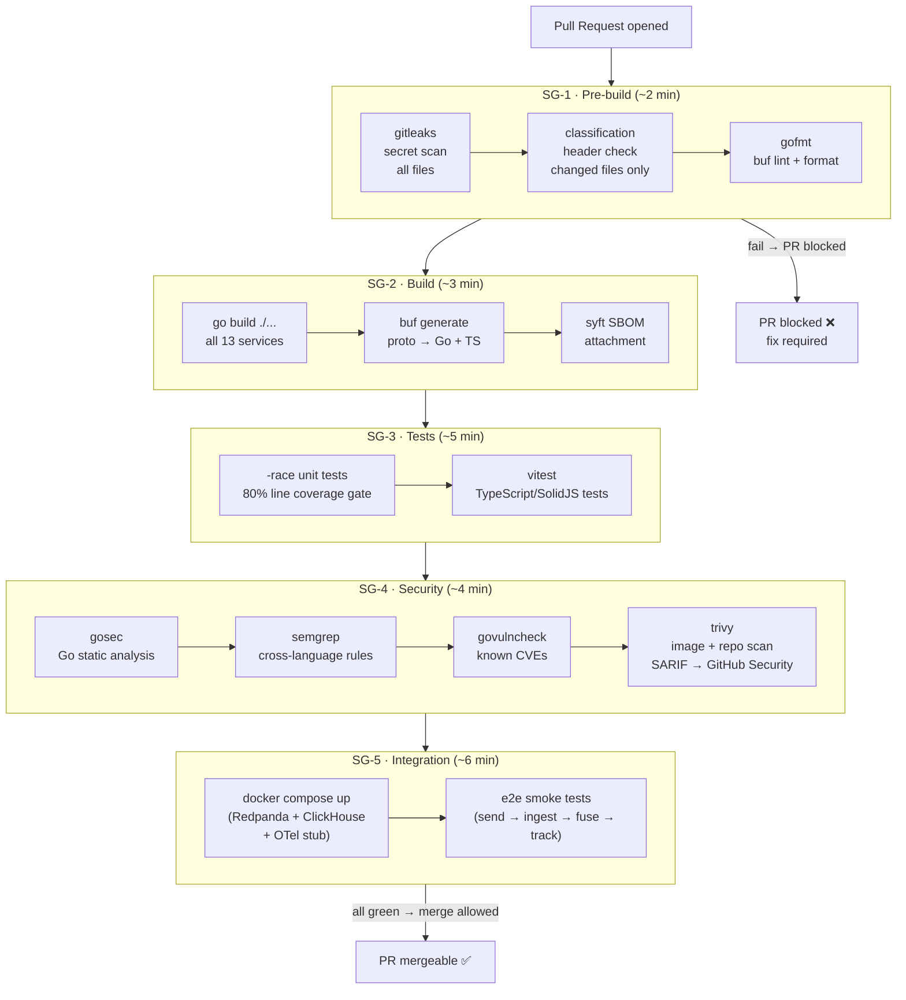

### 5.3 What Each Gate Checks and Why

| Gate                | Blocks merge on...                            | Why it matters for RTSA              |
| ------------------- | --------------------------------------------- | ------------------------------------ |
| SG-1 `gitleaks`     | Any secret pattern in any file                | ITSG-33 SA-4: no credentials in code |
| SG-1 classification | Missing `CLASSIFICATION: UNCLASSIFIED` header | DND classification policy            |
| SG-1 `gofmt`        | Unformatted Go                                | Readability and diff noise           |
| SG-2 build          | Compile errors                                | Catch obvious breaks early           |
| SG-3 coverage       | < 80% line coverage                           | SDLC mandates test completeness      |
| SG-4 `gosec`        | CWE-780, SQL injection, hardcoded creds, etc. | OWASP Top 10 / NIST 800-53           |
| SG-4 `trivy`        | CRITICAL/HIGH CVEs in dependencies            | Supply chain security                |
| SG-5 e2e            | Broken service integration                    | Catches contract regressions         |

### 5.4 Making CI Pass: Common Fixes

```bash
# SG-1: Add missing classification header to a new file
echo "// CLASSIFICATION: UNCLASSIFIED" | cat - myfile.go > tmp && mv tmp myfile.go

# SG-1: Fix gofmt
gofmt -w ./...

# SG-1: Fix buf lint
buf lint && buf format -w

# SG-3: Check your coverage
go test -coverprofile=cover.out ./... && go tool cover -func=cover.out | tail -1

# SG-4: Run gosec locally before push
gosec ./...

# SG-5: Reproduce the e2e smoke locally
docker compose -f deploy/docker-compose.yml up -d
go test -tags=integration ./tests/e2e/... -v
docker compose -f deploy/docker-compose.yml down
```

---

## Section 6 — Step 5: Merge to main (CD Build)

When the PR merges, the CD Build pipeline automatically fires. It builds only the
services whose source files changed (path-filtered), signs the images with `cosign`,
and pushes them to ACR.

### 6.1 CD Build Pipeline Flow

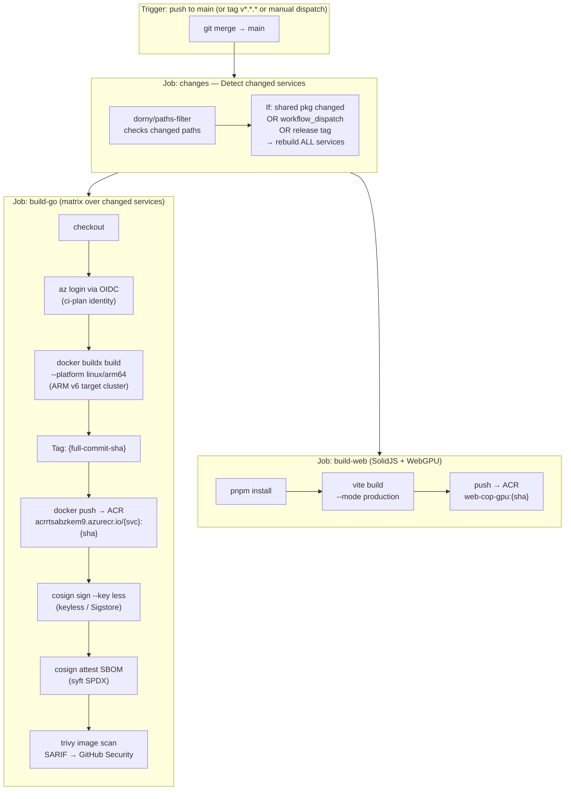

### 6.2 Image Naming and the Promotion Contract

All images share the same commit SHA tag. This is the **promotion contract** — the exact
same digest validated in dev is what gets deployed to staging and then production.
No rebuilds happen during promotion. Only the Kubernetes config changes.

```
acrrtsabzkem9.azurecr.io/svc-radar-ingestion:<full-commit-sha>
acrrtsabzkem9.azurecr.io/svc-fusion-engine:<full-commit-sha>
acrrtsabzkem9.azurecr.io/svc-track:<full-commit-sha>
acrrtsabzkem9.azurecr.io/svc-webtransport:<full-commit-sha>
acrrtsabzkem9.azurecr.io/svc-query:<full-commit-sha>
acrrtsabzkem9.azurecr.io/web-cop-gpu:<full-commit-sha>
```

### 6.3 Platform Architecture: Why ARM64

The dev AKS cluster uses `Standard_D2pds_v6` nodes (Ampere ARM64). The reusable
container workflow configures QEMU and Buildx with `platforms: linux/arm64`; Go
Dockerfiles consume BuildKit's `TARGETARCH` for binaries and health probes. If an
x86 image reaches an ARM node, the pod fails with `exec format error`.

```bash
# Verify your local Docker can build ARM64 (requires QEMU emulation or Apple M-series)
docker buildx ls
# You should see linux/arm64 in the platforms list

# Test a local ARM64 build of one service
docker buildx build --platform linux/arm64 -t test-arm64 ./svc-radar-ingestion
```

### 6.4 System State After CD Build

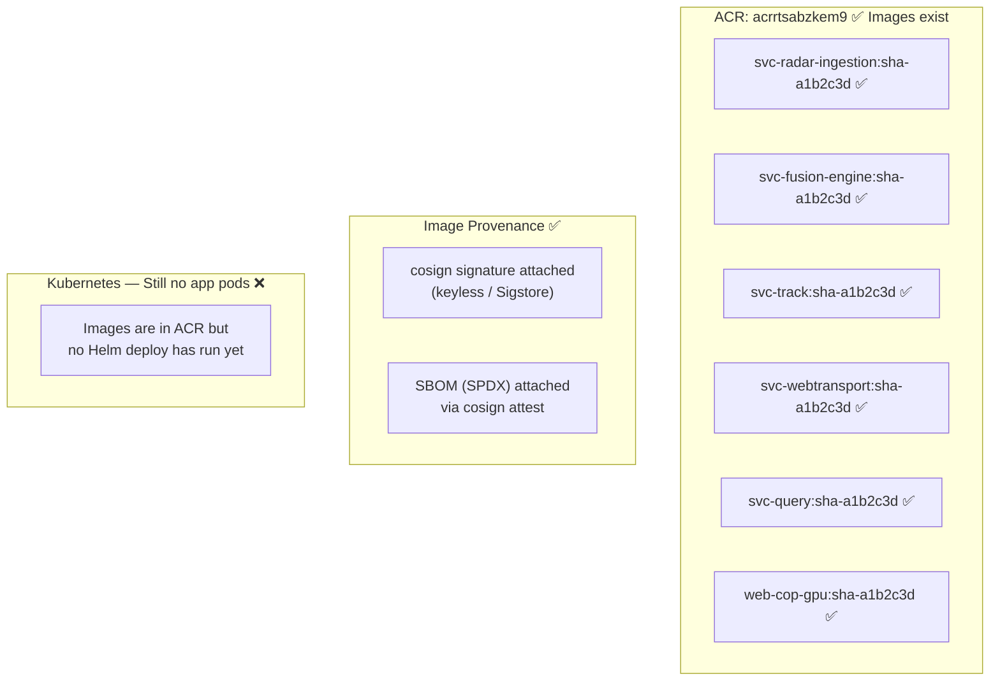

---

## Section 7 — Step 6: CD Deploy to Dev

`cd-deploy.yml` runs `helm upgrade --install` against the AKS cluster. It uses the image
tag built in the previous step and targets the `rtsa` namespace.

### 7.1 Helm Chart Structure

```
deploy/charts/
├── rtsa-backbone/        # Redpanda (single-broker dev) + ClickHouse + OTel collector
├── rtsa-ingestion/       # Radar + AIS + EW + ELINT + ISR + Cyber ingestion services
├── rtsa-processing/      # Fusion engine + anomaly detection + feedback + audit
└── rtsa-presentation/    # svc-track · svc-query · svc-webtransport · web-cop-gpu
```

Each chart has a `values.yaml` (defaults) and per-environment overrides in
`deploy/charts/<chart>/values-<env>.yaml`.

### 7.2 CD Deploy Flow

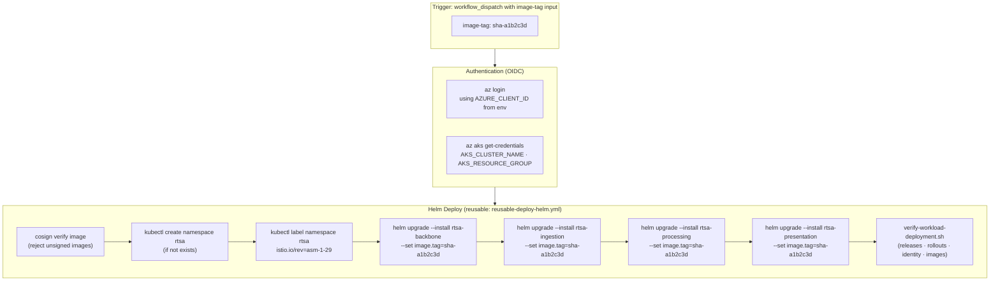

### 7.3 Bootstrap Development WebTransport Secrets

Before the first dev Helm deployment, create the JWT and TLS material directly in
Key Vault. The operator needs `Key Vault Secrets Officer` at the dev vault scope;
workloads retain the read-only `Key Vault Secrets User` role.

```bash
VAULT_ID=$(az keyvault show \
    --resource-group rg-rtsa-dev-cc \
    --name kv-rtsa-dev-aa67qb \
    --query id -o tsv)
OPERATOR_ID=$(az ad signed-in-user show --query id -o tsv)

az role assignment create \
    --assignee-object-id "$OPERATOR_ID" \
    --assignee-principal-type User \
    --role "Key Vault Secrets Officer" \
    --scope "$VAULT_ID"

scripts/azure/bootstrap-dev-key-vault-secrets.sh --env dev
```

The script refuses non-dev environments, validates the Terraform subscription and
vault, retains existing versions unless `--force` is explicit, and never prints
secret values. Use `--dry-run` to validate prerequisites only.

### 7.4 Trigger CD Deploy Manually

```bash
# Get the full SHA of the last successful CD Build
LAST_SHA=$(gh run list --workflow cd-build.yml --status success --limit 1 --json headSha --jq '.[0].headSha')

gh workflow run cd-deploy.yml \
  --repo arvinddhasmana/rtsa_webgpu \
  --field environment=dev \
    --field image-tag="$LAST_SHA"
```

### 7.5 Verify the Workload Deployment

The reusable Helm workflow automatically runs the workload verifier after all Helm
operations. Run the same gate locally when diagnosing or validating a deployment:

```bash
scripts/azure/verify-workload-deployment.sh \
    --namespace rtsa \
    --expected-image-tag "$LAST_SHA"
```

It verifies every expected Helm release, StatefulSet and Deployment rollout, pod health,
Istio sidecar injection, the WebTransport workload-identity annotation, and the promoted
image tag. Kubernetes warning events are printed for diagnosis but do not fail an otherwise
healthy deployment.

### 7.6 What Runs Inside Kubernetes After Deploy

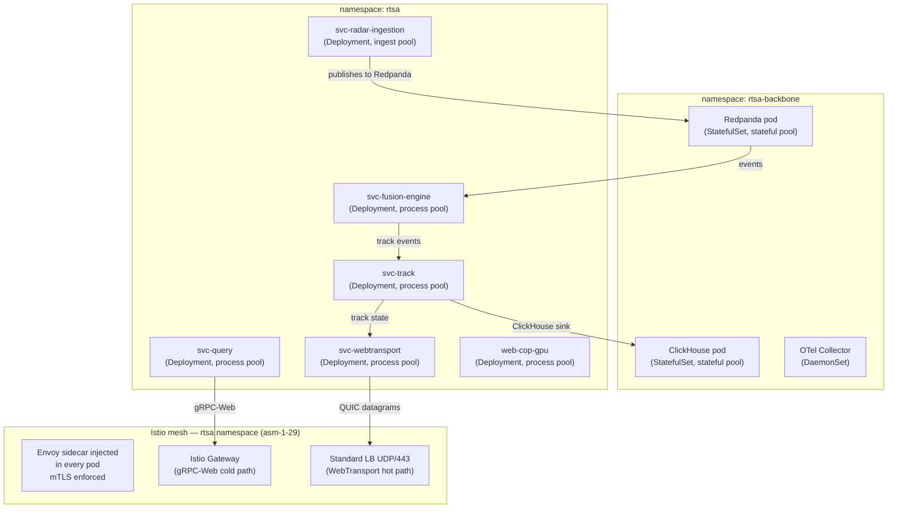

### 7.6 Set the Frontend URLs in GitHub

After the first successful deploy, retrieve the ingress endpoint addresses and set the
last two `__SET_ME__` variables:

```bash
# Get the Istio gateway external IP
GATEWAY_IP=$(kubectl get svc istio-ingressgateway -n istio-system \
  -o jsonpath='{.status.loadBalancer.ingress[0].ip}')

# Get the WebTransport service external IP (UDP/443)
WT_IP=$(kubectl get svc svc-webtransport -n rtsa \
  -o jsonpath='{.status.loadBalancer.ingress[0].ip}')

# Set them in GitHub
gh variable set VITE_API_GATEWAY_URL \
  --repo arvinddhasmana/rtsa_webgpu \
  --env dev \
  --body "https://${GATEWAY_IP}"

gh variable set VITE_WEBTRANSPORT_URL \
  --repo arvinddhasmana/rtsa_webgpu \
  --env dev \
  --body "https://${WT_IP}:443"
```

### 7.7 System State After CD Deploy (dev)

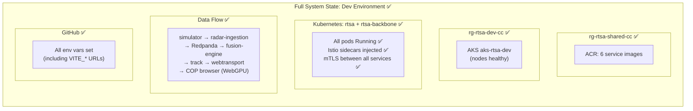

---

## Section 8 — Step 7: Promote to Test and Staging

Promotion means deploying the same image digest that passed in dev to a higher
environment. No code changes. No rebuilds. Just config and approval gates.

### 8.1 Full Promotion Flow

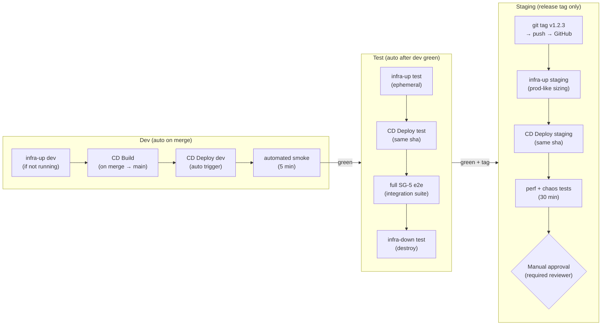

### 8.2 Create a Release Tag and Trigger Staging

```bash
# Ensure you are on main and up to date
git checkout main && git pull

# Tag the release
git tag v1.0.0
git push origin v1.0.0

# This triggers CD Build (force-rebuild all) + Staging promotion
# Monitor:
gh run list --workflow cd-build.yml --limit 3
```

### 8.3 Approve the Staging → Prod Gate

After staging tests pass, GitHub will pause the workflow at the `prod` environment
pending required reviewer approval.

1. Go to **Actions** tab in GitHub.
2. Find the pending workflow run.
3. Click **Review deployments**.
4. Select `prod` and click **Approve and deploy**.

---

## Section 9 — Step 8: Production Deployment

Production is identical to staging — same images, same Helm charts — with:

- On-demand (non-Spot) nodes across all pools
- Larger node sizes (configured in `staging.tfvars` / `prod.tfvars`)
- Purge protection enabled on Key Vault
- Managed Prometheus + Grafana enabled
- Multiple required reviewers on the GitHub Environment

### 9.1 Production Topology Compared to Dev

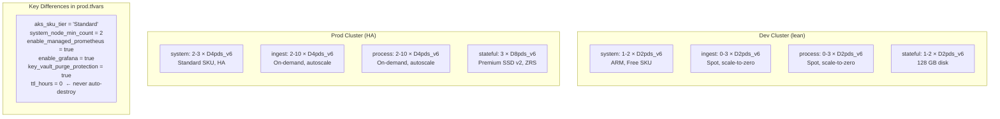

### 9.2 Production Pre-flight Checklist

Before approving prod:

```
□  All staging smoke tests pass (check Actions run summary)
□  Trivy scan shows no CRITICAL CVEs (check GitHub Security tab)
□  Change record raised (link in PR description)
□  On-call engineer notified
□  Rollback plan documented (previous image tag noted)
□  Cost estimate reviewed (08-cost-model-and-teardown.md)
```

### 9.3 Rollback

If prod deploy fails or causes a regression, roll back with the previous tag:

```bash
# Find the previous successful deploy tag
gh run list --workflow cd-deploy.yml --status success --limit 5

# Re-deploy previous image
gh workflow run cd-deploy.yml \
  --repo arvinddhasmana/rtsa_webgpu \
  --field environment=prod \
  --field image-tag="sha-{previous-sha}"
```

Helm keeps the previous release. `helm rollback` can also be used directly:

```bash
az aks get-credentials --resource-group rg-rtsa-prod-cc --name aks-rtsa-prod
helm history rtsa-presentation -n rtsa
helm rollback rtsa-presentation <previous-revision> -n rtsa
```

---

## Section 10 — Ongoing Operations

### 10.1 Cost Control: Tear Down Environments When Not Needed

The nightly schedule tears down `dev` and `test` automatically at 07:00 UTC:

```yaml
# infra-down.yml schedule:
schedule:
  - cron: "0 7 * * *" # tears down dev + test every night
```

Manual teardown:

```bash
gh workflow run infra-down.yml \
  --repo arvinddhasmana/rtsa_webgpu \
  --field environment=dev
```

Re-provision next morning:

```bash
gh workflow run infra-up.yml \
  --repo arvinddhasmana/rtsa_webgpu \
  --field environment=dev
```

> Rebuild time: ~15 min. All images remain in ACR. State is preserved in the Storage Account.
> The cluster starts empty — run CD Deploy again with the same SHA to restore application pods.

### 10.2 Environment Lifecycle Summary

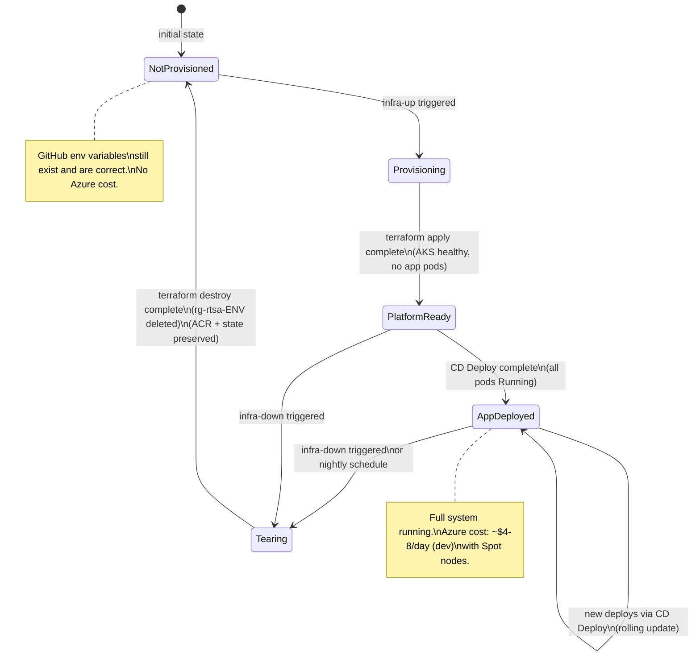

### 10.3 Monitoring and Observability

```bash
# Check pod status across all namespaces
kubectl get pods -A

# View logs for a specific service
kubectl logs -n rtsa deployment/svc-radar-ingestion --follow

# Check Redpanda topic lag (KEDA watches this to scale)
kubectl exec -n rtsa-backbone -it redpanda-0 -- \
  rpk topic list

# Open Grafana (dev: port-forward since Managed Grafana is disabled in dev)
kubectl port-forward -n monitoring svc/grafana 3000:3000
# Then open http://localhost:3000

# View Istio mesh metrics
kubectl port-forward -n istio-system svc/kiali 20001:20001
```

### 10.4 Troubleshooting Common Issues

#### Terraform: `state blob is already locked`

A previous Terraform process was killed mid-apply. The Azure Blob lease is held.

```bash
# Step 1: Kill any lingering Terraform processes
pkill -9 -f "terraform-provider-azurerm"
sleep 3

# Step 2: Break the blob lease using the storage account key
ACCT_KEY=$(az storage account keys list \
  --account-name strtsatfbzkem9 \
  --resource-group rg-rtsa-shared-cc \
  --query '[0].value' -o tsv)

az storage blob lease break \
    --blob-name "dev.tfstate" \
  --container-name "tfstate" \
  --account-name "strtsatfbzkem9" \
  --account-key "$ACCT_KEY"

# Step 3: Force-unlock using the lock ID from the error message
terraform -chdir=infra/terraform/environments/dev \
  force-unlock -force <LOCK-ID-FROM-ERROR>

# Step 4: Retry plan
terraform -chdir=infra/terraform/environments/dev plan -var-file=dev.tfvars
```

Or use the helper script:

```bash
scripts/azure/tf-break-lock.sh \
  --environment dev \
  --storage-account strtsatfbzkem9 \
  --container tfstate
```

#### AKS node not starting: `Insufficient vcpu quota`

This subscription (canadacentral) restricts to ARM VMs and has limited vCPU quota.
Only `Standard_D2pds_v6` (family: `Dpdsv6`) has available quota.
Check your current quota:

```bash
az vm list-usage --location canadacentral \
  --query "[?contains(name.value,'Dpds')].{Name:name.value, Used:currentValue, Limit:limit}" \
  -o table
```

If all 10 vCPUs are used, tear down the environment first:

```bash
gh workflow run infra-down.yml --field environment=dev
# Then wait ~5 min for resources to release, then re-provision
```

#### Pod in `CrashLoopBackOff`

```bash
# See why
kubectl describe pod <pod-name> -n rtsa

# Check logs (including init containers)
kubectl logs <pod-name> -n rtsa --previous

# Most common causes:
# 1. Missing Key Vault secret — check CSI driver logs
kubectl logs -n kube-system -l app=secrets-store-csi-driver

# 2. Wrong Workload Identity client ID
kubectl get sa -n rtsa svc-webtransport -o yaml | grep azure.workload

# 3. Image not found in ACR — check if CD Build ran
az acr repository show-tags --name acrrtsabzkem9 --repository svc-webtransport
```

#### CI failing: `Missing 'CLASSIFICATION: UNCLASSIFIED' header`

Every `.go`, `.ts`, `.yaml`, `.yml`, `.tf`, `.sh`, and `.md` file must have the
classification header as its **first line** (or within the first 5 lines):

```go
// CLASSIFICATION: UNCLASSIFIED
package main
```

```yaml
# CLASSIFICATION: UNCLASSIFIED
name: My Workflow
```

```hcl
# CLASSIFICATION: UNCLASSIFIED
variable "name" {}
```

---

## Section 11 — Complete State Reference

This diagram shows what exists after every step has been completed successfully.
Use it as a verification checklist.

```mermaid
flowchart TB
    subgraph STEP0["After Step 1 — Bootstrap"]
        B1["✅ rg-rtsa-shared-cc created"]
        B2["✅ ACR: acrrtsabzkem9"]
        B3["✅ Terraform state SA: strtsatfbzkem9"]
        B4["✅ 4 Managed Identities + OIDC federated creds"]
        B5["✅ Log Analytics: log-rtsa-shared-cc"]
    end

    subgraph STEP1["After Step 2 — GitHub Setup"]
        G1["✅ GitHub Environments: dev, test, staging, prod"]
        G2["✅ Repo vars: AZURE_TENANT_ID, SUBSCRIPTION_ID, ACR_NAME, TFSTATE_*"]
        G3["✅ Dev env: AZURE_CLIENT_ID = 698f32f3-..."]
        G4["⚠️  AKS_CLUSTER_NAME = __SET_ME__ (needs infra-up)"]
    end

    subgraph STEP2["After Step 3 — infra-up dev"]
        I1["✅ rg-rtsa-dev-cc created"]
        I2["✅ AKS: aks-rtsa-dev (3 node pools healthy)"]
        I3["✅ KV: kv-rtsa-dev-rg7auf"]
        I4["✅ Storage: strtsadevrg7auf"]
        I5["✅ 3 Workload Managed Identities"]
        I6["✅ GitHub dev vars: AKS_CLUSTER_NAME, KEY_VAULT_NAME, ISTIO_REVISION"]
    end

    subgraph STEP3["After Step 4+5 — CI + CD Build"]
        C1["✅ PR gates passing (SG-1..SG-5)"]
        C2["✅ Images in ACR: sha-{commit}"]
        C3["✅ cosign signature + SBOM attached"]
        C4["✅ SARIF scan uploaded to GitHub Security"]
    end

    subgraph STEP4["After Step 6+7 — CD Deploy dev + set VITE URLs"]
        D1["✅ All pods Running in rtsa namespace"]
        D2["✅ Istio mTLS enforced (asm-1-29)"]
        D3["✅ Backbone (Redpanda + ClickHouse) healthy"]
        D4["✅ VITE_API_GATEWAY_URL set"]
        D5["✅ VITE_WEBTRANSPORT_URL set"]
        D6["✅ COP loads in browser, tracks visible"]
    end

    subgraph STEP5["After Step 8+9 — Promoted to Staging → Prod"]
        P1["✅ Release tag vX.Y.Z pushed"]
        P2["✅ Staging tests + chaos/perf passed"]
        P3["✅ Manual approval recorded"]
        P4["✅ Same image digest running in prod"]
        P5["✅ Prod monitoring (Managed Prometheus/Grafana) active"]
    end

    STEP0 --> STEP1 --> STEP2 --> STEP3 --> STEP4 --> STEP5
```

---

## Quick Reference Card

Keep this handy. These are the 10 commands you will run most often.

```bash
# 1. Log in
az login && gh auth login

# 2. Bootstrap (one-time)
scripts/azure/bootstrap.sh

# 3. Create GitHub environments (one-time)
scripts/azure/setup-github-environments.sh --repo arvinddhasmana/rtsa_webgpu

# 4. Provision dev infrastructure
gh workflow run infra-up.yml --field environment=dev

# 5. Sync Terraform outputs to GitHub variables
scripts/azure/sync-dev-github-vars-from-tf.sh \
  --repo arvinddhasmana/rtsa_webgpu --environment dev

# 6. Connect kubectl to dev
az aks get-credentials --resource-group rg-rtsa-dev-cc --name aks-rtsa-dev

# 7. Check what's running
kubectl get pods -A

# 8. Trigger a deploy manually
gh workflow run cd-deploy.yml \
  --field environment=dev --field image-tag="sha-$(git rev-parse --short HEAD)"

# 9. Tear down dev (saves ~$6/day)
gh workflow run infra-down.yml --field environment=dev

# 10. Release to staging/prod
git tag v1.0.0 && git push origin v1.0.0
```

---

_For architecture details, see [02-target-architecture.md](02-target-architecture.md)._
_For cost breakdown, see [08-cost-model-and-teardown.md](08-cost-model-and-teardown.md)._
_For troubleshooting Terraform state issues in depth, see [09-operator-runbook-manual-validation.md](09-operator-runbook-manual-validation.md)._
