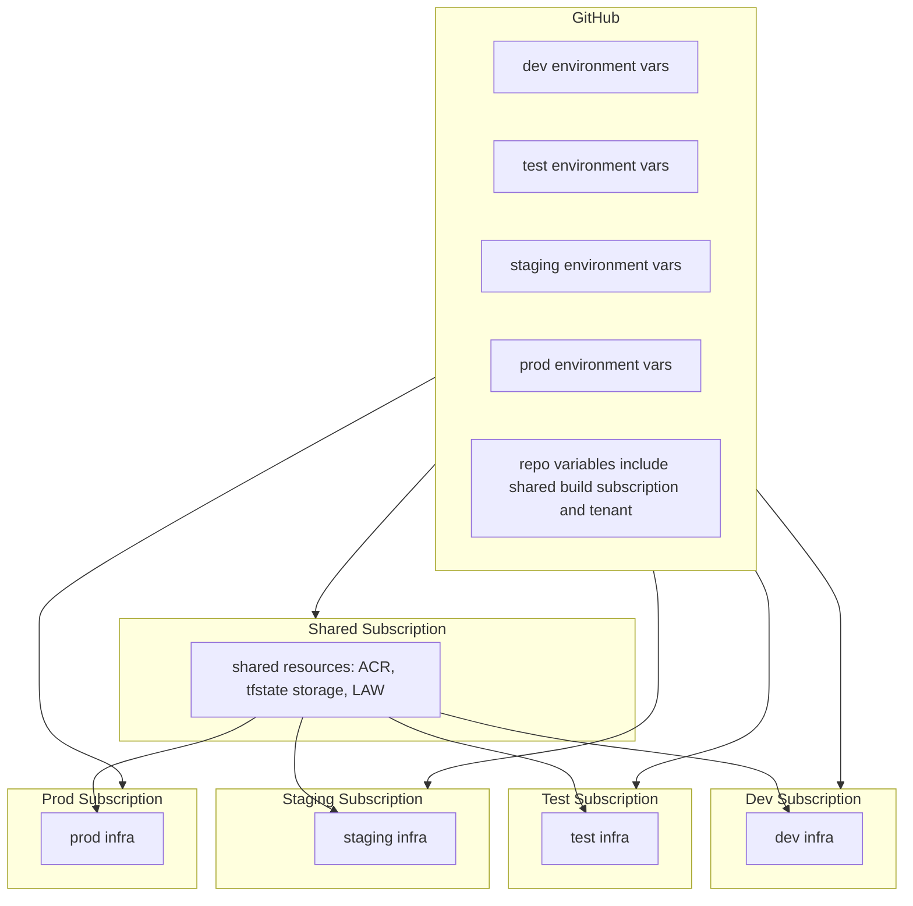

<!-- CLASSIFICATION: UNCLASSIFIED -->

# 11 - Multi-Subscription Architecture Model (Dev, Test, Staging, Prod)

> Parent: [README](README.md) · Next: [12 Multi-Subscription Implementation Plan](12-multi-subscription-migration-plan.md)
> Classification: UNCLASSIFIED · Status: Design baseline

---

## 1. Executive Summary

The target deployment model uses one shared subscription for common services and one
subscription per environment for dev, test, staging, and prod.

This preserves the existing CI/CD architecture and digest-based promotion model while
giving each environment its own security, quota, and governance boundary.

The model depends on four aligned areas:

1. Identity and RBAC scoping
2. Workflow variable model
3. Terraform provider and backend subscription wiring
4. Bootstrap outputs and automation scripts

---

## 2. Architecture Model

### 2.1 GitHub and Azure wiring

---

## 3. Implementation Touchpoints

The following implementation points anchor the multi-subscription model:

1. Bootstrap defines the shared and environment subscription inputs:
   [infra/terraform/bootstrap/variables.tf](infra/terraform/bootstrap/variables.tf#L4)
2. Bootstrap tfvars define the shared subscription and environment mappings:
   [infra/terraform/bootstrap/terraform.tfvars](infra/terraform/bootstrap/terraform.tfvars#L4)
3. Bootstrap outputs expose the values needed to seed GitHub variables:
   [infra/terraform/bootstrap/outputs.tf](infra/terraform/bootstrap/outputs.tf#L49)
4. Setup script writes shared and environment-scoped variables:
   [scripts/azure/setup-github-environments.sh](../../scripts/azure/setup-github-environments.sh#L175)
5. Infra workflows read the environment subscription variable during plan/apply/destroy:
   [../../.github/workflows/infra-up.yml](../../.github/workflows/infra-up.yml#L36)
   [../../.github/workflows/infra-down.yml](../../.github/workflows/infra-down.yml#L62)
6. Helm deploy workflow logs into the environment subscription selected by the job:
   [../../.github/workflows/\_reusable/deploy-helm.yml](../../.github/workflows/_reusable/deploy-helm.yml#L45)
7. Bootstrap identity roles are scoped to the correct shared or environment subscription:
   [infra/terraform/bootstrap/identity.tf](infra/terraform/bootstrap/identity.tf#L14)

Also, only dev environment Terraform root currently exists:
[infra/terraform/environments](../../infra/terraform/environments)

---

## 4. Impact Analysis by System Layer

### 4.1 GitHub Actions and Variable Model

Impact:

- Environment jobs use their own subscription id.
- Build jobs use the shared subscription where ACR lives.

Required direction:

- Keep shared global variables only for true globals.
- Use environment-scoped AZURE_SUBSCRIPTION_ID values for deploy jobs.
- Add explicit shared-subscription variables when needed by bootstrap/state/ACR tasks.

### 4.2 Identity and RBAC

Impact:

- Per-environment managed identities receive role assignments in their target
  subscription scope.

Required direction:

- Each environment deploy identity gets Contributor and RBAC admin roles in its own
  target subscription.
- Identities also need cross-subscription access to shared resources:
  - tfstate storage blob data contributor
  - ACR pull or push roles as required

### 4.3 Terraform Providers and Data Sources

Impact:

- Environment roots use one default azurerm provider per environment.
- Shared resource lookups use the shared subscription context.

Required direction:

- Introduce provider aliases:
  - azurerm.env for environment subscription resources
  - azurerm.shared for shared subscription resources
- Bind shared data sources to azurerm.shared.

### 4.4 Terraform Backend (State)

Impact:

- State backend coordinates are provided dynamically, with explicit shared
  subscription context for backend access.

Required direction:

- Add explicit backend subscription variable and configure backend init accordingly.
- Keep one state key per environment.

### 4.5 Deployment and Promotion Model

Impact:

- Promotion logic remains valid because it is digest-based.

Required direction:

- No change to artifact immutability model.
- Ensure deployment identity for each environment logs into the correct subscription.

---

## 5. Design Options

| Option | Summary                                                                | Pros                                               | Cons                                | Recommendation                       |
| ------ | ---------------------------------------------------------------------- | -------------------------------------------------- | ----------------------------------- | ------------------------------------ |
| A      | Shared subscription for ACR and state + dedicated subscription per env | strong isolation, least privilege, controlled cost | moderate refactor work              | recommended                          |
| B      | Fully separate per-env including ACR and state per subscription        | maximum isolation                                  | highest complexity and ops overhead | optional for strict compliance later |

Recommended baseline: Option A.

---

## 6. Operational and Governance Effects

### 6.1 Security posture improvements

1. Blast-radius reduction by subscription boundary
2. Cleaner RBAC and change accountability
3. Better production control with separate billing and policy scopes

### 6.2 Cost and quota implications

1. Separate quota pools per subscription can reduce contention.
2. Cost reporting becomes easier by environment.
3. Shared ACR and state keep baseline spend centralized and lower.

### 6.3 Reliability implications

1. Reduced chance that non-prod operations impact prod limits.
2. Clearer failure domains for infra-up and infra-down.
3. Slightly more pipeline variable complexity.

---

## 7. Risks and Mitigations

| Risk                                               | Likelihood | Impact | Mitigation                                               |
| -------------------------------------------------- | ---------- | ------ | -------------------------------------------------------- |
| Misconfigured subscription ids in environment vars | medium     | high   | validation job before terraform plan                     |
| Missing RBAC cross-subscription role assignments   | high       | high   | bootstrap conformance checks and scripted verification   |
| Backend auth failure to shared tfstate             | medium     | high   | explicit backend subscription configuration              |
| Drift between docs and implementation              | high       | medium | update docs in same PR as workflow and Terraform changes |

---

## 8. Readiness Checklist for Multi-Subscription Cutover

1. Test, staging, and prod Terraform roots created and validated.
2. Environment-level AZURE_SUBSCRIPTION_ID values configured.
3. Build identity and deploy identities separated by responsibility.
4. Bootstrap maps each environment to its target subscription and applies RBAC per scope.
5. Provider aliasing implemented and tested in environment roots.
6. Backend init tested from GitHub Actions and local CLI.
7. Non-prod and prod promotion dry-run executed successfully.

---

## 9. Documents that must align with this model

This model requires coordinated updates in the existing Azure docs set:

1. [05-devops-cicd-and-environments.md](05-devops-cicd-and-environments.md)
2. [06-iac-terraform-and-lifecycle.md](06-iac-terraform-and-lifecycle.md)
3. [09-operator-runbook-manual-validation.md](09-operator-runbook-manual-validation.md)
4. [10-getting-started-guide.md](10-getting-started-guide.md)
5. [README.md](README.md)

Detailed implementation plan and exact document delta are in:
[12-multi-subscription-migration-plan.md](12-multi-subscription-migration-plan.md)
