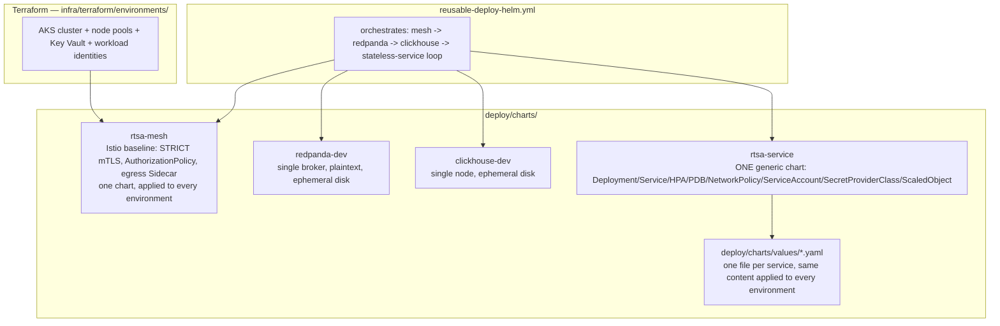

<!-- CLASSIFICATION: UNCLASSIFIED -->

# 13 — Workload Deployment Design

> **Parent**: [README](README.md) · **Prev**: [12 Multi-Subscription Migration Plan](12-multi-subscription-migration-plan.md)
> **Classification**: UNCLASSIFIED · **Status**: DRAFT FOR REVIEW

---

## 1. Purpose

This document describes **how the Helm deployment layer is actually designed today** for the RTSA walking skeleton on Azure, the **gaps** in that design, and the **proposed target design** to close them. It complements [03-technology-options-and-decisions.md](03-technology-options-and-decisions.md) (which records _what_ was decided — DL-08 Redpanda, DL-09 ClickHouse) with _how_ those decisions are implemented (or not yet implemented) in Helm.

**Note on scope**: only 6 of the ~18 architecture services are packaged in Helm today (the ingestion/hot-path "walking skeleton" — `svc-radar-ingestion`, `svc-fusion-engine`, `svc-track`, `svc-query`, `svc-webtransport`, `web-cop-gpu`). This is an **intentional scoping decision** (per [07-implementation-roadmap.md](07-implementation-roadmap.md) P2 "walking skeleton"), not a gap — it is not addressed by this document.

---

## 2. Existing Design

### 2.1 Chart layering



### 2.2 The generic `rtsa-service` chart

Every stateless service (`svc-radar-ingestion`, `svc-fusion-engine`, `svc-track`, `svc-query`, `svc-webtransport`, `web-cop-gpu`) reuses **one** chart — [deploy/charts/rtsa-service](../../../deploy/charts/rtsa-service) — differentiated purely by:

```bash
helm upgrade --install "$svc" deploy/charts/rtsa-service \
  -f "deploy/charts/values/$svc.yaml" \
  --set image.repository="$ACR.azurecr.io/$svc" \
  --set image.tag="$svc_tag"
```

Adding a new service means adding one values file, never a new chart. Templates cover `Deployment`, `Service`, `HorizontalPodAutoscaler`, `PodDisruptionBudget`, `NetworkPolicy`, `ServiceAccount` (with Azure Workload Identity annotations), `SecretProviderClass` (Key Vault CSI), and `ScaledObject` (KEDA).

### 2.3 Universal deploy decision (ACR-diff based)

Deployment no longer depends on git-diff/path-filter tracking. For every one of the 6 stateless services, [scripts/azure/resolve-deploy-tag.sh](../../../scripts/azure/resolve-deploy-tag.sh) implements a single universal rule:

- **not deployed yet** → deploy the latest tag actually pushed to ACR (via [resolve-acr-tag.sh](../../../scripts/azure/resolve-acr-tag.sh))
- **already deployed** → only redeploy if ACR has a newer tag than what's currently running; otherwise skip

This runs identically whether triggered by `cd-build.yml` (auto-deploy to `dev` on merge to `main`) or `cd-deploy.yml` (manual promotion to any environment) — no `image-tag`/`go-services`/`deploy-web` parameters are required from the caller.

### 2.4 Stateful & mesh components

`rtsa-mesh` (Istio), `redpanda` (event backbone), and `clickhouse` (OLAP) are **always** `helm upgrade --install`-ed unconditionally on every deploy run — they don't participate in the ACR-diff logic above because they aren't sourced from this repo's ACR builds at all. Their image versions are pinned directly in each chart's own `values.yaml` (e.g. `redpanda-dev` pins `docker.redpanda.com/redpandadata/redpanda:v24.2.7`).

### 2.5 Environment differentiation today

| Layer                                      | How it varies per environment today                                                                                                                                                       |
| ------------------------------------------ | ----------------------------------------------------------------------------------------------------------------------------------------------------------------------------------------- |
| Infrastructure (Terraform)                 | Fully parameterized — `infra/terraform/environments/<env>/<env>.tfvars` per environment                                                                                                   |
| GitHub Environment variables               | Parameterized — `AKS_CLUSTER_NAME`, `ACR_NAME`, `KEY_VAULT_NAME`, `WEBTRANSPORT_IDENTITY_CLIENT_ID`, `ISTIO_REVISION`, protection rules (required reviewers/wait timers for staging/prod) |
| Helm chart selection for stateful services | **Not parameterized** — same `redpanda-dev`/`clickhouse-dev` chart regardless of environment                                                                                              |
| Helm values for stateless services         | **Not parameterized** — same `deploy/charts/values/<svc>.yaml` content regardless of environment                                                                                          |

---

## 3. Gaps

### Gap 1 — No production-grade Redpanda/ClickHouse chart

`redpanda-dev`/`clickhouse-dev` are single-broker/single-node, ephemeral-disk charts explicitly designed for a cost-optimized, nightly-torn-down `dev` environment. [DL-08/DL-09](03-technology-options-and-decisions.md) already call for 3-broker RF=3 Redpanda and sharded+replicated ClickHouse in staging/prod — but no chart implementing that exists. Running `cd-deploy.yml` against `staging`/`prod` today would deploy the exact same single-instance, no-redundancy topology used for throwaway dev testing.

### Gap 2 — No environment-specific values overlays

Every stateless service's Spot-node `nodeSelector`/`tolerations`, small `resources.requests/limits`, and `replicaCount: 1` sizing is baked directly into `deploy/charts/values/<svc>.yaml` with no environment awareness. The same file is the only one `reusable-deploy-helm.yml` ever references, regardless of target environment.

Both gaps share the same underlying cause: **the deploy layer was built for the `dev` walking skeleton only, and environment-awareness for `test`/`staging`/`prod` was deferred.**

---

## 4. Proposed Design

The full remediation plan — industry best-practice options considered, target design, migration phases, and acceptance criteria — is documented separately:

**→ [Production-Grade Stateful Charts & Environment Value Overlays — Remediation Plan](../production-grade-stateful-and-environment-overlay-plan.md)**

Summary of the target state it defines:

1. **Redpanda**: keep `redpanda-dev` for `dev`/`test`; adopt the official Redpanda Operator + Helm chart (3 brokers, RF=3, PodAntiAffinity, PDB, tiered storage to Blob) for `staging`/`prod`.
2. **ClickHouse**: keep `clickhouse-dev` for `dev`/`test`; adopt the Altinity `clickhouse-operator` (`ClickHouseInstallation` CRD — sharded + replicated, Keeper ensemble, PDB, backup to Blob) for `staging`/`prod`.
3. **Environment overlays**: split `deploy/charts/values/<svc>.yaml` into `values/base/<svc>.yaml` (shared defaults) + `values/overlays/<env>/<svc>.yaml` (environment deltas only), layered via Helm's native multi-`-f` deep merge — mirroring the same `environments/<env>/<env>.tfvars` pattern already used for Terraform.
4. **Deploy workflow**: `reusable-deploy-helm.yml` becomes environment-conditional for stateful chart selection and always layers `base/` + `overlays/$ENVIRONMENT/` (when present) for stateless services — fully backward compatible with `dev`'s current behavior.

Migration is phased (M1–M6) and independently reversible at every step; see the linked plan for full detail, risk/rollback notes, and acceptance criteria.
