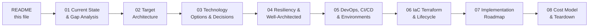
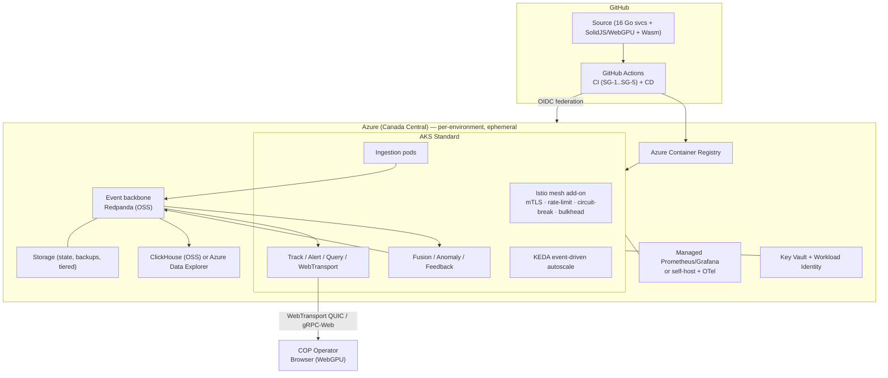

<!-- CLASSIFICATION: UNCLASSIFIED -->

# RTSA on Azure — DevOps & Deployment Plan

> **Document**: RTSA Azure Deployment Program — Master Index
> **Status**: DRAFT FOR REVIEW (design & technology options open for finalization)
> **Classification**: UNCLASSIFIED
> **Owner**: Platform / DevOps
> **Last Updated**: 2026-07-27

---

## 1. Purpose

This plan describes how to deploy the RTSA platform to **Microsoft Azure** as an
**event-driven microservices** system on **Azure Kubernetes Service (AKS)**, aligned to
the **Azure Well-Architected Framework (WAF)**, with a **fully automated SDLC** (Development →
Testing → Staging → Production) driven by **DevOps / CI-CD**.

The plan is written to be **discussed and finalized before implementation**. Every
significant design or technology choice is presented with options, trade-offs, cost,
and a recommendation. Confirmed decisions and open decisions are tracked in the
[Decision Log](#5-decision-log).

## 2. Goals & Guardrails (confirmed with stakeholder)

| #   | Requirement                                    | Confirmed direction                                                                      |
| --- | ---------------------------------------------- | ---------------------------------------------------------------------------------------- |
| G1  | Event-driven microservices on Azure            | AKS + Redpanda OSS event backbone                                                        |
| G2  | Azure Well-Architected Framework               | Baseline landing zone, five-pillar mapping ([04](04-resiliency-and-well-architected.md)) |
| G3  | Full SDLC automation (Dev/Test/Staging/Prod)   | GitHub Actions + GitOps, GitHub Environments approvals                                   |
| G4  | Start from an Azure **baseline** architecture  | Baseline landing zone first, enterprise hardening later                                  |
| G5  | Personal **Pay-As-You-Go** subscription        | Cost-first, no upfront licensing (OSS / consumption PaaS)                                |
| G6  | **Production-ready & reusable for enterprise** | Parameterized Terraform modules, reusable workflows                                      |
| G7  | **Ephemeral** environments                     | Automated **spin-up / tear-down** (`apply` / `destroy`)                                  |
| G8  | Resiliency **out of application code**         | Rate limiting, circuit breakers, bulkheads via mesh/infra                                |
| G9  | Cost is the primary constraint (time is not)   | Spot nodes, scale-to-zero, TTL teardown, budgets/alerts                                  |
| G10 | Baseline scope                                 | Walking skeleton (vertical slice) → scale to all 16 services                             |
| G11 | GPU / AI inference                             | **Deferred** — CPU-only / stubbed in baseline                                            |

## 3. How to Read This Plan

| Doc                                          | Title                          | What it answers                                                   |
| -------------------------------------------- | ------------------------------ | ----------------------------------------------------------------- |
| [01](01-current-state-and-gap-analysis.md)   | Current State & Gap Analysis   | What exists today; what is missing for Azure                      |
| [02](02-target-architecture.md)              | Target Azure Architecture      | The baseline event-driven architecture on AKS                     |
| [03](03-technology-options-and-decisions.md) | Technology Options & Decisions | Streaming, OLAP, mesh, ingress, secrets, observability trade-offs |
| [04](04-resiliency-and-well-architected.md)  | Resiliency & Well-Architected  | Five WAF pillars + rate limiting / circuit breakers / bulkheads   |
| [05](05-devops-cicd-and-environments.md)     | DevOps, CI/CD & Environments   | GitHub Actions pipelines, environments, GitOps, promotion         |
| [06](06-iac-terraform-and-lifecycle.md)      | IaC (Terraform) & Lifecycle    | Module structure, remote state, spin-up/tear-down automation      |
| [07](07-implementation-roadmap.md)           | Implementation Roadmap         | Phased delivery with milestones and acceptance criteria           |
| [08](08-cost-model-and-teardown.md)          | Cost Model & Teardown          | Per-environment cost, ephemeral savings, cost governance          |

## 4. Solution at a Glance

## 5. Decision Log

Legend: ✅ Confirmed · 🔵 Recommended (open for discussion) · ⚪ Open (needs decision)

| ID    | Decision                | Status | Choice / Recommendation                                                                 | Detail                                                                        |
| ----- | ----------------------- | ------ | --------------------------------------------------------------------------------------- | ----------------------------------------------------------------------------- |
| DL-01 | CI/CD platform          | ✅     | GitHub Actions                                                                          | [05](05-devops-cicd-and-environments.md)                                      |
| DL-02 | IaC tool                | ✅     | Terraform                                                                               | [06](06-iac-terraform-and-lifecycle.md)                                       |
| DL-03 | First scope             | ✅     | Baseline walking skeleton                                                               | [07](07-implementation-roadmap.md)                                            |
| DL-04 | GPU inference           | ✅     | Deferred (CPU/stub)                                                                     | [02](02-target-architecture.md)                                               |
| DL-05 | Region                  | ✅     | Canada Central (parameterized)                                                          | [02](02-target-architecture.md)                                               |
| DL-06 | Environment model       | ✅     | Ephemeral, automated up/down                                                            | [06](06-iac-terraform-and-lifecycle.md)                                       |
| DL-07 | Orchestrator            | ✅     | AKS **Standard** (control for spot + bulkhead pools)                                    | [03](03-technology-options-and-decisions.md#1-orchestrator-aks-sku)           |
| DL-08 | Event backbone          | ✅     | **Redpanda OSS on AKS — all environments** (single-broker dev · 3-broker RF=3 stg/prod) | [03](03-technology-options-and-decisions.md#2-event-backbone)                 |
| DL-09 | OLAP store              | ✅     | ClickHouse OSS on AKS · ADX alternative                                                 | [03](03-technology-options-and-decisions.md#3-olap-store)                     |
| DL-10 | Service mesh            | ✅     | Managed **Istio** add-on (resiliency + mTLS)                                            | [03](03-technology-options-and-decisions.md#4-service-mesh--resiliency-plane) |
| DL-11 | Ingress (cold path)     | ✅     | Istio ingress gateway + optional Front Door/WAF                                         | [03](03-technology-options-and-decisions.md#5-ingress--edge)                  |
| DL-12 | Hot path (WebTransport) | ✅     | Standard LB + UDP/443 (bypasses Front Door)                                             | [02](02-target-architecture.md#7-hot-path--cold-path-hosting)                 |
| DL-13 | Secrets & identity      | ✅     | Key Vault + Entra Workload ID + CSI driver                                              | [03](03-technology-options-and-decisions.md#6-secrets--identity)              |
| DL-14 | Observability           | ✅     | Azure Managed Prometheus/Grafana · self-host alt                                        | [03](03-technology-options-and-decisions.md#7-observability)                  |
| DL-15 | GitOps engine           | ✅     | Flux (lightweight) · ArgoCD alt · pipeline-Helm                                         | [05](05-devops-cicd-and-environments.md#4-gitops--promotion)                  |
| DL-16 | Autoscaling             | ✅     | KEDA (event lag) + Cluster Autoscaler                                                   | [04](04-resiliency-and-well-architected.md)                                   |

> **Status:** all decisions confirmed ✅. Per user direction DL-08 is set to **Redpanda OSS in all environments** (single-broker dev, 3-broker RF=3 staging/prod).
> Nothing is built until these are agreed.

## 6. Out of Scope (baseline)

- GPU-backed AI inference and model training at scale (deferred; see [02](02-target-architecture.md))
- Tactical **edge / air-gapped** deployment (already documented for on-prem in `docs/architecture/deployment_architecture.md`; Azure Arc bridge is a future phase)
- NATO STANAG live interoperability endpoints (adapter deploys; live peers are external)
- Production classified-data handling — this repository and plan remain **UNCLASSIFIED**

## 7. Related Existing Documentation

| Topic                             | Path                                                                     |
| --------------------------------- | ------------------------------------------------------------------------ |
| Canonical architecture (v1)       | `docs/architecture/v1/RTSA_WebGPU_Architecture_v1.md`                    |
| On-prem/edge deployment           | `docs/architecture/deployment_architecture.md`                           |
| CI/CD security gates (SG-1..SG-5) | `docs/sdlc_guidelines/06_integration_cicd/ci_cd_pipeline.md`             |
| Branching strategy                | `docs/sdlc_guidelines/06_integration_cicd/branching_strategy.md`         |
| Deployment guidelines             | `docs/sdlc_guidelines/07_deployment_operations/deployment_guidelines.md` |
| Security & compliance             | `docs/sdlc_guidelines/01_security_compliance/`                           |
| WebTransport runbook              | `docs/deployment/webtransport-runbook.md`                                |
