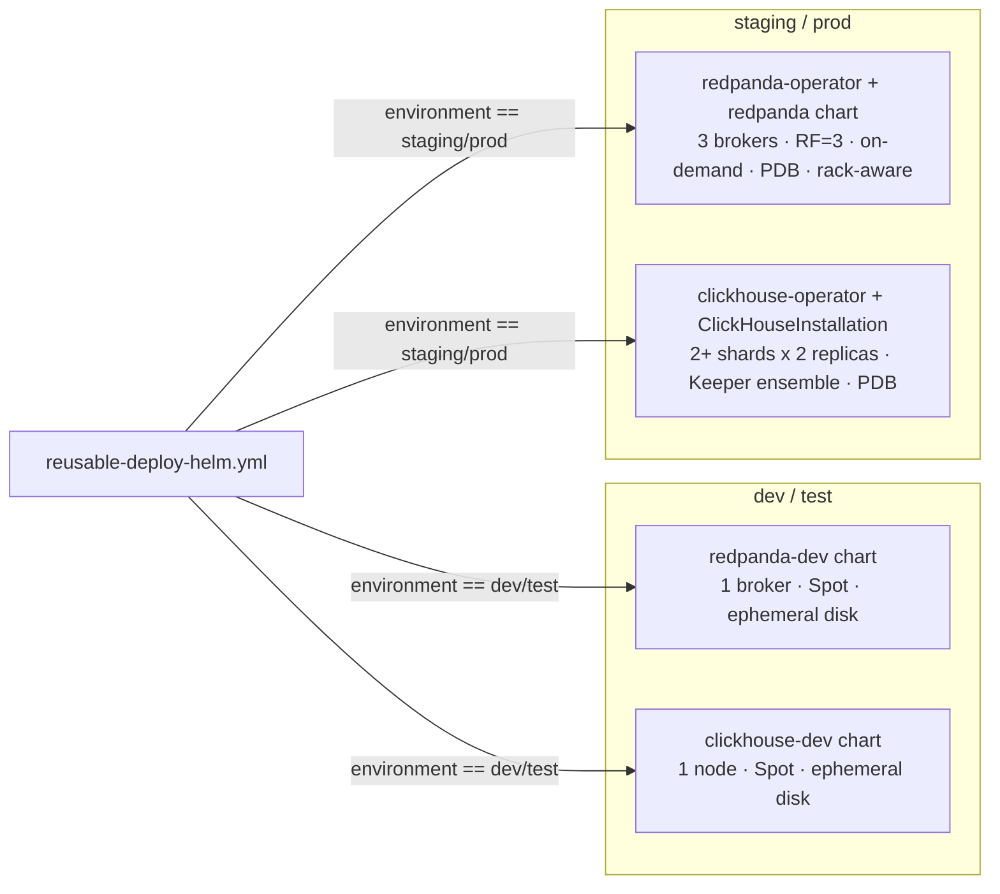

<!-- CLASSIFICATION: UNCLASSIFIED -->

# Remediation Plan — Production-Grade Stateful Charts & Environment Value Overlays

> **Parent**: [docs/deployment/azure/13-workload-deployment-design.md](azure/13-workload-deployment-design.md)
> **Classification**: UNCLASSIFIED · **Status**: PROPOSED — pending review
> **Owner**: Platform / DevOps

---

## 1. Scope

This plan closes two specific, previously identified design gaps in the Helm deployment layer:

1. **No production-grade Redpanda / ClickHouse chart** — only `redpanda-dev` / `clickhouse-dev` exist (single-broker / single-node, ephemeral-disk, cost-optimized for a torn-down-nightly `dev` environment). There is no chart suitable for `staging`/`prod`.
2. **No environment-specific Helm values overlays** — every stateless service's `deploy/charts/values/<service>.yaml` is applied identically regardless of target environment. Dev's Spot-node tolerations, small resource requests, and single-replica sizing would be applied verbatim if `cd-deploy.yml` were run against `staging`/`prod` today.

Both gaps were already anticipated at the design-decision level — [03-technology-options-and-decisions.md](azure/03-technology-options-and-decisions.md) **DL-08** and **DL-09** explicitly call for "3 brokers RF=3" Redpanda and "sharded+replicated" ClickHouse in staging/prod — but neither was ever implemented in Helm. This plan turns those decisions into a concrete build/migration plan using industry-standard patterns.

Out of scope: the 12 architecture services not yet packaged in Helm at all (`svc-ew-ingestion`, `svc-anomaly-detection`, etc.) — that is an intentional, separate scoping decision, not a gap being addressed here.

---

## 2. Industry Best Practices Considered

### 2.1 Redpanda in Kubernetes

| Option                                                                         | Description                                                                                                                                                                       | Verdict                                                                                                                                 |
| ------------------------------------------------------------------------------ | --------------------------------------------------------------------------------------------------------------------------------------------------------------------------------- | --------------------------------------------------------------------------------------------------------------------------------------- |
| **Redpanda Operator + official `redpanda` Helm chart** (Redpanda Data)         | CRD-driven (`Cluster`), manages StatefulSet, PDB, rack-awareness, TLS, SASL, tiered storage, rolling upgrades, and broker decommissioning natively. Actively maintained upstream. | ✅ **Recommended for staging/prod**                                                                                                     |
| Hand-rolled StatefulSet (current `redpanda-dev` pattern, scaled to 3 replicas) | Full control, minimal dependencies, but reimplements rack-awareness, safe rolling restarts, and decommissioning logic that the operator already solves correctly.                 | Keep for **dev/test only** — matches DL-08's "single broker, cheap, torn down with the environment" intent; not worth hardening for HA. |
| Managed Kafka-API service (Azure Event Hubs)                                   | Ruled out already in DL-08 (loses Wasm anti-poisoning transform parity, Azure-locked).                                                                                            | ❌ Rejected (already decided)                                                                                                           |

**Decision**: adopt the official Redpanda Helm chart for `staging`/`prod`, keep the existing lightweight `redpanda-dev` chart unchanged for `dev`/`test`.

### 2.2 ClickHouse in Kubernetes

| Option                                                                 | Description                                                                                                                                                                                         | Verdict                                                                   |
| ---------------------------------------------------------------------- | --------------------------------------------------------------------------------------------------------------------------------------------------------------------------------------------------- | ------------------------------------------------------------------------- |
| **Altinity `clickhouse-operator`** (CRD: `ClickHouseInstallation`)     | Industry-standard operator for ClickHouse on Kubernetes; manages sharding, replication, `ClickHouse Keeper` (or ZooKeeper) ensemble for replica coordination, rolling upgrades, and per-shard PVCs. | ✅ **Recommended for staging/prod**                                       |
| Hand-rolled StatefulSet (current `clickhouse-dev` pattern, scaled out) | Would require reimplementing shard/replica topology config, Keeper quorum management, and distributed-table DDL fan-out that the operator already provides.                                         | Keep for **dev/test only** — matches DL-09's "single node in dev" intent. |
| Azure Data Explorer (ADX)                                              | Ruled out already in DL-09 (forces a KQL rewrite of `svc-query` and Redpanda Connect ETL).                                                                                                          | ❌ Rejected (already decided)                                             |

**Decision**: adopt `clickhouse-operator` + `ClickHouseInstallation` CRD for `staging`/`prod`; keep `clickhouse-dev` unchanged for `dev`/`test`.

### 2.3 Environment-specific values

| Option                                                                              | Description                                                                                                                                                                           | Verdict                                                                                                                                                  |
| ----------------------------------------------------------------------------------- | ------------------------------------------------------------------------------------------------------------------------------------------------------------------------------------- | -------------------------------------------------------------------------------------------------------------------------------------------------------- |
| **Layered Helm `-f` value files** (base + per-environment overlay, later files win) | Native Helm behavior — no new tooling. Mirrors the project's own existing Terraform pattern (`environments/<env>/<env>.tfvars`).                                                      | ✅ **Recommended**                                                                                                                                       |
| Kustomize overlays on top of rendered Helm output (`helm template \| kustomize`)    | Powerful, but introduces a second templating engine and a `helm template`+`kubectl apply` flow that abandons Helm's release/rollback tracking (`helm history`, `helm rollback`).      | ❌ Rejected — unnecessary complexity for this project's scale                                                                                            |
| Helmfile (`environments:` blocks, per-env value composition)                        | Solves the same problem with more structure, but adds a new CLI/dependency to the pipeline for marginal benefit over native `-f` layering at this project's chart count (6 services). | ❌ Rejected for now — revisit if service count grows substantially (see [07-implementation-roadmap.md](azure/07-implementation-roadmap.md) P4 scale-out) |

**Decision**: adopt layered `-f base.yaml -f overlays/<env>/<service>.yaml`, Helm-native, no new tooling.

---

## 3. Proposed Target Design

### 3.1 Stateful services — chart selection by environment



`reusable-deploy-helm.yml`'s "Deploy Redpanda"/"Deploy ClickHouse" steps become environment-conditional:

```yaml
- name: Deploy Redpanda (event backbone)
  run: |
    if [[ "$ENVIRONMENT" == "dev" || "$ENVIRONMENT" == "test" ]]; then
      helm upgrade --install redpanda deploy/charts/redpanda-dev --namespace "$NS" --wait --timeout 10m
    else
      helm upgrade --install redpanda-operator deploy/charts/redpanda-operator --namespace "$NS" --wait --timeout 10m
      helm upgrade --install redpanda deploy/charts/redpanda-prod -f deploy/charts/redpanda-prod/values-${ENVIRONMENT}.yaml --namespace "$NS" --wait --timeout 15m
    fi
```

Same pattern for ClickHouse. Both `redpanda-prod`/`clickhouse-operator` charts are **new additions** under `deploy/charts/`; nothing existing is deleted or changed for dev/test.

**Production sizing (starting point, tune from real load in staging first):**

| Component           | dev/test              | staging/prod                                                                                                                                                  |
| ------------------- | --------------------- | ------------------------------------------------------------------------------------------------------------------------------------------------------------- |
| Redpanda brokers    | 1                     | 3, RF=3, `PodAntiAffinity` across nodes/zones                                                                                                                 |
| Redpanda storage    | ephemeral / small PVC | Premium managed-csi PVC per broker + tiered storage to Azure Blob for retention beyond local disk                                                             |
| Redpanda PDB        | none                  | `minAvailable: 2`                                                                                                                                             |
| ClickHouse topology | 1 node                | 2 shards × 2 replicas (4 pods) + 3-node Keeper ensemble                                                                                                       |
| ClickHouse storage  | ephemeral / small PVC | Premium managed-csi PVC per shard/replica + scheduled backup to Azure Blob (`clickhouse-backup` tool or native `BACKUP ... TO Disk` / S3-compatible endpoint) |
| ClickHouse PDB      | none                  | `minAvailable` = shard replica count − 1 per shard group                                                                                                      |

### 3.2 Environment value overlays — directory layout

```
deploy/charts/values/
  base/                          # NEW — shared defaults, env-agnostic
    svc-radar-ingestion.yaml
    svc-fusion-engine.yaml
    svc-track.yaml
    svc-query.yaml
    svc-webtransport.yaml
    web-cop-gpu.yaml
  overlays/                      # NEW — per-environment deltas only
    dev/
      svc-radar-ingestion.yaml    # Spot nodeSelector/tolerations, replicaCount=1, small resources
      ...
    test/
      ...                         # same shape as dev, may diverge as test needs grow
    staging/
      svc-radar-ingestion.yaml    # on-demand nodeSelector, replicaCount=2, PDB minAvailable=1
      ...
    prod/
      svc-radar-ingestion.yaml    # on-demand + zone-spread, replicaCount>=3, higher autoscaling ceiling
      ...
```

Overlay files contain **only the keys that differ** from base (Helm's native multi-`-f` value merge is a deep merge, so overlays don't need to repeat unchanged keys — e.g. `env:` entries, `probes:`, `ports:` stay in `base/` and are untouched by environment).

`reusable-deploy-helm.yml`'s deploy loop adds the overlay file conditionally:

```bash
value_files=(-f "deploy/charts/values/base/$svc.yaml")
overlay="deploy/charts/values/overlays/$ENVIRONMENT/$svc.yaml"
[[ -f "$overlay" ]] && value_files+=(-f "$overlay")

helm upgrade --install "$svc" deploy/charts/rtsa-service \
  "${value_files[@]}" \
  --namespace "$NS" \
  --set image.repository="$ACR.azurecr.io/$svc" \
  --set image.tag="$svc_tag" \
  ...
```

This is additive and backward compatible: if an environment has no overlay file yet, only `base/` applies (current dev behavior is preserved during migration by moving the existing `deploy/charts/values/<service>.yaml` content into `base/` verbatim, then extracting the Spot-specific bits into `overlays/dev/`).

---

## 4. Migration Plan (phased, low-risk)

| Phase  | Work                                                                                                                                                                                                                                                                                                         | Risk / Rollback                                                                                                                                |
| ------ | ------------------------------------------------------------------------------------------------------------------------------------------------------------------------------------------------------------------------------------------------------------------------------------------------------------ | ---------------------------------------------------------------------------------------------------------------------------------------------- |
| **M1** | Split existing `deploy/charts/values/<svc>.yaml` into `base/<svc>.yaml` (everything) + `overlays/dev/<svc>.yaml` (Spot nodeSelector/tolerations only, since that's the only genuinely dev-specific content today). Update `reusable-deploy-helm.yml` to layer both.                                          | Zero behavior change for `dev` — verify via `helm diff` (or `helm template` before/after comparison) producing an identical rendered manifest. |
| **M2** | Author `overlays/staging/<svc>.yaml` and `overlays/prod/<svc>.yaml` with on-demand node selectors, higher `resources.requests/limits`, higher `replicaCount`/HPA ceilings, and `PodDisruptionBudget.minAvailable` tuned per service.                                                                         | No effect until `test`/`staging`/`prod` are actually provisioned — purely additive files.                                                      |
| **M3** | Introduce `deploy/charts/redpanda-operator` + `deploy/charts/redpanda-prod` (values only, chart wraps upstream Redpanda Helm chart as a dependency). Validate in a throwaway `test` environment: kill a broker pod, confirm RF=3 survives with zero data loss and automatic re-replication.                  | Fully isolated — `redpanda-dev` untouched; rollback is `helm uninstall` in the test namespace.                                                 |
| **M4** | Introduce `deploy/charts/clickhouse-operator` + `ClickHouseInstallation` manifests for the sharded/replicated topology. Validate in `test`: confirm distributed table DDL fans out to both shards, kill a replica pod, confirm Keeper-coordinated failover.                                                  | Fully isolated — `clickhouse-dev` untouched.                                                                                                   |
| **M5** | Wire environment-conditional chart selection into `reusable-deploy-helm.yml` (dev/test → existing dev charts, staging/prod → new operator-backed charts). Update [09-operator-runbook-manual-validation.md](azure/09-operator-runbook-manual-validation.md) with the new verification steps for HA failover. | Gate behind a `staging` dry-run promotion before enabling for `prod`.                                                                          |
| **M6** | Update [07-implementation-roadmap.md](azure/07-implementation-roadmap.md) P5 exit criteria to reference this plan as complete; retire this document's "PROPOSED" status once M1–M5 are merged and validated.                                                                                                 | —                                                                                                                                              |

Each phase is independently mergeable and reversible; none requires downtime for `dev` (the environment currently in active use).

---

## 5. Acceptance Criteria

- [ ] `helm template` output for `dev` is byte-identical before/after the `base/`+`overlays/dev/` split (M1).
- [ ] A `staging` (or throwaway `test`) Redpanda deployment survives a single-broker pod deletion with zero message loss and automatic re-replication (M3).
- [ ] A `staging` ClickHouse deployment survives a single-replica pod deletion with automatic Keeper-coordinated failover and no query downtime on the surviving replica (M4).
- [ ] `cd-deploy.yml` run against `staging` deploys on-demand nodes with `staging`-sized resources/replicas, not dev's Spot/small-resource configuration (M5).
- [ ] [09-operator-runbook-manual-validation.md](azure/09-operator-runbook-manual-validation.md) documents the HA failover validation steps for both stateful components (M5).
