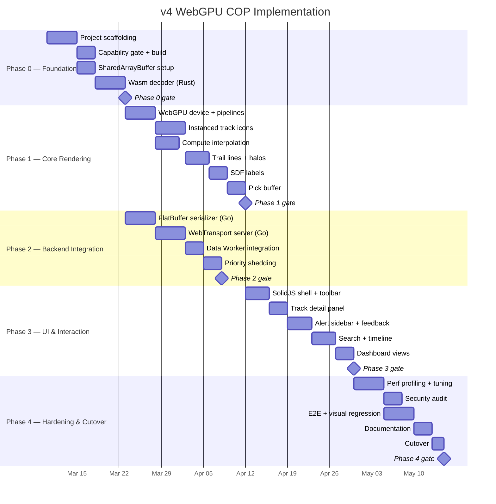
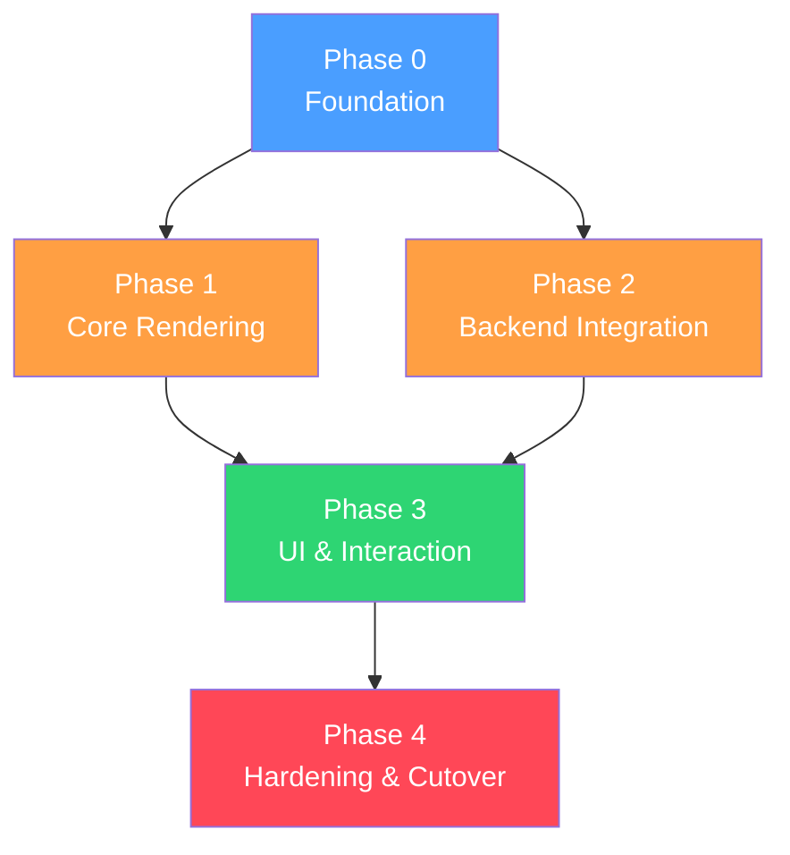

<!-- CLASSIFICATION: UNCLASSIFIED -->
# v4 Implementation Plan — WebGPU COP

> **Document**: RTSA v4 Implementation Plan Overview
> **Version**: 1.0
> **Classification**: UNCLASSIFIED
> **Last Updated**: 2026-03-05
> **Authoritative Source**: `docs/architecture/v1/RTSA_WebGPU_Architecture_v1.md`

---

## 1. Purpose

This document organises the implementation of the WebGPU Common Operating Picture (COP) into five time-boxed phases. Each phase is self-contained, delivers a testable milestone, and has an explicit "done" gate.

> **Scope**: This plan covers the **browser frontend and supporting backend additions** only. Existing Go microservices, Redpanda topics, ClickHouse schemas, and the gRPC cold path are unchanged unless explicitly noted.

---

## 2. Phase Overview

> **Note**: Phase 1 and Phase 2 run in parallel once Phase 0 is complete.

---

## 3. Phase Index

| Phase | Title | Document | Key Deliverables |
|---|---|---|---|
| **0** | Foundation | [phase0_foundation.md](phase0_foundation.md) | `web-cop-gpu/` scaffold, Vite + SolidJS, capability gate, SharedArrayBuffer, Rust Wasm decoder |
| **1** | Core Rendering | [phase1_core_rendering.md](phase1_core_rendering.md) | WebGPU device, all pipelines (icons, trails, halos, labels), compute shaders, pick buffer |
| **2** | Backend Integration | [phase2_backend_integration.md](phase2_backend_integration.md) | Go FlatBuffer serializer, Go WebTransport server, Data Worker, priority shedding |
| **3** | UI & Interaction | [phase3_ui_interaction.md](phase3_ui_interaction.md) | SolidJS overlay components, track detail, alerts, feedback, search, dashboards |
| **4** | Hardening & Cutover | [phase4_hardening_cutover.md](phase4_hardening_cutover.md) | Perf tuning, security audit, E2E tests, visual regression, documentation, production cutover |

---

## 4. Dependencies Between Phases

- **Phase 1 and Phase 2 are parallel** — rendering pipeline and backend pipeline can be developed independently
- Phase 1 uses **mock data** (generated in Render Worker) until Phase 2 delivers real WebTransport data
- Phase 3 requires both Phase 1 (canvas to click on) and Phase 2 (live data) to be complete
- Phase 4 is the final integration, hardening, and cutover phase

---

## 5. Architecture References

All implementation must conform to:

| Document | Path | Sections |
|---|---|---|
| v1 Architecture (canonical) | `docs/architecture/v1/RTSA_WebGPU_Architecture_v1.md` | All sections |
| High-Level Architecture | `docs/architecture/high_level_architecture.md` | Dual-protocol, tech stack |
| Component Design | `docs/architecture/component_design.md` | Thread model, pipelines |
| Data Architecture | `docs/architecture/data_architecture.md` | §12 hot-path wire format |
| Security Architecture | `docs/architecture/security_architecture.md` | §13–16 browser security |
| SolidJS Standards | `docs/sdlc_guidelines/04_coding_standards/solidjs_standards.md` | All sections |
| WebGPU Guidelines | `docs/sdlc_guidelines/08_tech_specific/webgpu_guidelines.md` | All sections |
| WGSL Shader Standards | `docs/sdlc_guidelines/08_tech_specific/wgsl_shader_standards.md` | All sections |
| FlatBuffers Guidelines | `docs/sdlc_guidelines/08_tech_specific/flatbuffers_guidelines.md` | All sections |
| WebTransport Guidelines | `docs/sdlc_guidelines/08_tech_specific/webtransport_guidelines.md` | All sections |

---

## 6. Testing Strategy Per Phase

| Phase | Test Type | Coverage Target |
|---|---|---|
| 0 | Unit tests for Wasm decoder, capability gate | 80%+ line coverage |
| 1 | Compute shader output tests, visual regression baselines | All shaders tested |
| 2 | Go unit tests, integration tests (WebTransport + FlatBuffer round-trip) | 80%+ line coverage |
| 3 | SolidJS component tests (`@solidjs/testing-library`), Playwright E2E | 80%+ components |
| 4 | Full E2E suite, perf benchmarks (50k tracks @ 60 FPS), security scan | Pass all gates |

---

## 7. Risk Register

| Risk | Impact | Mitigation |
|---|---|---|
| Browser WebGPU support gaps | High | Capability gate (Phase 0), Chrome/Edge priority, degrade gracefully |
| WebTransport blocked by enterprise proxy | Medium | Fallback to gRPC-Web streaming (existing cold path) |
| 50k track perf target not met | High | Profiling in Phase 4, reduce visible layers, LOD system |
| Rust Wasm decoder size | Low | `opt-level = "s"`, tree-shaking, target < 100 KB |
| SharedArrayBuffer requires cross-origin isolation | Medium | COOP/COEP headers in Phase 0, test in CI |
