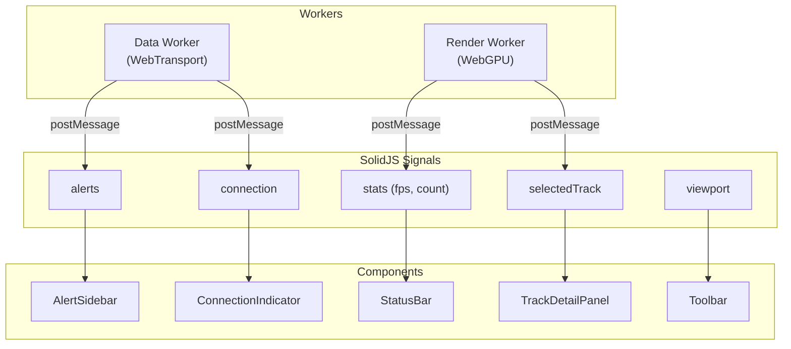

<!-- CLASSIFICATION: UNCLASSIFIED -->

# Phase 3 — UI & Interaction

> **Document**: v4 Implementation — Phase 3
> **Version**: 1.0
> **Classification**: UNCLASSIFIED
> **Status**: Not Started
> **Prerequisite Phases**: Phase 1 (Core Rendering), Phase 2 (Backend Integration)
> **Parallel With**: —
> **Architecture Reference**: `docs/architecture/v1/RTSA_WebGPU_Architecture_v1.md` §7, §8

---

## 1. Objective

Build the SolidJS overlay UI — shell, toolbar, track detail panel, alert sidebar, feedback form, search, timeline, and role-based dashboard views — connecting all components to the WebGPU canvas and live data streams.

---

## 2. Deliverables

| #     | Deliverable        | Description                                            |
| ----- | ------------------ | ------------------------------------------------------ |
| U3-1  | App shell          | Classification banner, role selector, layout grid      |
| U3-2  | Toolbar            | Dashboard selector, connection indicator, FPS counter  |
| U3-3  | Track detail panel | Selected track info from pick buffer + gRPC query      |
| U3-4  | Alert sidebar      | Live alert list from Data Worker + acknowledge flow    |
| U3-5  | Feedback form      | Operator feedback submission via gRPC cold path        |
| U3-6  | Search overlay     | Track search with QueryBuilder, results via gRPC       |
| U3-7  | Event timeline     | Historical event browser via ClickHouse query          |
| U3-8  | Status bar         | Track count, FPS, connection state, latency            |
| U3-9  | Dashboard views    | Sensor Operator, Operations Commander role views       |
| U3-10 | Component tests    | `@solidjs/testing-library` + Vitest for all components |
| U3-11 | E2E tests          | Playwright tests for key user workflows                |

---

## 3. Detailed Tasks

### U3-1: App Shell

- `ClassificationBanner` — static banner from `VITE_CLASSIFICATION_LEVEL`
- `AppShell` — CSS grid layout: banner (top), toolbar (left), canvas (center), panels (right/bottom)
- Canvas element sized to fill available space, transferred to Render Worker
- Reference: `docs/sdlc_guidelines/04_coding_standards/solidjs_standards.md` §2

### U3-2: Toolbar

- `RoleSelector` — switch between Sensor Operator / Operations Commander
- `DashboardSelector` — select active dashboard view
- `ConnectionIndicator` — WebTransport (+gRPC) connection status from signals
- Uses signals from `src/signals/connection.ts`

### U3-3: Track Detail Panel

- Appears when operator clicks track on WebGPU canvas
- Pick buffer returns `track_id_hash` → Render Worker → Main Thread
- Main Thread queries full track detail via gRPC cold path (`QueryService.GetTrack`)
- Panel shows: track type, position, speed, heading, classification, source, history
- Uses `selectedTrack` signal from `src/signals/track.ts`

### U3-4: Alert Sidebar

- Live alert list pushed from Data Worker (via WebTransport reliable stream or gRPC subscription)
- Sortable by severity, time
- Acknowledge button → gRPC `AlertService.AcknowledgeAlert`
- Uses `alerts` signal from `src/signals/alerts.ts`
- Reference: `solidjs_standards.md` §4.2 for component pattern

### U3-5: Feedback Form

- Operator provides classification feedback on a track
- Form fields: classification, confidence, justification
- Submits via gRPC `FeedbackService.SubmitOperatorFeedback`
- Reference: `solidjs_standards.md` §6

### U3-6: Search Overlay

- `SearchOverlay` triggered by keyboard shortcut (Ctrl+K)
- `QueryBuilder` — field-based search (track ID, type, location, time range)
- Results from gRPC `QueryService.SearchTracks` → displayed in list
- Click result → highlight track on canvas + open detail panel

### U3-7: Event Timeline

- Horizontal timeline component showing historical events
- Data from ClickHouse via gRPC `QueryService.GetTimeline`
- Scrubbing → query historical track positions → replay on canvas (stretch goal)

### U3-8: Status Bar

- Bottom bar showing:
  - Total track count (from Render Worker stats)
  - Visible track count (post-cull)
  - FPS (from Render Worker stats)
  - WebTransport latency (from Data Worker)
  - Connection state (connected/reconnecting)
- All values from signals updated via Worker `postMessage`

### U3-9: Dashboard Views

| Dashboard            | Role                              | Layout                                                  |
| -------------------- | --------------------------------- | ------------------------------------------------------- |
| Sensor Operator      | Monitors sensor feeds, raw tracks | Large canvas, minimal overlays, alert sidebar prominent |
| Operations Commander | Strategic view, fused picture     | Canvas + timeline + alert sidebar + search              |

Dashboards control which panels are visible, not the data flow. All data streams are always active.

### U3-10: Component Tests

For every component, write tests using `@solidjs/testing-library`:

```typescript
// Example test structure
describe("TrackDetailPanel", () => {
  it("renders track info when selectedTrack is set", ...);
  it("shows loading state while fetching detail", ...);
  it("clears panel when selectedTrack becomes null", ...);
});
```

### U3-11: E2E Tests

Playwright workflows:

1. **Track selection**: Click track on canvas → panel opens with correct data
2. **Alert acknowledge**: Alert appears in sidebar → click Ack → disappears
3. **Feedback submission**: Select track → open feedback → submit → success toast
4. **Search**: Ctrl+K → type track ID → click result → track highlighted
5. **Role switch**: Switch role → layout changes → correct panels visible

---

## 4. Signal Architecture



---

## 5. gRPC Cold Path Integration

| Service           | Method                   | Used By          |
| ----------------- | ------------------------ | ---------------- |
| `QueryService`    | `GetTrack`               | TrackDetailPanel |
| `QueryService`    | `SearchTracks`           | SearchOverlay    |
| `QueryService`    | `GetTimeline`            | EventTimeline    |
| `AlertService`    | `AcknowledgeAlert`       | AlertSidebar     |
| `FeedbackService` | `SubmitOperatorFeedback` | FeedbackForm     |

All gRPC calls use ConnectRPC via Envoy proxy (existing infrastructure).

---

## 6. Done Gate

| Criteria                                        | Verification                          |
| ----------------------------------------------- | ------------------------------------- |
| All SolidJS components render correctly         | `@solidjs/testing-library` tests pass |
| Track click → detail panel shows correct data   | Playwright E2E                        |
| Alert list updates in real-time                 | Playwright E2E                        |
| Feedback submission succeeds                    | Playwright E2E                        |
| Search returns results and highlights track     | Playwright E2E                        |
| Role switch changes visible panels              | Playwright E2E                        |
| Status bar shows live FPS, track count, latency | Visual verification                   |
| Classification banner always visible            | All E2E tests verify                  |
| Component test coverage ≥ 80%                   | Vitest coverage report                |
| No accessibility regressions                    | Playwright a11y audit                 |
