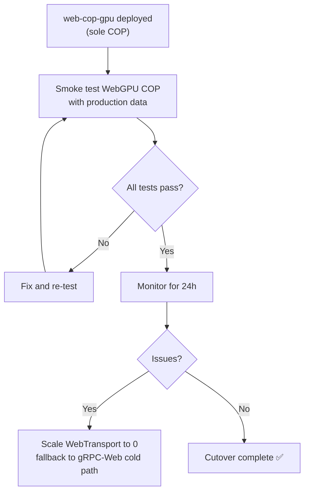

<!-- CLASSIFICATION: UNCLASSIFIED -->

# Phase 4 — Hardening & Cutover

> **Document**: v4 Implementation — Phase 4
> **Version**: 1.0
> **Classification**: UNCLASSIFIED
> **Status**: Complete
> **Prerequisite Phases**: Phase 3 (UI & Interaction)
> **Architecture Reference**: `docs/architecture/v1/RTSA_WebGPU_Architecture_v1.md` §10, §11

---

## 1. Objective

Profile and tune for the 50k-track @ 60 FPS target, conduct security audit, build comprehensive E2E and visual regression test suites, complete documentation, and execute production cutover from the React COP to the WebGPU COP.

> **Cutover Status**: ✅ Production cutover complete. Legacy `web-cop/` has been deleted from the repository. `web-cop-gpu/` is the sole frontend COP.

---

## 2. Deliverables

| #    | Deliverable             | Description                                                |
| ---- | ----------------------- | ---------------------------------------------------------- |
| H4-1 | Performance profiling   | Chrome DevTools + WebGPU timestamp queries                 |
| H4-2 | Performance tuning      | Bottleneck fixes to hit ≤ 8 ms frame time                  |
| H4-3 | Security audit          | ITSG-33 controls review, CSP validation, threat model      |
| H4-4 | E2E test suite          | Playwright coverage of all user workflows                  |
| H4-5 | Visual regression suite | Golden images at 100, 1k, 10k, 50k tracks                  |
| H4-6 | Load / stress testing   | Sustained 50k tracks for 30+ minutes                       |
| H4-7 | Documentation           | User guides, developer onboarding, runbooks                |
| H4-8 | Production cutover      | ✅ Complete — `web-cop` deleted, `web-cop-gpu` is sole COP |

---

## 3. Detailed Tasks

### H4-1: Performance Profiling

- Chrome DevTools Performance tab → identify main thread bottlenecks
- WebGPU timestamp queries → per-pass GPU timing
- Data Worker profiling → WebTransport decode throughput
- SharedArrayBuffer contention analysis

**Target metrics** (from `docs/architecture/component_design.md` §6):

| Metric            | Target |
| ----------------- | ------ |
| Total frame time  | ≤ 8 ms |
| SAB read + upload | ≤ 2 ms |
| Compute passes    | ≤ 1 ms |
| Render passes     | ≤ 4 ms |
| Main thread CPU   | < 20%  |

### H4-2: Performance Tuning

Common optimization areas:

- Buffer upload batching (if writeBuffer is bottleneck)
- Shader arithmetic simplification
- Reduce overdraw (draw order optimization)
- LOD system for zoomed-out views (reduce instance count)
- Texture atlas mipmapping
- `requestAnimationFrame` sync vs manual timing

### H4-3: Security Audit

Checklist against ITSG-33 / NIST 800-53:

| Area                     | Check                                                   |
| ------------------------ | ------------------------------------------------------- |
| Cross-origin isolation   | COOP/COEP headers set correctly                         |
| CSP                      | Validates against policy in `solidjs_standards.md` §7.3 |
| WebTransport TLS         | TLS 1.3, CSE cipher suites                              |
| JWT validation           | Token expiry, signature verification, clearance claims  |
| Classification filtering | Server-side enforcement verified                        |
| SharedArrayBuffer        | No cross-origin data leakage (Spectre mitigations)      |
| WGSL shaders             | No user-supplied shader code paths                      |
| Audit trail              | Session open/close, auth failures logged                |
| XSS                      | No `innerHTML` with user data                           |
| Dependency scan          | `pnpm audit`, Rust `cargo audit`                        |

### H4-4: E2E Test Suite

Expand Phase 3 Playwright tests to full workflow coverage:

| Workflow         | Description                                                          |
| ---------------- | -------------------------------------------------------------------- |
| Cold boot        | App loads → capability check → WebTransport connects → tracks render |
| Track selection  | Click track → detail panel → correct data                            |
| Alert management | Alert push → sidebar → acknowledge → removed                         |
| Feedback         | Select track → feedback form → submit → success                      |
| Search           | Ctrl+K → query → result → highlight                                  |
| Reconnection     | Server restart → reconnect → tracks resume                           |
| Role switch      | Operator → Commander → layout change                                 |
| Degraded mode    | Disable WebGPU → degraded notice shown                               |

### H4-5: Visual Regression Suite

- Golden images captured at defined viewport sizes
- Track counts: 100, 1,000, 10,000, 50,000
- Zoom levels: overview, city, tactical
- Comparison tool: Playwright `toHaveScreenshot()` with threshold
- CI blocks merge on visual regression

### H4-6: Load / Stress Testing

- **Sustained test**: 50k tracks @ 60 FPS for 30+ minutes
- **Spike test**: 0 → 50k tracks in < 5 seconds
- **Memory leak check**: Monitor GPU and JS memory over 1 hour
- **WebTransport stress**: 100 simultaneous sessions
- Tool: Custom test harness using the Go simulator (`tools/simulator/`)

### H4-7: Documentation

| Document                                            | Action                                                   |
| --------------------------------------------------- | -------------------------------------------------------- |
| User guides (sensor_operator, operations_commander) | Update with WebGPU COP screenshots and workflows         |
| Developer onboarding (`docs/lets_get_started/`)     | Add `web-cop-gpu` setup instructions                     |
| Deployment runbook                                  | Add WebTransport service deployment, QUIC firewall rules |
| Architecture docs                                   | Final review pass against implementation                 |

### H4-8: Production Cutover

> **✅ Cutover Complete** — `web-cop` has been deleted. `web-cop-gpu` is the sole frontend.

**Cutover steps (completed)**:

1. ~~Deploy `web-cop-gpu` alongside `web-cop` (both receive traffic)~~
2. ~~Internal team uses `web-cop-gpu` for 1 week (canary)~~
3. ~~Smoke test with production data (track count, latency, all features)~~
4. ~~Switch Envoy routing to `web-cop-gpu`~~
5. ~~Monitor 24h~~
6. ✅ `web-cop` deleted from repository, React code fully removed

---

## 4. Done Gate (All of v4)

| Criteria                                                | Verification               |
| ------------------------------------------------------- | -------------------------- |
| 50k tracks sustained at ≥ 55 FPS for 30 min             | Load test report           |
| Main thread CPU < 20%                                   | Chrome DevTools profile    |
| All E2E Playwright tests pass                           | CI green                   |
| Visual regression suite passes                          | CI golden image comparison |
| Security audit checklist 100% pass                      | Audit report signed        |
| No `cargo audit` or `pnpm audit` high/critical findings | CI audit check             |
| User guides updated with WebGPU COP content             | Doc review                 |
| Cutover plan approved by team lead                      | Sign-off                   |
| 24h production monitoring clean                         | Grafana dashboards         |
| `web-cop` deleted from repository                       | ✅ Complete                |

---

## 5. Rollback Plan

If critical issues discovered post-cutover, the fallback is to serve the COP over the gRPC-Web
cold path only (WebTransport hot path can be disabled independently):

1. Scale WebTransport server to zero
2. COP falls back to gRPC-Web streaming via Envoy
3. No data migration needed (browser state is ephemeral)
4. Backend services unchanged
