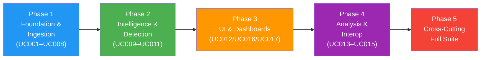

<!-- CLASSIFICATION: UNCLASSIFIED -->

# v5 — System Validation: Use-Case-by-Use-Case End-to-End Verification

> **Version**: 5.0
> **Classification**: UNCLASSIFIED
> **Date**: 2026-03-10
> **Goal**: Systematically validate every use case (UC001–UC017) end-to-end — reviewing implementation against requirements, running all test tiers (Unit / Integration / E2E / Browser E2E), compiling issues, and fixing in batch.

---

## Execution Dependency Order

Each phase **must** complete before the next begins. Phases are ordered bottom-up by the feature dependency graph.

## Phase Files

| Phase | File | Use Cases | Focus |
|-------|------|-----------|-------|
| Shared | [00_common_guidelines.md](00_common_guidelines.md) | — | Shared instructions, test commands, coverage targets |
| 1 | [phase1_foundation_ingestion.md](phase1_foundation_ingestion.md) | UC001–UC008 | Platform bootstrap, 6 sensor types, fusion engine |
| 2 | [phase2_intelligence_detection.md](phase2_intelligence_detection.md) | UC009–UC011 | Anomaly detection, operator feedback, model retraining |
| 3 | [phase3_ui_dashboards.md](phase3_ui_dashboards.md) | UC012, UC016, UC017 | Two-Level RBAC shell, fusion/operator/multi-domain/sensor-health dashboards, UI image generation |
| 4 | [phase4_analysis_interop.md](phase4_analysis_interop.md) | UC013–UC015 | Historical queries, forensics, NATO exchange |
| 5 | [phase5_cross_cutting_full_suite.md](phase5_cross_cutting_full_suite.md) | All | Full test suite, security, audit, classification, benchmarks |

## Issue Management

Within each phase, issues are **compiled into a batch list** and fixed after all use cases in that phase have been reviewed. Each phase plan has an **Issue Log** section for this purpose.

## References

- [Business Requirements](../../business/requirements.md)
- [Feature List](../../business/feature_list.md)
- [Use Cases](../../business/usecases/)
- [Demo Guide](../../demo/demo_setup_run_showcase.md)
- [User Guide](../../user_guide/README.md)
- [SDLC Testing Strategy](../../sdlc_guidelines/05_testing/testing_strategy.md)
- [Testing Guide](../../testing/testing_guide.md)
- [v4 Implementation Review](../v4/v4_implementation_review.md)
