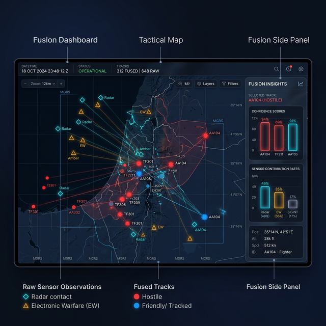
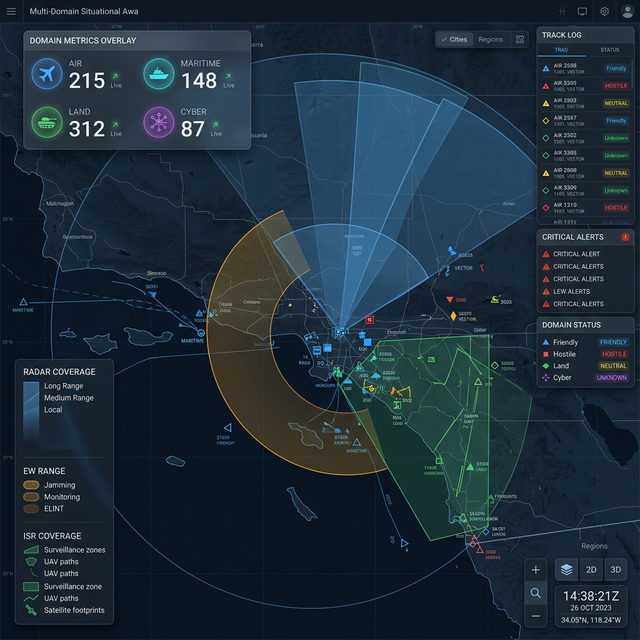

<!-- CLASSIFICATION: UNCLASSIFIED -->

# RTSA Dashboards: Multi-Domain vs. Fusion

In the context of the RTSA (Real-Time Situational Awareness) platform, the **Operations Commander** has access to three primary dashboard views, each serving a distinct tactical purpose. The **Multi-Domain Dashboard** and the **Fusion Dashboard** are the two primary tools for monitoring the theater of operations.

---

## 1. Fusion Dashboard: The "How" of Intelligence
The **Fusion Dashboard** is designed for deep-dive attribution. It makes the "invisible" work of the Fusion Engine visible to the commander. It answer the question: *"Why does the system think this track is a Hostile Fighter?"*

### Key Features
- **Raw Observations (Raw Obs)**: Renders individual sensor reports (Radar hits, EW intercepts, AIS pings) from different sources as distinct icons (e.g., ◇ for Radar, △ for EW).
- **Correlation Lines**: Draws subtle links between raw sensor observations and the resulting Fused Track, showing which sensors are contributing to an entity's state.
- **Fusion Side Panel**: A dedicated telemetry pane showing:
  - **Confidence Scores**: Real-time reliability rating for every track.
  - **Sensor Contribution Rates**: Which sensors are providing the most data.
  - **Top Uncertain Tracks**: Alerts the commander to tracks with conflicting data.

*Note: This image illustrates the attribution focus, showing raw sensor hits alongside fused tracks.*

---

## 2. Multi-Domain Dashboard: The "Big Picture"
The **Multi-Domain Dashboard** is a high-level orchestration view. It focuses on theater-wide awareness across all physical and digital domains. It answers the question: *"What is the overall state of my area of responsibility?"*

### Key Features
- **Domain Metrics Overlay**: A floating, glassmorphic HUD showing active track counts for **Air**, **Maritime**, **Land**, and **Cyber** domains.
- **Sensor Coverage Overlays**: Visualizes the "reach" of the fleet. It shows Radar fans, Electronic Warfare range arcs, and ISR surveillance polygons directly on the map.
- **Theater-Wide Toggles**: Simplified controls to view different layers of the battlefield (e.g., just the Cyber domain or just Land-based sensors).
- **Clutter Reduction**: Panels are typically collapsed to provide maximum map real estate for tracking large-scale movements.

*Note: This image illustrates the domain-level awareness and broad sensor coverage visualization.*

---

## Comparison Summary

| Feature | Fusion Dashboard | Multi-Domain Dashboard |
| :--- | :--- | :--- |
| **Primary User Goal** | Data Attribution & Integrity | Theater-wide Domain Awareness |
| **Map Visualization** | Raw Icons + Fused Icons + Correlation Links | Fused Tracks + Sensor Coverage Fans/Arcs |
| **Side Panel Focus** | Fusion Telemetry (Confidence, Hits/Sec) | Minimized (Maximum Map Visibility) |
| **KPIs** | Confidence Histogram, Sensor Contribution | Track Counts by Domain (Air, Land, Cyber) |
| **Best Used For** | Debugging sensor conflicts, verifying targets | Monitoring cross-domain threats, checking coverage gaps |

---

## 3. Implementation Context
Technically, these dashboards are implemented as separate SolidJS components in the `web-cop-gpu` frontend:
- `FusionCommanderDashboard.tsx`: Controls the raw observation stream and the deep-telemetry side panel.
- `MultiDomainCommanderDashboard.tsx`: Manages the domain KPI overlay and the complex geometry overlays for sensor coverage.
- Both use the same high-performance **WebGPU-powered map engine** to ensure fluid performance even with thousands of entities.

> [!TIP]
> Use the **Fusion Dashboard** when you see an anomaly and need to verify which sensors are reporting it. Switch to the **Multi-Domain Dashboard** to monitor the overall readiness and coverage of your assets across the entire theater.
