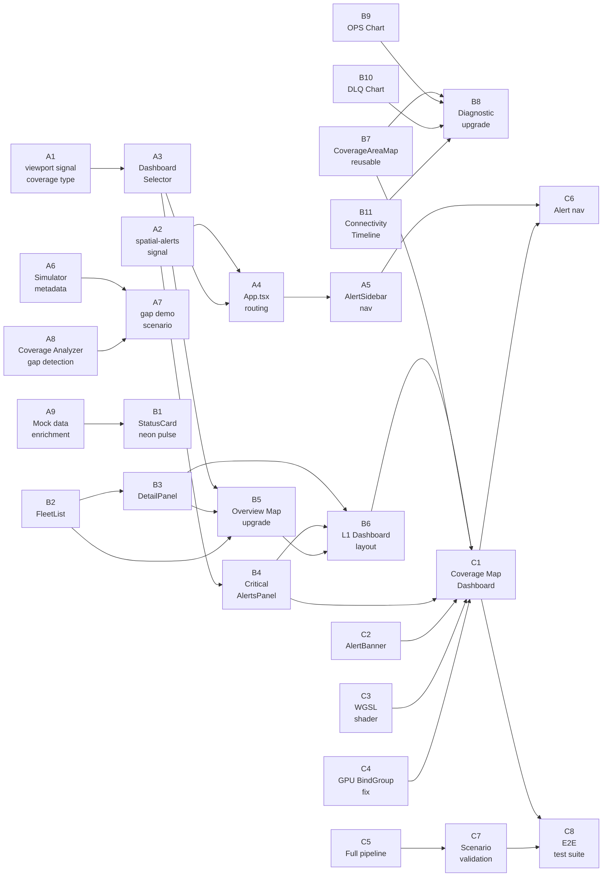

<!-- CLASSIFICATION: UNCLASSIFIED -->

# Three-Level Sensor Dashboard — Phased Implementation Plan

> **Classification**: UNCLASSIFIED  
> **Date**: 2026-03-13  
> **Status**: Supersedes `implementation_plan_sensordashboard_upgrade_coverage.md` (partial implementation archived)  
> **Use Cases**: UC017 (Sensor Health Monitoring), UC012 (Situational Awareness UI)  
> **Screen Target**: 120-inch command display — all components must scale gracefully to large-format screens  
> **Pipeline**: Full end-to-end — Simulator → Ingestion → Coverage Analyzer → Redpanda → WebGPU UI

---

## Executive Summary

The RTSA UI will be restructured into **three contextual view levels** based on operator intent:

| Level | Entry Point | View Name | Primary Goal |
|-------|-------------|-----------|--------------|
| **L1** | Default / Health dashboard | **Sensor Dashboard Overview** | Fleet-wide situational awareness — status cards + miniature coverage map |
| **L2** | Click a sensor card | **Sensor Drill-Down** | Deep diagnostics for a single sensor with focused coverage mini-map |
| **L3** | Click an alert OR select "Coverage" in dashboard combobox | **Full Coverage Map** | Strategic sensor coverage view — footprints, gaps, gap alerts |

All three levels share a **common reusable component library** and a **common data pipeline** so components can be reused across different screen configurations.

---

## Current State Audit

### ✅ Already Implemented (Partial)

| Asset | Location | State |
|-------|----------|-------|
| `SensorHealthDashboard.tsx` | `web-cop-gpu/src/components/dashboard/` | ✅ Exists — L1 frame with SensorGrid + 440px SensorOverviewMap sidebar |
| `SensorStatusCard.tsx` | `web-cop-gpu/src/components/dashboard/` | ✅ Exists — includes 64×64 MiniCoverageMap thumbnail |
| `SensorOverviewMap.tsx` | `web-cop-gpu/src/components/dashboard/` | ⚠ Exists — basic SVG lat/lon projection; missing map bg, gap hatching, fleet list, sensor detail panel |
| `MiniCoverageMap.tsx` | `web-cop-gpu/src/components/dashboard/` | ⚠ Exists — 60px SVG arc only; missing sweep animation, range rings, geo context |
| `SensorDiagnosticView.tsx` | `web-cop-gpu/src/components/dashboard/` | ⚠ Exists — header + KPI cards + 2-col layout; missing OPS chart, DLQ bar chart, connectivity timeline, rich L2 mini-map |
| `SensorGrid.tsx` | `web-cop-gpu/src/components/dashboard/` | ✅ Exists — filtered responsive grid |
| `CoverageManager` + `coverage.ts` | `web-cop-gpu/src/gpu/` | ⚠ Exists — GPU buffer management; bind group created per-draw (should be pre-allocated) |
| `coverage.wgsl` | `web-cop-gpu/src/shaders/` | ⚠ Exists — sector rendering; missing: bearing arc clipping, gap hatching, ISR swath polygon type |
| `SpatialAlert` proto | `proto/rtsa/inference/v1/spatial_alert.proto` | ✅ Exists |
| `SensorCoverage` proto | `proto/rtsa/ingestion/v1/ingestion_service.proto` | ✅ Exists |
| `svc-coverage-analyzer` | `svc-coverage-analyzer/` | ⚠ Exists — stub (`rtsa.sim_inject_gap=true` check only); no real geometric gap computation |
| `sensor-health.ts` | `web-cop-gpu/src/services/` | ✅ Exists — parses coverage from gRPC; includes mock data with coverage for 2 sensors |
| `viewport.ts` signals | `web-cop-gpu/src/signals/` | ⚠ Exists — 4 dashboard types (`sensor/commander/analytics/health`); missing `coverage` type |
| `DashboardSelector.tsx` | `web-cop-gpu/src/components/toolbar/` | ⚠ Exists — 4 options; missing "Coverage" option |
| `sensor-health.spec.ts` | `web-cop-gpu/e2e/` | ✅ Exists |
| `sensor-diagnostic.spec.ts` | `web-cop-gpu/e2e/` | ✅ Exists |
| `sensor-pipeline.spec.ts` | `web-cop-gpu/e2e/` | ⚠ Exists — stubbed; tests fail because L3 "Coverage Optimization" text missing |
| `sensor-health-demo.yaml` | `tools/simulator/scenarios/` | ✅ Exists — no coverage gap injection scenario |

### ❌ Entirely Missing

- `CoverageMapDashboard.tsx` — Level 3 full coverage map view  
- `SensorFleetList.tsx` — reusable scrollable sensor fleet sidebar  
- `SensorDetailHoverPanel.tsx` — reusable sensor detail drawer (health graph, uptime, coverage heatmap)  
- `CriticalAlertsPanel.tsx` — alert list panel for L1/L3  
- `SpatialAlertBanner.tsx` — bottom alert strip with RESOLVE button (L3)  
- `signals/spatial-alerts.ts` — live spatial alert signal  
- Neon pulse animation on `SensorStatusCard` for CONNECTED status  
- Large-screen (`>= 120"`) CSS scaling rules  
- `coverage-gap-demo.yaml` — simulator scenario with gap injection  
- Simulator coverage metadata emission (bearing sectors per sensor type)  
- Real gap geometry computation in `svc-coverage-analyzer`  
- `alerts.spatial.gaps` Redpanda topic routing to UI  
- `"coverage"` dashboard type in viewport signal + routing  
- Alert-click navigation to L3 coverage dashboard  
- `coverage-map.spec.ts` — Level 3 E2E test suite  

---

## Reusable Component Library Philosophy

Every UI primitive is built to be **screen-size agnostic** and **reused across all three levels**:

| Component | Used In | Notes |
|-----------|---------|-------|
| `SensorFleetList` | L1 (full list), L3 (filter panel) | Accepts `compact` prop for L3 |
| `SensorDetailHoverPanel` | L1 (hover panel), L2 (static header panel) | Accepts `sensor` prop |
| `CriticalAlertsPanel` | L1 (sidebar), L3 (critical alerts list) | Accepts `maxHeight` prop |
| `MiniCoverageMap` | L1 card thumbnail, L2 header thumbnail | Enhanced with range rings |
| `CoverageAreaMap` | L1 overview sidebar (compact), L2 (focused), L3 (full-screen) | Accepts `bounds`, `sensors`, `gaps`, `focusSensorId` props |
| `SpatialAlertBanner` | L3 only | Dismissed via RESOLVE |
| `ObsPerSecChart` | L2 (full), possible L3 stats | Accepts `data`, `avgOps`, `peakOps` |
| `DlqBreakdownChart` | L2 (full), possible L1 stats panel | Accepts `reasons` map |
| `ConnectivityTimeline` | L2 (full) | Accepts `events` array |

---

## Phase A — Foundation: Signals, Routing & Data Pipeline

> **Duration**: 1–2 days  
> **Goal**: All plumbing in place so L2 and L3 can be assembled without revisiting foundation. Simulator produces realistic coverage + gap data. UI can navigate to all 3 levels.

### A1. Viewport Signal — add `"coverage"` dashboard type

**File**: `web-cop-gpu/src/signals/viewport.ts`

```diff
- export type Dashboard = "sensor" | "commander" | "analytics" | "health";
+ export type Dashboard = "sensor" | "commander" | "analytics" | "health" | "coverage";
```

### A2. Spatial Alerts Signal

**NEW FILE**: `web-cop-gpu/src/signals/spatial-alerts.ts`

```typescript
// CLASSIFICATION: UNCLASSIFIED
import { createSignal } from "solid-js";

export interface SpatialAlertPayload {
  alertId: string;
  sectorId: string;          // e.g., "NW-4"
  affectedSensorId: string;  // e.g., "RADAR-07"
  severity: "CRITICAL" | "ELEVATED" | "WATCH";
  description: string;       // "Data gap in sector NW-4"
  lastContactUtc: string;    // ISO timestamp
  acknowledged: boolean;
  areaPolygon: Array<{ lat: number; lon: number }>;
}

export const [spatialAlerts, setSpatialAlerts] = createSignal<SpatialAlertPayload[]>([]);
export const [activeSpatialAlertId, setActiveSpatialAlertId] = createSignal<string | null>(null);
```

### A3. DashboardSelector — Add "Coverage" Option

**File**: `web-cop-gpu/src/components/toolbar/DashboardSelector.tsx`

Add `{ value: "coverage", label: "Coverage" }` to the `DASHBOARDS` array.

### A4. App.tsx — Route Coverage Dashboard

**File**: `web-cop-gpu/src/App.tsx`

- Import new `CoverageMapDashboard`
- In the `canvas` Show: branch on `dashboard() === "coverage"` to render `CoverageMapDashboard`
- Add alert-click handler: clicking a CRITICAL spatial alert calls `setDashboard("coverage")` and `setActiveSpatialAlertId(alertId)`
- Pass spatial alerts from `alerts_updated` Data Worker message to `setSpatialAlerts` (additive — spatial vs point alerts are distinct)

### A5. AlertSidebar — Click-to-Navigate for Coverage Gaps

**File**: `web-cop-gpu/src/components/panels/AlertSidebar.tsx`

- Spatial/coverage alerts (detected by `description` containing "gap" or a new `alertType` field) must show a "View on Map" button
- Clicking "View on Map" calls `setDashboard("coverage")` + `setActiveSpatialAlertId(alertId)`

### A6. Simulator — Coverage Metadata Emission

**Files**: `tools/simulator/internal/sensor/radar.go`, `ew.go`, `isr.go`, `ais.go`, `elint.go`, `cyber.go`

Each sensor generator must populate the `metadata` map of `SensorObservation` with coverage keys per sensor type:

| Sensor Type | Metadata Keys |
|-------------|---------------|
| RADAR | `rtsa.coverage.range_nm`, `rtsa.coverage.bearing_start`, `rtsa.coverage.bearing_end`, `rtsa.coverage.center_lat`, `rtsa.coverage.center_lon` |
| EW/SIGINT | `rtsa.coverage.range_nm` (omnidirectional — bearing 0→360), `rtsa.coverage.center_lat/lon` |
| ISR | `rtsa.coverage.swath_polygon` (JSON array of lat/lon pairs for ISR swath), `rtsa.coverage.center_lat/lon` |
| AIS/BFT | `rtsa.coverage.range_nm` (omnidirectional), `rtsa.coverage.center_lat/lon` |
| ELINT/COMINT | `rtsa.coverage.range_nm`, `rtsa.coverage.bearing_start/end`, `rtsa.coverage.center_lat/lon` |
| CYBER | `rtsa.coverage.zone_id` (logical zone, not geographic) |

### A7. Coverage Gap Demo Scenario

**NEW FILE**: `tools/simulator/scenarios/coverage-gap-demo.yaml`

```yaml
# CLASSIFICATION: UNCLASSIFIED
# Coverage Gap Demo — exercises Level 3 Coverage Map and SpatialAlert pipeline
name: "Coverage Gap Demo — Tactical Gap Detection"
seed: 20260313
duration_minutes: 15

sensors:
  radar:
    count: 5
    sensor_ids: ["RADAR-02", "RADAR-05", "RADAR-07", "RADAR-SONAR-A", "RADAR-SONAR-B"]
    update_interval_ms: 1000
    coverage_nm: 150
  ew:
    count: 1
    sensor_ids: ["AEW-1"]
    update_interval_ms: 2500

degradation_events:
  - at_minute: 2
    sensor_id: "RADAR-07"
    event: offline               # Forces gap in sector NW-4
    inject_gap_alert: true
    gap_sector_id: "NW-4"
  - at_minute: 8
    sensor_id: "RADAR-07"
    event: recovery

operational_area:
  center: { lat: 51.5, lon: -5.0 }
  radius_nm: 250
```

### A8. Coverage Analyzer — Real Gap Computation

**File**: `svc-coverage-analyzer/internal/domain/detector.go`

Upgrade from stub to basic geometric gap detection:
- Maintain an in-memory map of `sensorId → last known SensorCoverage`
- When `svc-coverage-analyzer` receives a sensor observation with coverage metadata, update the map
- On any sensor state change (OFFLINE / STALE), compute the uncovered geographic area by subtracting active sensor footprint unions from the monitored area polygon
- Emit `SpatialAlert` to Redpanda topic `alerts.spatial.gaps` with `area_polygon` and sensor attribution fields

> **Note**: Full computational geometry (polygon union/difference) is complex. For Phase A, use the simpler heuristic: if a sensor is OFFLINE and its coverage sector overlaps with a `monitored_sector` config, emit a gap alert referencing that sector. Full geometric computation is Phase C stretch goal.

### A9. Mock Data — Enrich Coverage Data

**File**: `web-cop-gpu/src/services/sensor-health.ts`

Update `mockSensorStatuses()` to include coverage for ALL sensors (not just 2 radars), including:
- Different `bearingStart/bearingEnd` per sensor type
- Correct `centerLat/centerLon` for each sensor matching the `operational_area` center in `sensor-health-demo.yaml` (lat: 58N, lon: -10W area)
- One sensor with `status: "OFFLINE"` and coverage data (for gap simulation in mock mode)

### A10. Phase A Tests

- **Unit**: `spatial-alerts.ts` signal — test `setSpatialAlerts`, `updateSpatialAlerts`, sort order
- **Unit**: `DashboardSelector.tsx` — test "Coverage" option is rendered
- **Unit**: `DashboardSelector.tsx` — test onChange routes correctly
- **E2E**: `sensor-health.spec.ts` — add test: dashboard selector has "Coverage" option
- **E2E**: `sensor-health.spec.ts` — add test: clicking "Coverage" navigates to coverage dashboard

---

## Phase B — UI Upgrades: Level 1 & Level 2

> **Duration**: 2–3 days  
> **Goal**: Level 1 Health Dashboard and Level 2 Diagnostic view match the mockup images. All new components are reusable primitives ready for L3 consumption.

### B1. `SensorStatusCard.tsx` — Neon Pulse & Large-Screen Scaling

**Modify**: `web-cop-gpu/src/components/dashboard/SensorStatusCard.tsx`

- **Neon pulse animation**: When `status === "CONNECTED"`, add a radially pulsing glow ring behind the status badge using CSS `@keyframes` (box-shadow: `0 0 0 0 color → 0 0 0 8px transparent`)
- **Status indicator size**: Increase the indicator dot to 8px, add `animation: connected-pulse 2s infinite` for CONNECTED
- **UTC clock**: Display UTC timestamp in card footer (small mono font, sub-second updates not required)
- **Large-screen scaling**: Cards use `clamp()` for font sizes; minimum card width increases to 360px for `full` view, 300px for `compact` view when viewport width > 2560px

### B2. New Reusable Component: `SensorFleetList.tsx`

**NEW FILE**: `web-cop-gpu/src/components/dashboard/SensorFleetList.tsx`

Purpose: Scrollable sensor fleet list with status indicators, sensor type icons, and hover/select highlighting.

Props:
```typescript
interface SensorFleetListProps {
  sensors: SensorStatus[];
  selectedSensorId?: string;
  onSensorSelect?: (sensor: SensorStatus) => void;
  onSensorHover?: (sensor: SensorStatus | null) => void;
  compact?: boolean;   // true = collapsed icon-only mode
  maxHeight?: string;
}
```

Renders each sensor as a row: `[StatusDot] [TypeIcon] [SensorId] [StatusBadge] [ObsRate]`

### B3. New Reusable Component: `SensorDetailHoverPanel.tsx`

**NEW FILE**: `web-cop-gpu/src/components/dashboard/SensorDetailHoverPanel.tsx`

Purpose: Right-side detail panel shows when a sensor is hovered in the fleet list or selected.

Sections rendered (matching L1 mockup right panel):
1. **Header**: Sensor ID, type badge, status badge
2. **Health Graph**: 12-point sparkline of `eventsPerSecond` trend (use last N polling cycles cached in a ring buffer signal)
3. **Uptime bar**: Horizontal segmented bar (12h / 30d / 90d — from diagnostic data)
4. **Connection Uptime %**: Big number e.g. `98.6%` (from diagnostic `data.uptimePercent`)
5. **Coverage Heatmap**: Simplified SVG heat-intensity visualization of coverage density. Uses `MiniCoverageMap` with `alertLevel` props.

Props:
```typescript
interface SensorDetailHoverPanelProps {
  sensor: SensorStatus | null;   // null = collapsed/hidden
  width?: string;
}
```

### B4. New Reusable Component: `CriticalAlertsPanel.tsx`

**NEW FILE**: `web-cop-gpu/src/components/dashboard/CriticalAlertsPanel.tsx`

Purpose: Vertically scrollable list of critical alerts with sensor context.

Each item shows:
- Alert severity icon  
- `[CRITICAL] SENSOR OFFLINE` header  
- Sensor ID affected  
- Timestamp (`14:32:01`)

Props:
```typescript
interface CriticalAlertsPanelProps {
  spatialAlerts: SpatialAlertPayload[];
  onAlertClick?: (alertId: string) => void;
  maxHeight?: string;
  title?: string;
}
```

### B5. Upgrade `SensorOverviewMap.tsx` — Enhanced L1 Coverage Map

**Modify**: `web-cop-gpu/src/components/dashboard/SensorOverviewMap.tsx`

The overview map in Level 1 is the "miniature coverage map" embedded in the right sidebar of the Health Dashboard. Upgrades required:

1. **Dark map background**: Replace blank SVG with a stylized dark ocean/land layer — use a simplified SVG world coastline path for the operational area bounds (hard-coded simplified UK/North Atlantic coastline vectors for mockup accuracy), or at minimum a dark `radial-gradient` with grid overlay (already partial)

2. **Coverage gap area visualization**: When an offline sensor's footprint overlaps the monitored area, render that sector with a **red diagonal hatching pattern** (`<pattern>` element with diagonal lines at 45°) instead of the normal fill

3. **Active gap alert badge**: Top-right badge on the map showing number of active coverage gaps (e.g., `⚠ 1 GAP`)

4. **Layer toolbar row**: Below the map title, add row: `[ZOOM+] [ZOOM-] | [Layers] [Alerts] [Map Style]` — compact icon buttons; ZOOM adjusts the `bounds` range (state local to overview map)

5. **Sensor label callouts**: For each sensor with coverage, add a small text label near the footprint center (e.g., "AEGIS", "RADAR-02"), avoiding overlap via simple offset heuristic

6. **Offline gap annotation**: For offline sensors, render "GAP DETECTED" text inside the hatched area with a pulsing opacity animation

7. **Interactive fleet list integration**: The `SensorOverviewMap` should accept an `onSensorHover` prop and pass it to dots in the SVG (highlight the corresponding dot when a sensor is hovered in `SensorFleetList`)

Updated props signature:
```typescript
interface SensorOverviewMapProps {
  sensors: SensorStatus[];
  spatialAlerts?: SpatialAlertPayload[];
  hoveredSensorId?: string;
  onSensorClick?: (sensor: SensorStatus) => void;
  width?: number;
  height?: number;
}
```

### B6. Upgrade `SensorHealthDashboard.tsx` — L1 Full Layout

**Modify**: `web-cop-gpu/src/components/dashboard/SensorHealthDashboard.tsx`

Layout change: The current right sidebar (440px) is upgraded to host:

```
┌─────────────────────────────────────────────────────────┐
│  [Sensor Health Monitor]  utcClock   [Full] [Compact]   │
├──────────────────────┬──────────────────────────────────┤
│  SENSOR FLEET LIST   │  SensorOverviewMap (grows)       │
│  SensorFleetList     │                                   │
│  (scrollable)        │  [gap badges, coastline SVG,     │
│                      │   footprints, callout labels]    │
│                      ├──────────────────────────────────┤
│  CRITICAL ALERTS     │  SensorDetailHoverPanel           │
│  CriticalAlertsPanel │  (appears on sensor hover)       │
└──────────────────────┴──────────────────────────────────┘
```

- Right panel subdivides: top = `SensorOverviewMap`, bottom = `SensorDetailHoverPanel`
- Left of right panel: `SensorFleetList` + `CriticalAlertsPanel`
- Coverage statistics below overview map (fleet coverage health KPIs — pull actual values from sensor data, not static strings)
- Left main area: `SensorGrid` (sensor status cards)

### B7. New Component: `CoverageAreaMap.tsx` — Reusable Focused Map

**NEW FILE**: `web-cop-gpu/src/components/dashboard/CoverageAreaMap.tsx`

This is the **core shared map component** for L2 and L3. Parameters drive its behavior:

```typescript
interface CoverageAreaMapProps {
  sensors: SensorStatus[];
  spatialAlerts?: SpatialAlertPayload[];
  focusSensorId?: string;          // L2: zoom auto into this sensor's footprint
  bounds?: { minLat: number; maxLat: number; minLon: number; maxLon: number };
  showLabels?: boolean;
  showGapHatching?: boolean;
  showRangeRings?: boolean;        // L2: show concentric range rings with distance
  showSweepAnimation?: boolean;    // L2 RADAR: show rotating sweep line
  showFleetList?: boolean;         // L3: show fleet list panel
  showAlertBanner?: boolean;       // L3: show bottom alert strip
  onSensorClick?: (sensor: SensorStatus) => void;
  onGapAlertClick?: (alertId: string) => void;
  width?: string;
  height?: string;
  className?: string;
}
```

Internal implementation:
- Uses SVG for the map background and coverage overlays (consistent with existing `SensorOverviewMap` approach; WebGPU canvas is separate and handles tracks)
- `focusSensorId` auto-computes bounds from that sensor's coverage area + 20% padding
- Range rings: when `showRangeRings=true` and a sensor is focused, render concentric SVG circles at 25%, 50%, 75%, 100% of range with distance labels
- Sweep animation: `requestAnimationFrame`-driven SVG transform on a sector line element, rotating from `bearingStart` to `bearingEnd` and back

### B8. Upgrade `SensorDiagnosticView.tsx` — L2 Rich Diagnostics

**Modify**: `web-cop-gpu/src/components/dashboard/SensorDiagnosticView.tsx`

1. **Replace `MiniCoverageMap` in header** with `CoverageAreaMap` as the right-column panel:
   - Props: `focusSensorId={sensor.sensorId}`, `showRangeRings`, `showSweepAnimation` (RADAR only), `showLabels`
   - Height: `100%` of right column
   - Shows lat/lon coordinates of sensor position at bottom

2. **Observations per Second Chart** — new `ObsPerSecChart` component inline:
   - Area/line chart showing OPS over last 60 data points
   - X-axis: time (auto-scrolling)
   - Y-axis: configurable range (`120–1500`)
   - Displays `Avg: XXXX OPS` and `Peak: XXXX OPS` in header
   - Implementation: SVG `<polyline>` with gradient fill underneath

3. **DLQ Rejection Reasons Chart** — new `DlqBreakdownChart` component inline:
   - Horizontal bar chart for: `Schema Mismatch`, `CRC Error`, `Rate Limit`, `Unknown`
   - Each bar: colored fill proportional to percentage, with percentage label on right
   - Data sourced from `data()!.dlqReasons` (new field expected from `fetchSensorDiagnostic`)

4. **Connectivity Events Timeline** — new `ConnectivityTimeline` component inline:
   - Vertical list with colored dots and time labels (`NOW`, `2 min ago`, `5 min ago`)
   - Events from `data()!.connectivityEvents` (new field from service)

Service updates needed:

**File**: `web-cop-gpu/src/services/sensor-health.ts`

Extend `SensorDiagnosticData` interface and `fetchSensorDiagnostic` mock:
```typescript
interface DlqReasonBreakdown {
  reason: string;
  percentage: number;
  count: number;
}

interface ConnectivityEvent {
  timestamp: string;  // relative: "NOW" | "2 min ago" etc.
  description: string;
  eventType: "NB" | "EY" | "R" | string;  // NB=nominal, EY=eye, R=reconnect
}

// Added to SensorDiagnosticData:
dlqReasons: DlqReasonBreakdown[];
connectivityEvents: ConnectivityEvent[];
uptimePercent: number;
obsPerSecHistory: number[];  // last 60 samples
```

### B9. New Component: `ObsPerSecChart.tsx`

**NEW FILE**: `web-cop-gpu/src/components/dashboard/ObsPerSecChart.tsx`

SVG area chart — component receives `history: number[]` + `minY: number` + `maxY: number`. Renders gradient-filled polyline. Displays `Avg` and `Peak` labels. Scales to parent container using `width="100%"`. No canvas, no D3 — pure SVG math inline.

### B10. New Component: `DlqBreakdownChart.tsx`

**NEW FILE**: `web-cop-gpu/src/components/dashboard/DlqBreakdownChart.tsx`

SVG horizontal bar chart. Each row: label, colored bar (width proportional to percentage), percentage value. Colors match severity: Schema Mismatch → amber, CRC Error → orange, Rate Limit → indigo, Unknown → gray.

### B11. New Component: `ConnectivityTimeline.tsx`

**NEW FILE**: `web-cop-gpu/src/components/dashboard/ConnectivityTimeline.tsx`

Vertical event list with colored dots. Events can be "connected" (green), "reconnecting" (amber), "interrupted" (red). Timestamps are relative strings.

### B12. Large-Screen CSS Scaling

**File**: `web-cop-gpu/src/index.tsx` (or a new `web-cop-gpu/src/large-screen.css`)

CSS custom property approach:
```css
/* 120-inch displays @ 4K: ~130 DPI → typically ≥ 3840px width */
@media (min-width: 3000px) {
  :root {
    --scale-ui: 1.5;
    --card-min-width: 480px;
    --font-scale: 1.4;
  }
}
@media (min-width: 5000px) {
  :root {
    --scale-ui: 2.0;
    --card-min-width: 600px;
    --font-scale: 1.8;
  }
}
```

All components use `clamp()` and CSS custom properties for widths, font-sizes, and padding to inherit scaling automatically.

### B13. Phase B Tests

#### Vitest Unit Tests
- `SensorFleetList.test.tsx` — renders all sensors, highlights selected, emits hover/click events
- `SensorDetailHoverPanel.test.tsx` — renders null state (hidden), renders sensor state (all sections present)
- `CriticalAlertsPanel.test.tsx` — renders alerts, click triggers callback
- `CoverageAreaMap.test.tsx` — renders without sensors (empty), renders with sensor + coverage, renders gap hatching when sensor offline, focuses bounds on `focusSensorId`
- `ObsPerSecChart.test.tsx` — SVG polyline has correct number of points, avg/peak labels correct
- `DlqBreakdownChart.test.tsx` — renders correct bar widths, correct labels
- `SensorStatusCard.test.tsx` — pulse animation class present for CONNECTED status
- `SensorOverviewMap.test.tsx` — gap badge visible when offline sensor with coverage exists

#### E2E Tests
- `sensor-health.spec.ts` additions:
  - L1 fleet list visible alongside sensor grid
  - Hover on fleet sensor highlights map dot
  - Gap badge appears when offline sensor has coverage
  - Sensor detail panel appears on fleet sensor hover
- `sensor-diagnostic.spec.ts` additions:
  - L2 coverage map panel visible in right column
  - Range rings visible for RADAR sensor
  - OPS chart visible
  - DLQ breakdown chart visible
  - Connectivity events visible
  - Clicking map sensor navigates to L2

---

## Phase C — Level 3 Coverage Dashboard + Full E2E Pipeline

> **Duration**: 2–3 days  
> **Goal**: Full Level 3 Coverage Map dashboard, complete E2E test suite across all 3 levels, end-to-end simulation with real data pipeline.

### C1. New Component: `CoverageMapDashboard.tsx` — Level 3 Full View

**NEW FILE**: `web-cop-gpu/src/components/dashboard/CoverageMapDashboard.tsx`

This is the dedicated Level 3 view. Layout (matching mockup):

```
┌─────────────────────────────────────────────────────────────┐
│ GLOBAL SITUATIONAL AWARENESS | SENSOR COVERAGE OVERLAY      │
│ CURRENT STATUS: [ALERT] ACTIVE GAPS (N)                     │
├──────────────────────────────────────────────────────────────│
│ [Map layers ▼] [Filter ▶] [Alerts ▶]        [ZOOM] [MAP ▼] │
├────────────┬───────────────────────────────────┬────────────┤
│ SENSOR     │                                   │ SENSOR     │
│ FLEET      │   CoverageAreaMap (full filling)  │ DETAIL     │
│            │                                   │ PANEL      │
│ SensorFleet│   - Footprints per sensor type    │            │
│ List       │   - GAP DETECTED hatch area       │ SensorDetail│
│ (scrollable│   - Sensor label callouts         │ HoverPanel │
│            │   - ZOOM controls on map          │            │
├────────────┤                                   │            │
│ CRITICAL   │                                   │            │
│ ALERTS     │                                   │            │
│ Critical   │                                   │            │
│ AlertsPanel│                                   ├────────────┤
└────────────┴───────────────────────────────────┘            │
│ [SENSOR ALERT] RADAR-07 OFFLINE | Data gap NW-4 | 14:32Z   │
│                                              [ RESOLVE ]    │
└─────────────────────────────────────────────────────────────┘
```

Implementation details:
- Left panel (240px): `SensorFleetList` with compact prop + `CriticalAlertsPanel`
- Center: `CoverageAreaMap` with `showGapHatching`, `showLabels`, `showFleetList=false`; covers all sensors
- Right panel (280px): `SensorDetailHoverPanel` (appears when sensor hovered in fleet list)
- Bottom: `SpatialAlertBanner` (appears when `spatialAlerts().length > 0`)
- Header status bar: "CURRENT STATUS: NOMINAL" or "CURRENT STATUS: [ALERT] ACTIVE GAPS (N)"
- If navigated from `setActiveSpatialAlertId(id)`, auto-zoom the map to the gap polygon and highlight the relevant sensor

```typescript
// CLASSIFICATION: UNCLASSIFIED
// src/components/dashboard/CoverageMapDashboard.tsx
export function CoverageMapDashboard() {
  // Never destructure props — this component has no props but uses global signals
  const sensors = /* createResource(fetchSensorStatuses) */;
  const gaps = spatialAlerts;
  // ...
}
```

### C2. New Component: `SpatialAlertBanner.tsx`

**NEW FILE**: `web-cop-gpu/src/components/dashboard/SpatialAlertBanner.tsx`

Bottom-of-screen alert strip:

```
[⚠ SENSOR ALERT] RADAR-07 OFFLINE | Data gap in sector NW-4 | Last contact: 14:32:01Z     [ RESOLVE ]
```

- Positioned `fixed` bottom, full width  
- Background: dark red semi-transparent with left colored border
- Cycles through multiple active alerts (←/→ arrow controls)
- RESOLVE button calls `acknowledgeAlert` logic for the spatial alert record
- Auto-dismisses after spatial alert is resolved on backend (polling `spatialAlerts()` signal)

Props:
```typescript
interface SpatialAlertBannerProps {
  alerts: SpatialAlertPayload[];
  onResolve?: (alertId: string) => void;
}
```

### C3. WGSL Shader Enhancement — `coverage.wgsl`

**Modify**: `web-cop-gpu/src/shaders/coverage.wgsl`

Three missing features needed for L3 accurate rendering:

1. **Bearing arc clipping**: Current fragment shader discards everything outside the unit circle but does not clip to the `bearing_start → bearing_end` sector. Add bearing angle computation from `uv` and discard fragments outside the sector.

2. **Gap hatching pattern**: When `record_type == 1` (gap), render diagonal hatch lines instead of solid fill. Hatch using: `step(fract((uv.x + uv.y) * 8.0), 0.3)` to produce diagonal stripe effect.

3. **ISR swath polygon type**: When `record_type == 2` (ISR swath), the bounding quad is a parallelogram; the fragment shader should use `uv.y` range to render a rectangular coverage swath rather than a circle arc.

### C4. `CoverageManager` — Pre-allocate Bind Group

**Modify**: `web-cop-gpu/src/gpu/coverage.ts`

Current code creates a new `GPUBindGroup` on every `draw()` call (violation of `webgpu_guidelines.md` — no per-frame GPU object creation). Fix: move bind group creation to `constructor` and cache it.

```typescript
// In constructor:
this.recordsBindGroup = device.createBindGroup({
  label: "coverage-records-bind-group",
  layout: pipelines.render.coverage.getBindGroupLayout(1),
  entries: [{ binding: 0, resource: { buffer: buffers.coverageStorage } }]
});

// In draw():
passEncoder.setBindGroup(1, this.recordsBindGroup);
```

### C5. Spatial Alert Pipeline — Full Integration

#### C5.1 `svc-coverage-analyzer` — Real Gap Detection

**Modify**: `svc-coverage-analyzer/internal/domain/detector.go`

Upgrade gap detection to sector-overlap heuristic:
- Load `monitored_sectors` from config (e.g., sector NW-4 covers `lat: 52-56N, lon: -10 to -4W`)
- Maintain a set of ACTIVE sensor IDs per sector (based on coverage metadata received)
- When a sensor transitions to OFFLINE: check if any sector loses its last covering sensor → emit `SpatialAlert` for that sector
- When a sensor recovers: re-evaluate sector coverage → if gap resolved, set `acknowledged = true` on existing alert

**File**: `svc-coverage-analyzer/internal/config/config.go`

Add `MonitoredSectors` config:
```go
type MonitoredSector struct {
  SectorID  string
  MinLat    float64
  MaxLat    float64
  MinLon    float64
  MaxLon    float64
}
```

#### C5.2 Redpanda Topic Routing

**File**: `svc-coverage-analyzer/internal/producer/producer.go`

Verify `alerts.spatial.gaps` topic is used. Add to `deploy/docker-compose.yml` Redpanda init topics if not present.

#### C5.3 Data Worker — Consume Spatial Alerts

**File**: `web-cop-gpu/src/workers/` (data worker)

The Data Worker must subscribe to `alerts.spatial.gaps` from gRPC-Web (via `AlertService.StreamAlerts` cold path) and emit `spatial_alerts_updated` message to main thread. Main thread calls `setSpatialAlerts()`.

### C6. Coverage Map Navigation from Alert Click

**File**: `web-cop-gpu/src/components/panels/AlertSidebar.tsx`

- Spatial alerts (identified by `alertType === "COVERAGE_GAP"` or `description.includes("gap")`) show a "View Coverage" button
- Click calls `setDashboard("coverage")` + `setActiveSpatialAlertId(alertId)`

**File**: `web-cop-gpu/src/components/dashboard/CoverageMapDashboard.tsx`

- On mount, if `activeSpatialAlertId()` is set, auto-zoom map to the alert's `areaPolygon` bounding box
- Highlight the affected sensor in `SensorFleetList` (bold, pulsing border)
- Show `SpatialAlertBanner` pre-populated with that alert

### C7. `coverage-gap-demo.yaml` — Full Gap Simulation Scenario

The scenario defined in Phase A7 must be validated end-to-end:
1. Simulator starts → all 5 sensors broadcast coverage metadata
2. At minute 2, RADAR-07 goes offline → metadata emission stops for that sensor
3. `svc-coverage-analyzer` detects sector NW-4 no longer covered → emits `SpatialAlert` to `alerts.spatial.gaps`
4. Data Worker receives alert → posts `spatial_alerts_updated` to main thread
5. `setSpatialAlerts()` updates signal → `CriticalAlertsPanel` badge increments
6. L3 dashboard opens → map shows red hatched area for NW-4, `SpatialAlertBanner` shows RADAR-07 alert
7. At minute 8, RADAR-07 recovers → gap resolves → banner auto-dismisses

### C8. Full E2E Test Suite

#### `coverage-map.spec.ts` — Level 3 Specific Tests

**NEW FILE**: `web-cop-gpu/e2e/coverage-map.spec.ts`

```typescript
// CLASSIFICATION: UNCLASSIFIED
// Tests for Level 3: Full Coverage Map Dashboard

test.describe("Level 3: Coverage Map Dashboard", () => {
  test("dashboard selector 'Coverage' option navigates to coverage view");
  test("coverage map header shows 'SENSOR COVERAGE OVERLAY'");
  test("current status shows NOMINAL when no gaps");
  test("current status shows ACTIVE GAPS count when gaps present");
  test("sensor fleet list is visible in left panel");
  test("hovering fleet sensor highlights it on the map");
  test("gap hatched area visible for offline sensor");
  test("GAP DETECTED label visible on offline sensor footprint");
  test("SpatialAlertBanner appears when coverage gap exists");
  test("RESOLVE button on SpatialAlertBanner is clickable");
  test("clicking coverage alert in AlertSidebar navigates to Level 3");
  test("Level 3 auto-zooms to active alert gap area on navigation");
  test("sensor detail panel appears on sensor hover");
  test("legend is visible with sensor type color coding");
  test("ZOOM buttons change map bounds");
  test("screenshot: Level 3 with active gap");
  test("screenshot: Level 3 NOMINAL state");
});
```

#### Update `sensor-pipeline.spec.ts` — Fix Stubbed Tests

**Modify**: `web-cop-gpu/e2e/sensor-pipeline.spec.ts`

- Replace "Coverage Optimization" text check with `[data-testid="coverage-map-dashboard"]`
- Add fleet list and gap visualization checks
- Fix Level 1 mini-map test to check for `[data-testid="sensor-overview-map"]`

#### `sensor-health.spec.ts` — Phase B Additions

Add tests per B13.

#### `sensor-diagnostic.spec.ts` — Phase B Additions

Add tests per B13.

### C9. Docker Compose Test Configuration

**File**: `tests/docker-compose.test.yml`

Ensure the test stack includes:
- `svc-coverage-analyzer` service
- Redpanda with `alerts.spatial.gaps` topic initialized
- Simulator running `coverage-gap-demo.yaml` scenario

### C10. Phase C Validation — Full Pipeline Run

```bash
# 1. Start full pipeline with coverage gap demo
docker compose -f deploy/docker-compose.yml \
               -f deploy/docker-compose.services.yml \
               up -d --wait

# 2. Initialize topics (including alerts.spatial.gaps)
bash scripts/dev/init-topics.sh

# 3. Start simulator with coverage gap scenario
go run ./tools/simulator/cmd/... --scenario coverage-gap-demo

# 4. Run full Playwright test suite
cd web-cop-gpu
VITE_MOCK_SENSORS=false npx playwright test \
  e2e/sensor-health.spec.ts \
  e2e/sensor-diagnostic.spec.ts \
  e2e/sensor-pipeline.spec.ts \
  e2e/coverage-map.spec.ts

# 5. Visual regression check
npx playwright test e2e/visual-regression.spec.ts --update-snapshots
```

---

## Full Test Coverage Matrix

| Layer | Test Type | L1 | L2 | L3 | Pipeline |
|-------|-----------|----|----|----|----------|
| `SensorFleetList` | Vitest unit | ✓ | — | ✓ | — |
| `SensorDetailHoverPanel` | Vitest unit | ✓ | ✓ | ✓ | — |
| `CriticalAlertsPanel` | Vitest unit | ✓ | — | ✓ | — |
| `CoverageAreaMap` | Vitest unit | ✓ | ✓ | ✓ | — |
| `ObsPerSecChart` | Vitest unit | — | ✓ | — | — |
| `DlqBreakdownChart` | Vitest unit | — | ✓ | — | — |
| `CoverageMapDashboard` | Vitest unit | — | — | ✓ | — |
| `SpatialAlertBanner` | Vitest unit | — | — | ✓ | — |
| `spatial-alerts.ts` | Vitest unit | ✓ | — | ✓ | — |
| L1 Health Dashboard | E2E Playwright | ✓ | — | — | — |
| L2 Diagnostic View | E2E Playwright | — | ✓ | — | — |
| L3 Coverage Map | E2E Playwright | — | — | ✓ | — |
| Full Alert Pipeline | E2E Playwright | — | — | ✓ | ✓ |
| Gap detection (Go) | Go unit test | — | — | — | ✓ |
| Coverage analyzer integration | Go integration | — | — | — | ✓ |
| Visual regression (all 3 levels) | Playwright screenshot | ✓ | ✓ | ✓ | — |

**Target**: ≥ 80% line coverage per file modified. All Playwright tests must pass both with `VITE_MOCK_SENSORS=true` (unit/CI) and `VITE_MOCK_SENSORS=false` (pipeline integration).

---

## Impact Analysis

### Files Created (New)
| File | Phase |
|------|-------|
| `web-cop-gpu/src/signals/spatial-alerts.ts` | A |
| `web-cop-gpu/src/components/dashboard/SensorFleetList.tsx` | B |
| `web-cop-gpu/src/components/dashboard/SensorDetailHoverPanel.tsx` | B |
| `web-cop-gpu/src/components/dashboard/CriticalAlertsPanel.tsx` | B |
| `web-cop-gpu/src/components/dashboard/CoverageAreaMap.tsx` | B |
| `web-cop-gpu/src/components/dashboard/ObsPerSecChart.tsx` | B |
| `web-cop-gpu/src/components/dashboard/DlqBreakdownChart.tsx` | B |
| `web-cop-gpu/src/components/dashboard/ConnectivityTimeline.tsx` | B |
| `web-cop-gpu/src/components/dashboard/CoverageMapDashboard.tsx` | C |
| `web-cop-gpu/src/components/dashboard/SpatialAlertBanner.tsx` | C |
| `web-cop-gpu/e2e/coverage-map.spec.ts` | C |
| `tools/simulator/scenarios/coverage-gap-demo.yaml` | A |
| Vitest unit tests for all new components | B/C |

### Files Modified (Existing)
| File | Phase | Change |
|------|-------|--------|
| `web-cop-gpu/src/signals/viewport.ts` | A | Add `"coverage"` Dashboard type |
| `web-cop-gpu/src/components/toolbar/DashboardSelector.tsx` | A | Add "Coverage" option |
| `web-cop-gpu/src/App.tsx` | A/C | Route `"coverage"` → `CoverageMapDashboard`; alert-click navigation |
| `web-cop-gpu/src/components/panels/AlertSidebar.tsx` | A/C | Spatial alert item → "View Coverage" button |
| `web-cop-gpu/src/services/sensor-health.ts` | A/B | Enrich mock data; extend `SensorDiagnosticData` |
| `web-cop-gpu/src/components/dashboard/SensorStatusCard.tsx` | B | Neon pulse animation, large-screen scaling |
| `web-cop-gpu/src/components/dashboard/SensorOverviewMap.tsx` | B | Map bg, gap hatching, gap badge, layer toolbar, callouts, hover integration |
| `web-cop-gpu/src/components/dashboard/SensorHealthDashboard.tsx` | B | Layout: add `SensorFleetList`, `CriticalAlertsPanel`, `SensorDetailHoverPanel` |
| `web-cop-gpu/src/components/dashboard/SensorDiagnosticView.tsx` | B | Add OPS chart, DLQ chart, connectivity timeline; upgrade mini-map to `CoverageAreaMap` |
| `web-cop-gpu/src/shaders/coverage.wgsl` | C | Bearing arc clipping, gap hatching, ISR swath type |
| `web-cop-gpu/src/gpu/coverage.ts` | C | Pre-allocate `recordsBindGroup` in constructor |
| `svc-coverage-analyzer/internal/domain/detector.go` | A/C | Real sector-overlap gap detection |
| `svc-coverage-analyzer/internal/config/config.go` | C | Add `MonitoredSectors` config |
| `svc-coverage-analyzer/internal/producer/producer.go` | C | Verify `alerts.spatial.gaps` topic |
| `tools/simulator/internal/sensor/radar.go` | A | Coverage metadata emission |
| `tools/simulator/internal/sensor/ew.go` | A | Coverage metadata emission |
| `tools/simulator/internal/sensor/isr.go` | A | Coverage swath polygon metadata |
| `tools/simulator/internal/sensor/ais.go` | A | Coverage metadata emission |
| `tools/simulator/internal/sensor/elint.go` | A | Coverage metadata emission |
| `web-cop-gpu/e2e/sensor-pipeline.spec.ts` | C | Fix stubbed tests |
| `web-cop-gpu/e2e/sensor-health.spec.ts` | B | Add L1 enhancements tests |
| `web-cop-gpu/e2e/sensor-diagnostic.spec.ts` | B | Add L2 enhancements tests |

### Cross-Service Impacts
- **Redpanda** topic `alerts.spatial.gaps` must exist (add to init script)
- **Data Worker** must subscribe to spatial alert stream (minor extension to existing gRPC-Web alert streaming)
- **Envoy proxy config** unchanged — spatial alerts flow through existing `AlertService` gRPC-Web endpoint
- **No Protobuf schema changes required** — existing `SpatialAlert` proto is sufficient

### Performance Budget (120-inch Display Targets)
| Metric | Target | Risk |
|--------|--------|------|
| SVG coverage overlay render | < 2ms per frame | Low — SVG is static, not per-frame |
| `CoverageAreaMap` re-render on sensor hover | < 16ms | Low — solid-js fine-grained reactivity |
| `SensorDetailHoverPanel` sparkline | < 5ms | Low — SVG polyline, no D3 |
| L3 initial data load | < 500ms | Low — parallel gRPC fetch |
| L3 gap alert update latency | < 2s end-to-end | Medium — Redpanda → Data Worker → signal |

### Threat Model Entry Required
- **New Data Flow**: Spatial alerts from `svc-coverage-analyzer` → Redpanda → Data Worker → UI
  - Threat: Poisoned gap alerts causing false sensor OFFLINE triggers
  - Mitigation: Alert acknowledgement requires operator action + audit event; alerts do not directly control sensor state
- Entry to add: `docs/sdlc_guidelines/03_architecture_design/threat_modeling.md` — Section "Coverage Gap Alert Flow"

---

## Pre-PR Checklist (Per Phase)

- [ ] Classification header `// CLASSIFICATION: UNCLASSIFIED` present in every new/modified file
- [ ] No hardcoded secrets, API keys, or connection strings
- [ ] No `panic()` in non-test Go code
- [ ] All errors propagated with context
- [ ] No PII or classified data in logs
- [ ] All external inputs validated before use
- [ ] SolidJS props never destructured
- [ ] GPU buffers not allocated per-frame (Phase C — `CoverageManager` fix)
- [ ] Unit tests with ≥ 80% coverage per modified file
- [ ] All E2E tests pass with `VITE_MOCK_SENSORS=true`
- [ ] All E2E tests pass with full pipeline (`VITE_MOCK_SENSORS=false`)
- [ ] `go build ./...` exits 0
- [ ] `go vet ./...` clean
- [ ] `go test ./...` passes
- [ ] Threat model entry added for spatial alert data flow

---

## Execution Order



