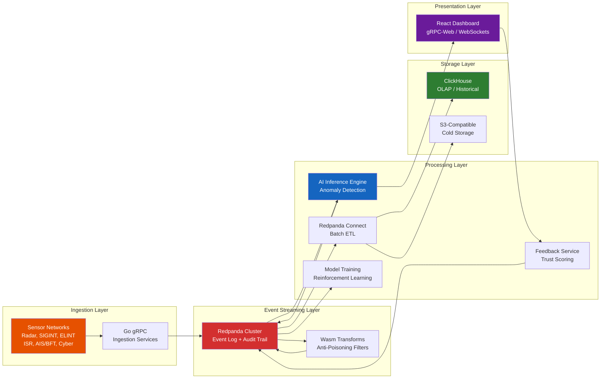
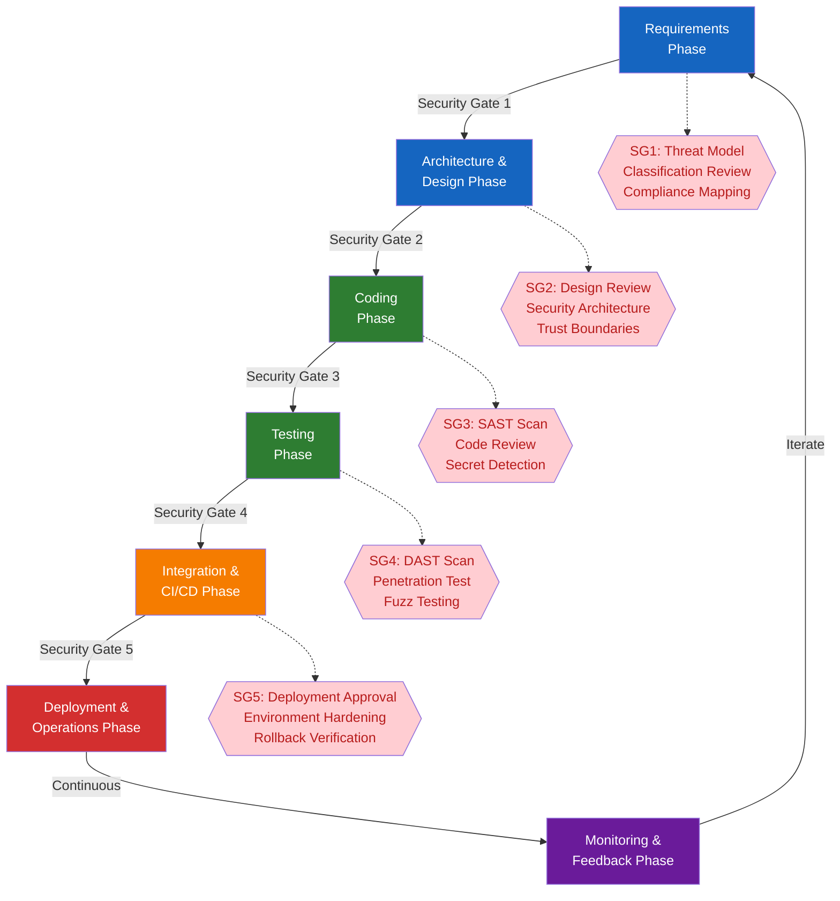

# RTSA Master Policy — Root Governance Document

> **CLASSIFICATION: UNCLASSIFIED**
> **Document Type**: Master Policy — All AI agents MUST load this first
> **Project**: RTSA — Real-Time Situational Awareness & Risk Assessment
> **Version**: 1.0
> **Last Updated**: 2026-02-23
> **Authority**: RTSA Project Lead

---

## 1. Project Identity

| Attribute | Value |
|---|---|
| **Project Name** | Real-Time Situational Awareness & Risk Assessment (RTSA) |
| **Domain** | Canadian Defence — Situational Awareness & AI-driven Anomaly Detection |
| **Classification Ceiling** | Protected C / Secret |
| **Compliance Frameworks** | ITSG-33 (CCCS), NIST 800-53 Rev 5, NATO STANAG 5516 |
| **Deployment Targets** | Tactical Edge, On-premise Data Centre, Hybrid |
| **Team Size** | 3–5 developers |
| **Development Model** | Trunk-based development with short-lived feature branches |
| **Primary AI Agent** | GitHub Copilot (Workspace/Chat mode) |

## 2. Mission Statement

RTSA provides real-time entity detection (assets and threats) using multi-sensor fusion across radar, EW/SIGINT, ELINT/COMINT, ISR, AIS/Blue Force Tracker, and cyber sensors. The system employs AI-driven anomaly detection, human-in-the-loop feedback, and automated model reinforcement learning with anti-poisoning safeguards. It must operate reliably in both full data centre environments and hardware-constrained tactical edge deployments, maintaining NATO interoperability via STANAG 5516/NFFI/MIP.

## 3. Core Technology Stack

| Layer | Technology | Purpose |
|---|---|---|
| Event Streaming | Redpanda | Real-time event log, audit trail, feedback routing, tiered storage |
| Microservices | Go + gRPC (Protobuf) | Strict type-safety, high performance, small binary footprint |
| Analytics / OLAP | ClickHouse | Historical storage, forensics, complex analytical queries |
| Frontend | React + gRPC-Web / WebSockets | Real-time situational awareness visualization |
| Data Pipeline | Redpanda Connect | Batch ETL: stream → ClickHouse / S3 |
| Containerization | Docker + Docker Compose / Kubernetes | Container-based development, deployment, and orchestration |
| Anti-Poisoning | Wasm Data Transforms / Go middleware | Feedback trust validation before model retraining |
| Interoperability | STANAG 5516 / NFFI / MIP adapters | NATO data exchange with allied systems |

## 4. SDLC Lifecycle with Security Gates

Every phase of the software development lifecycle includes mandatory security activities. No artifact advances to the next phase without passing its security gate.

### Security Gate Definitions

| Gate | Phase Transition | Mandatory Checks |
|---|---|---|
| **SG1** | Requirements → Architecture | Threat model initiated; data classification assigned to all data flows; ITSG-33 controls mapped to requirements |
| **SG2** | Architecture → Coding | Design review completed; security architecture reviewed; trust boundaries documented; ADR for security decisions |
| **SG3** | Coding → Testing | SAST scan passes (zero critical/high); code review by peer; no hardcoded secrets; classification headers present; unit tests included |
| **SG4** | Testing → Integration | DAST scan passes; fuzz testing on sensor parsers; penetration test for new attack surfaces; security test coverage meets threshold |
| **SG5** | Integration → Deployment | Deployment approval from lead; environment hardening checklist complete; rollback procedure verified; SBOM generated and signed |

## 5. Universal Rules — Always Enforce

These rules apply to ALL code, documentation, and configuration generated for this project, regardless of task type.

### 5.1 Classification & Data Handling

- **RULE-CLS-01**: This repository contains ONLY UNCLASSIFIED artifacts. No classified data, sensor payloads, operational coordinates, or intelligence products may be committed.
- **RULE-CLS-02**: Every generated source file must begin with a classification header comment: `// CLASSIFICATION: UNCLASSIFIED` (adjust comment syntax per language).
- **RULE-CLS-03**: Test data must be synthetic. Never use real sensor data, real coordinates, or real unit designations in tests or examples.
- **RULE-CLS-04**: Documentation may reference classification concepts but must not contain actual classified information.

### 5.2 Security

- **RULE-SEC-01**: Never hardcode passwords, API keys, tokens, certificates, connection strings, or any credential material. Use environment variables, Kubernetes secrets, or a secrets manager.
- **RULE-SEC-02**: All gRPC channels must use mutual TLS (mTLS) with CSE-approved cipher suites. No plaintext gRPC.
- **RULE-SEC-03**: All external data (sensor feeds, user input, API payloads, NATO data exchange) is untrusted. Validate schema, range, and format before processing.
- **RULE-SEC-04**: All state-changing operations must produce an immutable audit event routed through Redpanda.
- **RULE-SEC-05**: Implement defence-in-depth. No single security control should be the sole protection for any asset.

### 5.3 Code Quality

- **RULE-QUA-01**: Every code change must include corresponding unit tests. Target 80%+ line coverage.
- **RULE-QUA-02**: Never use `panic()` in production Go code. Wrap errors with context using `fmt.Errorf("operation: %w", err)`.
- **RULE-QUA-03**: Never swallow errors silently. Every error must be handled, logged, or propagated.
- **RULE-QUA-04**: Use structured logging (Go: `slog`; React: structured JSON). Never log classified data or PII at any level.
- **RULE-QUA-05**: Follow naming conventions defined in language-specific coding standards.

### 5.4 Development Process

- **RULE-DEV-01**: No direct commits to `main`. All changes via pull request with at least one reviewer.
- **RULE-DEV-02**: Use conventional commit messages: `type(scope): description` (types: feat, fix, refactor, test, docs, chore, security).
- **RULE-DEV-03**: Every PR must pass all CI gates (lint, build, test, SAST, security scan) before merge.
- **RULE-DEV-04**: New services or data flows require a threat model entry in the security architecture document before implementation begins.
- **RULE-DEV-05**: Breaking changes to Protobuf schemas require an ADR documenting the migration strategy.

### 5.5 Compliance

- **RULE-CMP-01**: All security controls must trace to at least one ITSG-33 or NIST 800-53 control family.
- **RULE-CMP-02**: NATO data exchange must conform to STANAG 5516 / NFFI / MIP formats.
- **RULE-CMP-03**: Supply chain: all dependencies must be from approved sources with known provenance. Generate SBOM (CycloneDX) for every release.
- **RULE-CMP-04**: Cryptographic algorithms must be CSE-approved. No custom cryptography implementations.
- **RULE-CMP-05**: Retain audit logs for a minimum of 7 years (configurable per deployment environment).

## 6. Architectural Principles

1. **Event-Driven First**: All state changes flow through Redpanda as the single source of truth. Services react to events, never poll databases for state.
2. **Separation of Inference and Training**: Real-time inference (the "now") operates independently from model training (the "future"). Training is triggered by event-driven batch processes, never inline with inference.
3. **Immutability**: Sensor events and audit records are append-only. No update or delete operations on event streams.
4. **Graceful Degradation**: The system must operate in reduced-capability mode when components fail or when deployed at the tactical edge with limited resources.
5. **Strict Ordering**: Sensor events maintain causal ordering via Redpanda partitioning keyed on sensor-source + entity-track-id.
6. **Zero Trust Networking**: Every service-to-service call is authenticated and encrypted. No implicit trust based on network position.
7. **Portable Deployment**: The same codebase deploys to full data centre, tactical edge, and hybrid configurations via configuration, not code branching.
8. **NATO Interoperability**: All external data exchange uses standardized formats (STANAG 5516, NFFI, MIP) with format validation at system boundaries.

## 7. Sensor Types — Quick Reference

| Sensor Type | Data Characteristics | Typical Volume | Partition Key |
|---|---|---|---|
| **Radar** | Track plots: azimuth, range, elevation, velocity | 1K–10K events/sec | `radar_id:track_id` |
| **EW/SIGINT** | Signal detections: frequency, bearing, modulation | 500–5K events/sec | `sensor_id:emitter_id` |
| **ELINT/COMINT** | Electronic/communications intelligence parameters | 200–2K events/sec | `collector_id:signal_id` |
| **ISR** | Imagery metadata, video frame references, detections | 100–1K events/sec | `platform_id:mission_id` |
| **AIS/BFT** | Position reports: lat/lon, course, speed, callsign | 50–500 events/sec | `unit_id` |
| **Cyber** | Network events: flows, alerts, indicators of compromise | 1K–50K events/sec | `sensor_id:source_ip` |

## 8. Document Cross-References

| Document Category | Location | Purpose |
|---|---|---|
| SDLC Guidelines | `docs/sdlc_guidelines/` | Development lifecycle policies |
| Business Requirements | `docs/business/requirements.md` | Functional and non-functional requirements |
| Feature List | `docs/business/feature_list.md` | Prioritized feature registry |
| Use Cases | `docs/business/usecases/` | Detailed use case specifications |
| Architecture | `docs/architecture/` | Technical architecture and design |
| Copilot Loader | `.github/copilot-instructions.md` | Root AI agent instruction file |

## 9. Change Log

| Date | Version | Change | Author |
|---|---|---|---|
| 2026-02-23 | 1.0 | Initial master policy creation | RTSA Project Lead |
