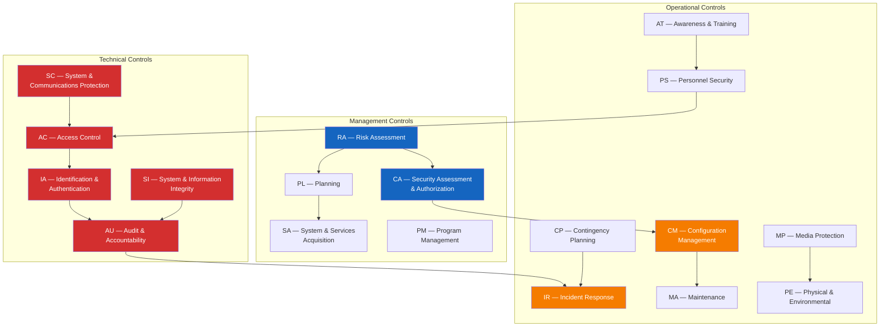

# ITSG-33 Security Control Mapping

> **CLASSIFICATION: UNCLASSIFIED**
> **Document Type**: Compliance Mapping
> **Parent**: `00_master_policy.md` → `01_security_compliance/security_classification.md`
> **Framework**: ITSG-33 — IT Security Risk Management (CCCS)
> **Last Updated**: 2026-02-23

---

## 1. Purpose

This document maps relevant ITSG-33 security control families to RTSA-specific implementation guidance. ITSG-33, published by the Canadian Centre for Cyber Security (CCCS), is the foundational IT security risk management framework for Government of Canada systems. As RTSA is rated Protected C / Secret, it must implement controls at the **HIGH** baseline or above.

## 2. Control Family Dependency Map

## 3. Technical Controls — Detailed Mapping

### 3.1 AC — Access Control

| Control ID | Control Name | RTSA Implementation |
|---|---|---|
| AC-2 | Account Management | Named service accounts for each microservice; no shared accounts; automated provisioning via K8s RBAC |
| AC-3 | Access Enforcement | gRPC interceptor enforces RBAC on every RPC call; ClickHouse uses row-level security |
| AC-4 | Information Flow Enforcement | Redpanda ACLs control topic-level read/write; cross-domain guard for NATO exchange |
| AC-6 | Least Privilege | Each Go microservice runs with minimal OS capabilities; containers run as non-root |
| AC-7 | Unsuccessful Login Attempts | gRPC auth interceptor locks accounts after 5 failed mTLS handshakes in 10 minutes |
| AC-17 | Remote Access | No remote access to classified environments; administrative access via jump server only |
| AC-20 | Use of External Systems | NATO partner systems access only via STANAG 5516 adapters through cross-domain guard |

### 3.2 AU — Audit & Accountability

| Control ID | Control Name | RTSA Implementation |
|---|---|---|
| AU-2 | Audit Events | All state-changing operations produce audit events: sensor ingest, entity classification, feedback submission, model retraining, admin actions |
| AU-3 | Content of Audit Records | Structured JSON: timestamp, actor, action, resource, outcome, classification level, correlation-id |
| AU-4 | Audit Storage Capacity | Redpanda tiered storage: hot (local SSD, 72h) → cold (S3/ClickHouse, 7 years) |
| AU-6 | Audit Review, Analysis, Reporting | ClickHouse materialized views for anomaly detection on audit streams; Grafana dashboards |
| AU-8 | Time Stamps | NTP-synchronized UTC timestamps; all events include monotonic clock for ordering |
| AU-9 | Protection of Audit Information | Audit topic in Redpanda is append-only; no delete permissions; separate ACL from operational topics |
| AU-10 | Non-repudiation | Cryptographic signing of audit events at origin service using service identity certificate |
| AU-11 | Audit Record Retention | Minimum 7-year retention; automated lifecycle via Redpanda tiered storage + ClickHouse TTL |

### 3.3 IA — Identification & Authentication

| Control ID | Control Name | RTSA Implementation |
|---|---|---|
| IA-2 | Identification and Authentication (Org Users) | Operator login via DoD/DND-approved identity provider; MFA required for all human access |
| IA-3 | Device Identification and Authentication | Sensor systems authenticate via X.509 certificates issued by project PKI |
| IA-5 | Authenticator Management | Certificate rotation every 90 days; automated via cert-manager; no password-based authentication |
| IA-8 | Identification and Authentication (Non-Org Users) | NATO partner systems authenticate via bilateral PKI trust anchors |
| IA-9 | Service Identification and Authentication | mTLS with SPIFFE/SPIRE for inter-service identity; each Go service has a unique SVID |

### 3.4 SC — System & Communications Protection

| Control ID | Control Name | RTSA Implementation |
|---|---|---|
| SC-7 | Boundary Protection | Network segmentation: sensor ingestion zone, processing zone, storage zone, presentation zone; firewall rules per zone |
| SC-8 | Transmission Confidentiality and Integrity | TLS 1.3 for all communications; mTLS for gRPC; encryption for Redpanda inter-broker |
| SC-12 | Cryptographic Key Establishment and Management | CSE-approved algorithms only; PKI for certificate lifecycle; HSM for key storage in data centre |
| SC-13 | Cryptographic Protection | AES-256-GCM for data at rest; TLS 1.3 for data in transit; ECDSA P-384 for signatures |
| SC-17 | Public Key Infrastructure Certificates | Project-specific PKI hierarchy; root CA offline; intermediate CAs per deployment environment |
| SC-23 | Session Authenticity | gRPC streams use per-session tokens; WebSocket connections authenticated and re-validated |
| SC-28 | Protection of Information at Rest | Redpanda: encrypted volumes; ClickHouse: encrypted at rest via dm-crypt/LUKS; S3: server-side AES-256 |

### 3.5 SI — System & Information Integrity

| Control ID | Control Name | RTSA Implementation |
|---|---|---|
| SI-2 | Flaw Remediation | Automated dependency scanning in CI; CVE patching SLA: Critical=24h, High=72h, Medium=7d |
| SI-3 | Malicious Code Protection | Container image scanning (Trivy); Wasm module signature verification; no arbitrary code execution |
| SI-4 | Information System Monitoring | Prometheus metrics on all services; anomaly detection on audit streams; Redpanda consumer lag alerts |
| SI-7 | Software, Firmware, & Information Integrity | SBOM generated per release; container images signed with cosign; hash verification on deployment |
| SI-10 | Information Input Validation | All sensor input validated against Protobuf schemas; range checks on coordinates, frequencies, timestamps |
| SI-16 | Memory Protection | Go runtime provides memory safety; containers use seccomp profiles; no raw pointer manipulation |

## 4. Operational Controls — Key Mappings

### 4.1 CM — Configuration Management

| Control ID | Control Name | RTSA Implementation |
|---|---|---|
| CM-2 | Baseline Configuration | Infrastructure-as-code (Helm charts, K8s manifests); immutable container images |
| CM-3 | Configuration Change Control | All changes via PR with review; automated drift detection in production |
| CM-6 | Configuration Settings | Hardened OS baselines (CIS Benchmark); Redpanda/ClickHouse security configurations documented |
| CM-7 | Least Functionality | Minimal container images (distroless); disabled unnecessary ports/protocols/services |
| CM-8 | Information System Component Inventory | SBOM per release; Kubernetes inventory via labels and annotations |

### 4.2 IR — Incident Response

| Control ID | Control Name | RTSA Implementation |
|---|---|---|
| IR-4 | Incident Handling | Runbooks for: security breach, data spillage, sensor compromise, poisoning attack, service outage |
| IR-5 | Incident Monitoring | Real-time alerting via Prometheus/Grafana; audit stream anomaly detection; Redpanda consumer lag |
| IR-6 | Incident Reporting | Automated incident event routing through Redpanda; escalation to Security Operations Centre |
| IR-8 | Incident Response Plan | Documented incident response plan with roles, escalation matrix, and communication procedures |

## 5. Management Controls — Key Mappings

### 5.1 RA — Risk Assessment

| Control ID | Control Name | RTSA Implementation |
|---|---|---|
| RA-3 | Risk Assessment | STRIDE threat modeling for each system boundary; DREAD risk scoring; updated per sprint |
| RA-5 | Vulnerability Scanning | Automated SAST (semgrep/gosec), DAST (OWASP ZAP for gRPC-Web), dependency scanning (Trivy) |

### 5.2 SA — System & Services Acquisition

| Control ID | Control Name | RTSA Implementation |
|---|---|---|
| SA-4 | Acquisition Process | Approved dependency list; supply chain security policy; no copyleft in production code |
| SA-11 | Developer Security Testing | Mandatory unit tests, SAST, fuzz testing for sensor parsers; security review gate in CI |
| SA-15 | Development Process, Standards, and Tools | This SDLC guidelines framework; Copilot governance rules; coding standards enforcement |

## 6. AI Agent Instructions

When implementing any feature, AI agents must:

1. Identify which ITSG-33 control families are affected by the change
2. Ensure the implementation satisfies the controls listed in this mapping
3. Include control references in code comments where a specific control is implemented (e.g., `// ITSG-33: AU-3 — Audit record content`)
4. Update this mapping document if a new control is implemented or an existing mapping changes
5. Flag any implementation that does not have a corresponding control mapping for security review
