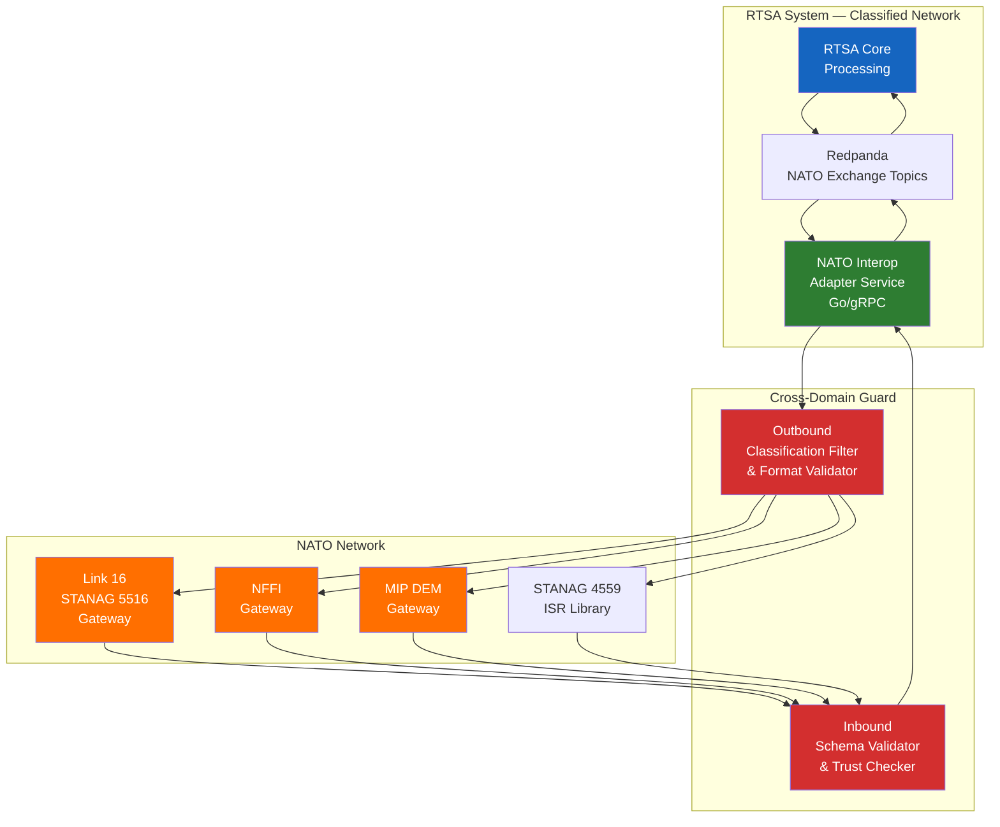
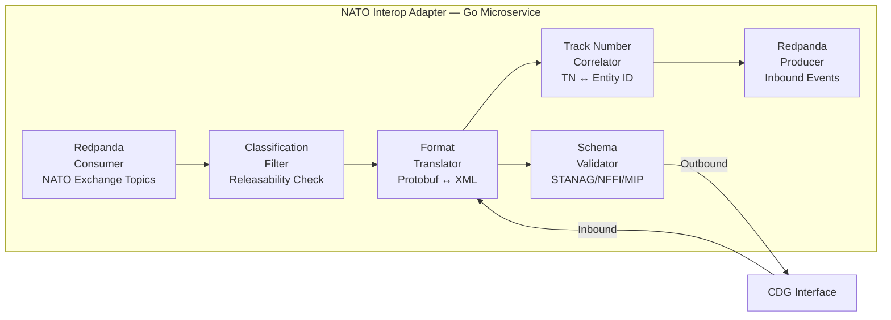

# NATO STANAG Compliance Guidelines

> **CLASSIFICATION: UNCLASSIFIED**
> **Document Type**: Interoperability Compliance
> **Parent**: `00_master_policy.md` → `01_security_compliance/security_classification.md`
> **Standards**: STANAG 5516, NFFI, MIP
> **Last Updated**: 2026-02-23

---

## 1. Purpose

This document defines compliance requirements for NATO interoperability standards applicable to the RTSA system. The system must exchange situational awareness data with NATO allied systems using standardized formats and protocols. All interoperability pathways cross a classification boundary and must transit through a cross-domain guard.

## 2. Applicable Standards

| Standard | Full Name | Purpose | RTSA Relevance |
|---|---|---|---|
| **STANAG 5516** | Link 16 Tactical Data Link | Standard tactical data link for air, maritime, and ground tracks | Primary format for track exchange with allied systems |
| **NFFI** | NATO Friendly Force Information | Standard for friendly force position/status reporting | Blue Force Tracker data exchange |
| **MIP** | Multilateral Interoperability Programme | Joint intelligence, surveillance, reconnaissance data exchange | ISR and intelligence product sharing |
| **STANAG 4559** | NATO Standard ISR Library Interface | Imagery and video metadata exchange | ISR sensor data exchange |
| **ADatP-3** | NATO Message Text Formatting System | Standardized message formats | Formatted message exchange |

## 3. Interoperability Architecture



## 4. STANAG 5516 — Link 16 Integration

### 4.1 Data Model Mapping

Link 16 uses J-Series messages organized by functional areas. RTSA must support the following J-Series message types:

| J-Series | Message Type | RTSA Mapping | Direction |
|---|---|---|---|
| J2.2 | Air Track | Entity (type=AIR) | Inbound / Outbound |
| J2.3 | Surface Track | Entity (type=SURFACE) | Inbound / Outbound |
| J2.4 | Subsurface Track | Entity (type=SUBSURFACE) | Inbound / Outbound |
| J2.5 | Land Track | Entity (type=LAND) | Inbound / Outbound |
| J3.0 | Point/Track Status | Entity Status update | Inbound / Outbound |
| J3.2 | Electronic Warfare | EW Detection event | Inbound / Outbound |
| J7.0 | Information Management | Control messages | Inbound / Outbound |
| J13.0 | Platform/System Status | Sensor health status | Outbound |

### 4.2 Track Number Management

- RTSA internal entity IDs must map bidirectionally to Link 16 Track Numbers (TN)
- Track number allocation follows STANAG 5516 TN block assignment per participating unit
- A TN correlation table must be maintained in Redpanda for real-time lookup
- TN conflicts (same TN assigned by different units) must be detected and resolved via correlation logic

### 4.3 Coordinate System

- Link 16 uses WGS 84 geodetic coordinates
- RTSA internal coordinates must be WGS 84 to avoid conversion errors
- Altitude: feet MSL (Link 16) ↔ meters MSL (RTSA internal) — conversion required
- Speed: knots (Link 16) ↔ meters/second (RTSA internal) — conversion required

## 5. NFFI — NATO Friendly Force Information

### 5.1 NFFI Message Structure

NFFI uses an XML-based schema for friendly force position reporting:

```
NFFI Message Structure:
├── Header
│   ├── MessageID (UUID)
│   ├── SenderID (NATO unit code)
│   ├── Timestamp (ISO 8601 UTC)
│   └── Classification (NATO marking)
├── FriendlyForceInfo
│   ├── UnitID (NATO unit identifier)
│   ├── Position
│   │   ├── Latitude (WGS 84 decimal degrees)
│   │   ├── Longitude (WGS 84 decimal degrees)
│   │   └── Altitude (meters MSL)
│   ├── Course (degrees true)
│   ├── Speed (m/s)
│   ├── Status (operational status code)
│   └── Timestamp (position fix time)
└── SecurityMarking
    ├── Classification
    └── Releasability (REL TO nations list)
```

### 5.2 RTSA ↔ NFFI Mapping

| NFFI Field | RTSA Entity Field | Conversion |
|---|---|---|
| UnitID | `entity.source_id` | Direct mapping via unit ID registry |
| Latitude | `entity.position.latitude` | No conversion (both WGS 84) |
| Longitude | `entity.position.longitude` | No conversion |
| Altitude | `entity.position.altitude_m` | No conversion (both meters) |
| Course | `entity.kinematics.heading_deg` | No conversion |
| Speed | `entity.kinematics.speed_mps` | No conversion |
| Status | `entity.status` | Enum mapping table |
| Classification | `entity.classification` | NATO ↔ GC classification mapping |

### 5.3 NATO ↔ GC Classification Mapping

| NATO Marking | GC Equivalent | RTSA Enum |
|---|---|---|
| NATO UNCLASSIFIED | UNCLASSIFIED | `UNCLASSIFIED` |
| NATO RESTRICTED | PROTECTED A | `PROTECTED_A` |
| NATO CONFIDENTIAL | CONFIDENTIAL | `CONFIDENTIAL` |
| NATO SECRET | SECRET | `SECRET` |

## 6. MIP — Multilateral Interoperability Programme

### 6.1 MIP Data Exchange Mechanism (DEM)

- MIP uses the Joint Consultation, Command, and Control Information Exchange Data Model (JC3IEDM)
- RTSA implements a MIP DEM adapter that translates between RTSA Protobuf models and JC3IEDM XML
- Exchange occurs via store-and-forward replication with conflict resolution

### 6.2 Supported MIP Information Exchange Requirements (IERs)

| IER | Description | RTSA Support |
|---|---|---|
| IER-1 | Ground Operational Picture | Entity tracks (LAND type) |
| IER-2 | Air Operational Picture | Entity tracks (AIR type) |
| IER-3 | Maritime Operational Picture | Entity tracks (SURFACE, SUBSURFACE types) |
| IER-5 | Intelligence Summary | AI anomaly detection summaries |
| IER-8 | Friendly Force Tracking | AIS/BFT entity positions |

## 7. Cross-Domain Guard Requirements

All NATO data exchange must transit through a cross-domain guard (CDS) that enforces:

1. **Classification filtering**: Outbound data stripped of any information above the release classification level
2. **Releasability enforcement**: Data marked with `REL TO` restrictions verified against destination nation
3. **Schema validation**: All outbound messages validated against the applicable STANAG/NFFI/MIP schema
4. **Content inspection**: Deep content inspection for inadvertent classified data leakage
5. **Rate limiting**: Prevent data exfiltration via high-frequency request patterns
6. **Logging**: All cross-domain transfers logged to the immutable audit trail

## 8. Implementation Guidelines

### 8.1 NATO Interop Adapter Service Design



### 8.2 Redpanda Topic Design for NATO Exchange

| Topic | Purpose | Key | Retention |
|---|---|---|---|
| `nato.outbound.stanag5516` | Outbound Link 16 messages | `track_number` | 72h hot + 7yr cold |
| `nato.outbound.nffi` | Outbound NFFI messages | `unit_id` | 72h hot + 7yr cold |
| `nato.outbound.mip` | Outbound MIP messages | `ier_type:entity_id` | 72h hot + 7yr cold |
| `nato.inbound.stanag5516` | Inbound Link 16 messages | `track_number` | 72h hot + 7yr cold |
| `nato.inbound.nffi` | Inbound NFFI messages | `unit_id` | 72h hot + 7yr cold |
| `nato.inbound.mip` | Inbound MIP messages | `ier_type:entity_id` | 72h hot + 7yr cold |
| `nato.audit` | All cross-domain transfer audit records | `transfer_id` | 72h hot + 7yr cold |

## 9. AI Agent Instructions

When implementing NATO interoperability features:

1. Always validate message schemas against the applicable STANAG/NFFI/MIP specification before transmission
2. Never transmit data above the authorized release classification level
3. Always include `REL TO` releasability markings on outbound messages
4. Maintain bidirectional mapping between RTSA entity IDs and NATO Track Numbers
5. Log all cross-domain data transfers to the NATO audit topic
6. Convert units (altitude: feet↔meters, speed: knots↔m/s) at the adapter boundary — internal RTSA always uses SI units
7. Handle NATO classification markings by mapping to GC equivalents using the table in Section 5.3
