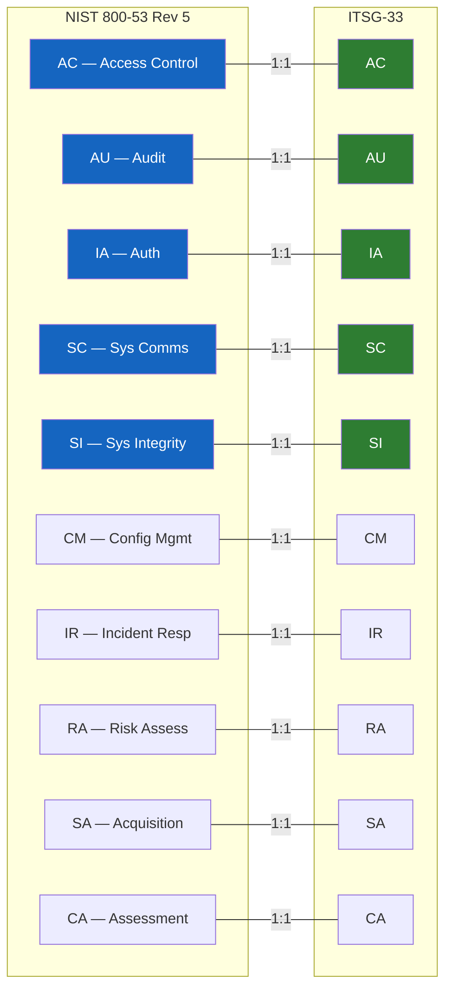

# NIST 800-53 Rev 5 Control Mapping

> **CLASSIFICATION: UNCLASSIFIED**
> **Document Type**: Compliance Mapping
> **Parent**: `00_master_policy.md` → `01_security_compliance/security_classification.md`
> **Framework**: NIST SP 800-53 Rev 5 — Security and Privacy Controls
> **Cross-Reference**: ITSG-33 (`itsg33_controls.md`)
> **Last Updated**: 2026-02-23

---

## 1. Purpose

This document maps NIST 800-53 Rev 5 security controls to RTSA-specific implementations, with cross-references to equivalent ITSG-33 controls. NIST 800-53 is included because: (1) Five Eyes interoperability often requires NIST alignment, (2) many security tools and frameworks reference NIST control IDs, and (3) it provides additional granularity beyond ITSG-33 for AI/ML-specific controls.

## 2. NIST ↔ ITSG-33 Framework Relationship

ITSG-33 and NIST 800-53 share the same control family structure. ITSG-33 tailors NIST controls for the GC context. Where they differ, RTSA implements the **more restrictive** of the two.

## 3. Access Control (AC) — HIGH Baseline

| NIST Control | ITSG-33 Equiv | Control Name | RTSA Implementation | Component |
|---|---|---|---|---|
| AC-2(1) | AC-2(1) | Automated Account Management | K8s RBAC with automated provisioning; service accounts via SPIFFE | All services |
| AC-3 | AC-3 | Access Enforcement | gRPC interceptor checks RBAC policies per RPC method | gRPC Services |
| AC-4 | AC-4 | Information Flow Enforcement | Redpanda ACLs per topic; network policies per K8s namespace | Redpanda, K8s |
| AC-4(4) | AC-4(4) | Flow Control of Encrypted Information | mTLS termination at service boundary; no encrypted passthrough without inspection | Ingestion, CDG |
| AC-6 | AC-6 | Least Privilege | Non-root containers; drop all capabilities; add only required caps | All containers |
| AC-6(9) | AC-6(9) | Auditing Use of Privileged Functions | Admin operations logged to audit topic with elevated detail | Audit Service |
| AC-17 | AC-17 | Remote Access | No remote access to classified environments; VPN + MFA for admin on unclassified | Operations |

### AI/ML-Specific Access Controls

| NIST Control | Control Name | RTSA Implementation |
|---|---|---|
| AC-4(17) | Domain Authentication | Sensor data validated against registered sensor identity before processing |
| AC-21 | Information Sharing | NATO data exchange only via STANAG 5516 adapter with classification filtering |
| AC-22 | Publicly Accessible Content | No RTSA data is publicly accessible; all interfaces require authentication |

## 4. Audit & Accountability (AU) — HIGH Baseline

| NIST Control | ITSG-33 Equiv | Control Name | RTSA Implementation | Component |
|---|---|---|---|---|
| AU-2 | AU-2 | Event Logging | All state changes, auth events, admin actions, model training triggers, feedback submissions | All services |
| AU-3(1) | AU-3(1) | Additional Audit Information | Include: sensor-id, entity-track-id, classification-level, trust-score, model-version | Event schemas |
| AU-4 | AU-4 | Audit Log Storage Capacity | Redpanda hot tier (72h local SSD) + ClickHouse cold tier (7yr) | Redpanda, CH |
| AU-6(1) | AU-6(1) | Automated Audit Review | ClickHouse materialized views detect anomalous patterns; alert on threshold breach | ClickHouse |
| AU-8 | AU-8 | Time Stamps | NTP-synced UTC; monotonic clock for event ordering within partitions | All services |
| AU-9 | AU-9 | Protection of Audit Information | Append-only Redpanda topic; separate ACL; no delete permissions | Redpanda |
| AU-10 | AU-10 | Non-repudiation | ECDSA-P384 signature on audit events using service certificate | All services |
| AU-12 | AU-12 | Audit Record Generation | Structured JSON via Go `slog`; SolidJS structured logging; no PII/classified data in logs | All services |

### AI/ML-Specific Audit Controls

| NIST Control | Control Name | RTSA Implementation |
|---|---|---|
| AU-2 (AI ext) | Model Decision Audit | Log: input feature hash, model version, confidence score, decision outcome for every inference |
| AU-6 (AI ext) | Training Audit | Log: training dataset hash, hyperparameters, validation metrics, feedback sources used |

## 5. Identification & Authentication (IA) — HIGH Baseline

| NIST Control | ITSG-33 Equiv | Control Name | RTSA Implementation | Component |
|---|---|---|---|---|
| IA-2(1) | IA-2(1) | MFA for Privileged Accounts | All operator/admin access requires MFA via approved identity provider | Dashboard, Admin |
| IA-2(2) | IA-2(2) | MFA for Non-Privileged | All human users require MFA; no exception for read-only roles | Dashboard |
| IA-3 | IA-3 | Device Identification | X.509 certificates for sensor systems; certificate-based mTLS for all devices | Ingestion |
| IA-5(2) | IA-5(2) | PKI-Based Authentication | SPIFFE/SPIRE for service identity; project PKI for sensors; bilateral PKI for NATO | All services |
| IA-8 | IA-8 | Non-Org User ID | NATO partners authenticate via bilateral PKI trust anchors; STANAG identity verification | STANAG Adapter |
| IA-9 | IA-9 | Service Authentication | mTLS with SPIFFE SVIDs for all inter-service gRPC calls | All gRPC |

## 6. System & Communications Protection (SC) — HIGH Baseline

| NIST Control | ITSG-33 Equiv | Control Name | RTSA Implementation | Component |
|---|---|---|---|---|
| SC-7 | SC-7 | Boundary Protection | 4 network zones: Ingestion, Processing, Storage, Presentation; firewall rules per zone | Network |
| SC-7(5) | SC-7(5) | Deny by Default | All ingress denied; explicit allow rules per service port; K8s network policies | K8s |
| SC-8 | SC-8 | Transmission Confidentiality | TLS 1.3 for all network communications; mTLS for gRPC | All services |
| SC-8(1) | SC-8(1) | Cryptographic Protection | CSE-approved cipher suites only; AES-256-GCM, ECDSA-P384 | All services |
| SC-12 | SC-12 | Key Management | cert-manager for auto-rotation; HSM for CA keys; no keys in code | PKI |
| SC-13 | SC-13 | Cryptographic Protection | AES-256-GCM (rest), TLS 1.3 (transit), ECDSA-P384 (signatures) | All |
| SC-28 | SC-28 | Protection at Rest | Encrypted volumes (dm-crypt/LUKS) for Redpanda & ClickHouse; S3 SSE-AES256 | Storage |

## 7. System & Information Integrity (SI) — HIGH Baseline

| NIST Control | ITSG-33 Equiv | Control Name | RTSA Implementation | Component |
|---|---|---|---|---|
| SI-2 | SI-2 | Flaw Remediation | CVE SLA: Critical=24h, High=72h, Medium=7d, Low=30d | CI/CD |
| SI-3 | SI-3 | Malicious Code Protection | Container scanning (Trivy); Wasm signature verification; SBOM enforcement | CI/CD, Wasm |
| SI-4 | SI-4 | System Monitoring | Prometheus metrics; Grafana alerts; Redpanda consumer lag monitoring | Monitoring |
| SI-7 | SI-7 | Integrity Verification | SBOM (CycloneDX); cosign image signatures; SHA-256 hash verification | CI/CD, Deploy |
| SI-10 | SI-10 | Input Validation | Protobuf schema enforcement; range validation; coordinate bounds checking | Ingestion |
| SI-16 | SI-16 | Memory Protection | Go memory safety; seccomp profiles; read-only root filesystem in containers | All containers |

### AI/ML-Specific Integrity Controls

| NIST Control | Control Name | RTSA Implementation |
|---|---|---|
| SI-3 (AI ext) | Anti-Poisoning | Wasm transforms validate feedback trust scores; outlier detection on training data | 
| SI-7 (AI ext) | Model Integrity | Model weight checksums verified on load; model provenance tracked in audit trail |
| SI-10 (AI ext) | Training Data Validation | Feedback data validated for: trust score threshold, temporal consistency, statistical distribution |

## 8. Cross-Reference Table — NIST ↔ ITSG-33

| NIST Family | ITSG-33 Family | Key Difference (if any) |
|---|---|---|
| AC | AC | ITSG-33 adds GC-specific personnel security integration |
| AU | AU | ITSG-33 specifies 7-year retention for Secret-level systems |
| IA | IA | ITSG-33 mandates CSE-approved authenticators for Protected C+ |
| SC | SC | ITSG-33 requires TEMPEST assessment for Protected C+ processing |
| SI | SI | ITSG-33 references CCCS vulnerability advisories (vs. NVD) |
| CM | CM | Equivalent |
| IR | IR | ITSG-33 requires reporting to CCCS GC-CIRT |
| RA | RA | ITSG-33 uses TRA methodology (Threat & Risk Assessment) |
| SA | SA | ITSG-33 includes SBOM requirements for GC supply chain |
| CA | CA | ITSG-33 SA&A process aligns with GC ITSG-22 |

## 9. AI Agent Instructions

When implementing security controls:

1. Reference both NIST and ITSG-33 control IDs in code comments: `// NIST: SC-8 / ITSG-33: SC-8 — TLS 1.3 enforcement`
2. When controls differ between frameworks, implement the **more restrictive** requirement
3. For AI/ML features, check the "AI/ML-Specific" sections in this document for additional controls
4. Every new data flow must be assessed against SC-7 (boundary protection) and AC-4 (information flow enforcement)
5. Every new authentication mechanism must satisfy IA-2 (MFA for humans) or IA-9 (mTLS for services)
